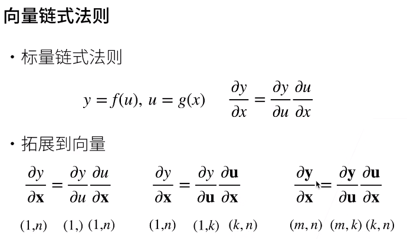

# 动手学深度学习v2 - 李沐

[D2L官网](https://zh.d2l.ai/)

[d2l - 课程主页](https://courses.d2l.ai/zh-v2/)

[d2l - Github](https://github.com/d2l-ai/d2l-zh)

[动手学深度学习 PyTorch版  - B站视频(合集)](https://space.bilibili.com/1567748478/channel/seriesdetail?sid=358497)

[PyTorch 论坛](https://discuss.pytorch.org/)

[课程论坛讨论](https://discuss.d2l.ai/c/chinese-version/16)

---

# 目录

[toc]

---

## 00 预告

神经网络是一门语言

增加 Transformer 等

---

## 01 课程安排

LeNet - ResNet - LSTM - BERT

损失函数、目标函数、过拟合、优化

**内容**
1. **深度学习基础** - 线性神经网络,多层感知机
2. **卷积神经网络** - LeNet,AlexNet,VGG,Inception,ResNet
3. **循环神经网络** - RNN,GRU,LSTM,seq2seq
4. **注意力机制** - Attention,Transformer
5. **优化算法** - SGD,Momentum,Adam
6. **高性能计算** - 并行,多GPU,分布式
7. **计算机视觉** - 目标检测,语义分割
8. **自然语言处理** - 词嵌入,BERT

下载 D2L Notebook

```bash
mkdir d2l-zh && cd d2l-zh
curl https://zh-v2.d2l.ai/d2l-zh-2.0.0.zip -o d2l-zh.zip
unzip d2l-zh.zip && rm d2l-zh.zip
cd pytorch
```

安装d2l包，以方便调取本书中经常使用的函数和类

```bash
pip3 install d2l
```

---

## 02 深度学习介绍


图片分类 - [](https://image-net.org/)

物体检测&分割(精确到像素)

样式迁移

人脸合成

文生图

文字生成(eg. GPT-3)

无人驾驶

广告点击(搜推广)
1. 触发 - 点击率预估 - 排序(点击率 × 竞价)
2. 广告特征提取 -> 模型(训练数据 -> 特征和用户点击 -> 模型) -> 点击率预测


---

## 03 安装

[安装](https://www.bilibili.com/video/BV18p4y1h7Dr/)


---

## 04 数据操作 + 数据预处理

### 04.01 数据操作

主要的数据结构 - N维数组


**广播机制 - broadcasting mechanism**

```python
import numpy as np
import torch

x = torch.arange(12).reshape(3,4)
y = np.ndarray(shape=(3,4))

print(type(x))      # <class 'torch.Tensor'>
print(type(y))      # <class 'numpy.ndarray'>

x_ = x.numpy()
y_ = torch.tensor(y)  # 涉及到数据拷贝
y__ = torch.from_numpy(y)  # 不涉及数据拷贝，更快、更节省内存

print(type(x_))     # <class 'numpy.ndarray'>
print(type(y_))     # <class 'torch.Tensor'>
print(type(y__))    # <class 'torch.Tensor'>

y = x.clone()  # 深拷贝
```

深度学习通常使用 32位浮点数 - torch.float32

### 04.02 数据预处理

csv 逗号分隔值 文件

pandas

pd.get_dummies()用于将分类数据转换为一种称为 "独热编码" One-Hot Encoding 的形式 (将缺失值转为 one-hot)

```python
torch.Tensor._is_view()
```

---

## 05 线性代数


**范数不等式**

**Frobenius范数**是矩阵的一种范数，是矩阵中所有元素的平方和的平方根。这个范数在机器学习中常用于正则化，以防止过拟合。

```python
torch.norm(Array)

keepdim = True  # 保留维度
```

**正定矩阵** - Positive Definite Matrix - 对于一个实对称矩阵 $A$，它被定义为正定的，如果对于所有非零实向量 $x$，都有 $x^TAx>0$。

**正交矩阵** - Orthogonal Matrix - $UU^T=1$，行相互正交，行单位长度

**置换矩阵** - Permutation Matrix - 元素只有0和1，每行和每列只有一个元素是 1，箱单与单位矩阵行列变换，**置换矩阵 是 正交矩阵**，置换矩阵的逆是它的转置


特征向量 & 特征值

---

## 06 矩阵计算

主要是求导数


亚导数


**梯度**


### 06.01 分子布局 & 分母布局

在 PyTorch 中，雅可比矩阵 Jacobian Matrix 使用的是 **`分子布局`**

**分子布局 - Numerator Layout**
1. **行数** 与 **分子的变量维度**（即结果变量的维度）一致
2. **列数** 与 **分母的变量维度**（即输入变量的维度）一致
3. 个人理解 - 求导结果的 长度(行数) 和 分子长度 一致，宽度(列数) 和 分母长度 一致

**分母布局 - Denominator Layout**
1. **行数** 与 **分母的变量维度**（即输入变量的维度）一致
2. **列数** 与 **分子的变量维度**（即结果变量的维度）一致
3. 个人理解 - 求导结果的 长度(行数) 和 分母长度 一致，宽度(列数) 和 分子 长度 一致


个人理解
1. 分子布局 - 求导结果的长度和分子长度一致，宽度和分母长度一致


---

## 07 自动求导

**链式法则**




**自动求导**计算一个函数在指定值上的导数


计算图


**自动求导的两种模式**
1. **正向**(Forward Mode)
   1. 先计算离输入近的
   2. 计算过程中不仅计算函数值，还同时计算导数
   3. 计算一个变量的梯度就需要扫一遍
2. **反向**(Reverse Mode)
   1. 先计算离输出近的
   2. 需要读取前向计算的中间结果(耗GPU资源)
   3. 可以一次性计算出所有输入变量的梯度


深度学习中，**求导是求模型参数对损失函数的导数**，如权重和偏置，目的是为了优化这些参数以最小化损失函数

在 PyTorch 的 nn.Module 中，模型的参数默认就是需要梯度的，requires_grad 属性默认为 True

模型中定义 nn.Parameter 或使用 nn 中的层，如 nn.Linear、nn.Conv2d 等，层内的参数 **默认会设置 requires_grad=True**

```python
x.grad.zero_()  # 清空梯度
torch.Tensor.detach()  # 将部分计算移动到计算图外
```

即使构建函数的计算图需要通过 Python 的控制流(条件、循环、函数)，仍然可以得到变量的梯度

**展示梯度自动累加**
```python
import torch
x = torch.tensor([1,2,3,4], requires_grad=True, dtype=torch.float32)
y = 2.0 * torch.dot(x, x)
# 对y进行反向传播，计算梯度
y.backward(retain_graph=True)
print("After first backward: ", x.grad)  # tensor([ 4.,  8., 12., 16.])
# 再次对y进行反向传播，查看梯度如何累加
y.backward(retain_graph=True)
print("After second backward: ", x.grad)  # tensor([ 8., 16., 24., 32.])


# 如果不 retain_graph 也可以再次构建计算图来模拟累计
import torch
x = torch.tensor([1,2,3,4], requires_grad=True, dtype=torch.float32)
# 对y进行反向传播，计算梯度
y = 2.0 * torch.dot(x, x)
y.backward()
print("After first backward: ", x.grad)  # tensor([ 4.,  8., 12., 16.])
# 再次对y进行反向传播，查看梯度如何累加
y = 2.0 * torch.dot(x, x)
y.backward()
print("After second backward: ", x.grad)  # tensor([ 8., 16., 24., 32.])
```

PyTorch累计梯度原因
1. 当GPU内存限制了批量大小时，通过累积来自多个小批量 mini-batches 的梯度，可以实现有效的大批量 batch 训练
2. 在多任务学习或当模型有多个输出时，需要分别计算每个损失函数对模型参数的梯度，此时需要累加梯度，之后再统一对模型参数更新
   ```python
   # 前向传播
   output1, output2 = model(input)
   loss1 = criterion1(output1, target1)
   loss2 = criterion2(output2, target2)

   # 反向传播
   optimizer.zero_grad()  # 清零梯度
   loss1.backward(retain_graph=True)  # 计算第一个损失的梯度
   loss2.backward()  # 计算第二个损失的梯度，梯度会累加到之前的基础上
   optimizer.step()  # 执行一次优化步骤
   ```
3. 循环神经网络 RNN 中，可能需要在一个训练步骤内多次计算同一参数的梯度，并将这些梯度累加起来

Loss 通常为标量

RNN 是环状图，但是实际上会拆开，然后梯度累加

---

## 08 线性回归 + 基础优化算法

### 08.01 线性回归


线性模型可以看做单层神经网络，仅有输入层和输出层(不算层数)


收集训练数据集


线性模型有**显式解**(损失函数是 **凸函数**)


总结
1. 线性回归是对n维输入的加权，外加偏差
2. 使用平方损失来衡量预测值和真实值的差异
3. 线性回归有显式解
4. 线性回归可以看做是单层神经网络


### 08.02 基础优化方法

**梯度下降**


梯度，是函数值上升最快的方向；负梯度，是函数值下降最快的方向

学习率 hyper-parameter
1. 不能太小 - 计算梯度耗时
2. 不能太大 - 模型难以收敛


实际中，一般不直接使用梯度下降(损失函数是所有样本的平均损失)


批量大小 **b** hyper-parameter
1. 不能太小 - 每次计算量太小，不适合并行来最大利用计算资源
2. 不能太大 - 内存消耗增加，浪费计算，例如所有样本都是相同的

总结
1. 梯度下降通过不断**沿着反梯度方向更新参数**求解 - 不需要知道显式解
2. **小批量随机梯度下降**是深度学习默认的求解算法，其两个重要的超参数是
   1. 批量大小
   2. 学习率


---

## 09 Softmax回归 + 损失函数 + 图片分类数据集

---

## 10 多层感知机 + 代码实现

---

## 11 模型选择 + 过拟合 & 欠拟合

---

## 12 权重衰退

---

## 13 丢弃法

---

## 14 数值稳定性 + 模型初始化

---

## 15 Kaggle 房价预测 + 课程竞赛:加州2020年房价

---

## 16 PyTorch 神经网络基础

---

## 17 使用和购买 GPU

---

## 18 预测房价竞赛总结

---

## 19 卷积层

---

## 20 卷积层里的填充和步幅

---

## 21 卷积层里的多输入多输出通道

---

## 22 池化层

---

## 23 经典卷积神经网络 LeNet

---

## 24 神队卷积神经网络 AlexNet

---

## 25 使用块的网络 VGG

---

## 26 网络中的网络 NiN

---

## 27 含并行连结的网络 GoogLeNet/Inception V3

---

## 28 批量归一化

---

## 29 残差网络 ResNet


### ResNet 为什么能训练出 1000 层的模型

---

## 30 第二部分完结竞赛:图片分类

---

## 31 深度学习硬件: CPU & GPU

---

## 32 深度学习硬件: TPU & 其他

---

## 33 单机多卡并行

---

## 34 多 GPU 训练实现

---

## 35 分布式训练

---

## 36 数据增广

---

## 37 微调

---

## 38 第二次竞赛 树叶分类结果

---

## 39 实战 Kaggle 比赛 : 图像分类 CIFAR-10

---

## 40 实战 Kaggle 比赛 : 狗的品种识别 ImageNet Dogs

---

## 41 物体检测 和 数据集

---

## 42 锚框

---

## 43 树叶分类竞赛技术总结

---

## 44 物体检测算法 : R-CNN, SSD,Y OLO

---

## 45 SSD 实现

---

## 46 语义分割 和 数据集

---

## 47 转置卷积

### 47.2 转置卷积是一种卷积

---

## 48 全连接卷积神经网络 FCN

---

## 49 样式迁移

---

## 50 课程竞赛 - 牛仔行头检测

---

## 51 序列模型

---

## 52 文本预处理

---

## 53 语言模型

---

## 54 循环神经网络 RNN

---

## 55 循环神经网络 RNN 的实现

---

## 56 门控循环单元 GRU

---

## 57 长短期记忆网络 LSTM

---

## 58 深层循环神经网络

---

## 59 双向循环神经网络

---

## 60 机器翻译数据集

---

## 61 编码器-解码器 架构

---

## 62 序列到序列学习 seq2seq

---

## 63 束搜索

---

## 64 注意力机制

---

## 65 注意力分数

---

## 66 使用注意力机制的 seq2seq

---

## 67 自注意力

---

## 68 Transformer

---

## 69 BERT 预训练

---

## 70 BERT 微调

---

## 71 目标检测竞赛总结

---

## 72 优化算法

---

## 73 课程总结和进阶学校

---

