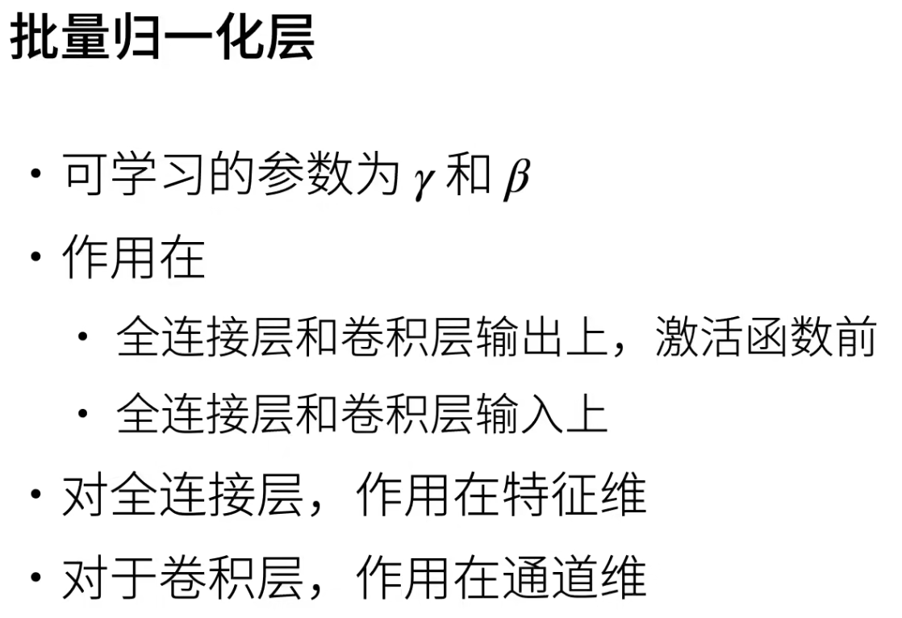
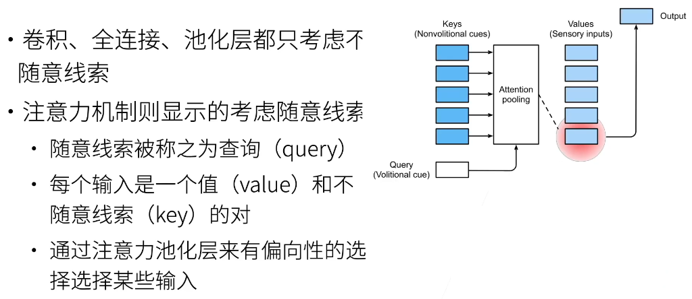
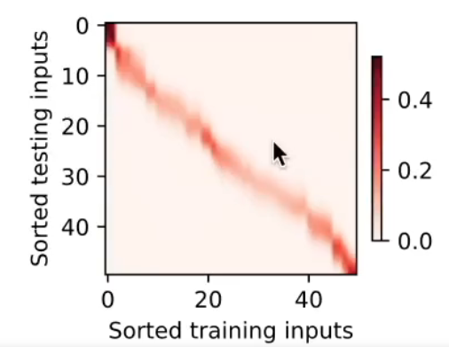

# 动手学深度学习v2 - 李沐

[D2L官网](https://zh.d2l.ai/)

[d2l - 课程主页](https://courses.d2l.ai/zh-v2/)

[d2l - Github](https://github.com/d2l-ai/d2l-zh)

[动手学深度学习 PyTorch版  - B站视频(合集)](https://space.bilibili.com/1567748478/lists/358497?type=series)

[PyTorch 论坛](https://discuss.pytorch.org/)

[课程论坛讨论](https://discuss.d2l.ai/c/chinese-version/16)

---

# 目录

[toc]


---

## 01 课程安排

LeNet - ResNet - LSTM - BERT

损失函数、目标函数、过拟合、优化

**内容**
1. **深度学习基础** - 线性神经网络, 多层感知机
2. **卷积神经网络** - LeNet, AlexNet, VGG, Inception, ResNet
3. **循环神经网络** - RNN, GRU, LSTM, seq2seq
4. **注意力机制** - Attention, Transformer
5. **优化算法** - SGD, Momentum, Adam
6. **高性能计算** - 并行, 多GPU, 分布式
7. **计算机视觉** - 目标检测, 语义分割
8. **自然语言处理** - 词嵌入, BERT

下载 D2L Notebook

```bash
mkdir d2l-zh && cd d2l-zh
curl https://zh-v2.d2l.ai/d2l-zh-2.0.0.zip -o d2l-zh.zip
unzip d2l-zh.zip && rm d2l-zh.zip
cd pytorch
```

安装d2l包，以方便调取本书中经常使用的函数和类

```bash
pip3 install d2l
```

---

## 02 深度学习介绍


应用
1. 图片分类 - [](https://image-net.org/)
2. 物体检测&分割(精确到像素)
3. 样式迁移
4. 人脸合成
5. 文生图
6. 文字/代码生成(eg. GPT-3)
7. 无人驾驶

案例 - 广告点击(搜推广)
1. 触发(用户搜索) - 点击率预估(关键) - 排序(点击率 × 竞价)
2. 广告特征提取(广告主、产品描述、图片) -> 模型(训练数据 -> 特征和用户点击 -> 模型) -> 点击率预测


---

## 03 安装

[PyTorch 官网](https://pytorch.org/)

---

## 04 数据操作 + 数据预处理

### 04.01 数据操作

主要的数据结构 - N维数组


**广播机制 - broadcasting mechanism** (numpy & tensor)


```python
import numpy as np
import torch

x = torch.arange(12).reshape(3,4)
y = np.ndarray(shape=(3,4))

print(type(x))      # <class 'torch.Tensor'>
print(type(y))      # <class 'numpy.ndarray'>

x_ = x.numpy()
y_ = torch.tensor(y)  # 涉及到数据拷贝
y__ = torch.from_numpy(y)  # 不涉及数据拷贝，更快、更节省内存

print(type(x_))     # <class 'numpy.ndarray'>
print(type(y_))     # <class 'torch.Tensor'>
print(type(y__))    # <class 'torch.Tensor'>

y = x.clone()  # 深拷贝
```

深度学习通常使用 32位浮点数 - torch.float32

### 04.02 数据预处理

csv 逗号分隔值 文件

pandas

`pd.get_dummies()` 用于将分类数据转换为一种称为 **独热编码 One-Hot Encoding** 的形式 (将缺失值转为 one-hot)

float64 计算较慢，一般使用 float32

reshape & view
1. 相同点
   1. 不会改变张量存储的数据本身，而是改变张量的形状(元信息)
   2. 总元素数量必须一致
2. 不同点
   1. view(更高效) 要求原始张量的内存布局必须是连续的，如果张量是非连续的，需要先调用 `.contiguous()` 方法将张量变为连续的
   2. reshape 会尝试自动处理非连续的张量，如果原始张量是非连续的，reshape 会隐式创建一个新的连续张量，并复制数据到新的内存区域

```python
torch.Tensor._is_view()
```


## 补 : `Dataset` & `DataLoader`

[Datasets & DataLoaders](https://pytorch.org/tutorials/beginner/basics/data_tutorial.html)

torch.utils.data.`Dataset`
1. 从数据源 (文件、数据库) 加载原始数据，可以使用 自定义/
2. import 方法 : `from torch.utils.data import Dataset`
3. **Pre-Loaded** (image, text, audio)
   1. `root`
   2. `train` (Bool)
   3. `download=True`
   4. `transform` (`torchvision.transforms` 中支持的)
4. **自定义** Dataset 需要 **继承** 该类 并 实现以下三个方法
   1. `__init__` : 初始化数据集，加载数据文件等
   2. `__len__` : 返回数据集中样本的数量
   3. `__getitem__` : 根据索引返回单个样本的数据和标签
   4. example
      ```python
      class CustomImageDataset(Dataset):
         def __init__(self, annotations_file, img_dir, transform=None, target_transform=None):
            self.img_labels = pd.read_csv(annotations_file)
            self.img_dir = img_dir
            self.transform = transform
            self.target_transform = target_transform

         def __len__(self):
            return len(self.img_labels)

         def __getitem__(self, idx):
            img_path = os.path.join(self.img_dir, self.img_labels.iloc[idx, 0])
            image = read_image(img_path)
            label = self.img_labels.iloc[idx, 1]
            if self.transform:
                  image = self.transform(image)
            if self.target_transform:
                  label = self.target_transform(label)
            return image, label  # 同时返回 data & label
      ```
5. 可以通过 `torchvision.transforms` 或自定义变换来增强数据

torch.utils.data.`DataLoader`
1. 用于将 `Dataset` 封装成批量数据的迭代器，根据需要将数据分成批次，处理随机打乱等操作
2. import 方法 : `from torch.utils.data import DataLoader`
3. 参数
   1. dataset : 需要加载的数据集
   2. batch_size : 每个批次的数据量
   3. shuffle : 是否在每个 epoch 开始时打乱数据
   4. num_workers : 加载数据的线程数(默认为 0，使用主线程)
4. 本身是 可迭代对象 iterable，需要 `iter()` 变为 迭代器，才能使用 `next()`
5. `for` 循环可以直接作用于 `iterable`，并且在内部会自动将 `iterable` 转换为 `iterator`


## 补 : `dir()` & `help()`

`dir(<object_name>)`
1. 列出对象的所有属性和方法，包括内置属性和用户定义的属性

`help(<func_name>)`
1. 提供对象或模块的详细帮助文档，包括方法、属性的使用说明及参数说明
2. 注意，仅需要函数名

在函数中添加文档字符串(docstring) `""" text """`，会自动读取这些内容

函数名
1. 双下划线 `__`
   1. 单侧 **private**，这些属性或方法只能在类内部访问，外部不能直接访问
   2. 双侧 **magic method** 魔术方法，通常由 Python 解释器定义和调用，而不是由开发者直接调用
2. 单下划线 `_` ，**protected**，开发者应该避免在类外部直接访问这些成员，但它并不会真正限制访问
3. 无下划线 ，**public**


---

## 05 线性代数


矩阵范数是一个标量，用来衡量矩阵的大小

**范数不等式**

**Frobenius范数** 是矩阵的一种范数，是矩阵中所有元素的平方和的平方根，机器学习中常用于正则化，以防止过拟合

```python
torch.norm(Array)

keepdim = True  # 保留维度
```

**正定矩阵** - Positive Definite Matrix : 对于一个实对称矩阵 $A$，它被定义为正定的，如果对于所有非零实向量 $x$，都有 $x^TAx>0$。

**正交矩阵** - Orthogonal Matrix : $UU^T=1$，行相互正交，行单位长度

**置换矩阵** - Permutation Matrix - 元素只有0和1，每行和每列只有一个元素是 1，箱单与单位矩阵行列变换，**置换矩阵 是 正交矩阵**，置换矩阵的逆是它的转置


特征向量(不被矩阵改变方向的向量) & 特征值

实对称矩阵
1. 总可以找到特征向量
2. 所有特征值都是实数
3. 特征向量可以构成一组正交基
4. 可以被正交矩阵对角化


矩阵乘法
1. Hadamard Product `⊙` 哈达玛积 : 矩阵按元素乘法
2. Cross Product `@` 叉乘


计算 总和/均值 时保持 轴数不变 `keepdims=True`

沿轴累加求和 `cumsum(axis=)`


---

## 06 矩阵计算

主要是求导数


$\frac{d}{dx} ln(x) = \frac{1}{x}$ 只是对于自然对数，其他情况需要使用 换底公式

亚导数(拓展到不可微函数)


**梯度**
1. 
2. 
3. 
4. 
5. 


### 06.01 分子布局 & 分母布局

在 PyTorch 中，雅可比矩阵 Jacobian Matrix 使用的是 **`分子布局`**

**分子布局 - Numerator Layout**
1. **行数** 与 **分子的变量维度**（即结果变量y的维度）一致
2. **列数** 与 **分母的变量维度**（即输入变量x的维度）一致
3. 个人理解 - 求导结果的 长度(行数) 和 分子长度 一致，宽度(列数) 和 分母长度 一致

**分母布局 - Denominator Layout**
1. **行数** 与 **分母的变量维度**（即输入变量x的维度）一致
2. **列数** 与 **分子的变量维度**（即结果变量y的维度）一致
3. 个人理解 - 求导结果的 长度(行数) 和 分母长度 一致，宽度(列数) 和 分子 长度 一致


个人理解
1. 分子布局 - 求导结果的长度和分子y长度一致，宽度和分母x长度一致


---

## 07 自动求导

**链式法则**


例子(分解 & 链式法则)
1. 
2. 

**自动求导** 计算一个函数在 **指定值** 上的导数


**计算图**


**自动求导 两种模式**
1. 
2. **正向**(Forward Mode)
   1. 先计算离输入近的
   2. 计算过程中不仅计算函数值，还同时计算导数
   3. **计算一个变量的梯度就需要扫一遍**(所以神经网络不会采用)
3. **反向**(Reverse Mode)
   1. 先计算离输出近的
   2. 需要读取 前向计算 的 中间结果(耗GPU资源)
   3. 可以一次性计算出所有输入变量的梯度
   4.  
4. 复杂度
   1. 

深度学习中，**求导是求模型参数对损失函数的导数**，如 权重和偏置，目的是为了优化这些参数以 **最小化损失函数**

PyTorch 的 `nn.Module` 中，模型的参数默认就是需要梯度的，`requires_grad` 属性默认为 **True**

模型中定义 `nn.Parameter` 或使用 `nn` 中的层，如 `nn.Linear`、`nn.Conv2d` 等，层内的参数 **默认会设置 requires_grad=True**

```python
# PyTorch 默认累计梯度
x.grad.zero_()  # 清空梯度，_表示重写内容
torch.Tensor.detach()  # 将部分计算移动到计算图外
```

即使构建函数的计算图需要通过 Python 的控制流(条件、循环、函数)，仍然可以得到变量的梯度


**展示梯度自动累加**
```python
import torch
x = torch.tensor([1,2,3,4], requires_grad=True, dtype=torch.float32)
y = 2.0 * torch.dot(x, x)
# 对y进行反向传播，计算梯度
y.backward(retain_graph=True)
print("After first backward: ", x.grad)  # tensor([ 4.,  8., 12., 16.])
# 再次对y进行反向传播，查看梯度如何累加
y.backward(retain_graph=True)
print("After second backward: ", x.grad)  # tensor([ 8., 16., 24., 32.])

# 如果不使用 retain_graph=True，在调用 y.backward() 后，计算图会被自动销毁。这是 PyTorch 的默认行为，目的是节省内存

# 如果不 retain_graph 也可以再次构建计算图来模拟累计
import torch
x = torch.tensor([1,2,3,4], requires_grad=True, dtype=torch.float32)
# 对y进行反向传播，计算梯度
y = 2.0 * torch.dot(x, x)
y.backward()
print("After first backward: ", x.grad)  # tensor([ 4.,  8., 12., 16.])
# 再次对y进行反向传播，查看梯度如何累加
y = 2.0 * torch.dot(x, x)
y.backward()
print("After second backward: ", x.grad)  # tensor([ 8., 16., 24., 32.])
```

显式构造并不方便

PyTorch累计梯度原因
1. 当GPU内存限制了批量大小时，通过累积来自多个小批量 mini-batches 的梯度，可以实现有效的大批量 batch 训练
2. 在**多任务学习**或当模型**有多个输出时**，需要分别计算每个损失函数对模型参数的梯度，此时需要累加梯度，之后再统一对模型参数更新
   ```python
   # 前向传播
   output1, output2 = model(input)
   loss1 = criterion1(output1, target1)
   loss2 = criterion2(output2, target2)

   # 反向传播
   optimizer.zero_grad()  # 清零梯度
   loss1.backward(retain_graph=True)  # 计算第一个损失的梯度
   loss2.backward()  # 计算第二个损失的梯度，梯度会累加到之前的基础上
   optimizer.step()  # 执行一次优化步骤
   ```
3. 循环神经网络 RNN 中，可能需要在一个训练步骤内多次计算同一参数的梯度，并将这些梯度累加起来

Loss 通常为**标量**

RNN 是环状图，但是实际上会拆开，然后梯度累加

---

## 08 线性回归 + 基础优化算法

### 08.01 线性回归


线性模型可以看做**单层神经网络**，仅有 输入层 & 输出层(不算层数)


收集训练数据集


线性模型有**显式解**(损失函数是 **凸函数**)


总结
1. 线性回归是对n维输入的加权，外加偏差
2. 使用平方损失来衡量预测值和真实值的差异
3. 线性回归有显式解
4. 线性回归可以看做是 **单层神经网络**


### 08.02 基础优化方法

**梯度下降**


梯度，是函数值上升最快的方向；负梯度，是函数值下降最快的方向

学习率 hyper-parameter
1. 
2. 不能太小 - 计算梯度耗时
3. 不能太大 - 模型难以收敛

实际中，一般不直接使用梯度下降(损失函数是所有样本的平均损失)


批量大小 **b** hyper-parameter
1. 不能太小 - 每次计算量太小，不适合并行来最大利用计算资源
2. 不能太大 - 内存消耗增加，浪费计算，例如 所有样本都是相同的

总结
1. 梯度下降通过不断**沿着反梯度方向更新参数**求解 - 不需要知道显式解
2. **小批量随机梯度下降**是深度学习默认的求解算法，其两个重要的超参数是
   1. 批量大小
   2. 学习率


### 08.03 线性回归 代码实现

[线性回归的从零开始实现 - ipynb](./OfficialNoteBooks/chapter_linear-networks/linear-regression-scratch.ipynb)

[线性回归的简洁实现 - ipynb](./OfficialNoteBooks/chapter_linear-networks//linear-regression-concise.ipynb)


`data.DataLoader` 将 dataset 转为 iterator，使用 next 获得下一个 batch

`trainer = torch.optim.SGD(net.parameters(), lr=0.03)`

传入 网络参数 给 optimizer，可以用 `step()` 自动 更新参数

对于 每个 iteration，optimizer 先需要 `zero_grad()`

对 loss 进行 `backward()`，各个 parameter 对于 loss 的

---

## 补

[“随机梯度下降、牛顿法、动量法、Nesterov、AdaGrad、RMSprop、Adam”，打包理解对梯度下降法的优化](https://www.bilibili.com/video/BV1r64y1s7fU/)

[优化器 ｜SGD ｜Momentum ｜Adagrad ｜RMSProp ｜Adam](https://www.bilibili.com/video/BV1jh4y1q7ua)

[十分钟搞明白Adam和AdamW，SGD，Momentum，RMSProp，Adam，AdamW](https://www.bilibili.com/video/BV1NZ421s75D)

梯度下降 是下降 **损失函数的梯度**

使用 Vanilla 的 梯度下降，需要 **遍历整个数据集**，效率不高，并且梯度求的是一个点的最速下降方向 结合 步长(学习率)，而不整体的最优路径


随机梯度下降
1. 对于 凸问题，收敛速度稍慢于 Vanilla 梯度下降，性价比高
2. 随机选取一个批次(mini-batch)


牛顿法


动量法

Nesterov

AdaGrad

RMSprop

Adam


---

## 09 Softmax回归 + 损失函数 + 图片分类数据集

回归 预测 连续值

分类 预测 离散类别


ArgMax 难以 求导，因此难以 BackPropagation

分类
1. 对 真实类别进行 独热编码 One-Hot Encoding
   1. 
2. 更需要 正确类的 置信度 尽量大，$o_{True} - o_{False} \ge \delta$，让模型有能力更能辨识类别
3. Softmax，预测概率 (多分类)
   1. 
   2. 输出范围 0-1
4. **Cross Entropy** 交叉熵，用于衡量 两个分布的相似程度
   1. **==☆==**[信息量--香农熵--交叉熵--kl散度 | 笔记](../DiffusionModel/DiffusionModel.md#补--信息量--香农熵--交叉熵--kl散度)
   2. 只关心预测正确的情况(因为独热)

**激活函数**

Sigmoid $\sigma(x)$
1. $$\sigma(x) = \frac{e^x}{1+e^x}$$
2. derivative : $$\frac{\partial \sigma(x)}{\partial x} = \sigma(x) (1- \sigma(x))$$

ReLU(Rectified Linear Unit)


**损失函数**

Cross Entropy Loss(eg : 二分类)
1. $$L(y, \hat{y}) = -[y \log(\hat{y}) + (1-y)\log(1- \hat{y})]$$
2. derivative : $$\frac{\partial L}{\partial \hat{y}} = - \frac{y}{\hat{y}} + \frac{1-y}{1-\hat{y}} = \frac{\hat{y}-y}{\hat{y}(1-\hat{y})}$$
3. 
4. 在 worst prediction 中，Loss 大，因此更新快

Loss Function
1. L2 Loss - MSE(Mean Squared Error)
   1. 距离 minimum 越远，梯度下降 越快，参数更新幅度越大
2. L1 Loss - MAE(Mean Absolute Error)
   1. 距离 minimum 不同距离，梯度下降 速度相同，参数更新幅度相同(稳定性)
3. Huber's Robust Loss - 结合 L1 & L2
   1. 
   2. 在非常靠近 minimum 时候，可以 更小的更新幅度


数据集
1. [图像分类数据集 - ipynb](./OfficialNoteBooks/chapter_linear-networks/image-classification-dataset.ipynb)


Softmax 回归 代码实现
1. [softmax回归的从零开始实现 - ipynb](./OfficialNoteBooks/chapter_linear-networks/softmax-regression-scratch.ipynb)
2. [softmax回归的简洁实现 - ipynb](./OfficialNoteBooks/chapter_linear-networks/softmax-regression-scratch.ipynb)


---

## 10 多层感知机 + 代码实现


---

## 11 模型选择 + 过拟合 & 欠拟合

常见比例为 70%训练集 & 15%验证集 & 15%测试集

Training Set - learn parameters

Validation Set - tune hyper-parameters
1. 在训练过程中，每隔一段时间(如每个epoch)在验证集上评估模型性能
2. 超参数调优 : 定义超参数空间，选择在验证集上表现最好的超参数组合
3. 不参与训练，**多次使用**

Test Set - evaluate performance
1. 评估模型在未见数据上的最终性能
2. **一次性使用**


TODO

---

## 12 权重衰退 Weight Decay

[weight decay - ipynb](./OfficialNoteBooks/chapter_multilayer-perceptrons/weight-decay.ipynb)

一种 L2 正则化(L2 Regularization) 技术，目的是防止模型过拟合，让神经网络的权重不会变得过大

处理过拟合的方法

限制参数值选择范围

硬性限制(不常用)
1. 

柔性限制
1. $\lambda$ 是 超参数
2. 相当于 在 loss 加上了 对 weight 的 penalty 罚
3. 


参数更新
1. 
2. 先将当前权重减小，再按照梯度更新


不需要特殊的网络结构

pytorch 中 直接 使用 参数更新公式 在 优化器中 提供选项 (`torch.optim`)
1. 作用到 `model.parameters()` 里的所有参数，包括 bias
   1. `optimizer = optim.SGD(model.parameters(), lr=0.01, weight_decay=0.0001)`
   2. `optimizer = optim.Adam(model.parameters(), lr=0.001, weight_decay=0.0001)`
2. 只对权重 weights 进行 L2 正则化，而不对偏置 bias 进行正则化
   ```python
   optim.SGD([
                  {'params': others},
                  {'params': bias_params, 'weight_decay': 0}
               ], weight_decay=1e-2, lr=1e-2)
   ```

---


## 13 丢弃法 DropOut

动机 : 好的模型 需要对 input 的 扰动 鲁棒

使用 有噪声的 数据 相当于 Tikhonov 正则

正则使得权重不要太大，避免一定程度的过拟合

丢弃法 : 在 层之间 加入噪音，而不是在 输入 加噪音

**不改变期望** - **无偏差**的加入噪音
1. 

通常将 丢弃法 作用在 **隐藏全连接层的 输出**(不是整个模型的 输出)

很少用在 CNN 中

丢弃概率 是一个 超参数


训练时随机丢弃（置零）部分神经元，这样可以让模型学到更鲁棒的特征

**注意**
1. 正则项 只在 训练中 使用，影响 模型参数 更新
2. 保证确定性的输出


---

## 14 数值稳定性 + 模型初始化

[Numerical Stability - ipynb](./OfficialNoteBooks/chapter_multilayer-perceptrons/numerical-stability-and-init.ipynb)


**梯度爆炸**
1. 
2. 转置是因为分母布局
3. 

**梯度消失**
1. 
2. 
3. 


---

## 15 Kaggle 房价预测 + 课程竞赛:加州2020年房价


---

## 16 PyTorch 神经网络基础


---

## 17 使用和购买 GPU


---

## 18 预测房价竞赛总结


---

## 19 卷积层


---

## 20 卷积层里的填充和步幅


---

## 21 卷积层里的多输入多输出通道


---

## 22 池化层


---

## 23 经典卷积神经网络 LeNet


---

## 24 神队卷积神经网络 AlexNet


---

## 25 使用块的网络 VGG


---

## 26 网络中的网络 NiN


---

## 27 含并行连结的网络 GoogLeNet/Inception V3


---

## 28 批量归一化 Batch Normalization(BN)

[Batch Normalization - ipynb](./OfficialNoteBooks/chapter_convolutional-modern/batch-norm.ipynb)

Normalization 的作用 把数据拉回标准正态分布，向量经过矩阵运算后值会越来越大，为了网络的稳定性，需要及时把值拉回正态分布

不同batch的分布变化大

让同一个 batch 样本 在 每一层 都服从 类似的分布


一般情况会出现，梯度消失，下层(接近input) 梯度小 训练慢

底层变化，导致上层部分 也需要更新，导致收敛慢
1. 底层(靠近 Input，梯度小，收敛慢，细节)
2. 顶层(靠近 Loss ，梯度大，收敛快，抽象)

希望学习底层的时候，避免顶层变化

batch 的 分布(方差 和 均值) 会一直变化

尝试将 不同层 的 mini-batch 的 均值 & 方差 固定


$\gamma$, $\beta$ **仿射参数是需要学习的**

$|B|$ 是 batch size

$^2$是 逐元素 平方

分母一般加一个 小 $\epsilon$ 防止 0

**$$\hat{x}_i = \frac{x_i - \mu_B}{\sqrt{\sigma_B^2 + \epsilon}}$$**

**$$y_i = \gamma \hat{x}_i + \beta$$**


BN 完成归一化后，再 **乘 γ** & **加 β** 相当于再进行 一次 仿射变换，可以避开 激活函数的线性部分，**不降低模型的 表达能力 和 灵活性**


**==注意 一定 要在 激活函数 之前==**，防止 激活函数 截断数值



**不仅仅可以作用在数据上，而且可以作用在 每个 全连接层/卷积层 的 input/output**

对于
1. 全连接层(特征维)
   1. 对每个 特征 计算 标量的 均值 & 方差，进行归一化，再用学到的 $\gamma$, $\beta$ 进行 调整
2. 卷积层(通道维)
   1. 作用在 **通道(channel)** 上，与图像分辨率无关


每个 mini-batch 的 均值 和 方差 可以理解为 一个 随机的 偏移/缩放 (噪声)


可以用更大的学习率，加速收敛，不改变模型精度

`nn.BatchNorm2d`

推理 使用 全局的 moving_mean & moving_var (利用 momentum 调整 当前 & 过去 的 比例，是在 训练时更新的)，训练使用 mini-batch 的 mean & var


缺陷
1. 仅在 Batch 中包含样本数量较多时有效
2. 对于 RNN / Sequence序列数据 性能差
3. 分布式运算 的 数据同步，影响效率


## 补 : 层归一化 Layer Normalization(LN)

[什么是层归一化LayerNorm，为什么Transformer使用层归一化 - B站视频](https://www.bilibili.com/video/BV1yCyQY6EnA/?)

BatchNorm & LayerNorm
1. **BatchNorm 切 feature 聚合 batch**，**LayerNorm 切 样本 聚合 feature & seq_len**
2. BatchNorm 依赖整批样本，样本间分布差异越大，统计越不稳定
3. LayerNorm 不受 batch大小、序列长度、样本分布影响
4. NLP 常见场景对 BatchNorm 不友好，**batch 中句子长短差别大**，BN 统计容易被极端样本拉偏
5. Transformer 训练常因显存或模型并行被迫把有效 batch size 压得很小，BN 统计噪声大
6. BN，**padding token** 也加入统计会污染均值方差；LN 则天然只看自身维度，不受 pad 位影响
7. BN 需要在训练期间累积 全局移动平均 作推理用，LN 运行时只用当前样本自身统计，训练/推理 公式一致，无需维护额外状态


序列数据 尺寸 $B * Q* D$
1. B - batch size
2. Q - sequence length
3. D - feature dim

是 Batch Normalization 的替代方案，但不依赖 mini-batch 的统计信息，而是对每个样本的隐藏层神经元维度进行归一化


不是以 batch 为单位 进行 归一化，而是 对 某个样本的 某层 的 input/output 进行归一化(对于原始数据，相当于是对于 feature 维度 计算均值 和 方差)，让不同 feature 维度可以有不同的 缩放比例 和 偏差

公式 和 Batch Norm 类似，也有两个 可以学习的参数 $\gamma$, $\beta$，用于仿射变化，γ 和 β 的作用是让网络在归一化后仍然能够灵活学习不同的 feature 分布，而不会丢失原始信息，

Transformer 使用 层归一化


### BN & LN 对比

BN抹杀 同一个样本 不同特征之间的大小关系，但是保留 不同样本间各个特征的 相对大小关系

LN抹杀 不同样本间的 大小关系，但是保留 一个样本内不同特征之间的 相对大小关系

batch-size较小 或 序列问题 可以使用 LN

RNN 或 Transformer 解决的是序列问题，不同样本的序列长度不一致，而 Batch Norm 需要对不同样本的同一位置特征进行标准化处理

LN 保留了一个样本内不同特征之间的大小关系，一条样本的不同特征，其实就是时序上的变化，这正是需要学习的东西自然不能做 BN 抹杀

训练 & 推理
1. LN 针对的是单独一个样本，训练 & 预测阶段 的使用并无差别
2. BN 针对一个batch进行计算的，预测时有时要预测的是单个样本
   1. 要么 认为 batch size 就是 1，不进行标准化处理
   2. 要么 在训练时记录标准化操作的 均值和方差 直接应用到 预测数据


### 例题

对于 PyTorch 里的一个 图片tensor，shape 为 (2, 3, 4, 4)，如果对这个 Tensor 进行 **Batch Normalization**，请问一共会计算 **几个均值/方差**？ 3，通道数 channel

对于 PyTorch 里的一个 文本tensor，shape 为 (2, 3, 4)，如果对这个 Tensor 进行 **Layer Normalization**，请问一共会计算 **几个均值/方差**？ 2*3 (batch_size * sequence_size(token 数量))，不需要 特征维度

对于 shape 为 (2, 3, 4, 4) 的 Tensor，如果对其进行 Batch Normalization (BN)，请问 α/β（可学习参数 γ 和 β）的 shape 是多少？ **在 C=3 维度计算均值和方差，每个通道 1 组 γ 和 β，shape 是 [3]**

对于 shape 为 (2, 3, 4) 的 Tensor，如果对其进行 Layer Normalization (LN)，请问 α/β（可学习参数 γ 和 β）的 shape 是多少？ **对 D=4 维度进行归一化，所以 γ/β 的 shape 也是 [4]**

Batch Normalization (BN) 在 CNN 任务中， 对每个通道（Channel）单独计算均值和方差，所以对于 RGB 3 通道的图像，BN 计算 3 个均值和方差，与图像大小无关


**Batch Norm 区分 训练/推理(需要 moving_mean/var)**


---

## 29 残差网络 ResNet


### ResNet 为什么能训练出 1000 层的模型


---

## 30 第二部分完结竞赛:图片分类


---

## 31 深度学习硬件: CPU & GPU


---

## 32 深度学习硬件: TPU & 其他


---

## 33 单机多卡并行


---

## 34 多 GPU 训练实现


---

## 35 分布式训练


---

## 36 数据增广


---

## 37 微调


---

## 38 第二次竞赛 树叶分类结果


---

## 39 实战 Kaggle 比赛 : 图像分类 CIFAR-10


---

## 40 实战 Kaggle 比赛 : 狗的品种识别 ImageNet Dogs


---

## 41 物体检测 和 数据集


---

## 42 锚框


---

## 43 树叶分类竞赛技术总结


---

## 44 物体检测算法 : R-CNN, SSD, YOLO


---

## 45 SSD 实现


---

## 46 语义分割 和 数据集


---

## 47 转置卷积

### 47.2 转置卷积是一种卷积


---

## 48 全连接卷积神经网络 FCN


---

## 49 样式迁移


---

## 50 课程竞赛 - 牛仔行头检测


---

## 51 序列模型 Sequence Model

RNN, NLP 处理序列，考虑时间信息

CNN 考虑空间信息

**统计工具** (**不独立**的随机变量)
1. **联合概率** 用 **条件概率** 展开
2. 
3. 核心 : 条件概率
   1. 
   2. 当前时刻的值依赖于之前时刻的某种函数 $f$

自回归模型 Auto-Regressive Model
1. 核心思想 : 当前时刻的值由之前若干时刻的值决定，**使用自身过去数据预测未来**

方案
1. Markov 假设
   1. 
   2. 只需关注 过去 $\tau$ 个数据点
   3. 特点
      1. 当序列很长，不需要回看很久
      2. **定长**，可以使用 之前的方法 : 如 MLP
2. 潜变量模型 Latent Variable
   1. 
   2. 只用一个 潜变量 数据 $h_t$ 表示 过去信息
   3. 当前 潜变量 通过 **前一时刻的** input & 潜变量 来计算


[序列模型 - ipynb](./OfficialNoteBooks/chapter_recurrent-neural-networks/sequence.ipynb)
1. 数据对
   1. input  : $[x_{t-\tau}, \cdots , x_{t-1}]$
   2. output : $x_t$
2. `nn.init.xavier_uniform_` : 用于初始化 神经网络 的权重，用于 解决 梯度消失 & 梯度爆炸 - TODO

预测
1. 单步预测 : 给定 真实数据 预测下一个 数据
2. 多步预测 : 使用 自己的预测，不断推演 (每次预测都有误差，误差不断叠加)


---

## 52 文本预处理

文本当做时序序列，将词汇转为训练素材

[文本预处理 - ipynb](./OfficialNoteBooks/chapter_recurrent-neural-networks/text-preprocessing.ipynb)

暴力方法(现实中不用) : 仅保留字母，并将字母全变为小写，去除两端空白字符

tokenize 词元化
1. 两种方式
   1. word 词 : 机器学习模型简单，但词可能性多，而且会有 **长尾** 问题(很多词出现频率低)
   2. char 字符 : 可能性少，但是模型要学习用字符构成单词
2. 特殊
   1. reserved token : 句子 开始/结束 Token
   2. unknown token `<unk>` : 未知

中文更麻烦，需要分词(没有空格) `jieba` 库

vocabulary 词汇表
1. 计算机无法直接处理原始文本数据，需要将文本转换为**数值形式**
2. 将文本中的每个单词或词项映射到数值空间
3. 通过词汇表，我们可以使用 词袋模型(Bag of Words)、TF-IDF 或 Word2Vec 等方法将文本转换为向量
4. 构建 vocabulary 可以有效地控制输入特征的维度，避免处理过程中出现过多的词项
5. 可以构建 `token_to_idx` & `idx_to_token`

corpus 语料库

模型 需要配合 训练模型使用的vocabulary


---

## 53 语言模型

文本序列

目标是估计 **联合概率**

给定前面的词，不断使用条件概率，生成后续文本

应用
1. 
2. 甚至可以纠错


---

## 54 循环神经网络 RNN(Recurrent Neural Network)

[【数之道 09】揭开循环神经网络RNN模型的面纱 - BiliBili](https://www.bilibili.com/video/BV1YK411F7Tg)

MLP 不适合 处理 序列问题，模型 input 数量固定


BPTT - Back Propagation Through Time
1. 
2. 也会出现 梯度消失/梯度爆炸 的问题，很多个 $\frac{\partial H_k}{\partial H_{k-1}}$ 连乘
3. 通过 LSTM 或 GRU 解决 (**短期记忆**)
   1. 


tanh 损失函数
1. **$$\tanh(x) = \frac{e^x - e^{-x}}{e^x + e^{-x}}$$**
2. 
3. 零均值、对称性好，梯度较大
4. 比 Sigmoid 更适合深度网络，因为其**梯度更大，不容易梯度消失**


同一层 所有时间步共享参数

不同层 拥有独立的参数


[Understanding LSTM Networks](https://colah.github.io/posts/2015-08-Understanding-LSTMs/)

---

## 55 循环神经网络 RNN 的实现


---

## 56 门控循环单元 GRU(Gated Recurrent Units)

[lstm - ipynb](./OfficialNoteBooks/chapter_recurrent-modern/gru.ipynb)

GRU 是在 LSTM 之后 提出的，只用 隐藏状态传递信息

RNN 无法处理 太长的序列，Hidden State 无法记住 很久以前的 信息

观察序列时，不是每个观察值都同等重要

2 个 sigmoid
1. **更新门** update gate
   1. 上期状态能进入当期的比例
   2. 数据比较重要，更新隐藏状态
   3. 等于 1，不更新，保留过去状态，抛弃当前 input
   4. 等于 0，抛弃 过去状态，更关注当前 input
2. **重置门** reset gate
   1. 上期状态的遗忘比例
   2. 遗弃多少历史信息

1 个 sigmoid

同时考虑历史信息部分 & 新增信息部分


$\tilde{H}_t$(candidate hidden state)，input & hidden state 经过 重置门

$H_t$(hidden state)


极端情况
1. z = 0，r = 1，回退到 普通 RNN
2. z = 0，r = 0，只关注当前 input
3. z = 1，忽略当前 input

outputs 存储整个序列的输出，必须在循环中逐步**累积结果**

H 隐藏状态，每个时间步只需要保留最新的 H，不需要存储整个历史序列的 H


---

## 57 长短期记忆网络 LSTM(Long Short-Term Memory)

[lstm - ipynb](./OfficialNoteBooks/chapter_recurrent-modern/lstm.ipynb)

**候选记忆单元** $c_t$ (Memory(Cell State)) - 相比 RNN 增加
1. 上期状态 $c_{t-1}$ 通过 遗忘门
2. 加上 本期新增的部分(由 tanh & sigmoid 相乘 得到)
3. 本期状态 乘以 输出门，得到输出值
4. 可以看成一个 没有 normalize 的，数值区间可能比较大
5. 可以选择 过去 和 当前 的 比例


3 个 sigmoid & 2 个 tanh 函数
1. sigmoid
   1. 可以返回 [0,1] 区间的值
   2. 可以作为闸门，控制信息更新的比例
   3. 管理
      1. **遗忘门** forget gate
         1. 将值朝0 减少
         2. 0 表示 完全遗忘
         3. 1 表示 完全保留
      2. **输入门** input gate
         1. 决定是否忽略 input 数据
      3. **输出门** output gate
         1. 决定是不是使用 隐状态
2. tanh
   1. 可以返回 [-1,+1] 区间的值
   2. 控制信息的增减的 大小 & 方向，并将值锁定在 [-1,+1] 区间


由于 由4个部分组成，结果 在0~1之间 或者 大于1，混合相乘，更加稳定 (解决梯度 消失、爆炸)


$\tilde{c}_t$ 的范围 是 [-1,+1] (tanh 的输出)，但是 $c_t$ 未必，通过 tanh 将其 放缩在 [-1,+1]之间，再和 output gate 得到 $H_t$


Hidden State / Memory(Cell State) / Candidate Memory 的 维度相同

遗忘门，输入门，输出门，候选记忆单元 的网络参数 维度一样

```python
return (normal((num_inputs, num_hiddens)),  # W_x (输入 -> 隐藏)
        normal((num_hiddens, num_hiddens)),  # W_h (隐藏 -> 隐藏)
        torch.zeros(num_hiddens, device=device))  # 偏置项 b
```

perplexity : 困惑度，衡量语言模型好坏的指标，数值越小，表示模型的预测能力越强

最终输出 $Y_t$ 只由 hidden state 决定

$H_t$(Hidden State) 称为短期记忆，更容易受输入变化影响
$C_t$(Cell State) 称为长期记忆，更稳定


---


## 58 深层循环神经网络


---

## 59 双向循环神经网络


---

## 60 机器翻译数据集


---

## 61 编码器-解码器 架构


编码器(处理输入) : 将 input 变成 中间表达形式(特征)

解码器(得到输出) : 将 中间表达形式 解析为 output

CNN
1. 

RNN
1. 

编码器 输出 状态 (encoder_outputs)

解码器 接收 编码器的输出 作为 init_state

编码器 和 解码器 都有 输入


---

## 62 序列到序列学习 seq2seq

编码器 解码器 都是 RNN

编码器 最后时刻的 隐状态 作为 初始 解码器 隐状态，完成信息传递


编码器 是 RNN，读取输入句子，只需要 hidden state，不需要输出

encoder 可以使用 双向 RNN(既能看到前文，也能看到后文，不仅仅是从左到右)，decoder 不能是 双向 RNN，因为需要做预测

将最后的 隐藏状态 传给 解码器，使用 RNN 输出，给一个 `<bos>` 直到 `<eos>`，长度可变


编码器 最后 时间步 的 hidden state 用作 解码器的 init_state (初始隐状态)

**训练**
1. 解码器 使用 目标句子 作为 输入
2. 即时 前一个 单词 翻译错误 也不影响，使用 目标句子的上一个词 作为 下一个 输入
3. 


**推理**
1. 直接使用上一时刻输出的 作为 下一时刻的 输入


**BLEU**(Bilingual Evaluation Understudy)
1. 衡量生成序列的好坏
2. `n-gram` 从一个序列中 **连续** 取出的 n 个元素的子序列
3. n-gram 精度 使用 clipped count (裁剪计数 (B 在参考里只有 1 次，所以预测里的 2 个 B 只能算 1 次命中))，避免模型靠 复读 同一个高频词来刷分
4. 
5. BLEU 越大越好
6. 指数项惩罚过短的预测，如果 过长 容易 低命中
7. $p_n$(n-gram 的精度) 小于 1，越开方越大，因此 长匹配 有 高权重


---

## 63 束搜索 (Beam Search)

seq2seq 中 使用 贪心搜索预测序列 (选最大概率的词)

贪心 ≠ 最优 (局部最优 ≠ 全局最优)，当前步次优，但是后续 有更好的选择

穷举可以保证最优，但是 computing complexity 太大，为 $n^T$ (字典大小$n$，序列长度$T$)

Beam Search
1. 每次搜索，保存最好的 k个 候选 (一共只保留k个，不是每个 branch 保留 k个)
2. 每个时刻，对上一步 k个候选(每个对应 n种 可能) 对应的 kn个可能，选出最好的 k个
   1. 如果某些分支(branch)提前结束(产生 `<eos>` 标记)，算法通常会将这些分支的结果保留，并继续扩展其他未完成的分支(确保生成的结果完整且能够处理不同长度的输出序列)
3. 
4. 时间复杂度 $O(knT)$
5. 可能不仅仅考虑最后的 k 个，子序列也考虑
6. 候选分数 $\frac{1}{L^\alpha} \log p(y_1, \ldots, y_L) = \frac{1}{L^\alpha} \sum_{t'=1}^L \log p(y_{t'} | y_1, \ldots, y_{t'-1})$
   1. $\frac{1}{L^\alpha}$ 用于归一化，log 的结果为负，使用该参数可以减少对 短句的 倾向
      1. 不归一化，会倾向于短句，因为概率越乘越小，log 之后 会是 更大负数
   2. 通常 $\alpha$ 取 0.75


---

## 64 注意力机制 (Attention Mechanism)

不随意线索 : 找到特征最明显的 (卷积，全连接，池化)

随意线索 : 有意识的寻找 (注意力机制)



**随意线索 query**

**不随意线索 key** & 对应值 value


通过 attention pooling 注意力池化，**有偏向性的选择输入**


非参注意力 池化/汇聚
1. 非参表示，参数不用学习，只要足够多数据，可以很好拟合模型
2. 
3. K 是 kernel核，用于 衡量 query 和 key 差异
4. 
5. 有点像滑动窗口，加权平均


参数化注意力机制
1. 引入 可以学习的 $w = \frac{1}{\sigma}$ (kernel 宽度)，起到缩放距离的作用，w大($\sigma$ 小) softmax 更尖锐，w小($\sigma$ 大) softmax 更平坦
2. 
3. query - $x$
4. key - $x_i$
5. value - $y_i$


bmm(batch matrix multiplication)，对于每个batch，分别进行矩阵乘法

热力图
1. 
2. Testing = Query
3. Training = Key
4. 颜色表示 softmax 后 得到的 **注意力权重** $\alpha$


---

## 65 注意力分数

[attention-scoring-functions - ipynb](./OfficialNoteBooks/chapter_attention-mechanisms/attention-scoring-functions.ipynb)

分数 : 没有 normalize 的 权重


拓展到高维度


关键在于 设计 a

**Additive Attention** 加性注意力
1. 将 key & query 映射 到相同长度，并相加，放入激活函数，并和 v相乘(不是 value) 转为一个值
2. 
3. 相当于一层 全连接

**Scaled Dot-Product Attention**
1. 如果长度相同，可以不学新参数，直接内积，并除以长度开根号，减少对长度的敏感性
2. 


可以对部分 weight 做 dropout，忽略某些 key-value pair，做完后 和 value 进行 bmm

---

## 66 使用注意力机制的 seq2seq

[Bahdanau 注意力 - ipynb](./OfficialNoteBooks/chapter_attention-mechanisms/bahdanau-attention.ipynb)

机器翻译中，每个生成的词可能源于句子中不同的词，需要 focus

而 普通 seq2seq 只使用了 最后的 hidden state，之前的内容可能产生遗忘，难以还原

**动机** 希望在翻译的时候，使用对应原句的词 (利用 注意力机制)

对比
1. 有注意力 -> 全序列隐藏状态当 Key/Value
2. 没注意力 -> 只要最后隐藏状态

加入注意力
1. 
2. 编码器 每个 词的输出 作为 key-value (相同的)
3. 解码器 RNN 上一个词输出 作为 query (最好是用当前词，但是正在预测，因此用上一个词)
4. 注意力的输出 和 下一个词的 embedding 合并 作为输入 进入 RNN
5. query 和 key-value 都统一用 RNN 的 输出，因为语义空间一致

seq2seq 通过 隐状态 在 encoder & decoder 中传递信息

注意力机制 通过 解码器 RNN 输出，匹配 合适的 编码器 RNN 输出，更有效的传递信息


---

## 67 自注意力


---

## 68 Transformer


---

## 69 BERT 预训练


---

## 70 BERT 微调


---

## 71 目标检测竞赛总结


---

## 72 优化算法


---

## 73 课程总结和进阶学习


---


