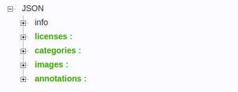
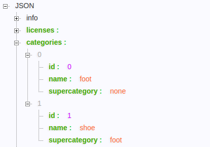
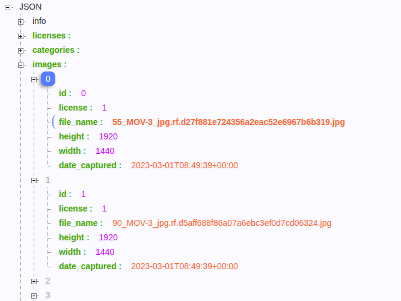
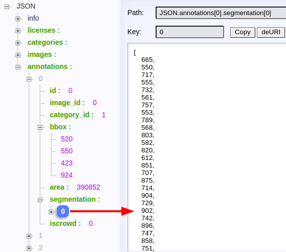

# [COCO 数据集](https://cocodataset.org/#home)

[toc]

## Portals

[Introduction to the COCO Dataset --- OpenCV](https://opencv.org/introduction-to-the-coco-dataset/)

[读coco数据集的代码接口了解segmentation的处理方法](https://blog.csdn.net/u013735511/article/details/79099483)

## COCO Dataset Formats

COCO数据集是微软团队制作的一个数据集，通过这个数据集我们可以训练到神经网络对图像进行detection，classification，segmentation，captioning。

COCO stores data in a JSON file formatted by info, licenses, categories, images, and annotations. You can create a separate JSON file for training, testing, and validation purposes.

**数据集整体结构(使用 edge 浏览器插件 JSON-handle 查看)**



```json
{
    "info": info,
    "licenses": [license],
    "images": [image],
    "annotations": [annotation],
    "categories": [category]
}
```

**Info: Provides a high-level description of the dataset.**


```json
"info": {
    "year": int,
    "version": str,
    "description": str,
    "contributor": str,
    "url": str,
    "date_created": datetime 
}

"info": {
    "year": 2021,
    "version": 1.2,
    "description": "Pets dataset",
    "contributor": "Pets inc.",
    "url": "http://sampledomain.org",
    "date_created": "2021/07/19" 
}
```

**Licenses: Provides a list of image licenses that apply to images in the dataset.**  数组形式


```json
"licenses": [{
    "id": int,
    "name": str,
    "url": str
}]

"licenses": [{
    "id": 1,
    "name": "Free license",
    "url": "http://sampledomain.org"
}]
```

**Categories: Provides a list of categories and supercategories.**  数组形式



```json
"categories": [{
    "id": int,
    "name": str,
    "supercategory": str,
    "isthing": int,
    "color": list
}]

"categories": [
    {"id": 1, 
     "name": "poodle", 
     "supercategory": "dog", 
     "isthing": 1, 
     "color": [1,0,0]},
    {"id": 2, 
     "name": "ragdoll", 
     "supercategory": "cat", 
     "isthing": 1, 
     "color": [2,0,0]}
]
```

**Images: Provides all the image information in the dataset without bounding box or segmentation information.**  数组形式



```json
"image": {
    "id": int,
    "width": int,
    "height": int,
    "file_name": str,
    "license": int,
    "flickr_url": str,
    "coco_url": str,
    "date_captured": datetime
}

"image": [{
    "id": 122214,
    "width": 640,
    "height": 640,
    "file_name": "84.jpg",
    "license": 1,
    "date_captured": "2021-07-19  17:49"
}]
```

**Annotations: Provides a list of every individual object annotation from each image in the dataset.**  数组形式

iscrowd
1. iscrowd=0，这时候就会用到polygon，也就是多边形
2. iscrowd=1，会用到RLE



```json
"annotations": {
    "id": int,
    "image_id": int,
    "category_id": int
    "segmentation": RLE or [polygon],
    "area": float,
    "bbox": [x,y,width,height],
    "iscrowd": 0 or 1
}

"annotations": [{
    "segmentation":
    {	
        "counts": [34, 55, 10, 71]
        "size": [240, 480]
    },
    "area": 600.4,
    "iscrowd": 1,
    "Image_id": 122214,
    "bbox": [473.05, 395.45, 38.65, 28.92],
    "category_id": 15,
    "id": 934
}]

"annotations": [{
    "segmentation": [[34, 55, 10, 71, 76, 23, 98, 43, 11, 8]],
    "area": 600.4,
    "iscrowd": 1,
    "Image_id": 122214,
    "bbox": [473.05, 395.45, 38.65, 28.92],
    "category_id": 15,
    "id": 934
}]
```