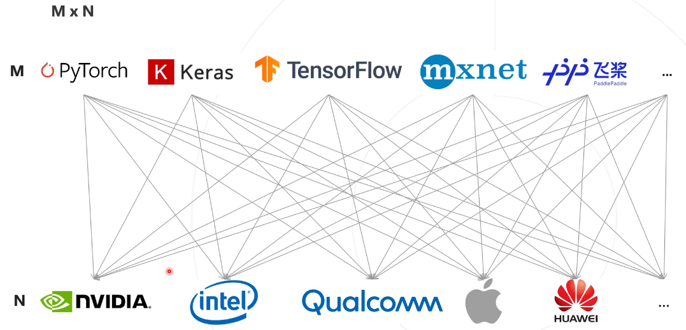
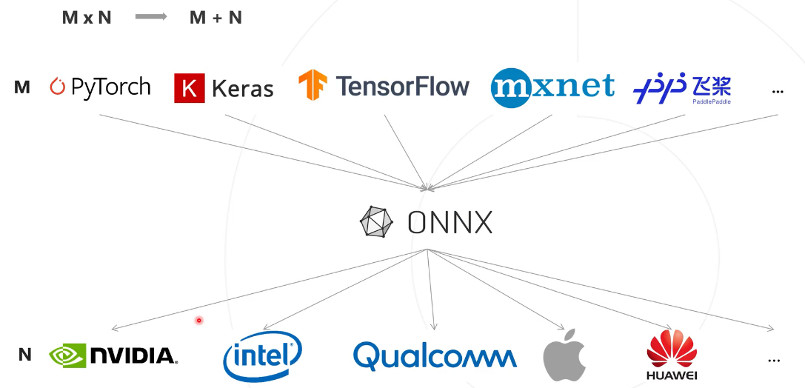
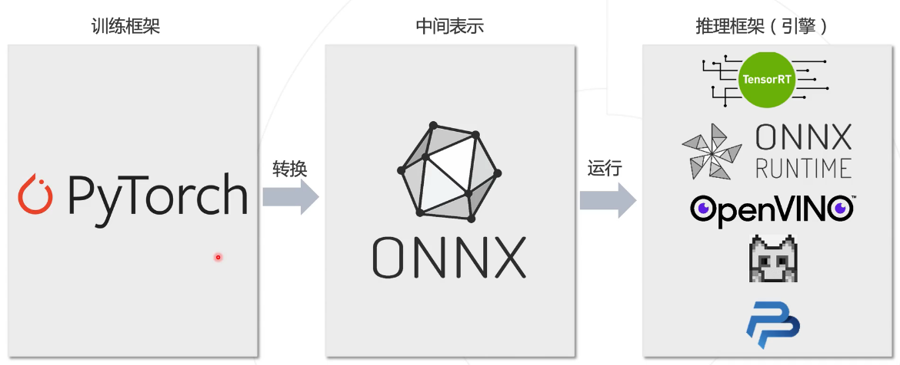
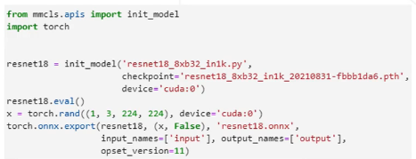
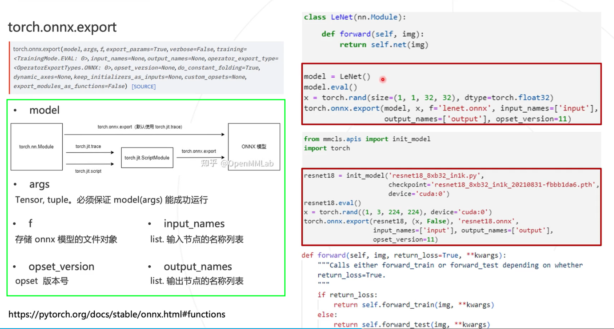

# MMDeploy

# 通用视觉框架 OpenMMLab 之 MMDeploy

[通用视觉框架 OpenMMLab 之 MMDeploy --- B站官方](https://space.bilibili.com/1293512903/channel/collectiondetail?sid=1142395)

[Netron 网页版](https://netron.app/)

[netron --- github](https://github.com/lutzroeder/netron)

## 01 PyTorch 模型部署基础知识

### 背景介绍

数据 -> 模型 -> 部署

### ONNX 模型格式

调用模型的 .eval() 进入 evaluation 模式，消除 dropout、bn 等影响

[TORCH.ONNX --- pytorch官网](https://pytorch.org/docs/stable/onnx.html)

args 要 对应 forward 函数，保证 model(args) 能够运行

这是因为，当 model 是 nn.Module 时，pytorch 只有在执行一遍模型推理的过程(即调用模型的 forward 函数)，才能知道模型使用了哪些算子

