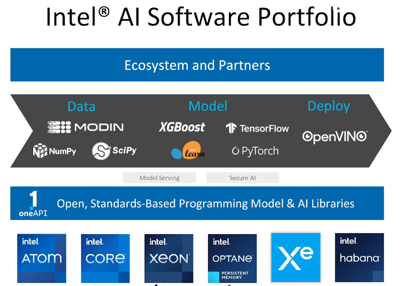
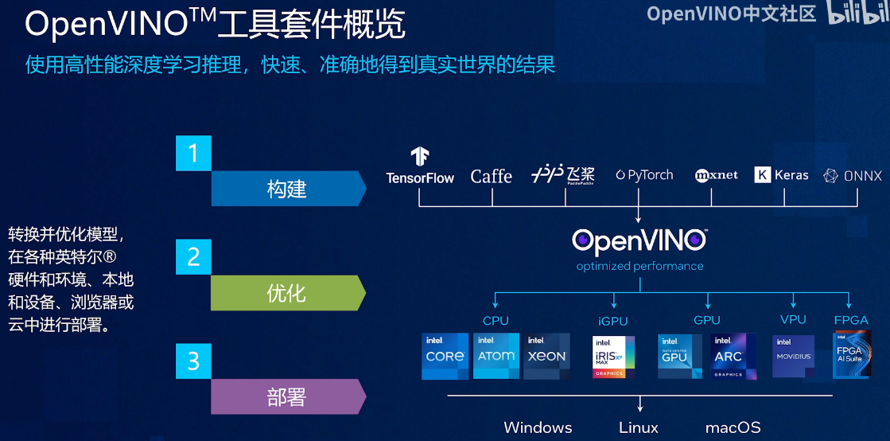
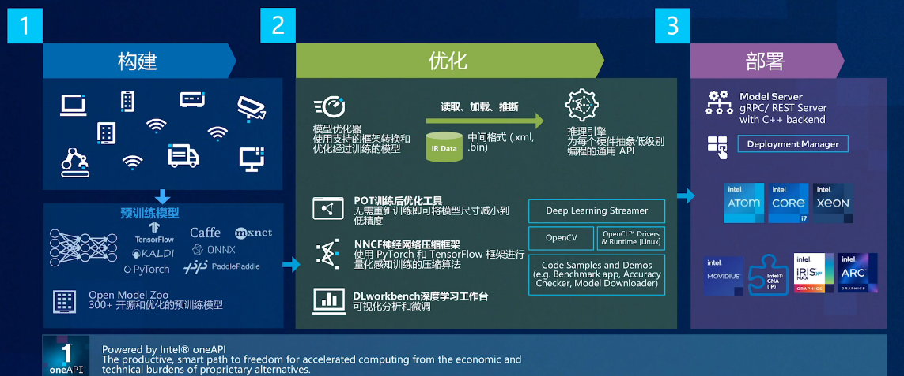
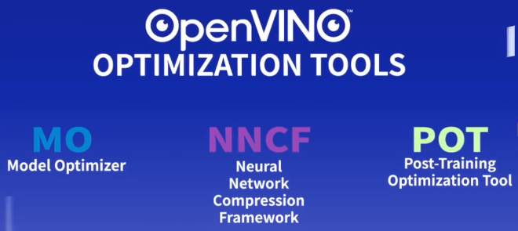
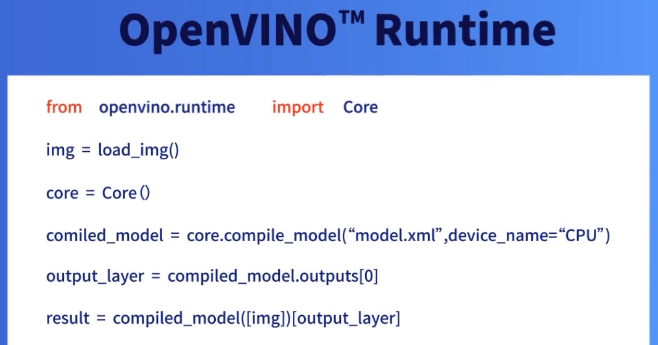

# OpenVINO

[toc]

# OpenVINO是什么？ --- OpenVINO中文社区

[一个视频带你看懂OpenVINO，超详细功能点展示 --- OpenVINO中文社区](https://www.bilibili.com/video/BV1iN4y1w7HH/)

[OpenVINO是什么？ --- OpenVINO中文社区 ](https://www.bilibili.com/video/BV1dg4y1p7e9/)

**开放式视觉推理和神经网络优化**

One API

OpenModelZoo 预训练模型仓库

模型优化

支持多平台异构编程的Runtime接口

Model Server 组件支持模型以服务的形式进行部署

# OpenVINO-Notebook教程 --- OpenVINO中文社区

[OpenVINO-Notebook教程 --- OpenVINO中文社区](https://space.bilibili.com/38566875/channel/collectiondetail?sid=145944)

[openvinotoolkit/openvino_notebooks --- Github官网](https://github.com/openvinotoolkit/openvino_notebooks)

## 01 教程｜如何在Ubuntu上安装OpenVINO-Notebook

[安装指南(多平台) --- Github官网](https://github.com/openvinotoolkit/openvino_notebooks/blob/main/README_cn.md#-%E5%AE%89%E8%A3%85%E6%8C%87%E5%8D%97)

[安装说明(Ubuntu) --- Github官网](https://github.com/openvinotoolkit/openvino_notebooks/wiki/Ubuntu)

## 02 教程｜如何在Windows上安装OpenVINO-Notebook

跳过

## 03 OpenVINO-Notebook系列正式课第一期：14行代码实现视觉分类检测应用

