# 动手学深度学习

[toc]

## 00 Portals


## 23 LeNet（经典卷积神经网络）

[LeNet](https://zh-v2.d2l.ai/chapter_convolutional-neural-networks/lenet.html)

手写数字识别

MNIST数据集

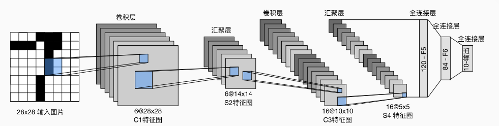

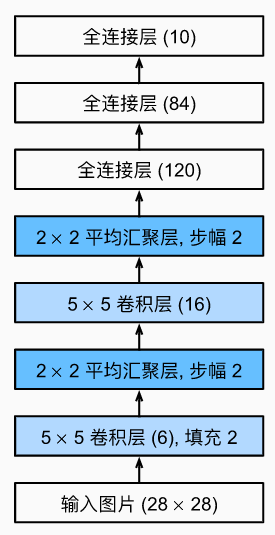

线使用卷积层学习图片空间信息

再使用全连接层转换到类别空间

```python
net = nn.Sequential(
    nn.Conv2d(1, 6, kernel_size=5, padding=2), nn.Sigmoid(),
    nn.AvgPool2d(kernel_size=2, stride=2),
    nn.Conv2d(6, 16, kernel_size=5), nn.Sigmoid(),
    nn.AvgPool2d(kernel_size=2, stride=2),
    nn.Flatten(),
    nn.Linear(16 * 5 * 5, 120), nn.Sigmoid(),
    nn.Linear(120, 84), nn.Sigmoid(),
    nn.Linear(84, 10))
```

```python
X = torch.rand(size=(1, 1, 28, 28), dtype=torch.float32)
for layer in net:
    X = layer(X)
    print(layer.__class__.__name__,'output shape: \t',X.shape)
```

**QA**


## 24 AlexNet（深度卷积神经网络）

2000年初期，kernel核方法，转换为凸优化问题。几何学，特征抽取。特征工程。抽取特征(SIFT,SURF)。

随着数据量提升和数据集的增大：神经网络（1990，模型小）->核方法（2000，可以计算出核矩阵）->神经网络（2010，可以构造更深的神经网络）

ImageNet（469*387，1.2M样本数，1000类）

2012，赢得ImageNet竞赛

更大更深的LeNet。卷积层的层数和通道数都有较大提升。

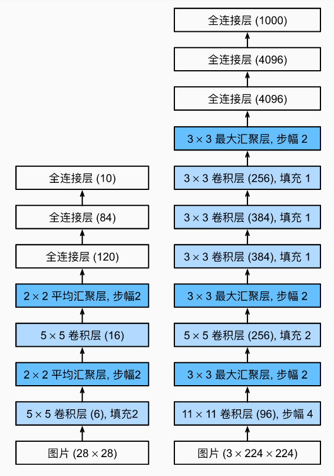

左侧为LeNet，右侧为AlexNet

主要改进
1. 丢弃法（模型控制）
2. Sigmoid-->ReLu
3. MaxPooling

观念上，量变引起质变。用CNN学习特征，最后通过Softmax进行回归（两个模型一起训练）。

更多细节
1. 激活函数从sigmoid变为relu
2. 隐藏全连接层后加入丢弃层
3. 数据增强（亮度、颜色、随机裁剪等等）

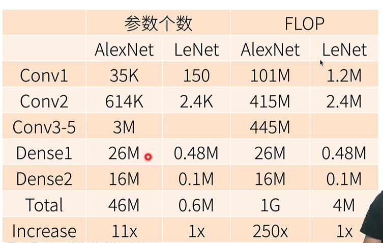

FLOP:浮点计算数

参数更多，计算复杂度远远增加


```python
net = nn.Sequential(
    # 这里，我们使用一个11*11的更大窗口来捕捉对象。
    # 同时，步幅为4，以减少输出的高度和宽度。
    # 另外，输出通道的数目远大于LeNet
    nn.Conv2d(1, 96, kernel_size=11, stride=4, padding=1), nn.ReLU(),
    nn.MaxPool2d(kernel_size=3, stride=2),
    # 减小卷积窗口，使用填充为2来使得输入与输出的高和宽一致，且增大输出通道数
    nn.Conv2d(96, 256, kernel_size=5, padding=2), nn.ReLU(),
    nn.MaxPool2d(kernel_size=3, stride=2),
    # 使用三个连续的卷积层和较小的卷积窗口。
    # 除了最后的卷积层，输出通道的数量进一步增加。
    # 在前两个卷积层之后，汇聚层不用于减少输入的高度和宽度
    nn.Conv2d(256, 384, kernel_size=3, padding=1), nn.ReLU(),
    nn.Conv2d(384, 384, kernel_size=3, padding=1), nn.ReLU(),
    nn.Conv2d(384, 256, kernel_size=3, padding=1), nn.ReLU(),
    nn.MaxPool2d(kernel_size=3, stride=2),
    nn.Flatten(),
    # 这里，全连接层的输出数量是LeNet中的好几倍。使用dropout层来减轻过拟合
    nn.Linear(6400, 4096), nn.ReLU(),
    nn.Dropout(p=0.5),
    nn.Linear(4096, 4096), nn.ReLU(),
    nn.Dropout(p=0.5),
    # 最后是输出层。由于这里使用Fashion-MNIST，所以用类别数为10，而非论文中的1000
    nn.Linear(4096, 10))
```


## 25 VGG（使用块的网络）

AlexNet：存在问题，结构不够清晰。

怎么样更好的更深更大
1. 更多全连接层（太贵）
2. 更多卷积层（不好做）
3. 将卷积层组合成块（vgg）

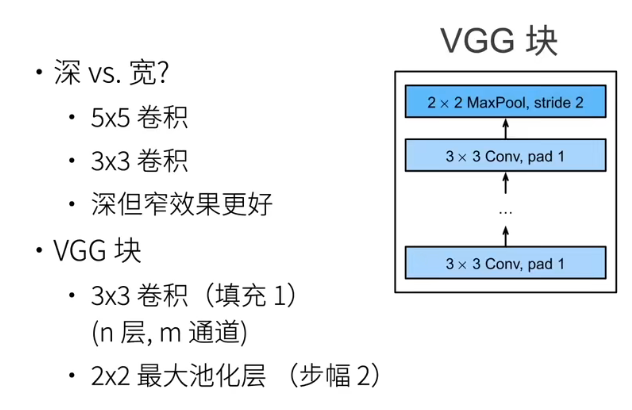

n表示的是卷积层的层数
m表示的是每一层卷积层的通道数

多个VGG块和全连接层

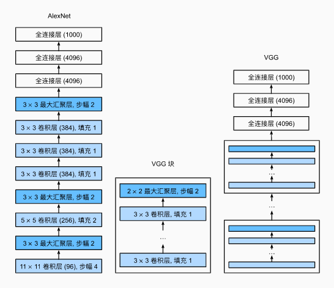

VGG比AlexNet慢（计算量更大）而且更占内存

**总结**
1. VGG使用可重复使用的卷积块构建深度卷积神经网络
2. 不同的卷积块个数和超参数可以得到不同复杂度的变种

**代码**
```python
def vgg_block(num_convs, in_channels, out_channels):
    layers = []
    for _ in range(num_convs):
        layers.append(nn.Conv2d(in_channels, out_channels,
                                kernel_size=3, padding=1))
        layers.append(nn.ReLU())
        in_channels = out_channels
    layers.append(nn.MaxPool2d(kernel_size=2,stride=2))
    return nn.Sequential(*layers)

conv_arch = ((1, 64), (1, 128), (2, 256), (2, 512), (2, 512))

def vgg(conv_arch):
    conv_blks = []
    in_channels = 1
    # 卷积层部分
    for (num_convs, out_channels) in conv_arch:
        conv_blks.append(vgg_block(num_convs, in_channels, out_channels))
        in_channels = out_channels

    return nn.Sequential(
        *conv_blks, nn.Flatten(),
        # 全连接层部分
        nn.Linear(out_channels * 7 * 7, 4096), nn.ReLU(), nn.Dropout(0.5),
        nn.Linear(4096, 4096), nn.ReLU(), nn.Dropout(0.5),
        nn.Linear(4096, 10))

net = vgg(conv_arch)
```

**QA**


## 26 NiN（网络中的网络）

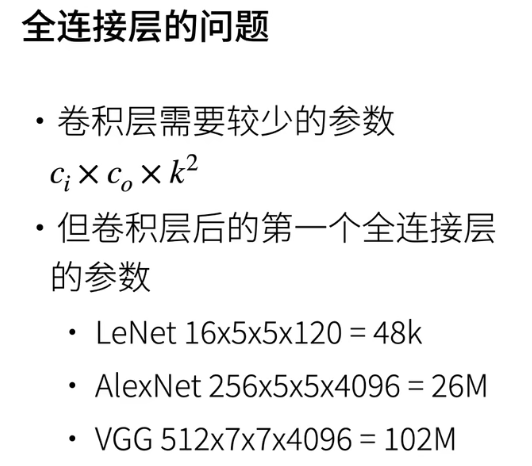

对于卷积层：输入通道数\*输出通道数\*卷积核大小

全连接层使用的参数太多（容易过拟合），而卷积层使用的参数相对较少

NiN思想：完全不用全连接层

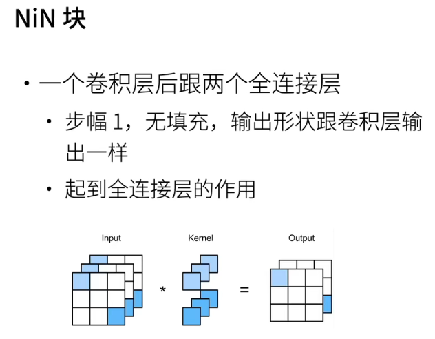

1*1的卷积层相当于全连接层，对于通道进行混合

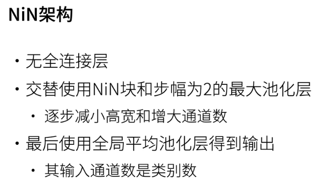

全局池化层相当于对一整个channel进行处理，每个channel取出一个值。这个值当作类别预测。

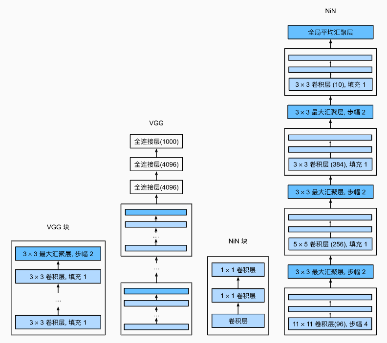

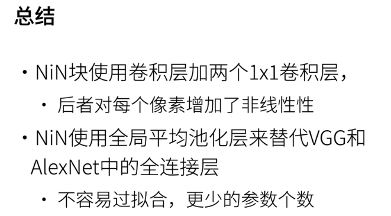

**代码**

```python
def nin_block(in_channels, out_channels, kernel_size, strides, padding):
    return nn.Sequential(
        nn.Conv2d(in_channels, out_channels, kernel_size, strides, padding),
        nn.ReLU(),
        nn.Conv2d(out_channels, out_channels, kernel_size=1), 
        nn.ReLU(),
        nn.Conv2d(out_channels, out_channels, kernel_size=1), 
        nn.ReLU())
        # 可以看到后两层的conv2d不会改变通道数

net = nn.Sequential(
    nin_block(1, 96, kernel_size=11, strides=4, padding=0),
    nn.MaxPool2d(3, stride=2),
    nin_block(96, 256, kernel_size=5, strides=1, padding=2),
    nn.MaxPool2d(3, stride=2),
    nin_block(256, 384, kernel_size=3, strides=1, padding=1),
    nn.MaxPool2d(3, stride=2),
    nn.Dropout(0.5),
    # 标签类别数是10
    nin_block(384, 10, kernel_size=3, strides=1, padding=1),
    nn.AdaptiveAvgPool2d((1, 1)),
    # 将四维的输出转成二维的输出，其形状为(批量大小,10)
    nn.Flatten())
```

**QA**

## 27 GoogleNet（含并行连结的网络）

卷积的超参数不知如何选择（卷积核大小、池化大小等等）

Inception块：4个路径从不同层面抽取信息，再输出通道维合并。（不做选择）

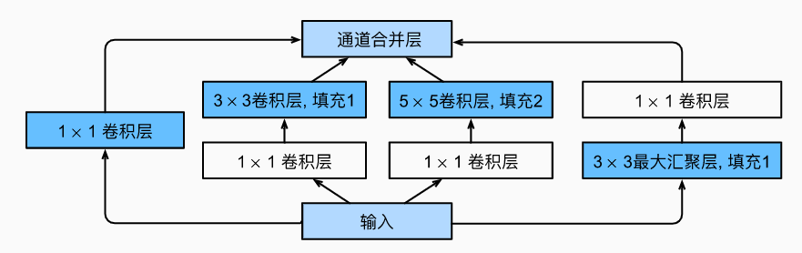

输入被copy。pad是为了让输入和输出的高宽一样大，但通道数增加。

但是每个路径具体输出的通道数占总通道数的比例其实也是超参数。

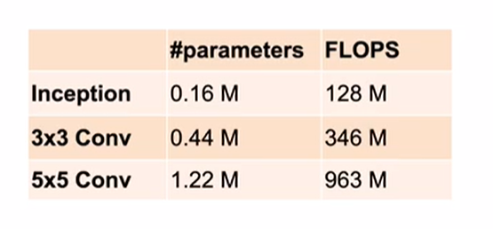

跟单3\*3、5\*5卷积层比，Inception块有更少的参数个数和计算复杂度

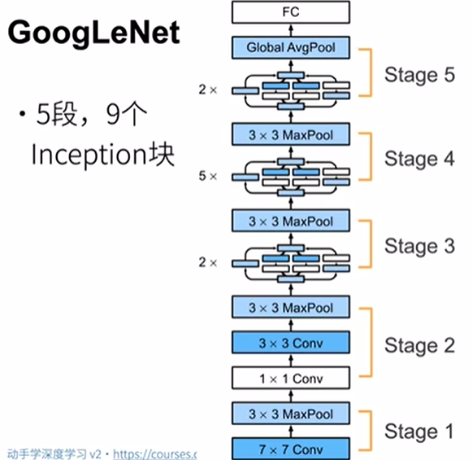

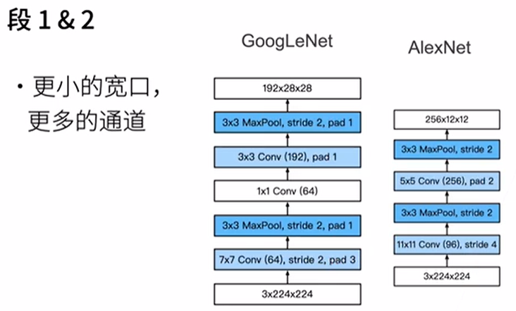

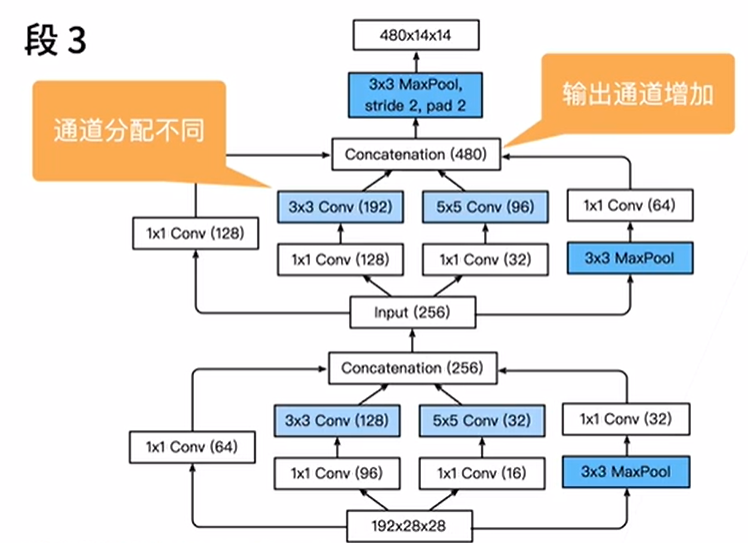

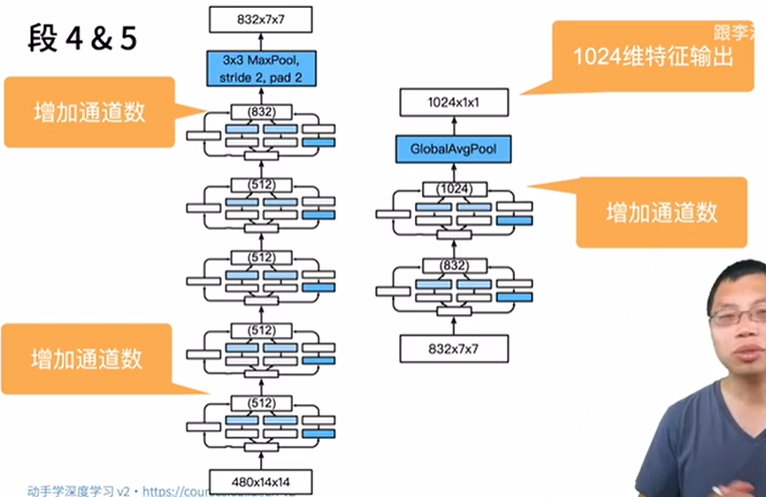

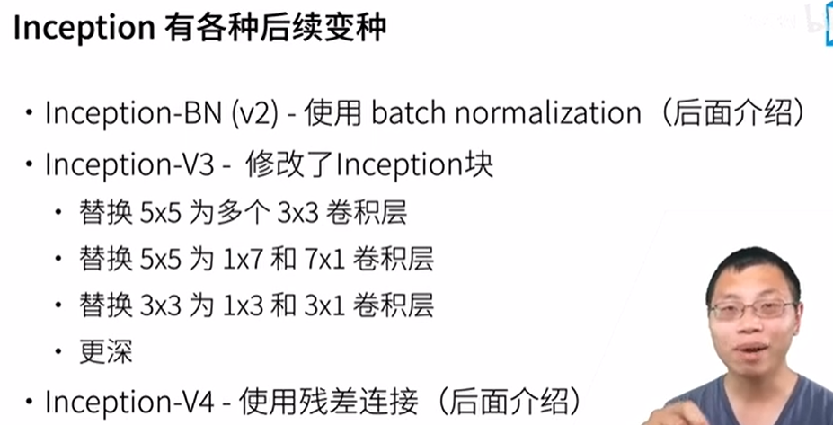

后续的改进

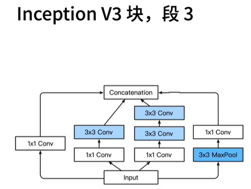

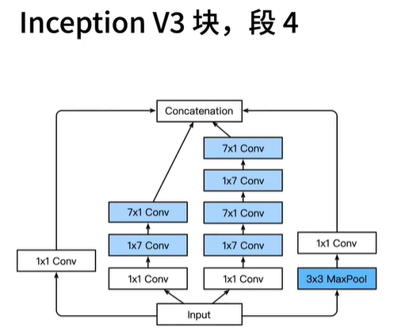

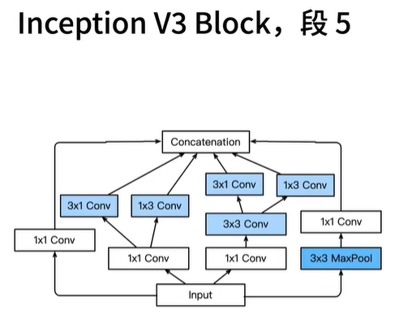

inception V3基本上完胜VGG，但内存消耗较大，计算也不是太快。

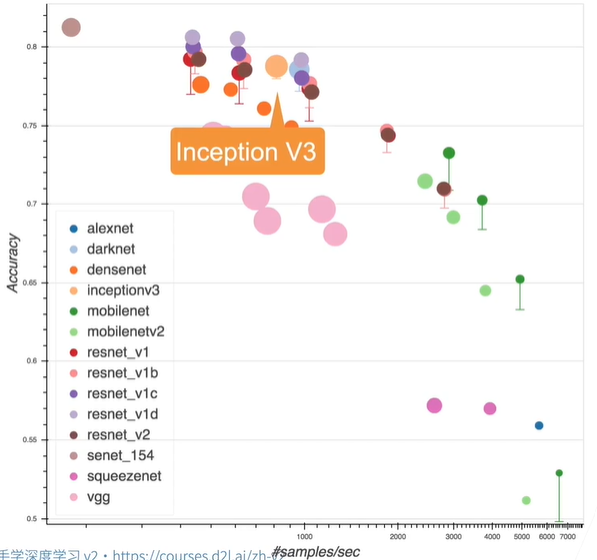

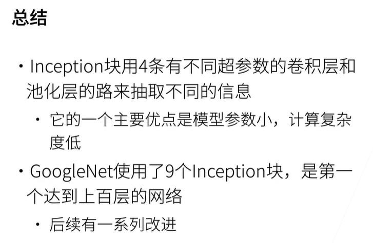


## 28 批量归一化

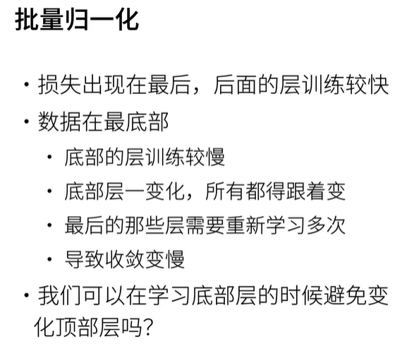

下层权重更新相对较小（慢）。低层主要是纹理信息。另外，底部变换后，顶部需要重新训练

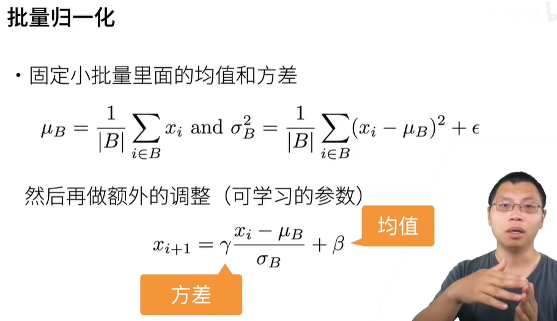

$\gamma 不是方差，\sigma 才是方差。\gamma 和 \beta 是可以学习的参数$

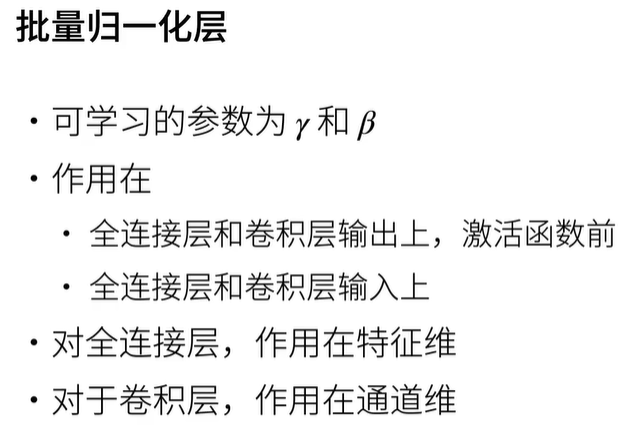

批量归一化是一个线性变换

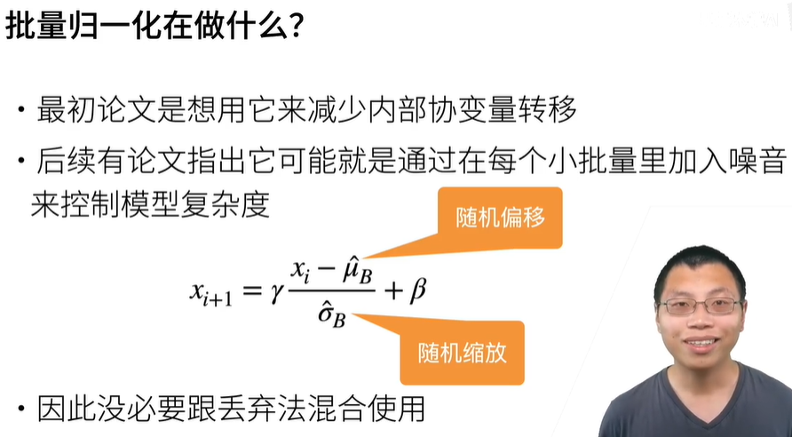

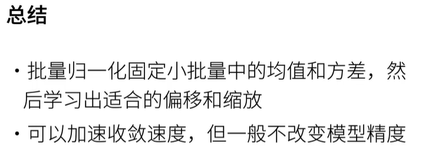

可以允许使用较大的学习率，加快收敛速度

**QA**

## 29 ResNet（残差网络）


## 48 全连接卷积神经网络

FCN用深度神经网络--语义分割

用转置的卷积层替换CNN最后的全连接层

（常见的一般通过全局的平均池化层(AdaptiveAvgPool2d)和全连接层(Linear)）

1. CNN
2. 1*1 conv 降低空间通道数  不会对空间信息进行改变
3. transposed conv 转置的卷积层 对图片进行放大（K\*H\*W，K是通道数也是类别数，对每一个像素类别的预测存在通道中。HW是原始图片的大小，CNN会使得图片变小）

```python
nn.ConvTranspose2d()

```


