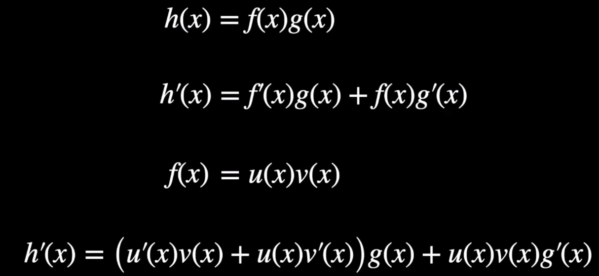
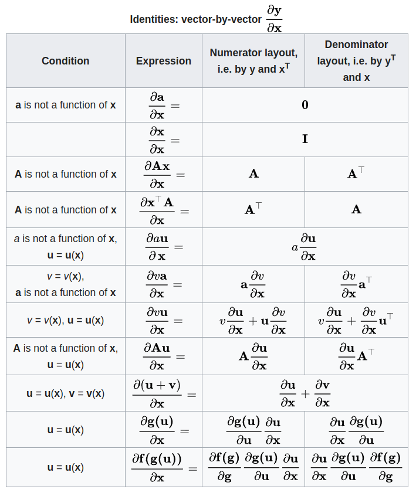
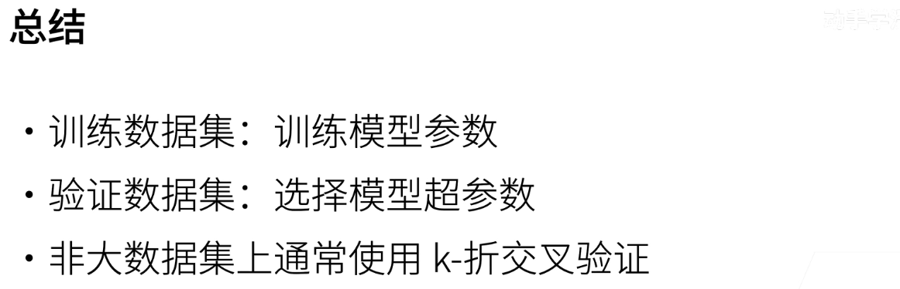
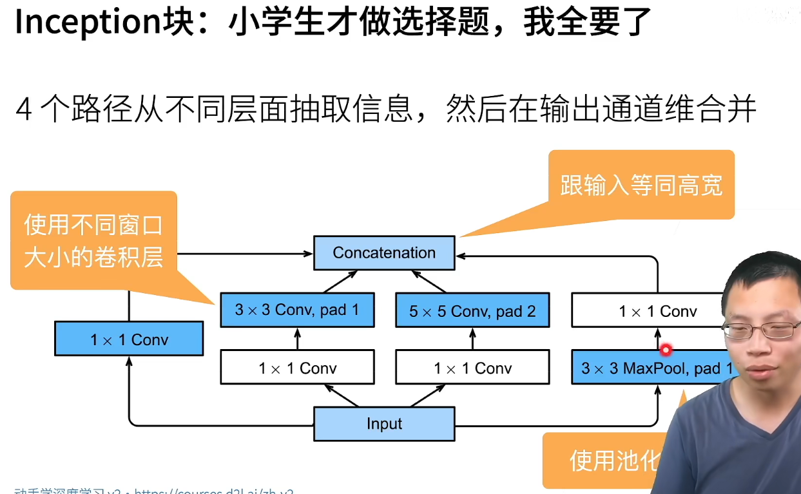
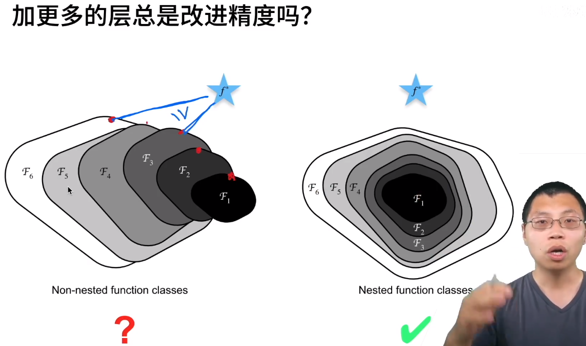
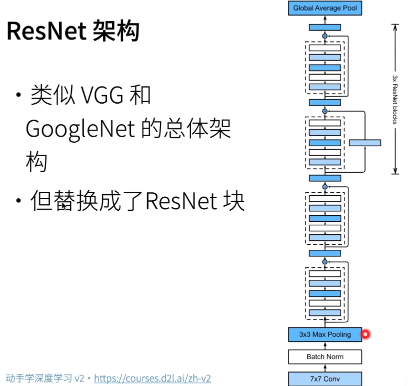
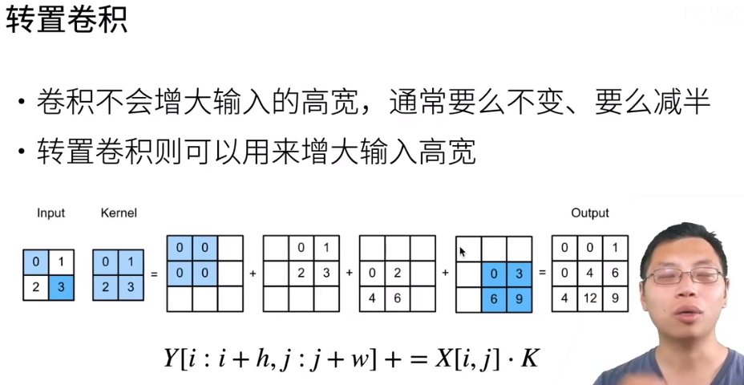
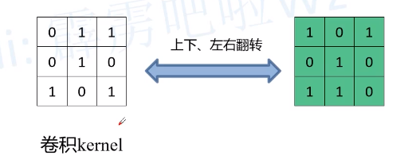
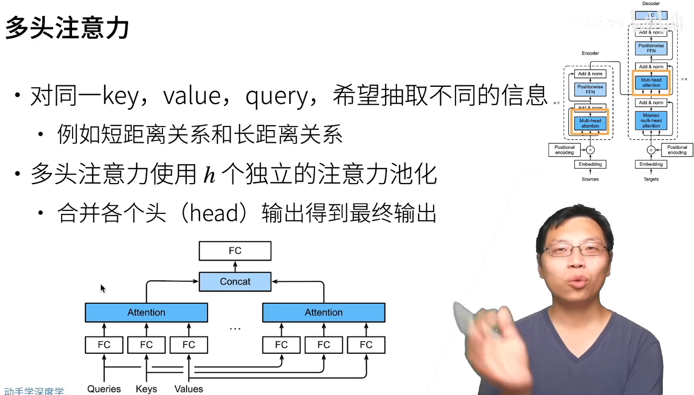

# 动手学深度学习

[toc]

# Portals

[动手学深度学习 PyTorch版 --- 跟李沐学AI](https://space.bilibili.com/1567748478/channel/seriesdetail?sid=358497)

[《动手学深度学习》官网](https://zh-v2.d2l.ai/index.html)


# 动手学深度学习 PyTorch版 --- 跟李沐学AI

## 04 数据操作+数据预处理

N维数组是机器学习和神经网络的主要数据结构


## 07 自动求导

### 李沐


做矩阵乘法，权重为列向量，右乘数据


反向时会使用前向时的中间结果


内存复杂度使得深度神经网络会消耗大量GPU资源

### PyTorch Autograd Explained - In-depth Tutorial

[PyTorch Autograd Explained - In-depth Tutorial](https://www.youtube.com/watch?v=MswxJw-8PvE)

[PyTorch Autograd Drawio](https://app.diagrams.net/#G1bq3akhmA5DGRCiFYJfNPSn7il2wvCkEY)

如果所有输入的 requires_grad 都为 False，最终结果的 requires_grad 也将为 False 同时 is_leaf 也为 True ，反向图也不会被创建


[PyTorch Hooks Explained - In-depth Tutorial](https://www.youtube.com/watch?v=syLFCVYua6Q)


[How do computational graphs and autograd in PyTorch work](https://www.youtube.com/watch?v=dEnUP6_kpeo)

正向传播计算数值


反向传播利用这些数值进行计算 L.backward() 进行反向传播


[What is Automatic Differentiation?](https://www.youtube.com/watch?v=wG_nF1awSSY)


Finite Differences 会有精度问题，随着 step size 的减小，近似程度会更好，但由浮点数产生的误差会开始增加


符号求导可以保证精度，但是会引入其他问题，例如: expression swell 表达式膨胀 问题




随着神经网络的加深， Symbolic Differentiation 更加难以被应用，而且需要 closed-form expressions，也就是用条件、循环、递归等结构搭建


a&b 作为中间变量，可以简化流程，但是会降低效率


最终，我们是在 原始运算符 上进行微分操作

而链式法则 chain rule 可以让我们将这些运算符组合起来

Auto diff 有两种模式， Forward & Reverse

Forward Mode 概念上更加简单，它在计算时，加入每一个中间变量，及其导数 (derivatives = tangents)

f 是双输入、单输出


Primals 和 Tangents 两者用一个元组表示 


对于多输出(f1,f2) 情况， Forward Mode 也能应对，对于同一个输入(x1)，不同输出(f1、f2)也可以在一次前向中完成

但对于另一个输入(x2)，需要重新计算一遍上述过程


用 Jacob 矩阵进行表示的话，从n维到m维的映射函数所对应的 Jacob 矩阵形状为 m行n列(m为因变量数量，n为自变量数量)，所以当输入(n)相对于输出(m)较少时，forward mode 较为理想 (每个输入变量对于各个输出的导数对应Jacob矩阵的一列)


[Automatic Differentiation -- University of British Columbia](https://www.youtube.com/watch?v=ZGSUrfJcXmA)


## 补:矩阵求导

[维基百科 矩阵微积分 (不全)](https://zh.wikipedia.org/zh-cn/%E7%9F%A9%E9%98%B5%E5%BE%AE%E7%A7%AF%E5%88%86)

[Wikipedia Matrix Calculus (全)](https://en.wikipedia.org/wiki/Matrix_calculus#Layout_conventions)



[Matrix Calculus 在线计算器](https://www.matrixcalculus.org/matrixCalculus)

[Mathematics for Machine Learning书籍下载地址](https://mml-book.github.io/)
git a
[矩阵求导简介](https://zhuanlan.zhihu.com/p/137702347)

矩阵求导的本质：eg：A对B求导，矩阵A中的每一个元素对矩阵B中的每一个元素求导
|A|B|求导后元素个数|
|-|-|-------------|
|1×1|1×1|1×1|
|1×p|1×n|p×n|
|q×p|m×n|p×q×m×n|


[DR_CAN【矩阵的导数运算】1_标量向量方程对向量求导_分母布局_分子布局](https://www.bilibili.com/video/BV1av4y1b7MM/)

**标量对向量的导数**


**向量对向量的导数**


这里使用分母布局所以得到的结果是$A^T$，如果使用分子布局则结果不同为$A$，所以推导时需要统一方式


上面的结果同样是使用分母布局，如果使用分子布局得到的结果是当前结果的整个的转置

[DR_CAN【矩阵的导数运算】2_案例分析_线性回归](https://www.bilibili.com/video/BV1W84y1H7HR/)


$\hat{z}$代表估计值，$y_1$为截距，$y_2$为斜率


找到合适的参数使得代价函数最小(线性回归+最小二乘)

为了方便表示和加速计算，使用矩阵方式进行表示


对于无法得到$(\vec{X}^T \vec{X})^{-1}$的情况可以采用梯度下降法


## 10 多层感知机

**感知机**


σ函数的1/0，1/-1都可以，二分类


yi>0说明分类正确

权重更新，类似于梯度下降，批量大小为1
分类正确，max()为0，不进行权重更新


（y不是函数，是两者相乘）
对于数据半径较大，肯定需要多迭代几步
对于较好的数据，余量较大，则迭代步数较少


感知机不能解决XOR问题


**多层感知机**


组合简单的分类器


激活函数需要非线性


比0-1函数更方便求导


relu减缓梯度消失

修正线性单元


再softmax中加入隐藏层


不要忘记激活函数，最后一层不用激活函数


Multi Layer Perceptron


## 11 模型选择 + 过拟合欠拟合


更关心泛化误差


尽可能多的用数据集



**过拟合欠拟合**


过于关注细节导致模型容量高的泛化误差较大


+1是因为有bias也可以学习

参数值可以有一个大选择范围，说明模型复杂度较高

**VC维**


**数据复杂度**


## 12 权重衰退 weight decay

处理过拟合


*表示最优解


## 补:正则化 regularization

直观理解，人工在原点处添加了人工势阱

[l1 相比于 l2 为什么容易获得稀疏解？](https://www.zhihu.com/question/37096933)


紫色为原始损失函数($L$)，蓝色为添加L2正则项($L+Cx^2$)，粉色为添加L1正则项($L+C|x|$)(最优x为0，利用绝对值函数的尖峰)。最优的 x 就变成了 0。这里利用的就是绝对值函数的尖峰。

两种regularization能不能把最优的x变成0，取决于原先的损失函数在0点处的导数：
如果本来导数不为0
1. 施加L2 regularization后导数依然不为0，最优的x也不会变成0
2. 施加L1 regularization时，只要regularization项的系数C大于原先损失函数在0点处的导数的绝对值，x=0 就会变成一个极小值点
3. 上面只分析了一个参数 x。事实上 L1 regularization 会使得许多参数的最优值变成 0，这样模型就稀疏了


[为什么L1和L2正则化可防止过拟合](https://zhuanlan.zhihu.com/p/85630046)
[数学工具-正则项](https://www.citisy.site/posts/35241.html)
[L1正则先验是Laplace分布，L2正则先验分布是高斯分布](https://zhuanlan.zhihu.com/p/344592019)

[正则化是什么？ bilibili](https://www.bilibili.com/video/BV1wM411J7kE/)


**L1正则化**


**L2正则化**


**L1、L2一起用(用系数调整正则项权重) --> 弹性网络**


**概率统计视角**

无正则化 : 最小化损失函数 == 最大化样本的似然分布 == MLE(maximum likelihood estimation)


添加正则项后 : 相当于求 最大化后验分布 MAP(maximum A posteriori)

最大后验估计可以利用经验数据，获得对未观测量的点态估计。它与F极大似然估计方法相近，不同的是它**扩充了优化的目标函数**，其中**融合了预估计量的先验分布信息**，所以**最大后验估计可以看作是正则化（regularized）的最大似然估计**。


L1正则是先验为拉普拉斯分布式的情况

[拉普拉斯分布](https://en.wikipedia.org/wiki/Laplace_distribution)的概率密度函数 $P(x;\mu,\lambda) = \frac{1}{2\lambda}e^{-\frac{|x-\mu|}{\lambda}}$


L2正则是先验为高斯分布式的情况

[高斯分布](https://en.wikipedia.org/wiki/Normal_distribution)的概率密度函数 $f(x;\mu,\sigma) = \frac{1}{\sqrt{2\pi}\sigma}e^{-\frac{(x-\mu)^2}{2\sigma^2}}$


## 13 丢弃法


用这个扰动可以保证期望不变


dropout类似于正则项，只在训练中使用。预测、推理时无需使用。


## 14 数值稳定性 + 模型初始化和激活函数


t是层数，y是损失函数与各层的函数的复合

向量关于向量的导数是矩阵

**梯度爆炸**，**梯度消失**


## 19 卷积层


如果使用MLP显然不合理

两个原则：
1. 平移不变性，要找的内容出现在图片的不同位置都能找到
2. 局部性，只需要局部信息

考虑到空间信息，必须使用矩阵


w是全连接层的权重，四维，从输入层的高宽到隐藏层的高宽


降低了模型的复杂度


卷积和交叉相关本质上就是上下左右颠倒一下
实际上都是学习出来的，所以无所谓，用二维交叉相关写起来更方便


### kernel&filter

一组多个卷积核=一个滤波器

假设输入是H×W×C， C是输入的深度(即通道数)。
卷积核(滤波器)的通道数需要和输入的通道数相同，所以也为C，假设卷积核的大小为K×K，一个卷积核就为K×K×C。
计算时卷积核的对应通道应用于输入的对应通道，这样一个滤波器应用于输入就得到输出的一个通道。
假设有P个K×K×C的卷积核，这样每个卷积核应用于输入都会得到一个通道，所以输出有P个通道。


## 20 卷积层里的填充和步幅

控制输出大小的超参数


基本不会用到偶数的kernel


## 23 LeNet（经典卷积神经网络）

[LeNet](https://zh-v2.d2l.ai/chapter_convolutional-neural-networks/lenet.html)

手写数字识别

MNIST数据集


先使用卷积层学习图片空间信息

再使用全连接层转换到类别空间

```python
net = nn.Sequential(
    nn.Conv2d(1, 6, kernel_size=5, padding=2), nn.Sigmoid(),
    nn.AvgPool2d(kernel_size=2, stride=2),
    nn.Conv2d(6, 16, kernel_size=5), nn.Sigmoid(),
    nn.AvgPool2d(kernel_size=2, stride=2),
    nn.Flatten(),
    nn.Linear(16 * 5 * 5, 120), nn.Sigmoid(),
    nn.Linear(120, 84), nn.Sigmoid(),
    nn.Linear(84, 10))
```

```python
X = torch.rand(size=(1, 1, 28, 28), dtype=torch.float32)
for layer in net:
    X = layer(X)
    print(layer.__class__.__name__,'output shape: \t',X.shape)
```

**QA**


## 24 AlexNet（深度卷积神经网络）

2000年初期，当时最主流的是kernel核方法，转换为凸优化问题。
同时，计算机视觉使用几何学，特征抽取。特征工程。抽取特征(SIFT,SURF)。

随着数据量提升和数据集的增大：神经网络（1990，模型小）->核方法（2000，可以计算出核矩阵）->神经网络（2010，可以构造更深的神经网络）

ImageNet（469*387，1.2M样本数，1000类）

2012，赢得ImageNet竞赛

更大更深的LeNet。卷积层的层数和**通道数**都有较大提升。


人工特征提取和SVM是分开的。CNN和SVM是一起训练的，更好


左侧为LeNet，右侧为AlexNet

主要改进
1. 丢弃法（模型控制）
2. Sigmoid-->ReLu 减缓速度消失
3. 平均Pooling-->MaxPooling

观念上，量变引起质变。用CNN学习特征，最后通过Softmax进行回归（两个模型一起训练）。

更多细节
1. 激活函数从sigmoid变为relu
2. 隐藏全连接层后加入丢弃层
3. 数据增强（亮度、颜色、随机裁剪等等）


FLOP:浮点计算数

参数更多，计算复杂度远远增加


```python
net = nn.Sequential(
    # 这里，我们使用一个11*11的更大窗口来捕捉对象。
    # 同时，步幅为4，以减少输出的高度和宽度。
    # 另外，输出通道的数目远大于LeNet
    nn.Conv2d(1, 96, kernel_size=11, stride=4, padding=1), nn.ReLU(),
    nn.MaxPool2d(kernel_size=3, stride=2),
    # 减小卷积窗口，使用填充为2来使得输入与输出的高和宽一致，且增大输出通道数
    nn.Conv2d(96, 256, kernel_size=5, padding=2), nn.ReLU(),
    nn.MaxPool2d(kernel_size=3, stride=2),
    # 使用三个连续的卷积层和较小的卷积窗口。
    # 除了最后的卷积层，输出通道的数量进一步增加。
    # 在前两个卷积层之后，汇聚层不用于减少输入的高度和宽度
    nn.Conv2d(256, 384, kernel_size=3, padding=1), nn.ReLU(),
    nn.Conv2d(384, 384, kernel_size=3, padding=1), nn.ReLU(),
    nn.Conv2d(384, 256, kernel_size=3, padding=1), nn.ReLU(),
    nn.MaxPool2d(kernel_size=3, stride=2),
    nn.Flatten(),
    # 这里，全连接层的输出数量是LeNet中的好几倍。使用dropout层来减轻过拟合
    nn.Linear(6400, 4096), nn.ReLU(),
    nn.Dropout(p=0.5),
    nn.Linear(4096, 4096), nn.ReLU(),
    nn.Dropout(p=0.5),
    # 最后是输出层。由于这里使用Fashion-MNIST，所以用类别数为10，而非论文中的1000
    nn.Linear(4096, 10))
```


## 25 VGG（使用块的网络）


AlexNet：存在问题，结构不够清晰。

怎么样更好的更深更大？
1. 更多全连接层（太贵）
2. 更多卷积层（不好做）
3. 将卷积层组合成块（vgg）


n表示的是卷积层的层数
m表示的是每一层卷积层的通道数

多个VGG块和全连接层


VGG比AlexNet慢（计算量更大）而且更占内存（图中点的大小）

**总结**
1. VGG使用可重复使用的卷积块构建深度卷积神经网络
2. 不同的卷积块个数和超参数可以得到不同复杂度的变种

**代码**
```python
def vgg_block(num_convs, in_channels, out_channels):
    layers = []
    for _ in range(num_convs):
        layers.append(nn.Conv2d(in_channels, out_channels,
                                kernel_size=3, padding=1))
        layers.append(nn.ReLU())
        in_channels = out_channels
    layers.append(nn.MaxPool2d(kernel_size=2,stride=2))
    return nn.Sequential(*layers)

conv_arch = ((1, 64), (1, 128), (2, 256), (2, 512), (2, 512))

def vgg(conv_arch):
    conv_blks = []
    in_channels = 1
    # 卷积层部分
    for (num_convs, out_channels) in conv_arch:
        conv_blks.append(vgg_block(num_convs, in_channels, out_channels))
        in_channels = out_channels

    return nn.Sequential(
        *conv_blks, nn.Flatten(),
        # 全连接层部分
        nn.Linear(out_channels * 7 * 7, 4096), nn.ReLU(), nn.Dropout(0.5),
        nn.Linear(4096, 4096), nn.ReLU(), nn.Dropout(0.5),
        nn.Linear(4096, 10))

net = vgg(conv_arch)
```

**QA**


## 26 NiN（网络中的网络）


对于卷积层：输入通道数\*输出通道数\*卷积核大小

全连接层使用的参数太多（容易过拟合），而卷积层使用的参数相对较少

NiN思想：完全不用全连接层


1*1的卷积层相当于全连接层，对于通道进行混合


全局池化层相当于对一整个channel进行处理，每个channel取出一个值。这个值当作类别预测。


**代码**

```python
def nin_block(in_channels, out_channels, kernel_size, strides, padding):
    return nn.Sequential(
        nn.Conv2d(in_channels, out_channels, kernel_size, strides, padding),
        nn.ReLU(),
        nn.Conv2d(out_channels, out_channels, kernel_size=1), 
        nn.ReLU(),
        nn.Conv2d(out_channels, out_channels, kernel_size=1), 
        nn.ReLU())
        # 可以看到后两层的conv2d不会改变通道数

net = nn.Sequential(
    nin_block(1, 96, kernel_size=11, strides=4, padding=0),
    nn.MaxPool2d(3, stride=2),
    nin_block(96, 256, kernel_size=5, strides=1, padding=2),
    nn.MaxPool2d(3, stride=2),
    nin_block(256, 384, kernel_size=3, strides=1, padding=1),
    nn.MaxPool2d(3, stride=2),
    nn.Dropout(0.5),
    # 标签类别数是10
    nin_block(384, 10, kernel_size=3, strides=1, padding=1),
    nn.AdaptiveAvgPool2d((1, 1)),
    # 将四维的输出转成二维的输出，其形状为(批量大小,10)
    nn.Flatten())
```

**QA**

## 27 GoogleNet（含并行连结的网络）


卷积的超参数不知如何选择（卷积核大小、池化大小等等）

Inception块：4个路径从不同层面抽取信息，再输出通道维合并。（不做选择）





输入被copy。

pad是为了让输入和输出的高宽一样大，但通道数增加。

但是每个路径具体输出的通道数占总通道数的比例其实也是超参数。


跟单3\*3、5\*5卷积层比，Inception块有更少的参数个数和计算复杂度


后续的改进


inception V3基本上完胜VGG，但内存消耗较大，计算也不是太快。


## 28 批量归一化 Batch Normalization(BN)

对于深层神经网络比较好。


下层权重更新相对较小（慢）。低层靠近数据，主要是抽取底层信息和纹理信息。另外，底部变换后，顶部需要重新训练。


$\gamma 不是方差，\sigma^2 才是方差。\gamma 和 \beta 是可以学习的参数$。不一定是均值为0，方差为1。


批量归一化是一个线性变换，激活函数加入非线性


可以允许使用较大的学习率，不会出现梯度爆炸，加快收敛速度

**QA**

## 29 ResNet（残差网络）

[残差网络 ResNet【动手学深度学习v2】](https://www.bilibili.com/video/BV1bV41177ap)

[ResNet为什么能训练出1000层的模型【动手学深度学习v2】](https://www.bilibili.com/video/BV1554y157E3/)

[撑起计算机视觉半边天的ResNet【论文精读】](https://www.bilibili.com/video/BV1Fb4y1h73E/)

[ResNet论文逐段精读【论文精读】](https://www.bilibili.com/video/BV1P3411y7nn/)

加更多的层未必能够改变精度? 可能会学偏了



$f(x)=x+g(x)$ 使得可以先拟合小网络

训练f(x)s时，如果发现g(x)部分较难训练(即直接利用效果就挺好)，则该部分将没有较大的梯度

**residual**


weight layer 理解为卷积层


1*1卷积变化通道数


有两种 resnet block 
1. 高宽减半（卷积时加入步幅，通道数增加）
2. 高宽不变




101、152等 resnet 使用较少


nn.ReLU 设置 inplace=True 可以节省内存

### ResNet 的 Residual 处理梯度消失问题

假设网络模型为y=f(x)，x是输入，y是输出，有一个要更新的权重w，D是学习率

y'是再加深的模型(更靠近输出)，梯度则是链式法则计算得到，紫色第二行的前部分是一个较小的值(预测值比较接近真实值时)，梯度则会越来越小

所以是用乘法带来的后果就是越接近底层，梯度越小

而resnet则是通过将乘法转换为加法(绿色部分)，即使后面的部分较小，仍能获得梯度进行更新，同时也可以解释为什么这种网络结构可以拟合较浅的网络(情况较差的时候，后半部分的梯度会相对较小)


## 44 物体检测算法：R-CNN(region)，SSD，YOLO

### R-CNN

目标检测常用算法


不同的锚框可以做相同大小的batch，方便训练


解决一张大图片有较多锚框，做过多次数的CNN的问题


使用网络替代原来的selective search，得到较高质量的锚框。NMS，非极大值抑制(non maximum suppression)


精度高，但耗时


### SSD


快，但是准度偏低


### 


## 46 语义分割和数据集  Semantic Segmentation


应用：背景虚化，路面分割(无人车)，实例分割


最重要的语义分割数据集——[Pascal VOC2012 官网](http://host.robots.ox.ac.uk/pascal/VOC/voc2012/)

结合图片增广：随机裁剪randomCrop

不能随意拉伸（插值可能没有意义）


## 47 转置卷积 transposed convolution

[卷积可视化 github](https://github.com/vdumoulin/conv_arithmetic/blob/master/README.md)



但是语义分割是需要像素级的精度，如果一直卷积减小，则无法完成任务

Input每一个元素与Kernel按元素相乘，暂存在对应位置(间距为stride，所以stride越大，最终结果尺寸越大)，最后统一加起来

如果要padding是在output上进行的

**以前卷积是用矩阵实现的** [相关课程](https://www.bilibili.com/video/BV1cM411u7qq/)


该过程显然不可逆，但是可以得到尺寸相同的





'*' 号代表卷积


可以通过填充以及核矩阵翻转来等效转置卷积


转置卷积和卷积是形状上的逆运算，所以padding越大，最后的尺寸越小


[卷积与转置卷积 公式推导](https://zhuanlan.zhihu.com/p/95554961)


插入指的是中间的蓝色十字，填充指的是周围上下左右


**转置卷积所得结果的含义**可以理解为，已知当前经过卷积后的像素类别，反推出原本尺寸图像的像素级信息

**语义分割使用卷积是否丢失信息**，未必
1. 尺度信息减少，但是通道数增加 (空间分辨率下降，但是特征维数增加)
2. 语义信息不是离散的而是连续的，卷积可以逐渐summarize

有一点 encoder-decoder 的感觉

### 补:转置卷积补充内容

**From ChapGPT**
转置卷积（transpose convolution）是一种卷积神经网络（CNN）中常用的操作，用于将低维特征图（low-dimensional feature map）恢复成高维的输入数据。转置卷积的操作可以通过使用卷积神经网络的反向传播算法（backpropagation）来实现。

在进行转置卷积操作时，我们需要指定两个参数：padding和stride。
1. Padding 指的是在输入数据的周围添加一些虚拟的像素点，以便于卷积核在边缘处也能够进行有效的卷积操作。与正常卷积不同的是，转置卷积中的padding并不是直接在输入数据周围添加像素点，而是在输出数据周围添加像素点。常用的padding有两种：
   1. Valid padding：不进行padding，输出数据的尺寸会比输入数据小。
   2. Same padding：在输出数据周围添加padding，使得输出数据的尺寸与输入数据相同。
2. Stride 指的是卷积核每次移动的步长。与正常卷积不同的是，转置卷积中的stride是指卷积核在输出数据上每次移动的步长。

在进行转置卷积操作时，我们需要根据输入数据的尺寸、卷积核的尺寸、padding和stride来计算输出数据的尺寸。具体的计算公式可以参考下面的公式：

output_size = (input_size - 1) * stride + kernel_size - 2 * padding

[转置卷积（transposed convolution） --- B站视频](https://www.bilibili.com/video/BV1mh411J7U4/)

转置卷积不是卷积的逆运算，转置卷积也是卷积


**个人理解**
1. 转置卷积和卷积可以使得输入输出的形状互换，所以可以反向理解，padding和stride都是从正常卷积的角度定义的
2. 转置卷积的输出(普通卷积的输入)，如果经过stride>1，转置卷积的输入(普通卷积的输出)自然会变小，而且相对于stride=1，自然中间会有间隙
3. 转置卷积的输出(普通卷积的输入)，如果经过padding>0，转置卷积的输入(普通卷积的输出)自然会变大，为了实现卷积操作，需要在转置卷积的输入(普通卷积的输出)的周围补0


## 48 全连接卷积神经网络 FCN

FCN用深度神经网络做语义分割，奠基性的工作，现在用的不多


**用转置的卷积层替换CNN最后的全连接层**（常见的一般通过全局的平均池化层(AdaptiveAvgPool2d)和全连接层(Linear)）

结构
1. CNN
2. 1*1 conv 降低空间通道数，不会对空间信息进行改变
3. transposed conv 转置的卷积层 对图片进行放大（K\*H\*W，K是通道数也是类别数，对每一个像素类别的预测存在通道中。HW是原始图片的大小，CNN会使得图片变小）


## 补 : FPN

[理解FPN特征金字塔网络结构 --- B站视频](https://www.bilibili.com/video/BV12v411K79Z/)


常用特征提取结构
1. CNN结构 single feature map 使用最后一层特征预测
2. 图片金字塔 featurized image pyramid
3. 多尺度特征融合 pyramid feature hierarchy 不增加额外的计算量
4. FPN 高层特征近上采样和低层特征进行融合 FPN的变种核心在于定义了差异化的特征图融合方式 eg.retinanet


FPN精度高，FCN速度和内存上更优


[FPN结构详解 --- B站视频](https://www.bilibili.com/video/BV1dh411U7D9/)


融合方式有add和concat，FPN采用的是add，直接相加

上采样方式:


模型结构，以 resnet 为 backbone


没看完


## 51 序列模型

现实中有很多数据是有**时序结构**


联合概率用条件概率展开


正序 和 反序(有时候物理上不可行，但是有实际意义(已知未来，回推过去))


对过去 t-1 个数据进行建模

因为是用之前的数据，而不是其他的数据，所以叫自回归


引入马尔科夫假设后，定长数据，可以使用之前的工具 MLP、线性回归等等


不断更新潜变量 (RNN)

两个模型
1. h 与 x 推得 h'
2. h' 与 x 推得 x'


## 52 文本预处理

[NLP领域中的token和tokenization到底指的是什么？](https://www.zhihu.com/question/64984731)

[Tokenization --- stanford nlp](https://nlp.stanford.edu/IR-book/html/htmledition/tokenization-1.html)

将文本当做时序序列，便于序列

暴力的预处理
1. 将非英文字母变为空格
2. 大写转小写

将每行文本序列变为 token，两种类型
1. word词(数量较多)
2. char字符(但是需要学习词的构成)

在自然语言处理中，通常会将句子切分成一小块一小块的单元，这些小块单元就被称为"Token"

(对于中文需要分词 --- jieba)

还需要构建一个字典，词汇表 vocabulary，用于将 token 映射为 数字索引

很多次出现的次数很少的 token，将其作为 unknown token

token中加入，unknown token，手动的 reserved token，以及出现频率较多的 token

获取 idx-to-token(列表 []) 以及 token-to-idx(字典 {})

word 都转为 index

训练和预测必须使用相同的 vocab ，否则就乱套了


## 53 语言模型


## 57 长短期记忆网络（LSTM）


## 60 机器翻译数据集

使用空格将标点符号和单词分割，使得标点符号作为单独的单词

utf-8 做处理

token可以理解为最小语义单元，翻译的话个人喜欢叫词元（当然翻译成令牌、词都行），可以是word/char/subword。

tokenization是指分词，目的是将输入文本分成一个个词元，保证各个词元拥有相对完整和独立的语义，以供后续任务（比如学习或者作为高级模型的输入）使用。

`<pad>`(),`<bos>`(begin of sentence),`<eos>`(end of sentence)

将出现频率过小的 原词 进行剔除

序列样本都有一个固定的长度，截断或填充文本序列

source 和 target 都有对应的 词表 vocabulary

也可以将多种语言放在一个 vocab 中


## 61 编码器解码器架构

encoder-decoder


特征提取 可以理解为编码的过程

原始形式 -> 中间形式，便于机器学习


state 可以是 feature map 或者隐藏状态

decoder 也可以拿到一些额外的输入

编码器负责表示输入，解码器负责输出


## 62 序列到序列学习(seq2seq)

机器翻译，两个句子可以有不同的长度


## 64 注意力机制

[What exactly are keys, queries, and values in attention mechanisms? --- Stack Exchange](https://stats.stackexchange.com/questions/421935/what-exactly-are-keys-queries-and-values-in-attention-mechanisms?newreg=711a72f85079409bbaf0f46d7ada2c03)

key/value/query 的概念类似于检索系统。例如，当你在 Youtube 上搜索视频时，搜索引擎会将你的 query(搜索栏中的文本)映射到数据库中与候选视频相关的一组 keys(视频标题、描述等) ，然后向你展示最匹配的视频(values)。


query 你想要干嘛 question

环境是 key-value 对

用 query 和 key 匹配，得到最佳的 value


## 68 Transformer

[【王树森】Transformer模型](https://www.bilibili.com/video/BV1dK411k74q/)





# 测试

```python
import torch
# 以下代码只有在PyTorch GPU版本上才会执行
import time


print(torch.__version__)
print(torch.cuda.is_available())
a = torch.randn(10000,1000)
b = torch.randn(1000,2000)
t0 = time.time()
c = torch.matmul(a,b)
t1 = time.time()
print(a.device,t1-t0,c.norm(2))
 
device = torch.device('cuda')
a = a.to(device)
b = b.to(device)
t0 = time.time()
c = torch.matmul(a,b)
t1 = time.time()
print(a.device,t1-t0,c.norm(2))
 
t0 = time.time()
c = torch.matmul(a,b)
t1 = time.time()
print(a.device,t1-t0,c.norm(2))

#判断是否安装了cuda
import torch
print(torch.cuda.is_available())  #返回True则说明已经安装了cuda
#判断是否安装了cuDNN
from torch.backends import  cudnn 
print(cudnn.is_available())  #返回True则说明已经安装了cuDNN
print(cudnn.version())
```