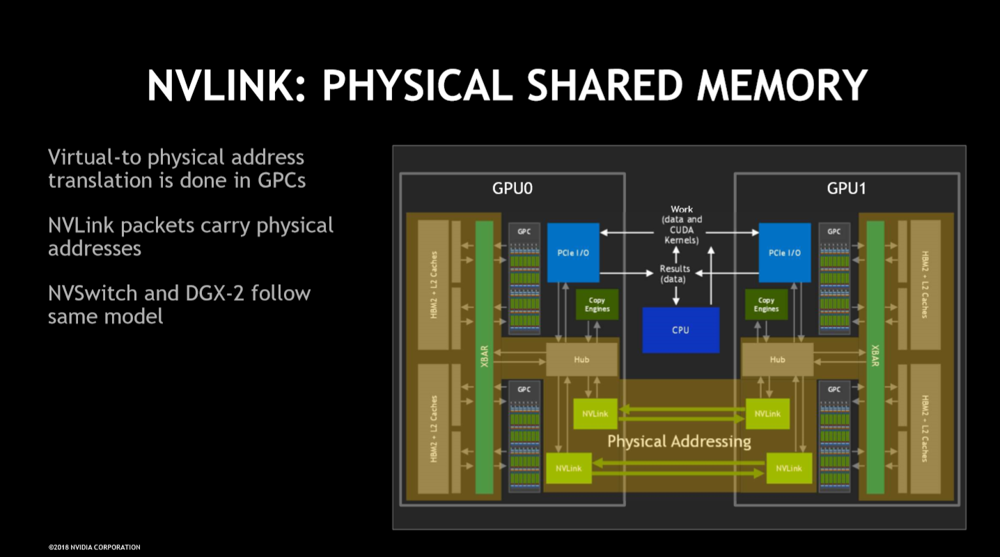
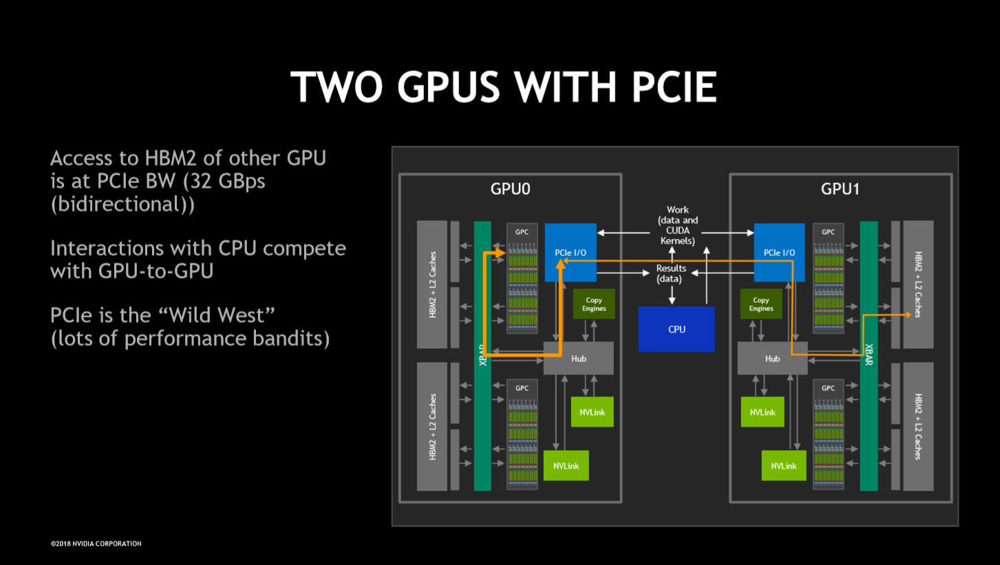
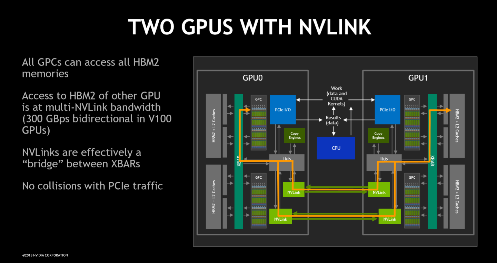
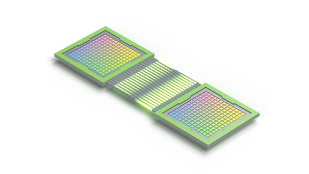
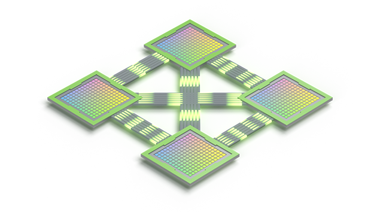
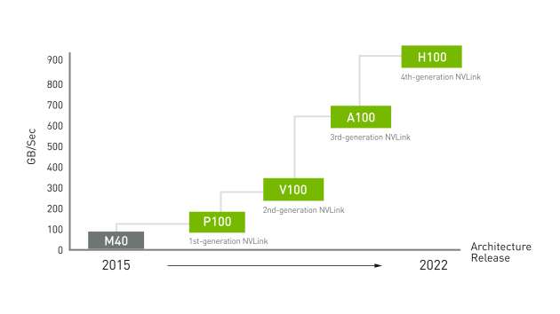
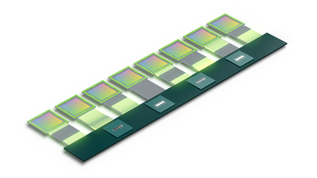
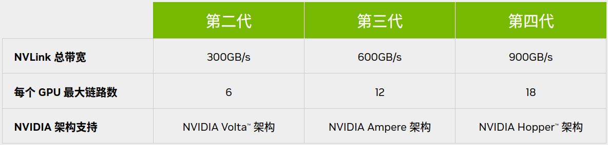
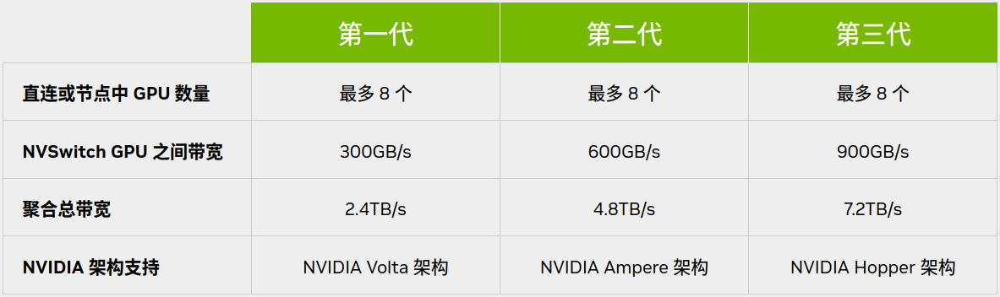

# NVLink & NVSwitch™

---

# Table of Contents
- [NVLink \& NVSwitch™](#nvlink--nvswitch)
- [Table of Contents](#table-of-contents)
- [NVLink \& NVSwitch™](#nvlink--nvswitch-1)
  - [行业基准 MLPerf 1.1](#行业基准-mlperf-11)

---

# NVLink & NVSwitch™

[NVLink 和 NVSwitch - Nvidia官网](https://www.nvidia.cn/data-center/nvlink/)

同主机内不同 GPU 之间的一种高速互联方式

NVLink 高速、高带宽、低延迟 互联技术，提供直接的点对点连接，比传统的 PCIe 总线更高的速度和带宽

支持GPU之间点对点通信(无需通过主机内存、CPU)，支持GPU之间的内存共享(可以直接访问彼此内存空间)

可支持 **服务器内** 和 **服务器间** 实现高级 **多 GPU 通信** 的基础模组

在每个 GPU 之间实现 无缝高速通信的 **多节点、多 GPU 系统**

提高可扩展性，进而实现超快速的深度学习训练

单个 NVIDIA H100 Tensor Core GPU 支持多达 18 个 NVLink 连接，总带宽为 900 GB/s，是 PCIe 5.0 带宽的 7 倍

 

**NVLink 性能**

**NVSwitch™** 基于 NVLink 的高级通信能力构建，可为计算密集型工作负载提供更高带宽和更低延迟

支持高速集合运算，每个 NVSwitch 都有 64 个 NVLink 端口，并配有 NVIDIA SHARP™ 引擎，可用于网络内归约和组播加速

NVLink 是一种 GPU 之间的直接互连，可扩展服务器内的多 GPU 输入/输出 (IO)

NVSwitch 可连接多个 NVLink，在单节点内和节点间实现以 NVLink 能够达到的最高速度进行多对多 GPU 通信

NVLink 专注于 GPU 间的 **直接高速通信**，而 NVSwitch 则在此基础上提供了更广泛的互联能力和更大规模的集群协同工作能力

NVLink 类似于直接连接两台计算机或设备的直连线，NVSwitch 则类似于交换机

## 行业基准 MLPerf 1.1

MLPerf 1.1 是一个由 开放AI联盟(OpenAI Alliance 非 OpenAI公司) 发起的行业基准测试，旨在为深度学习模型的训练和推理性能提供一个标准化的评估方法

MLPerf（Machine Learning Performance）基准测试的目的是建立一个共同的、可重复的和透明的性能评估框架，以便不同硬件和软件平台之间的性能可以进行公平比较。

包括了以下几个方面
1. 模型和任务
   1. MLPerf 1.1 包括了一系列流行的深度学习模型以及它们在不同数据集上的表现，如
      1. BERT
      2. ResNet
      3. Transformer
   2. 这些模型和任务被广泛认为是深度学习领域的代表性工作负载
2. 性能指标
   1. MLPerf 基准测试关注的主要性能指标包括训练和推理时间、吞吐量（每秒处理的样本数）、以及模型的精度
   2. 这些指标共同反映了系统的深度学习能力
3. 标准化流程
   1. MLPerf 提供了一系列标准化的测试流程和指南，确保所有参与测试的系统都在相同的条件下运行，包括了
      1. 数据预处理
      2. 模型配置
      3. 训练策略

