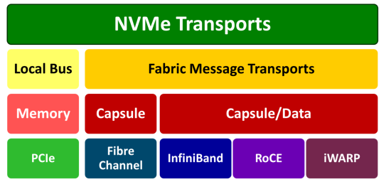

# NVMe Over Fabrics

---

## Table of Contents

- [NVMe Over Fabrics](#nvme-over-fabrics)
  - [Table of Contents](#table-of-contents)
- [NVMe Over Fabrics](#nvme-over-fabrics-1)
  - [FC (Fibre Channel 光纤通道)](#fc-fibre-channel-光纤通道)
  - [NVMe (Non-Volatile Memory Express)](#nvme-non-volatile-memory-express)
  - [NoF (NVMe over Fabrics)](#nof-nvme-over-fabrics)
  - [RoCE (RDMA over Converged Ethernet)](#roce-rdma-over-converged-ethernet)

---

# NVMe Over Fabrics

**Fabrics** 指 支持 NVMe协议数据传输的 **网络架构 或 网络基础设施**

NVMe-oF 非常适合现代的 大规模 和 分布式 存储环境 (eg:AI数据中心)
1. 扩展性 - 通过网络连接多台服务器和存储系统，存储资源可以跨越更大的物理距离进行共享和管理
2. 灵活的存储配置 - 更容易实现存储资源的按需分配和扩展
3. 高性能 - 提供接近本地性能的延迟和吞吐量

利用了现有的网络技术
1. Ethernet - RoCE(RDMA over Converged Ethernet)
2. InfiniBand
3. Fibre Channel
4. iWARP(Internet Wide Area RDMA Protocol)

**NVMe传输分布图**

当通过 fabric设备 向 NVMe 发送复杂消息时，**capsule** 允许将多个小消息作为一个消息发送，提高传输效率 并 减少延迟

NVMe(Non-Volatile Memory Express) 是 协议

PCIe(Peripheral Component Interconnect Express) 是 总线 & 接口

PCIe 5.0 x16 的 **双向带宽 = 单向带宽 x 2 = 64 GB/s x 2 = 128 GB/s**(双向带宽是单向带宽的两倍) (定义 - PCI Express 5.0标准下，使用16个通道 Lane 进行数据传输时，数据可以同时在两个方向上进行传输的总带宽)

但是 AI加速卡上的内存 都是 TB/s 级别，仅用 PCIe 效率不够

**NIC** - Network Interface Card - 网络接口卡

RDMA - Remote Direct Memory Access 远程直接内存访问 - 允许计算机系统之间直接在内存之间传输数据，而无需操作系统的介入，从而实现内存零拷贝

适用于高性能计算（HPC）、数据中心和云计算环境，显著减少 数据传输延迟 和 CPU负载

## FC (Fibre Channel 光纤通道)

高速网络技术，主要用于连接计算机数据存储

通常用于SAN (Storage Area Network)，即存储区域网络，它允许多台服务器访问共享的存储设备

## NVMe (Non-Volatile Memory Express)

**NVMe** 是一种针对高速非易失性存储媒介(如SSDs，固态硬盘)的传输协议，用来充分利用固态硬盘的高性能

通过减少延迟和增加输入/输出操作的速度，来提升数据传输效率

**NVMe** 是通过 **PCI Express (PCIe)** 接口在主机硬件和固态存储设备之间传输数据

## NoF (NVMe over Fabrics)

NVMe over Fabrics
1. NVMe over FC - 最大化继承传统 FC 网络，复用网络基础设施
2. NVMe over TCP - 可以基于 现有 IP网络，在网络设施不变的情况下实现 端到端 NVMe
3. NVMe over RDMA
   1. NVMe over RoCE - 性能较好，兼具TCP优势(**主流**)

扩展了传统NVMe技术，使其能够在更广阔的网络中使用

不仅限于直连到主机的PCIe设备，NVMe协议现在可以通过各种网络技术(如Fibre Channel、Ethernet等)，跨越更远的距离进行操作

## RoCE (RDMA over Converged Ethernet) 

RoCE 是一种网络技术，**允许远程直接内存访问 (RDMA) 的操作在以太网网络上进行**

RDMA(Remote Direct Memory Access)，允许一台计算机直接从另一台计算机的内存中读取或写入数据，而无需经过操作系统和CPU的处理，从而显著减少延迟并提高数据传输速率

RoCE 使得这种高效的数据传输方式能够在传统的以太网基础设施上实现，从而增加了网络的灵活性和数据处理能力