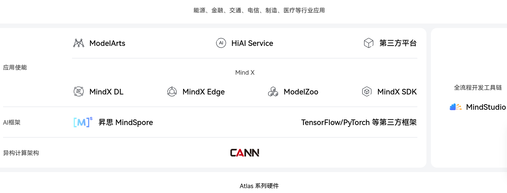
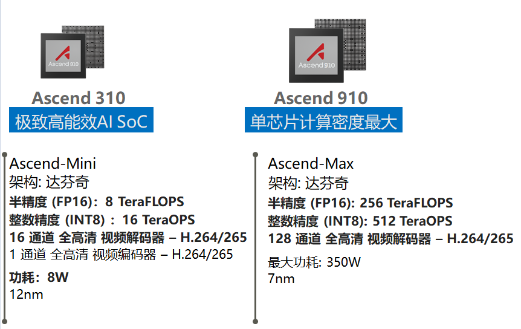
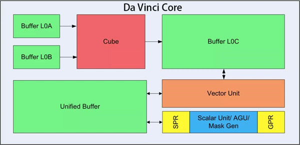
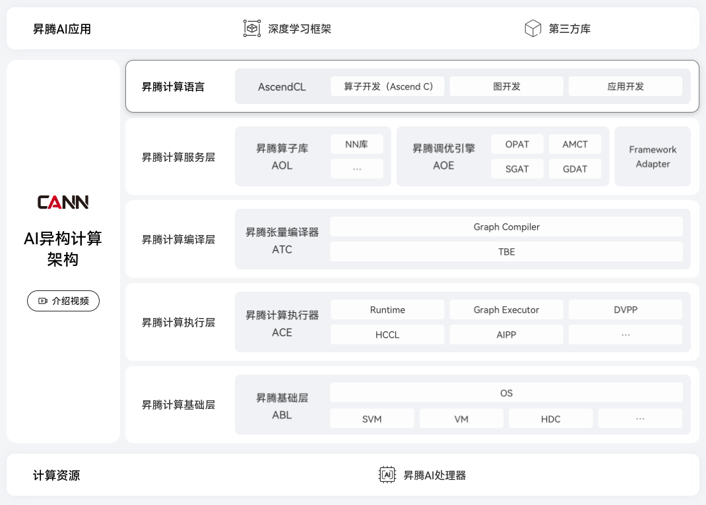

# Products of DeepLearning Hardware

---

## Table of Contents

- [Products of DeepLearning Hardware](#products-of-deeplearning-hardware)
  - [Table of Contents](#table-of-contents)
  - [TODO](#todo)
- [Nvidia](#nvidia)
- [Huawei](#huawei)

---

## TODO

[GPU 进阶笔记（一）：高性能 GPU 服务器硬件拓扑与集群组网（2023）](https://arthurchiao.art/blog/gpu-advanced-notes-1-zh/)
[GPU 进阶笔记（二）：华为昇腾 910B GPU 相关（2023）](https://arthurchiao.art/blog/gpu-advanced-notes-2-zh/)
[GPU 进阶笔记（三）：华为 NPU (GPU) 演进（2024）](https://arthurchiao.art/blog/gpu-advanced-notes-3-zh/)

# Nvidia

L40S

---

# Huawei

[昇腾 Ascend ](https://www.hiascend.com/)

**昇腾全栈 AI 软硬件平台**

[昇腾软硬件全栈简介](https://zhuanlan.zhihu.com/p/571485917)

[大模型国产化适配 - 华为昇腾AI全栈软硬件平台总结](https://zhuanlan.zhihu.com/p/637918406)

昇腾芯片
1. **昇腾910** for **训练**
   1. 910支持8卡链接，910B支持16卡的链接
2. **昇腾310** for **推理**

Domain Specific Architecture，DSA

达芬奇(Da Vinci)架构，对标 Nvidia
1. 3D Cube 矩阵乘法单元
   1. Buffer L0A、L0B、L0C 则用于存储输入矩阵和输出矩阵数据，负责向 Cube 计算单元输送数据和存放计算结果
2. Vector 向量计算单元
   1. Vector 的指令相对来说非常丰富，可以覆盖各种基本的计算类型和许多定制的计算类型
3. Scalar 标量计算单元
   1. 主要负责 AI Core 的标量运算，功能上可以看作一个小 CPU
   2. 完成整个程序的循环控制，分支判断，Cube、Vector 等指令的地址和参数计算以及基本的算术运算等

**Atlas系列**产品(NPU) - 基于 `昇腾910` 和 `昇腾310` 打造出来的
1. Atlas 800 (型号：9000)
   1. **训练服务器**
   2. 包含8个训练卡(Atlas 300 T - **昇腾910**)
2. Atlas 800 (型号：3000)
   1. **推理服务器**
   2. 包含8个推理卡(Atlas 300 I - **昇腾310**)
3. Atlas 900
   1. **训练集群**
   2. 128台 Atlas 800(型号：9000)构成
   3. 由一批训练服务器组合而成

**异构计算架构 CANN**
1. 对标英伟达的 CUDA + CuDNN 的核心软件层
2. 引擎、编译器、执行器、算子库
   

**AI框架**
1. 自研框架 - MindSpore昇思
2. 第三方框架 - PyTorch、TensorFlow等

**应用使能**
1. ModelZoo - 存放模型的仓库，包括普通模型 和 昇思大模型
2. MindX SDK - 帮助用户快速开发并部署人工智能应用
3. MindX DL - 昇腾深度学习组件。提供昇腾 AI 处理器资源管理和监控、昇腾 AI 处理器优化调度、分布式训练集合通信配置生成等
4. MindX Edge - 昇腾智能边缘组件

ARM+910B

X86+910B

