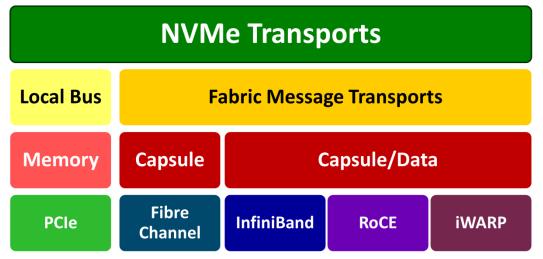
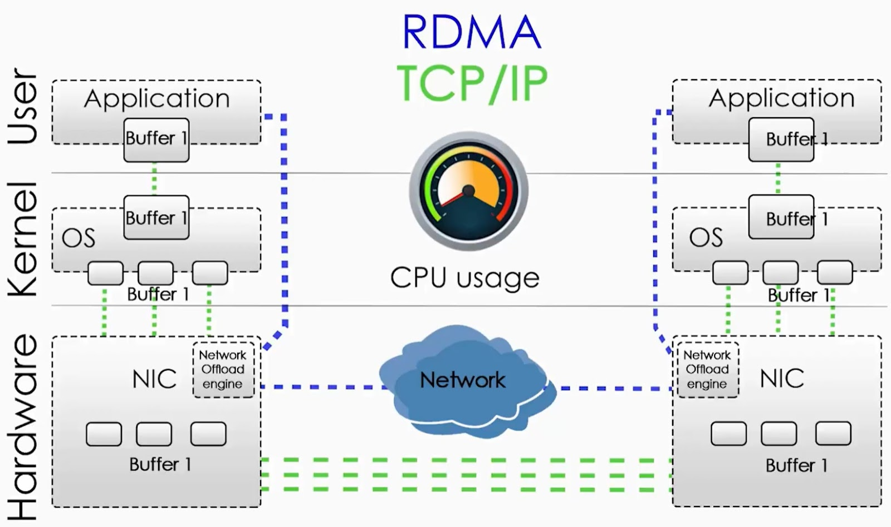
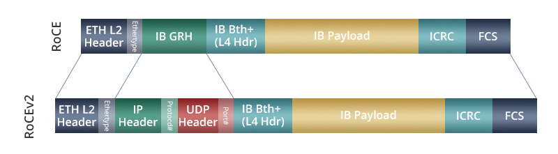
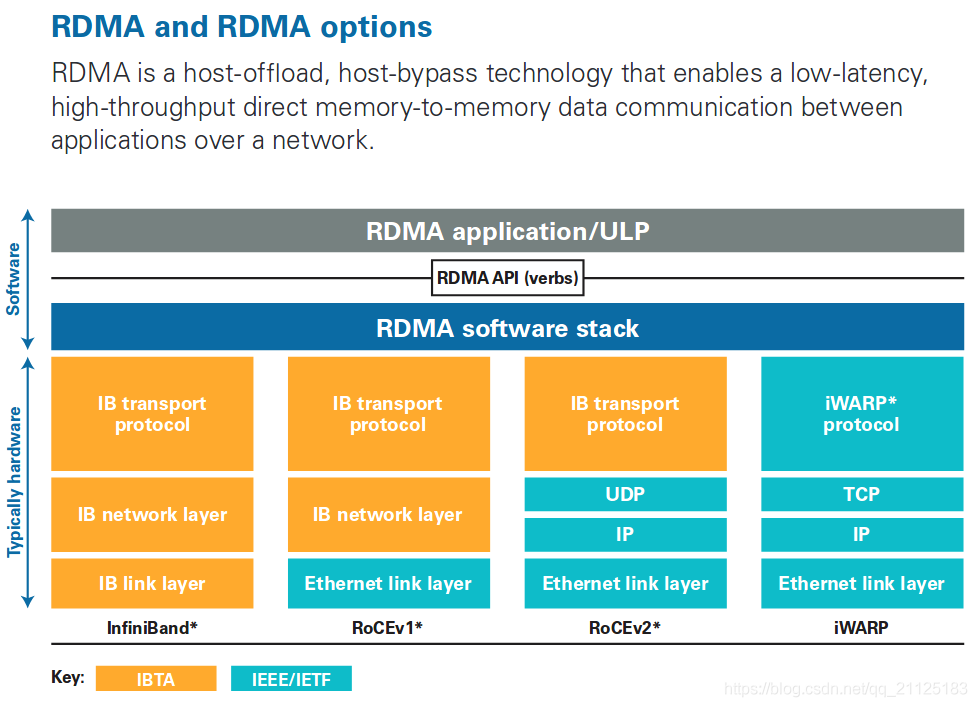
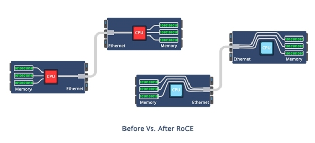
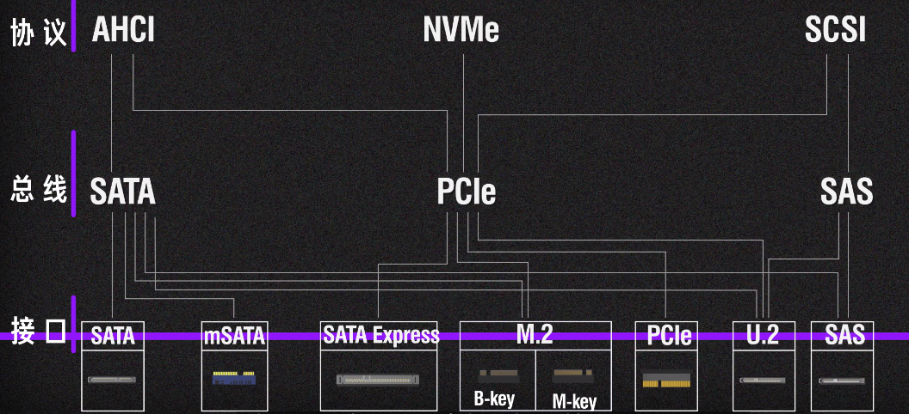

# RDMA & NVMe-oF

NVMe-oF(over Fabrics) 包含 RDMA(Remote Direct Memory Access)

RDMA 是实现 NVMe-oF 的一种常见传输协议

---

## Table of Contents

- [RDMA \& NVMe-oF](#rdma--nvme-of)
  - [Table of Contents](#table-of-contents)
- [RDMA](#rdma)
- [NVMe-oF (Non-Volatile Memory Express over Fabrics)](#nvme-of-non-volatile-memory-express-over-fabrics)
  - [FC (Fibre Channel 光纤通道)](#fc-fibre-channel-光纤通道)
  - [NVMe (Non-Volatile Memory Express)](#nvme-non-volatile-memory-express)
  - [NoF (NVMe over Fabrics)](#nof-nvme-over-fabrics)
- [Ultra Ethernet Consortium](#ultra-ethernet-consortium)

---

# RDMA

传统 TCP/IP 网络通讯 CPU多次介入，有毫秒级延迟(内存复制和处理)
1. 数据从应用缓存拷贝到Kernel中的TCP协议栈缓存
2. 拷贝到驱动层
3. 拷贝到网卡缓存

**RDMA** - Remote Direct Memory Access 远程直接内存访问
1. 许计算机系统之间直接在内存(虚拟内存)之间传输数据，而无需操作系统(Kernel内核)的介入，从而实现内存零拷贝
2. 传输过程由 NIC 硬件完成 (**NIC** - Network Interface Card - 网络接口卡)，无需CPU介入
3. 特点
   1. CPU Offload - 无需CPU干预
   2. Kernel Bypass - 不需要在内核态与用户态之间做上下文切换
   3. Zero Copy - 应用程序都能直接访问集群中的设备的虚拟内存

传统类似 高速公路(RDMA) & 人工收费站(TCP/IP)

适用于高性能计算（HPC）、数据中心和云计算环境，显著减少 数据传输延迟 和 CPU负载

RDMA 要求承载网络无丢包，保证数据传输的可靠性

RDMA 3种 实现方式 (都需要 专门的网卡 支持)
1. **InfiniBand(IB)**
   1. **专为RDMA设计的网络**
   2. 在硬件层面提供了RDMA功能
   3. **成本高昂**，需要购买全套的 IB 设备，包括网卡、线缆、交换机和路由器等等
   4. 常用于 DPC(Data Processing Center) 场景中的存储前端网络
   5. 单一厂商 - Mellanox(后来被 nvidia 收购)
2. **RoCE(RDMA over Converged Ethernet)**
   1. Ethernet-Based，允许 RDMA通信 在 **以太网** 上进行
   2. **RoCE v1** - 基于以太网链路层实现的 RDMA 协议 - RoCEv1 的数据帧不带IP头部，只能在L2子网内通信
   3. **RoCE v2** - 以太网TCP/IP协议中UDP层实现，引入 IP 解决了扩展性问题，支持通过IP网络路由
      
      1. 将GRH(Global Routing Header)换成 UDP header +　IP header
      2. 报文结构是在原有的 IB 架构的报文上增加UDP头、IP 头和二层以太网报文头
   4. 消耗的资源比 iWARP 少，支持的特性比 iWARP 多
   5. 可以使用普通的以太网交换机，**需要支持 RoCE 的网卡**(其他网络设备都是兼容的)
   6. 常用于存储后端网络
3. iWARP(Internet Wide Area RDMA Protocol)
   1. TCP/IP - Based，只能支持可靠传输
   2. 允许RDMA操作在广域网上执行，利用已经存在的以太网和IP基础设施
   3. iWARP协议栈 相比其他两者更为复杂
   4. 失去了 RDMA 的性能优势，已经逐渐被业界所抛弃

|           | InfiniBand  | iWARP           | RoCE       |
|-----------|-------------|-----------------|------------|
| **性能**   | 最好        | 稍差(受TCP影响)   | 与 IB 接近  |
| **成本**   | 高          | 中              | 低          |
| **稳定性** | 好          | 差               | 较好        |
| **交换机** | IB 交换机    | 以太网交换机      | 以太网交换机  |

[IBTA -​ Infiniband 行业联盟](https://www.infinibandta.org/)

RDMA 对网络要求
1. 低延时(微秒级)
2. 无损(lossless)
   1. RDMA在无损状态下可以满速率传输，而一旦发生丢包重传，性能会急剧下降
   2. DMA实现无损主要是依赖基于 PFC 和 ECN 的网络流控技术

# NVMe-oF (Non-Volatile Memory Express over Fabrics)

扩展 NVMe 协议到网络环境中，使得计算机可以通过网络以近乎本地的性能访问远程NVMe存储设备

NVMe-oF可以使用不同的传输层来实现其功能
1. **==RDMA==** - RoCE/IB
2. **TCP/IP** - 性能不及RDMA

**Fabrics** 指 支持 NVMe协议数据传输的 **网络架构 或 网络基础设施**

NVMe-oF 非常适合现代的 大规模 和 分布式 存储环境 (eg:AI数据中心)
1. 扩展性 - 通过网络连接多台服务器和存储系统，存储资源可以跨越更大的物理距离进行共享和管理
2. 灵活的存储配置 - 更容易实现存储资源的按需分配和扩展
3. 高性能 - 提供接近本地性能的延迟和吞吐量

利用了现有的网络技术
1. Fibre Channel
2. RDMA 网络
   1. **RoCE**(RDMA over Converged Ethernet) - Ethernet-Based
   2. **InfiniBand**(IB)
   3. **iWARP**(Internet Wide Area RDMA Protocol) - Ethernet-Based

**NVMe传输分布图**

当通过 fabric设备 向 NVMe 发送复杂消息时，**capsule** 允许将多个小消息作为一个消息发送，提高传输效率 并 减少延迟

NVMe(Non-Volatile Memory Express) 是 协议

PCIe(Peripheral Component Interconnect Express) 是 总线 & 接口

PCIe 5.0 x16 的 **双向带宽 = 单向带宽 x 2 = 64 GB/s x 2 = 128 GB/s**(双向带宽是单向带宽的两倍) (定义 - PCI Express 5.0标准下，使用16个通道 Lane 进行数据传输时，数据可以同时在两个方向上进行传输的总带宽)

但是 AI加速卡上的内存 都是 TB/s 级别，仅用 PCIe 效率不够

## FC (Fibre Channel 光纤通道)

高速网络技术，主要用于连接计算机数据存储

通常用于SAN (Storage Area Network)，即存储区域网络，它允许多台服务器访问共享的存储设备

## NVMe (Non-Volatile Memory Express)

**NVMe** 是一种针对高速非易失性存储媒介(如SSDs，固态硬盘)的传输协议，用来充分利用固态硬盘的高性能

通过减少延迟和增加输入/输出操作的速度，来提升数据传输效率

**NVMe** 是通过 **PCI Express (PCIe)** 接口在主机硬件和固态存储设备之间传输数据

## NoF (NVMe over Fabrics)

NVMe over Fabrics
1. NVMe over FC - 最大化继承传统 FC 网络，复用网络基础设施
2. NVMe over TCP - 可以基于 现有 IP网络，在网络设施不变的情况下实现 端到端 NVMe
3. NVMe over RDMA
   1. NVMe over RoCE - 性能较好，兼具TCP优势(**主流**)

扩展了传统NVMe技术，使其能够在更广阔的网络中使用

不仅限于直连到主机的PCIe设备，NVMe协议现在可以通过各种网络技术(如Fibre Channel、Ethernet等)，跨越更远的距离进行操作

# Ultra Ethernet Consortium

UEC 超级以太网联盟

[Ultra Ethernet Consortium 官网](https://ultraethernet.org/)

The New Era Needs a New Network
1. As performant as a supercomputing interconnect
2. As ubiquitous(无处不在) and cost-effective as Ethernet
3. As scalable as a cloud data center

