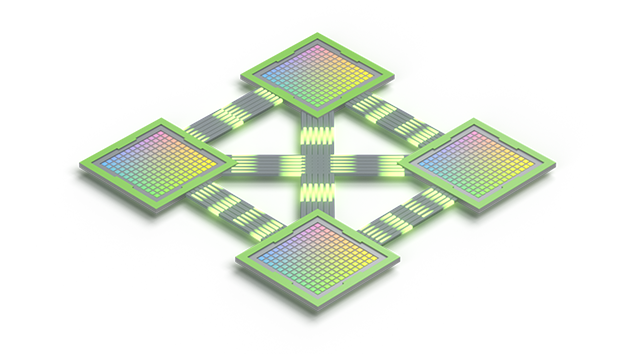
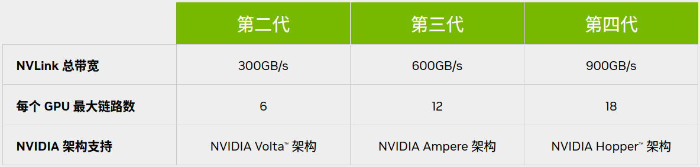
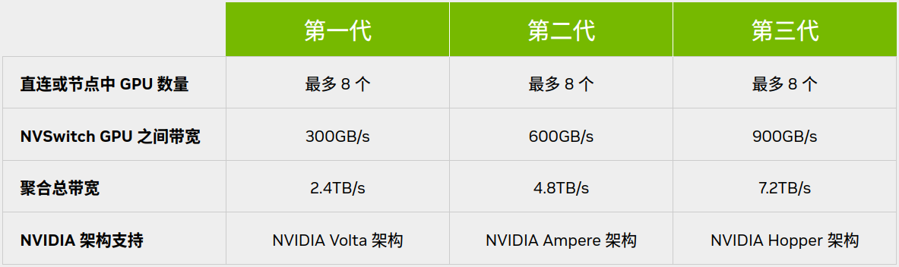

# Hardware for Deep Learning

---

# Table of Contents
- [Hardware for Deep Learning](#hardware-for-deep-learning)
- [Table of Contents](#table-of-contents)
- [NVLink \& NVSwitch™](#nvlink--nvswitch)
  - [行业基准 MLPerf 1.1](#行业基准-mlperf-11)
- [GPU \& GPGPU \& NPU](#gpu--gpgpu--npu)

---

# NVLink & NVSwitch™

[NVLink 和 NVSwitch - Nvidia官网](https://www.nvidia.cn/data-center/nvlink/)

可支持 **服务器内** 和 **服务器间** 实现高级 **多 GPU 通信** 的基础模组

在每个 GPU 之间实现 无缝高速通信的 **多节点、多 GPU 系统**

提高可扩展性，进而实现超快速的深度学习训练

单个 NVIDIA H100 Tensor Core GPU 支持多达 18 个 NVLink 连接，总带宽为 900 GB/s，是 PCIe 5.0 带宽的 7 倍

**NVLink 性能**

**NVSwitch™** 基于 NVLink 的高级通信能力构建，可为计算密集型工作负载提供更高带宽和更低延迟

支持高速集合运算，每个 NVSwitch 都有 64 个 NVLink 端口，并配有 NVIDIA SHARP™ 引擎，可用于网络内归约和组播加速

NVLink 是一种 GPU 之间的直接互连，可扩展服务器内的多 GPU 输入/输出 (IO)

NVSwitch 可连接多个 NVLink，在单节点内和节点间实现以 NVLink 能够达到的最高速度进行多对多 GPU 通信

NVLink 专注于 GPU 间的 **直接高速通信**，而 NVSwitch 则在此基础上提供了更广泛的互联能力和更大规模的集群协同工作能力

NVLink 类似于直接连接两台计算机或设备的直连线，NVSwitch 则类似于交换机

## 行业基准 MLPerf 1.1

MLPerf 1.1 是一个由 开放AI联盟(OpenAI Alliance 非 OpenAI公司) 发起的行业基准测试，旨在为深度学习模型的训练和推理性能提供一个标准化的评估方法

MLPerf（Machine Learning Performance）基准测试的目的是建立一个共同的、可重复的和透明的性能评估框架，以便不同硬件和软件平台之间的性能可以进行公平比较。

包括了以下几个方面
1. 模型和任务
   1. MLPerf 1.1 包括了一系列流行的深度学习模型以及它们在不同数据集上的表现，如
      1. BERT
      2. ResNet
      3. Transformer
   2. 这些模型和任务被广泛认为是深度学习领域的代表性工作负载
2. 性能指标
   1. MLPerf 基准测试关注的主要性能指标包括训练和推理时间、吞吐量（每秒处理的样本数）、以及模型的精度
   2. 这些指标共同反映了系统的深度学习能力
3. 标准化流程
   1. MLPerf 提供了一系列标准化的测试流程和指南，确保所有参与测试的系统都在相同的条件下运行，包括了
      1. 数据预处理
      2. 模型配置
      3. 训练策略

---

# GPU & GPGPU & NPU

**GPU (Graphics Processing Unit)**
1. 简介 - GPU最初设计用于加速计算机图形渲染过程，尤其是3D图形。它是一种高度并行结构的处理器，专门用于处理图形和图像计算任务。
2. 用途
3. 场景

**GPGPU (General-Purpose computing on Graphics Processing Units)**
1. 简介 - GPGPU 是指将GPU的计算能力用于非图形计算任务，即进行通用计算。它是一种通过特定的编程模型（如CUDA或OpenCL）利用GPU执行复杂计算的方法。GPGPU 允许开发者利用GPU的并行处理能力，解决各种复杂的计算问题。
2. 用途 - GPGPU 技术可以用于执行各种高性能计算任务，比如机器学习算法的训练、大规模物理模拟、加密货币挖矿、生物信息学计算等。
3. 场景 - 适合那些可以并行处理的计算密集型任务，特别是那些需要处理大量数据的任务，如科研模拟、金融分析、图像和视频处理等。

**NPU (Neural Processing Unit)**
1. 简介 - NPU 是专为神经网络和深度学习工作负载优化的处理器。它是一种专用硬件，用于高效处理机器学习任务中的大量矩阵和向量运算。
2. 用途 - NPU 被设计用来加速神经网络的前向传播和反向传播，从而提高机器学习模型训练和推断的速度。
3. 场景 - NPU 主要用在需要快速和高效处理深度学习模型的场景中，例如智能手机、无人机、自动驾驶汽车、高端服务器和数据中心等。经常集成在移动设备和服务器硬件中，以提供专门的计算能力。

GPU、NPU相对CPU，主要都是为了提升算力，提高并行运算能力而生的

训练首选GPGPU，应用首选NPU。

GPU 是指图形处理器。 可以理解成显卡，一般用来显示工作的。

GPGPU 是通用目的GPU，现阶段主流显卡都是GPGPU。通常算力很强，可以适用于大多数目的。

NPU 是网络处理器也可以指代所谓神经网络处理器。功能相对固化，单位功耗下性能更高。专门为AI设计的芯片。AI方面算力很强。大多数的NPU并不能用于训练，主要是因为设计目的的限制。 

---

