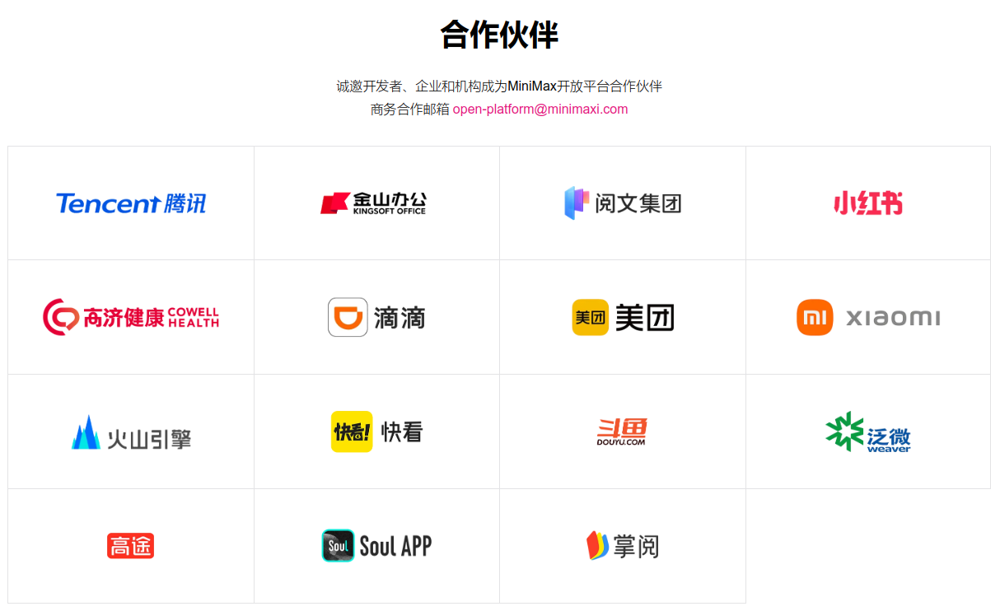
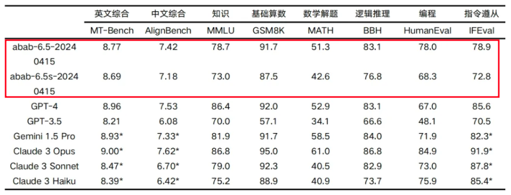
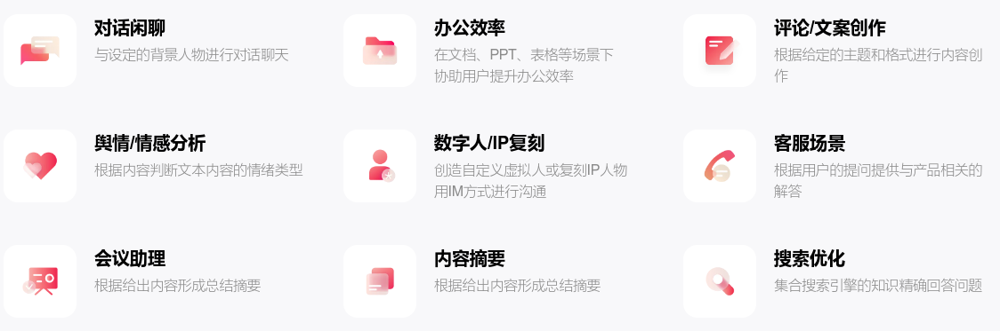
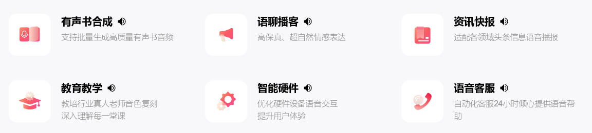

# 大模型公司 调研

---

# Table of Contents

- [大模型公司 调研](#大模型公司-调研)
- [Table of Contents](#table-of-contents)
- [Ollama](#ollama)
- [AnythingLLM](#anythingllm)
- [Minimax](#minimax)
  - [技术能力](#技术能力)
    - [MoE LLM abab-6.5](#moe-llm-abab-65)
    - [文本大模型](#文本大模型)
    - [语音大模型](#语音大模型)
  - [海螺AI](#海螺ai)
  - [产品定价](#产品定价)

---

# Ollama

<!--  -->

[Ollama - Github](https://github.com/ollama)

[Ollama 模型支持](https://ollama.com/library) - `llama3`, `mistral`, `qwen`, `embedding models`

Ollama 是一个开源的框架，专门设计用于在本地机器上便捷地部署和运行大型语言模型

# AnythingLLM

[AnythingLLM 官网](https://useanything.com/)

AnythingLLM is all-in-one AI application that can do RAG, AI Agents, and much more with no code or infrastructure headaches.

---

# Minimax

[minimax 官网](https://www.minimaxi.com/)

MiniMax 是一家专注于人工智能大模型的创业公司，成立于2021年11月，由前商汤科技副总裁、通用智能技术负责人闫俊杰创立

## 技术能力

### MoE LLM abab-6.5

2024 年 4 月 17 日，MiniMax 正式推出 abab 6.5 系列模型

abab 6.5 包含万亿参数，支持 200k tokens 的上下文长度

abab 6.5s 使用了同样的训练技术和数据，更高效，支持 200k tokens 的上下文长度

### 文本大模型

多轮记忆 | 信息提取 | 代码生成 | 知识问答

高并发 支持最高 10万+ RPM (requests per minute)

低门槛微调 仅需百条训练数据

客户案例
1. 办公 - 为金山办公WPS提供大模型能力，提供文本生成、要点总结、任务分发、Excel表格处理及PPT生成等能力
2. 社交 - 为小红书提供生成式搜索，用户可通过自然语言表达个人意图以获得大模型提炼和总结各搜索结果后的精准回答，并对答案进行多轮追问
3. 医疗 - 为高济健康搭建医生及药师AI助手，对医患进行定期回访并协助回答病患专业问题，极大提升服务效率与专业度

### 语音大模型

多品质音色复刻 | 语音在线合成 | 自动理解文本

## 海螺AI

类似 KIMI 的 AI 助手

[海螺AI](https://hailuoai.com/)

## 产品定价

[产品定价](https://www.minimaxi.com/document/price)

计费项是token数，以1000个token为单位，1000 tokens约对应750个字符文本（包括标点等字符），计费token数包括输入和输出

**ChatCompletion Pro & ChatCompletion V2 & ChatCompletion**

| 计算项     | 单价                |
|--------   |--------            |
| abab6     | 0.1    元/千tokens  |
| abab5.5   | 0.015  元/千tokens  |
| abab5.5s  | 0.005  元/千tokens  |

**Embeddings 向量化**

接口为Embeddings，使用MiniMax自研的embo-01模型，仅针对token数进行统计计费

| 计算项     | 单价                |
|--------   |--------            |
| embo-01   | 0.0005 元/千tokens  |

**Retrieval 知识库**

知识库向量化产生的embedding token费用 和 向量化后的 数据存储 费用

| 计算项             | 单价                 |
|--------           |--------             |
| embedding token   | 0.001   元/千tokens  |
| 存储 - 向量数据     | 1.5     元/GB/天     |

**Finetune 微调**

微调接口支持用户构造定制数据集对预训练模型进行多样化微调

训练计费 = 每千tokens的价格 * 输入文件中的千tokens数量 * 训练的 epoch 数

| 计费类型   | 模型                | 单价                |
|------    |---------            |-----------         |
| 训练      | abab5.5-chat-240123 | 0.06    元/千tokens |
| 训练      | abab5.5-chat-240119 | 0.06    元/千tokens |
| 推理      | abab5.5-chat-240123 | 0.05    元/千tokens |
| 推理      | abab5.5-chat-240119 | 0.015   元/千tokens |

