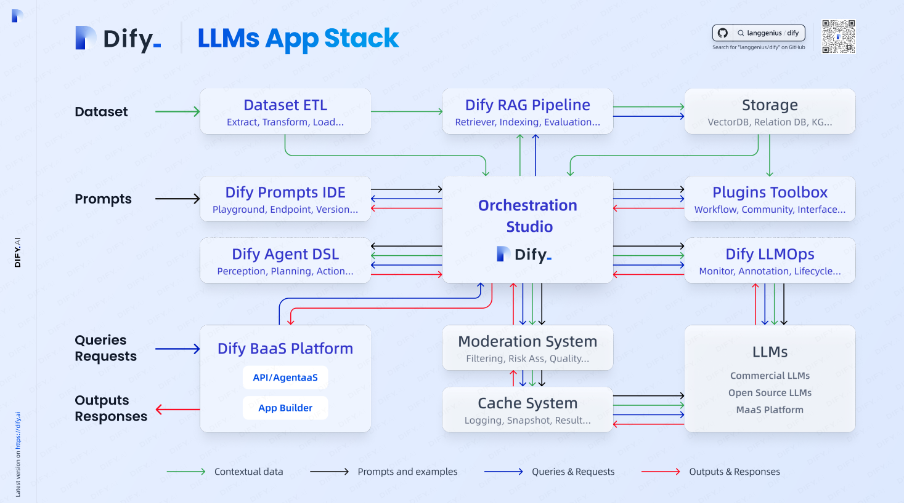
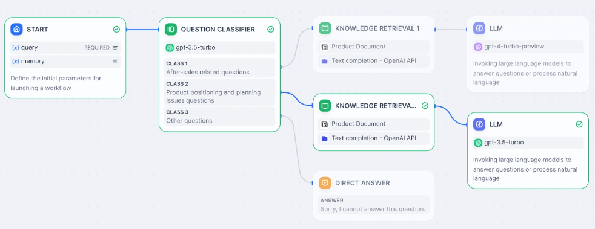
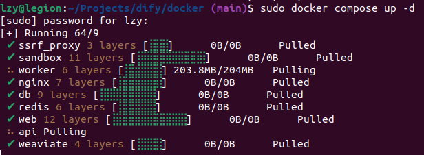
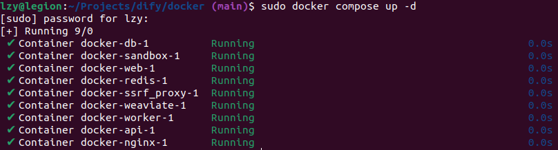
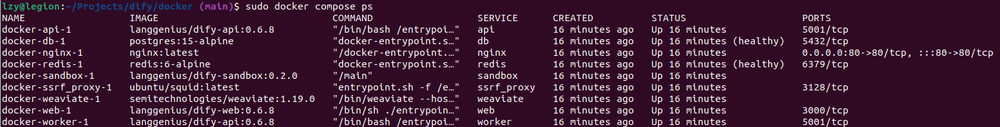

# Dify

[dify - Github](https://github.com/langgenius/dify)

[dify.ai - zh/cn](https://dify.ai/zh)

[dify.ai - en/us](https://dify.ai/)

---

## Table of Contents

- [Dify](#dify)
  - [Table of Contents](#table-of-contents)
- [Introduction](#introduction)
- [Deploy Community Edition](#deploy-community-edition)
  - [Docker Compose 部署](#docker-compose-部署)


---

# Introduction

**[LLMs App Stack](https://assets.dify.ai/files/dify_llms_app_stack_cn.pdf)**



Dify is an **open-source** LLM app development platform
1. Agent capabilities
2. AI workflow - Build and test powerful AI workflows on a visual canvas
   
3. RAG pipeline
4. model management
5. observability features
6. knowledge base
7. go from prototype to production

Combine
1. **Backend-as-a-Service** : 后端即服务，不再编写或管理所有服务端组件，可以使用领域通用的远程组件(而不是进程内的库)来提供服务
2. **LLMOps**

enable developers to quickly build production-grade generative AI applications

# Deploy Community Edition

[Dify CE - Github](https://github.com/langgenius/dify)

## Docker Compose 部署

查看 **`docker`** & **`docker compose`** 版本

```bash
lzy@legion:~ $ docker --version
Docker version 26.1.2, build 211e74b

lzy@legion:~ $ docker compose version
Docker Compose version v2.24.6-desktop.1
```

**Clone**

```bash
git clone https://github.com/langgenius/dify.git
```

**Start**

```bash
cd dify/docker
sudo docker compose up -d
```

deployment procedure



deployment result



```bash
docker compose ps
```



**Upgrade**

```bash
cd dify/docker
git pull origin main
docker compose down
docker compose pull
docker compose up -d
```

**Access**

访问 Dify 在浏览器中输入 [http://localhost](http://localhost)
```edge

```
