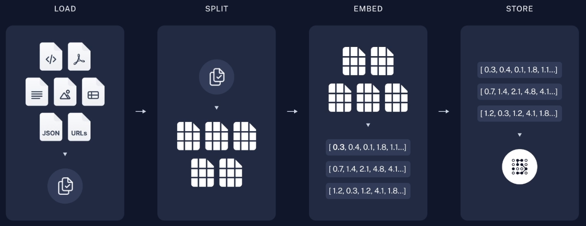

# FileLoader

---

## Table of Contents

- [FileLoader](#fileloader)
  - [Table of Contents](#table-of-contents)
- [RAG 流程](#rag-流程)
- [Tools](#tools)

---

# RAG 流程

Load -> Split -> Embed -> Store

# Tools

[PyPDF - Docs](https://pypdf.readthedocs.io/en/stable/index.html)

