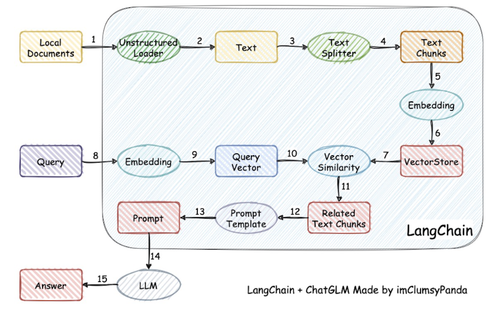

---

# 目录
- [目录](#目录)
- [LangChain](#langchain)
  - [Introduction](#introduction)
  - [QuickStart](#quickstart)
  - [Components](#components)
  - [LangChain \& ZhipuAI(ChatGLM)](#langchain--zhipuaichatglm)
    - [Getting started](#getting-started)
    - [ChatGLM + LangChain 实践培训 (实现基于本地知识的问答)](#chatglm--langchain-实践培训-实现基于本地知识的问答)
- [九天玩转 Langchain](#九天玩转-langchain)
  - [第 01 讲 - 简介](#第-01-讲---简介)
  - [第 02 讲 - HelloWorld](#第-02-讲---helloworld)
  - [第 03 讲 -](#第-03-讲--)
  - [第 04 讲 -](#第-04-讲--)
  - [第 05 讲 -](#第-05-讲--)
  - [第 06 讲 -](#第-06-讲--)
  - [第 07 讲 -](#第-07-讲--)
  - [第 08 讲 -](#第-08-讲--)
  - [第 09 讲 -](#第-09-讲--)
  - [第 10 讲 -](#第-10-讲--)
- [Functions, Tools and Agents with LangChain](#functions-tools-and-agents-with-langchain)
- [LangChain for LLM Application Development](#langchain-for-llm-application-development)
- [Additional Reading](#additional-reading)
  - [REST API](#rest-api)


---

# LangChain

[LangChain - 官网](https://www.langchain.com/)

[LangChain Docs - 官网](https://python.langchain.com/docs/get_started/introduction/)


## Introduction

LangChain is a framework for developing applications powered by large language models

Simplifies every stage of the LLM application lifecycle
1. Development开发 - using LangChain's open-source building **blocks** and [components](https://python.langchain.com/docs/modules/)
2. Productionization生产 - **LangSmith** to inspect, monitor and evaluate your chains
3. Deployment部署 - Turn any chain into an API with **LangServe**


framework consists of the following open-source libraries
1. langchain-core : 基础抽象和LangChain表达式语言
2. langchain-community : 第三方集成，如langchain-openai、langchain-anthropic等
3. langchain : Chains, agents, and retrieval strategies
4. langgraph : Build robust and stateful multi-actor applications with LLMs by modeling steps
5. langserve : deploy chains as REST APIs
6. LangSmith : developer platform (debug, test, evaluate, and monitor LLM applications)

## QuickStart


## Components

[Components](https://python.langchain.com/docs/modules/)

**Main Components**
1. [Model I/O](https://python.langchain.com/docs/modules/model_io/)
   
   1. **Prompts**
   2. **Chat Models**
      1. tuned for **conversations**
      2. take a list of chat messages(not single string) as input and they return an AI message as output
      3. 受 上下文窗口 限制 - 对话管理策略 : 信息压缩和摘要、关键信息标记
   3. **LLMs**
      1. in LangChain == **pure text completion models**
      2. take **a string prompt as input** and **output a string completion**
   4. **Output Parsers**
   5. What's More
      1. Different models have different prompting strategies that work best for them
      2. **Anthropic**'s models work best with **XML** (P.S. Anthropic 是一家人工智能研究和安全公司，由前OpenAI员工创建，Claude)
      3. **OpenAI**'s models work best with **JSON**
2. Retrieval
   1. Document Loaders
   2. Text Splitters
   3. Embedding Models
   4. Vectorestores
   5. Retrievers
3. Composition
   1. Tools
   2. Agents
   3. Chains
4. Additional
   1. Memory
   2. Callbacks


## LangChain & ZhipuAI(ChatGLM)

[LangChain & ZhipuAI - LangChain官网](https://python.langchain.com/docs/integrations/chat/zhipuai/)

[资源包管理 - 智谱AI开放平台](https://open.bigmodel.cn/usercenter/resourcepack)

[GLM-4 接口文档 - 智谱AI](https://open.bigmodel.cn/dev/api#glm-4)

### Getting started

**Installation**

```python
%pip install --quiet httpx[socks]==0.24.1 httpx-sse PyJWT
```

**Importing the Required Modules**

```python
from langchain_community.chat_models import ChatZhipuAI
from langchain_core.messages import AIMessage, HumanMessage, SystemMessage

zhipuai_api_key = "your_api_key"
```

### ChatGLM + LangChain 实践培训 (实现基于本地知识的问答)

[ChatGLM + LangChain 实践培训](https://www.bilibili.com/video/BV13M4y1e7cN/)

[ LangChain-Chatchat (原 Langchain-ChatGLM) 配套代码](https://github.com/chatchat-space/Langchain-Chatchat)

ChatGLM 具备的能力
1. 自我认知
2. 提纲写作
3. 文案写作
4. 信息抽取

LangChain 应用场景
1. 文档问答
2. 个人助理
3. 查询表格数据
4. API 交互
5. 信息提取
6. 文档总结

基于 **单一文档问答** 的实现原理
1. 加载本地文档 - 读取本地文档加载为文本
2. 文本拆分 - 将文本按照 字符、长度或语义 进行拆分 - 输入有长度限制
   1. chunking - 分块 - 指的是将长文本分割成的较小的、可管理的段落或部分
   2. 内存管理、并行处理
3. 根据提问匹配文本 - 根据用户提问对文本进行 字符匹配 或 **语义检索(向量化 & 向量空间检索)**
4. 构建prompt - 将匹配文本、用户提问加入Prompt模板
5. LLM生成回答 - 将Prompt发送给LLM获得基于文档内容的回答

基于 **本地知识库问答** 的实现原理 (VectorStore 向量数据库)


AIMessage
SystemMessage
HumanMessage


---

# 九天玩转 Langchain

[九天玩转Langchain](https://space.bilibili.com/1235535223/channel/collectiondetail?sid=1794575)

## 第 01 讲 - 简介

LLM - 补全

Prompt 提示词

主流 LLM
1. GPT
2. LLaMA(Large Language Model Meta AI)
3. ChatGLM - 中文语料

GPT API
1. model - 模型选择
2. prompt
3. temperature - 模型发散能力

几个问题
1. 如何 格式化 输出 json/csv
2. 提示词长度 / 长文本
3. 多次进行 API 调用，连续的问题
4. 调用外部的服务
5. 标准化的开发
6. 快速切换模型

LangChain 类似与工具箱，协助 LLM 应用开发

设计思路 - 交互流程 模块化、抽象化

Mixture of Experts - 专家混合模型
1. 将大型网络分解为多个较小的子网络
2. 每个专家负责学习输入数据的一部分
3. 进行预测时，MoE模型会根据输入选择最相关的专家进行处理
4. 一个 **门控机制** gating mechanism，决定哪个专家对于给定的输入最为合适，从而只激活一个或少数几个专家进行计算
5. 提高模型的效率和扩展性
6. MoE特别适用于处理非常大的数据集和模型，因为它允许模型动态地只激活相关的部分


## 第 02 讲 - HelloWorld


LLM 模型
1. 本地
2. API
   1. 百度 ERNIE
   2. 阿里 Qwen
   3. Replicate
   4. OpenAI

predict 根据输入的文本生成新的文本


## 第 03 讲 - 

## 第 04 讲 - 

## 第 05 讲 - 

## 第 06 讲 - 

## 第 07 讲 - 

## 第 08 讲 - 

## 第 09 讲 - 

## 第 10 讲 - 


# Functions, Tools and Agents with LangChain

[Functions, Tools and Agents with LangChain](https://learn.deeplearning.ai/courses/functions-tools-agents-langchain/lesson/1/introduction)


---

# LangChain for LLM Application Development

[LangChain for LLM Application Development](https://learn.deeplearning.ai/courses/langchain/lesson/1/introduction)


---


# Additional Reading

## REST API

[【API技术核心原理】REST | GraphQL | gRPC | tRPC](https://www.bilibili.com/video/BV1yL41167fD/)

[【大厂面试】面试官：你连RESTful都不知道我怎么敢要你？](https://mp.weixin.qq.com/s/56lUMDnklrvWQXrpWWC8Xg)

全称 **RE**presentational **S**tate **T**ransfer API(Application Programming Interface)

**不是 协议，不是 语言**

一种 **软件架构风格**，定义 客户端和服务器 交换数据 的 规则和约定

REpresentational - JSON,XML,JPEG 都是 资源表现形式

State Transfer - 状态变化，通过 HTTP method 实现

**六大原则**
1. **服务端-客户端 (Client-Server)**
   1. 相互独立，不需要知道对方逻辑，可以使用不同 技术栈
2. **无状态 (Stateless)**
   1. 要求 **客户端的状态不保存在服务端**，客户端 请求时 需要 正确表示自己的状态 并 传输给服务端
3. **缓存 (Cacheable)**
   1. 无状态 不代表 不缓存
   2. 如果 客户端 短时间内 不断 请求 同一个 资源 会影响 网络带宽和响应时间
   3. GET 设置为 默认缓存，POST 不缓存
4. **统一接口 (Uniform Interface)**
   1. 不同的资源 用 不同的 URI (Uniform Resource Identifier，统一资源标识符) 表示
   2. URL (Uniform Resource Locator，统一资源定位符) - URI 的 子集
   3. HTTP method (表明要干什么) - HTTP方法包含在HTTP请求行中
      1. **GET**    - 从服务器获取指定资源的信息
      2. **POST**   - 向服务器提交新的资源，请求服务器创建一个新资源
      3. **PUT**    - 更新服务器上的现有资源或创建新资源
      4. **PATCH**  - 对资源进行部分更新
      5. **DELETE** - 删除服务器上的一个资源
5. **分层系统 (Layered System)**
   1. 发送请求可能先通过 负载均衡 进行 流量分配，分配到部署了 API 的 服务器上 再 请求数据库
   2. 客户端难以猜透服务端具体架构，系统更安全，架构更容易扩展
6. **按需代码 (Code on Demand / Hidden State)**
   1. 服务端可以响应可执行代码给客户端

用大白话来说 - **URL定位资源** - **HTTP描述操作**
1. 通过 **URL** 就知道要什么资源
2. 通过 **HTTP method** 就知道要干什么
3. 通过 **HTTP status code** 就知道结果如何

eg
1. GET /tasks 获取所有任务
2. POST /tasks 创建新任务
3. GET /tasks/{id} 通过任务id获取任务
4. PUT /tasks/{id} 更新任务
5. DELETE /tasks/{id} 删除任务

eg
1. GET - 获取资源
2. POST - 添加资源
3. PUT - 修改资源
4. DELETE - 删除资源

server 提供的 RESTfuI API 中， URL 中只使用名词来指定资源，原则上不使用动词

用 HTTP Status Code 传递 server 的状态信息
1. 200 表示 成功
2. 500 表示 Server 内部错误

优点
1. 风格统一
2. 面向资源，一目了然，具有自解释性
3. 充分利用 HTTP 协议本身语义

缺点
1. 很依赖 API 文档

