# 大模型

[toc]

---

# 昇思MindSpore技术公开课-大模型专题

## Links

[MindSpore官方 --- B站 --- 内含大模型公开课](https://space.bilibili.com/526894060/video)

[昇思MindSpore技术公开课-大模型专题 --- Github](https://github.com/mindspore-courses/step_into_chatgpt)

## 第一课：Transformer

### 01 开场致辞

[第一课：Transformer](https://www.bilibili.com/video/BV16h4y1W7us/)

**LLM技术演变史** large language model

统计语言模型 -> 基于神经网络的语言模型 -> 预训练模型

语言模型 -> 数学定义 -> 概率模型(所有句子的概率分布)

**统计语言模型 SLM 时代**

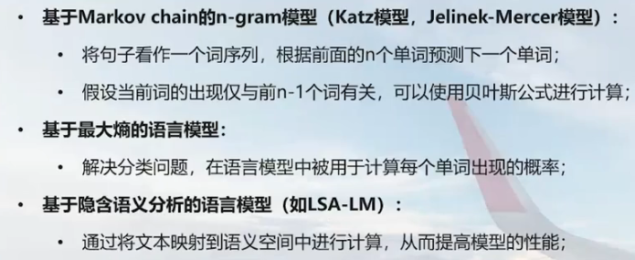

自回归语言模型(一个词一个词生成，使用前几个词计算下一词的概率，在连乘)，缺陷在于概率难算(历史过长)

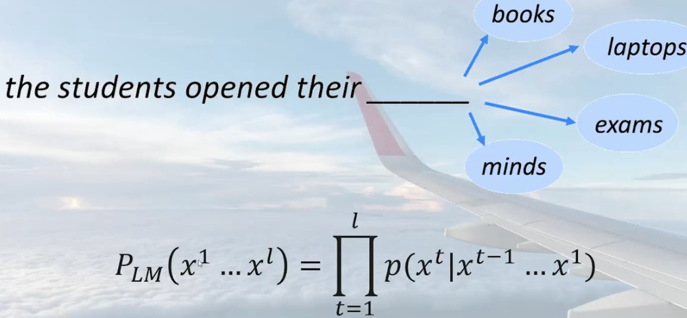

n-gram，引入一定马尔科夫假设，实现起来还是较为困难，但算起来较快，精度较低

统计语言模型由于数据稀疏性和维度灾难，只能在小规模语料库中使用

**基于神经网络的语言模型 NNLM 时代**

使用了GPU可以在整个词表中进行快速的归一化

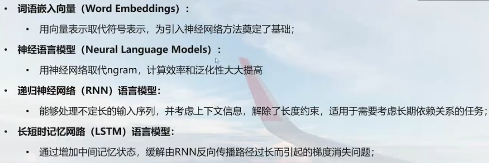

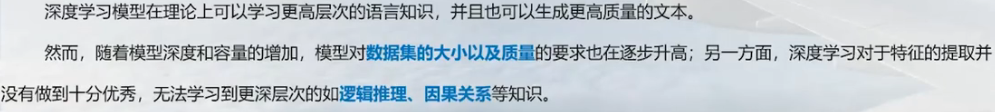

词嵌入向量 word embedding

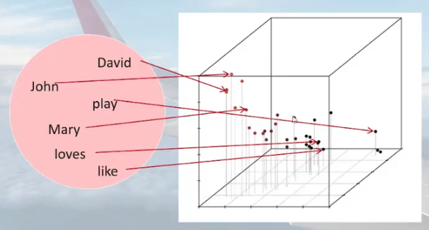

神经语言模型 类似与n-gram，中间步骤使用了神经网络

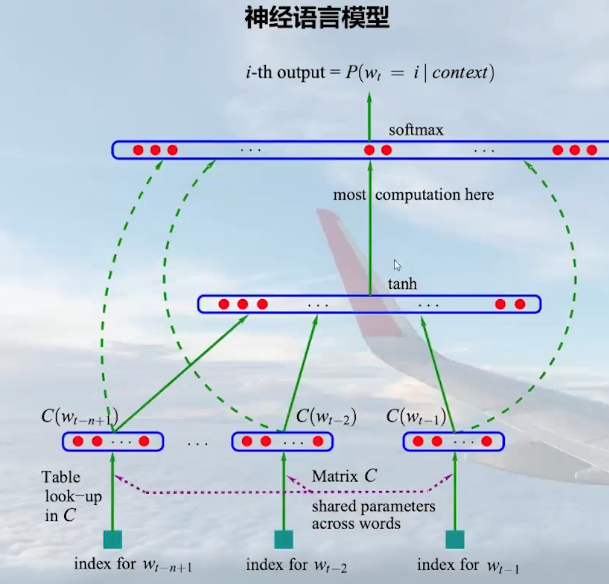

RNN

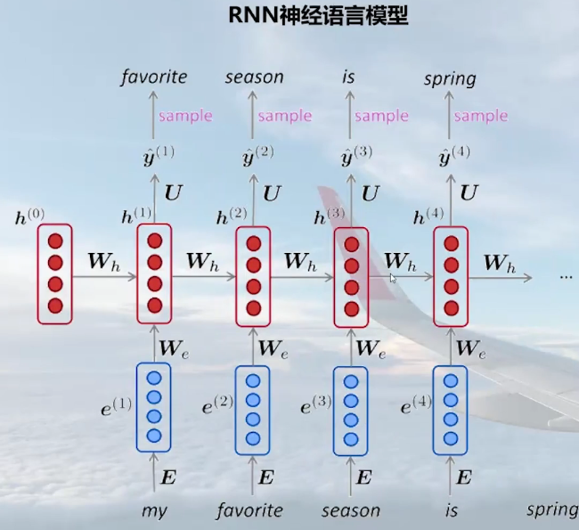

**预训练语言模型 PLM 时代**

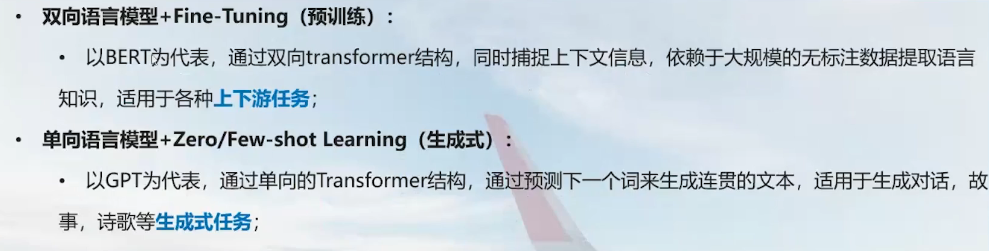

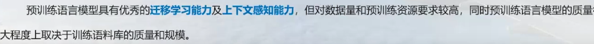

Transformer，位置编码

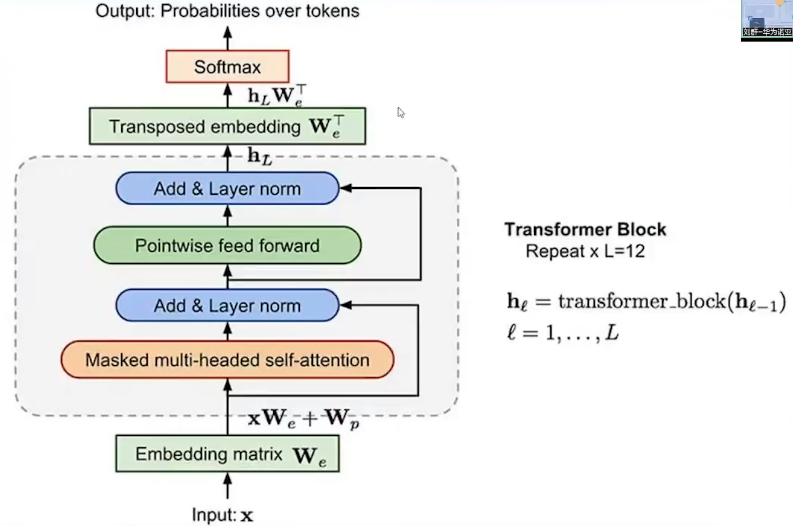

两个阶段，预训练 + fine-tune

**通用人工智能 AGI 时代**

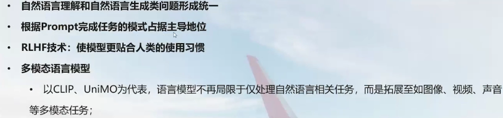

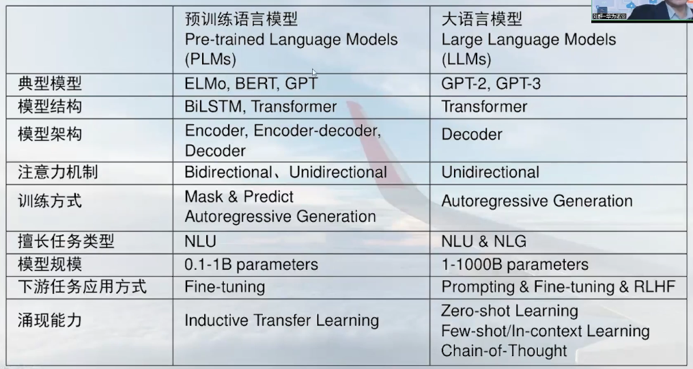

参数量巨大

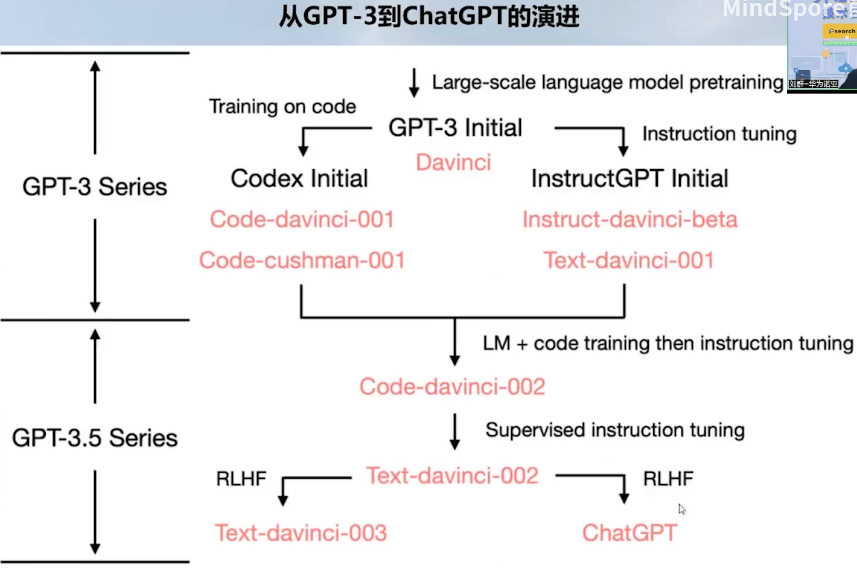

### 02 注意力机制 Attention

论文 : Attention is All You Need

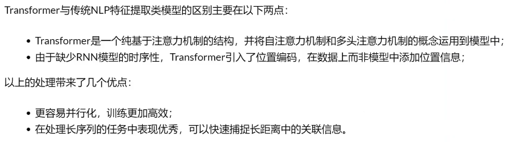

任务内容的不同，句子中需要更加关注的部分也不同。

Attention机制用于判断**词在句子中的重要性**，通过注意力分数表达词在句子中的重要性。

计算注意力分数时，我们主要参考三个因素
1. query    : 任务内容
2. key      : 索引/标签(帮助定位到答案)
3. value    : 答案

在上面的例子中，"情感分类"、"电影名字"、"中译英"等为**query**，每次对于任务内容的回答即为**value**

用一个比较直观的举例来说，每次登录视频网站搜索视频时，搜索的内容为**query**，搜索结果中显示的视频名称为**key**，它与任务内容相关，并可以引导我们至具体的视频内容**value**

一般在文本翻译中，我们希望翻译后的句子的意思和原始句子相似，所以进行注意力分数计算时，**query**一般和目标序列，即翻译后的句子有关，**key**则与源序列，即翻译前的原始句子有关

常用计算注意力分数的方法
1. additive
2. scaled dot-product

**scaled dot-product**

计算注意力分数，即 query 和 key 的相似度

想要使得 query 和 key 有相似度

计算时，还要进行归一化

同时，为了避免query($Q \in R^{n\times d_{model}}$)和key($K \in R^{m\times d_{model}}$)本身的“大小”影响到相似度的计算，我们需要在点乘后除以$\sqrt{d_{model}}$

$$\text{Attention Score}(Q, K)=\frac{QK^T}{\sqrt{d_{model}}}$$

softmax 限制到 0~1 之间

$$\text{Attention}(Q, K, V) = \text{softmax}\left(\frac{QK^T}{\sqrt{d_{model}}}\right)V$$

在处理数据时，我们为了统一长度，会使用`<pad>`占位符补齐了一些稍短的文本。本身没有意义，padding掩码会保证这些位置对应的注意力为0。

**自注意力机制 self-attention**

自注意力机制中，我们关注句子本身，查看每个单词对于周边单词的重要性。这样可以很好地理清句子中的逻辑关系，如代词指代。

The animal didn't cross the street because it was too tired.

it -> the animal

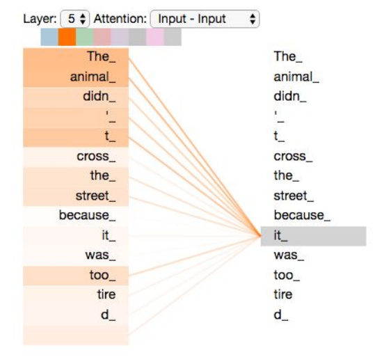

**多头注意力机制 multi-head attention**

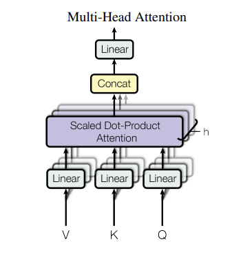

使得模型通过不同的方式关注序列不同部分

多次计算，每次计算输入序列中某一部分的注意力分数，最后将结果整合

### 02 Transformer结构

### 03 通过Transformer实现文本机器翻译

---

