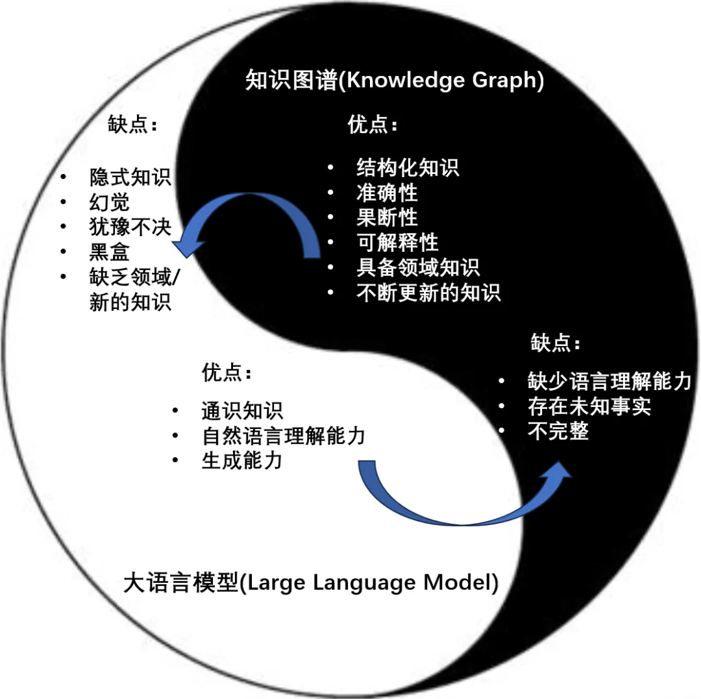

# RAG

---

## Table of Content
- [RAG](#rag)
  - [Table of Content](#table-of-content)
- [IBM Technology - Introductions](#ibm-technology---introductions)
  - [How Large Language Models Work?](#how-large-language-models-work)
  - [Why Are There So Many Foundation Models?](#why-are-there-so-many-foundation-models)
  - [What is Retrieval-Augmented Generation (RAG)?](#what-is-retrieval-augmented-generation-rag)
  - [Why Large Language Models Hallucinate?](#why-large-language-models-hallucinate)
  - [What is a Vector Database?](#what-is-a-vector-database)
- [Retrieval-Augmented Generation for Large Language Models: A Survey](#retrieval-augmented-generation-for-large-language-models-a-survey)
  - [Links](#links)
- [RAG \& KnowledgeGraph](#rag--knowledgegraph)
  - [GraphRAG - Microsoft](#graphrag---microsoft)
  - [LLM \& KnowledgeGraph](#llm--knowledgegraph)
- [Advanced RAG Techniques : an Illustrated Overview](#advanced-rag-techniques--an-illustrated-overview)
  - [Vector Search - 向量搜索](#vector-search---向量搜索)
  - [LLM 产品](#llm-产品)
  - [LLM-based pipelines \& applications](#llm-based-pipelines--applications)
  - [Naive RAG](#naive-rag)
  - [Advanced RAG](#advanced-rag)
    - [01 - Chunking \& vectorisation](#01---chunking--vectorisation)
    - [02 - Index](#02---index)
      - [02.01 - Vector store index](#0201---vector-store-index)
      - [02.02 - Hierarchical indices](#0202---hierarchical-indices)
      - [02.03 - Hypothetical Questions and HyDE](#0203---hypothetical-questions-and-hyde)
      - [02.04 - Context enrichment](#0204---context-enrichment)
      - [02.05 - Fusion retrieval or hybrid search](#0205---fusion-retrieval-or-hybrid-search)
    - [03 - Reranking \& filtering](#03---reranking--filtering)
    - [04 - Query transformations](#04---query-transformations)
    - [05 - Chat Engine](#05---chat-engine)
    - [06 - Query Routing](#06---query-routing)
    - [07 - Agents in RAG](#07---agents-in-rag)
    - [08 - Response synthesiser](#08---response-synthesiser)
- [12 RAG Pain Points and Proposed Solutions-Solving the core challenges of Retrieval-Augmented Generation](#12-rag-pain-points-and-proposed-solutions-solving-the-core-challenges-of-retrieval-augmented-generation)

---


---

# IBM Technology - Introductions

## How Large Language Models Work?

[How Large Language Models Work?](https://www.youtube.com/watch?v=5sLYAQS9sWQ)

GPT - generative pretrained transformer

instance(实例) of foundation model

self-supervised learning != unsupervised learning
1. self-supervised learning
   1. 从数据本身自动生成标签来训练模型，不依赖外部提供的标签(预测图像的某个部分、预测句子中遮挡的单词)
   2. 但创建了一个监督任务，使模型能够通过预测数据的某些方面来学习数据的表示
2. unsupervised learning
   1. 发现数据中的隐藏结构或模式，而不是从标签数据中学习
      1. 聚类 - clustering - K-means & hierarchical
      2. 降维 - dimension reduction - PCA & t-SNE
      3. 关联规则学习 - association rule learning

LLM = data + architecture(transformer) + training

business applicaitons
1. Customer Service Application - ChatBot
2. Content Creation - article / email / video
3. Software Development - code review

## Why Are There So Many Foundation Models?

[Why Are There So Many Foundation Models?](https://www.youtube.com/watch?v=QPQy7jUpmyA)

[IBM NASA Geospatial - HuggingFace](https://huggingface.co/ibm-nasa-geospatial)

HuggingFace - download open source foundation models

Foundation Model - 规模更大、应用更广泛 的预训练模型(多功能性 & 可适应性 & 迁移学习，通过少量的调整或甚至零次调整 zero-shot learning 处理各种任务)

Transformer - turn raw data to compressed representation & catch the data's basic structure

can be fine-tuned to perform different tasks


## What is Retrieval-Augmented Generation (RAG)?

[What is Retrieval-Augmented Generation (RAG)?](https://www.youtube.com/watch?v=T-D1OfcDW1M)

**RAG - Retrieval-Augmented Generation - 检索增强生成**

**Challenges**
1. no source
2. knowledge out of date

content source (Internet/Documents/Policies)

LLMs are instructed to pay attention to source data before respond

**Pros:**
1. less likely to hallucinate(幻觉)
2. less likely to leak data(数据隔离、访问控制)
3. know when to say "I don't know"

**Cons:**
1. if the retriever is bad -> user can't get an answer

## Why Large Language Models Hallucinate?

[Why Large Language Models Hallucinate?](https://www.youtube.com/watch?v=cfqtFvWOfg0)

plausible sounding nonsense

make up completely fabricated or contradictory statements

Different Granularity(颗粒度)
1. sentense contradiction(contradict previous sentence)
2. prompt contradiction
3. factual contradiction
4. nonsensical/irrelevant information base hallucinations


Causes
1. data quality(not possible to cover all topics)
2. generation method
   1. beam search
   2. sampling
   3. maximum


## What is a Vector Database?

[What is a Vector Database?](https://www.youtube.com/watch?v=t9IDoenf-lo)

Database
1. SQL - 结构化 数据 - tables
2. NoSQL(Not Only SQL) - 非结构化/半结构化 数据 - docs
3. Graph - 图结构 数据 - nodes
4. Vector - 向量 数据 - AI apps

2 concepts
1. Vector
   1. images、texts、documents -> represented in type of numerical value(array)
2. Embedding
   1. 对象 (单词、句子、图像) 映射到向量空间
   2. flexibility(vary input)/scability


---

# Retrieval-Augmented Generation for Large Language Models: A Survey

## Links

[Retrieval-Augmented Generation for Large Language Models: A Survey](https://arxiv.org/abs/2312.10997)

[RAG-Survey - Github](https://github.com/Tongji-KGLLM/RAG-Survey)


---

# RAG & KnowledgeGraph

## GraphRAG - Microsoft

[Project GraphRAG - LLM-Derived Knowledge Graphs](https://www.microsoft.com/en-us/research/project/graphrag/)

[arxiv - From Local to Global: A Graph RAG Approach to Query-Focused Summarization](https://arxiv.org/pdf/2404.16130v1)

GraphRAG (Graphs + Retrieval Augmented Generation)




## LLM & KnowledgeGraph

知识图谱 - 结构化的知识表示方式，能通过符号推理产生**可解释的结果**，具备精确可靠的领域知识


三类路线
1. 基于知识图谱增强的大模型
2. 基于大模型增强的知识图谱
3. 大模型和知识图谱的融合


---

# Advanced RAG Techniques : an Illustrated Overview

[Advanced RAG Techniques : an Illustrated Overview](https://medium.com/towards-artificial-intelligence/advanced-rag-techniques-an-illustrated-overview-04d193d8fec6)

[高级 RAG 技术 : 图解概览 [译]](https://baoyu.io/translations/rag/advanced-rag-techniques-an-illustrated-overview)

RAG provides LLMs with the information retrieved from some data source to ground its generated answer on

RAG = Search + LLM prompting(query and the retrieved context)

## Vector Search - 向量搜索

**Vector Search - 向量搜索**
1. [Faiss Wiki - Github](https://github.com/facebookresearch/faiss/wiki) - a library for efficient similarity search and clustering of dense vectors
2. [Chroma - Github](https://github.com/chroma-core/chroma) - the open-source embedding database
3. [weavaite.io](https://weaviate.io/) - an open source, AI-native vector database
4. [pinecone](https://www.pinecone.io/) - a serverless vector database
5. [nmslib](https://github.com/nmslib/nmslib) - an efficient cross-platform similarity search library and a toolkit for evaluation of similarity search methods
6. [Qdrant](https://qdrant.tech/) - a vector similarity search engine and vector database

## LLM 产品

LLM(**brain** for **RAG pipeline**)
1. [ChatGPT - OpenAI](https://openai.com/chatgpt) - Get answers. Find inspiration. Be more productive.
2. [Claude - Anthropic](https://www.anthropic.com/product) - a family of foundational AI models that can be used in a variety of applications
3. [Mixtral form Mistral](https://mistral.ai/news/mixtral-of-experts/) - A high quality Sparse Mixture-of-Experts
4. [Phi-2 from Microsoft](https://www.microsoft.com/en-us/research/blog/phi-2-the-surprising-power-of-small-language-models/)
5. [Llama2](https://huggingface.co/blog/zh/llama2) - a family of state-of-the-art open-access large language models
6. [OpenLLaMA - UC Berkelely](https://huggingface.co/openlm-research) - open source reproduction of Meta AI’s LLaMA model trained on the RedPajama dataset
7. [Falcon](https://huggingface.co/tiiuae) - TII's flagship series of large language models, built from scratch using a custom data pipeline and distributed training library

## LLM-based pipelines & applications

**open source libraries for LLM-based pipelines & applications**
1. [LangChain 🦜️](https://python.langchain.com/docs/get_started/introduction/)
   
2. [LlamaIndex 🦙](https://docs.llamaindex.ai/en/stable/) - a framework for building context-augmented LLM applications
   
3. [Dify](https://dify.ai/zh) - **开源的** LLM 应用开发平台。提供从 Agent 构建到 AI workflow 编排、RAG 检索、模型管理等能力，轻松构建和运营生成式 AI 原生应用
   
4. [BiSheng](https://bisheng.dataelem.com/) - 便捷、灵活、可靠的企业级大模型应用开发平台
   


## Naive RAG


**Vanilla RAG case**
1. split texts into chunks
2. **embed chunks into vectors** with some Transformer Encoder model
3. put all those vectors into an index
4. create **prompt** for LLM that tells the model to answers user’s query(given the context found)
   ```python
   def question_answering(context, query):
      prompt = f"""
                  Give the answer to the user query delimited by triple backticks ```{query}```\
                  using the information given in context delimited by triple backticks ```{context}```.\
                  If there is no relevant information in the provided context, try to answer yourself,
                  but tell user that you did not have any relevant context to base your answer on.
                  Be concise and output the answer of size less than 80 tokens.
                  """
      response = get_completion(instruction, prompt, model="gpt-3.5-turbo")
      answer = response.choices[0].message["content"]
      return answer
   ```

**Runtime**
1. **vectorize user’s query** with the same Encoder model
2. execute search of this query vector against the index
3. find the top-k results
4. retrieve the corresponding text chunks from our database
5. feed them into the LLM prompt as context

Prompt engineering is the **cheapest** thing you can try to improve your RAG pipeline

[OpenAI - Prompt engineering(shares strategies and tactics for getting better results from large language models)](https://platform.openai.com/docs/guides/prompt-engineering)


## Advanced RAG


### 01 - Chunking & vectorisation

Procedure
1. create an index of vectors(向量索引), representing our document contents
2. in the runtime to search for the **least cosine distance**(余弦值用来表示两个向量的相似性)
3. query vector which corresponds to the closest semantic meaning

**least cosine distance**
**$$ \cos (x, y)
=\frac{x \cdot y}{|x| \cdot |y|}
=\frac{\sum_{i=1}^{n} x_{i} y_{i}}
{\sqrt{\sum_{i=1}^{n} x_{i}^{2}} \sqrt{\sum_{i=1}^{n} y_{i}^{2}}} $$**


**Chunking** - split documents in chunks without loosing meaning
1. Transformer models have fixed input sequence length
2. 相比于几页文本的平均向量，一句话或几句话的向量更能准确地代表其语义含义
3. size of the chunk depends on the embedding model and its capacity in tokens
4. [Chunking Strategies for LLM Applications](https://www.pinecone.io/learn/chunking-strategies/)


**Vectorization**
1. choose a model to embed our chunks
2. search optimized models(为搜索优化的模型)
   1. [bge-large](https://huggingface.co/BAAI/bge-large-en-v1.5)
      1. [FlagEmbedding - Github](https://github.com/FlagOpen/FlagEmbedding/blob/master/README_zh.md)
   2. [E5](https://huggingface.co/intfloat/multilingual-e5-large)
3. [Overall MTEB English leaderboard](https://huggingface.co/spaces/mteb/leaderboard) - Massive Text Embedding Benchmark


### 02 - Index

#### 02.01 - Vector store index


(omit the Encoder block)

the crucial part of the RAG pipeline is the **search index 搜索索引**, storing your vectorized content

most naive implementation uses **flat index**(a brute force 暴力 distance calculation between the **query vector** and **all the chunks’ vectors**)

a vector index like faiss, nmslib or annoy - optimized for efficient retrieval, using **Approximate Nearest Neighbours** implementation(clustring, trees or HNSW algorithm)

[Vector Search - Hierarchical Navigable Small World (HNSW) graphs](https://www.pinecone.io/learn/series/faiss/hnsw/)

#### 02.02 - Hierarchical indices

#### 02.03 - Hypothetical Questions and HyDE

#### 02.04 - Context enrichment

#### 02.05 - Fusion retrieval or hybrid search


### 03 - Reranking & filtering


### 04 - Query transformations


### 05 - Chat Engine


### 06 - Query Routing

### 07 - Agents in RAG

### 08 - Response synthesiser


---

# 12 RAG Pain Points and Proposed Solutions-Solving the core challenges of Retrieval-Augmented Generation

[12 RAG Pain Points and Proposed Solutions](https://towardsdatascience.com/12-rag-pain-points-and-proposed-solutions-43709939a28c)

[12 个 RAG 痛点和建议的解决方案 (中文翻译)](https://zhuanlan.zhihu.com/p/681351068)


Pain Point
1. **Missing Content (内容缺失)**
   1. provides a **plausible but incorrect answer** when **the actual answer is not in the knowledge base**, rather than stating it doesn’t know
   2. users receive misleading information, leading to frustration
   3. **SOLUTION**
      1. **Clean your data** - Garbage in, garbage out, such as containing conflicting information. Clean data is the prerequisite for any RAG pipeline
      2. **Better prompting** - By instructing the system with prompts : "Tell me you don’t know if you are not sure of the answer", encourage the model to acknowledge its limitations and communicate uncertainty
2. **Missed the Top Ranked Documents (错过排名靠前的文档)**
   1. essential documents may not appear in the top results returned by the system’s retrieval component
   2. correct answer is overlooked, causing the system to fail to deliver accurate responses
   3. question is in the document but did not rank highly enough to be returned to the user
   4. **SOLUTION**
      1. **Hyperparameter tuning** for **chunk_size**(分块大小) and **similarity_top_k**(相似度最高的K个) - manage the efficiency and effectiveness of the data retrieval process, impact the **trade-off** between **computational efficiency** and the **quality of retrieved information**
      2. **Reranking retrieval results** - evaluate and enhance retriever performance using various **embeddings and rerankers** & finetune **a custom reranker**
3. **Not in Context - Consolidation Strategy Limitations (不在上下文中-整合策略的局限性)**
   1. Documents with the answer were retrieved from the database but **did not make it into the context for generating an answer**, a consolidation process takes place to retrieve the answer
   2. **SOLUTION**
      1. Tweak retrieval strategies
      2. Finetune embeddings
4. **Not Extracted (未提取)**
   1. system struggles to extract the correct answer from the provided context, especially when overloaded with information
   2. Key details are missed, compromising the quality of responses
   3. occurs when there is too much noise or contradicting information in the context
   4. **SOLUTION**
      1. Clean your data
      2. Prompt Compression
      3. LongContextReorder - the best performance typically arises when crucial data is positioned at the start or conclusion of the input context
5. **Wrong Format (格式错误)**
   1. an instruction to extract information in a specific format(table & list) is overlooked
   2. **SOLUTION**
      1. Better prompting - Clarify the instructions、Simplify the request and use keywords、Give examples、Iterative prompting and asking follow-up questions
      2. Output parsing - to provide “parsing” for LLM outputs、provide formatting instructions
      3. Pydantic programs - serves as a versatile framework that converts an input string into a structured Pydantic object
      4. OpenAI JSON mode - enable JSON mode for the response
6. **Incorrect Specificity (特征不明显)**
   1. responses may lack the necessary detail or specificity, often requiring follow-up queries for clarification
   2. answers may be too vague or general, failing to meet the user’s needs
   3. **SOLUTION**
      1. Advanced retrieval strategies
         1. small-to-big retrieval - 先从较小、较精确的数据集开始搜索，如果在这些数据集中找不到足够的信息，就逐渐扩展到更大的数据集
         2. sentence window retrieval - 基于文本窗口的检索策略，特别适用于需要从大量文本中提取具体句子或短文本片段的场景，检索系统会根据查询的上下文或关键词，确定相关句子周围的“窗口”范围，并从这些窗口中提取信息
         3. recursive retrieval - 迭代的检索方法，它在初次检索后使用检索到的信息来精细化和改进后续的搜索查询
7. **Incomplete (不完整)**
   1. partial responses aren’t wrong; however, don’t provide all the details, despite the information being present and accessible within the context
   2. **SOLUTION**
      1. Query transformations - add a query understanding layer before actually querying the vector store
8. **Data Ingestion Scalability (数据摄取可扩展性)**
   1. the system struggles to efficiently manage and process large volumes of data
   2. lead to performance bottlenecks and potential system failure
   3. cause prolonged ingestion time, system overload, data quality issues, and limited availability
   4. **SOLUTION**
      1. Parallelizing ingestion pipeline - ingestion pipeline parallel processing
9. **Structured Data QA (结构化数据 QA)**
   1. accurately interpreting user queries to retrieve relevant structured data
   2. especially with complex or ambiguous queries, inflexible text-to-SQL
   3. **SOLUTION** of LlamaIndex
      1. Chain-of-table Pack
      2. Mix-Self-Consistency Pack
10. **Data Extraction from Complex PDFs (复杂 PDF 中的数据提取)**
    1. extract data from complex PDF documents(embedded tables)
    2. **SOLUTION**
       1. Embedded table retrieval - use [Unstructured.io](Unstructured.io) to parse out the embedded tables from an HTML document(use **pdf2htmlEX** to convert the PDF to HTML), build a node graph, use recursive retrieval to index/retrieve tables based on the user question
11. **Fallback Model(s) (后备模型)**
    1. rate limit errors with OpenAI’s models
    2. a fallback model(s) as the backup in case your **primary model malfunctions**
    3. **SOLUTION**
       1. Neutrino router - a collection of LLMs to which you can route queries
       2. OpenRouter - a unified API to access any LLM, finds the lowest price for any model and offers fallbacks in case the primary host is down
12. **LLM Security (LLM安全性)**
    1. combat **prompt injection**, handle **insecure outputs**, prevent **sensitive information disclosure**
    2. **SOLUTION**
       1. Guard - classify content for LLMs by examining both the inputs (through **prompt classification**) and the outputs (via **response classification**), produce text outcomes that determine whether a specific prompt or response is considered safe or unsafe

