# RAG(Retrieval-Augmented Generation) - 检索增强生成

解决 LLM 问题
1. 信息滞后 - 静态知识
2. 模型幻觉 - **hallucination**
3. 私有数据匮乏 - 训练数据来自互联网公开数据，构建私有知识库

---

## Table of Content
- [RAG(Retrieval-Augmented Generation) - 检索增强生成](#ragretrieval-augmented-generation---检索增强生成)
  - [Table of Content](#table-of-content)
- [Prompt-Engineer \& RAG \& Fine-Tunning](#prompt-engineer--rag--fine-tunning)
- [RAG 高效应用指南 - AI花果山](#rag-高效应用指南---ai花果山)
  - [文档智能解析](#文档智能解析)
  - [文本分块 Text Chunking/Splitting](#文本分块-text-chunkingsplitting)
- [IBM Technology - Introductions](#ibm-technology---introductions)
  - [How Large Language Models Work?](#how-large-language-models-work)
  - [Why Are There So Many Foundation Models?](#why-are-there-so-many-foundation-models)
  - [What is Retrieval-Augmented Generation (RAG)?](#what-is-retrieval-augmented-generation-rag)
  - [Why Large Language Models Hallucinate?](#why-large-language-models-hallucinate)
  - [What is a Vector Database?](#what-is-a-vector-database)
- [Retrieval-Augmented Generation for Large Language Models: A Survey](#retrieval-augmented-generation-for-large-language-models-a-survey)
- [Unifying RAG and long context LLMs](#unifying-rag-and-long-context-llms)
- [RAG \& KnowledgeGraph](#rag--knowledgegraph)
  - [GraphRAG - Microsoft](#graphrag---microsoft)
  - [LLM \& KnowledgeGraph](#llm--knowledgegraph)
- [Advanced RAG Techniques : an Illustrated Overview](#advanced-rag-techniques--an-illustrated-overview)
  - [Vector Search - 向量搜索](#vector-search---向量搜索)
  - [LLM 产品](#llm-产品)
  - [LLM-based pipelines \& applications](#llm-based-pipelines--applications)
  - [Naive RAG](#naive-rag)
  - [Advanced RAG](#advanced-rag)
    - [01 - Chunking \& vectorization](#01---chunking--vectorization)
    - [02 - Index](#02---index)
      - [Vector store index](#vector-store-index)
      - [Hierarchical indices](#hierarchical-indices)
      - [Hypothetical Questions and HyDE](#hypothetical-questions-and-hyde)
      - [Context enrichment](#context-enrichment)
        - [Sentence Window Retrieval](#sentence-window-retrieval)
        - [Auto-merging Retriever (Parent Document Retriever)](#auto-merging-retriever-parent-document-retriever)
        - [Fusion Retrieval or Hybrid Search](#fusion-retrieval-or-hybrid-search)
    - [03 - Reranking \& filtering](#03---reranking--filtering)
    - [04 - Query transformations](#04---query-transformations)
    - [05 - Reference citations](#05---reference-citations)
    - [06 - Chat Engine](#06---chat-engine)
    - [07 - Query Routing](#07---query-routing)
    - [08 - Agents in RAG](#08---agents-in-rag)
    - [09 - Response synthesizer](#09---response-synthesizer)
    - [10 - Encoder and LLM fine-tuning](#10---encoder-and-llm-fine-tuning)
    - [11 - Evaluation](#11---evaluation)
    - [12 - Conclusion](#12---conclusion)
- [12 RAG Pain Points and Proposed Solutions-Solving the core challenges of Retrieval-Augmented Generation](#12-rag-pain-points-and-proposed-solutions-solving-the-core-challenges-of-retrieval-augmented-generation)

---

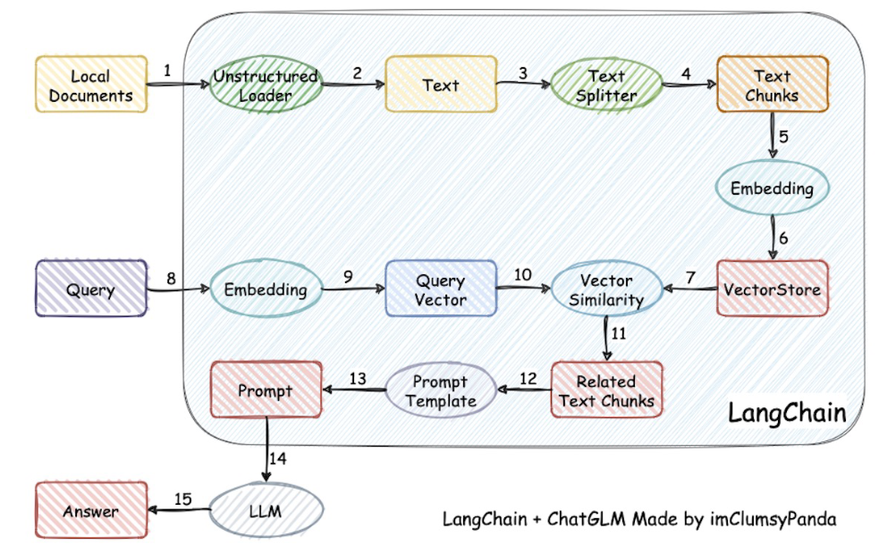

---

# Prompt-Engineer & RAG & Fine-Tunning

对于 错误回复
1. Prompt-Engineer : 解决问题问不清楚(不改动LLM)
2. RAG : 解决缺乏相关知识(不改动LLM)
3. Fine-Tunning : 解决模型能力不足(改动LLM)，不建议一开始就进行模型微调

---

# RAG 高效应用指南 - AI花果山

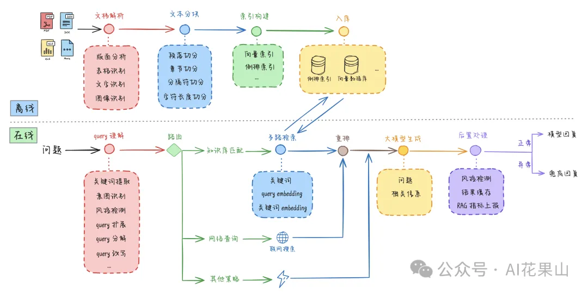

RAG 应用的基本架构，可以分为离线和在线两部分
1. 离线 - 对知识库文档进行解析、拆分、索引构建和入库
2. 在线 - query分析、召回检索、联网搜索、重拍、query回答

## 文档智能解析

从 非结构化数据(PDF, Word, PPT, Excel, 图像, 图表) 中 提取出内容

[版面分析那些事 - 一些传统实现](https://zhuanlan.zhihu.com/p/35910823)

Layout Analysis - 布局分析
1. 文本 - 标题、副标题、正文文本
   1. OCR引擎 - Optical Character Recognition
2. 图像 - 图片、图表、公式
3. 表格
   1. 表格识别 - TSR，Table Structure Recognition

相关模型
1. [微软 LayoutLM 微软亚研院](https://www.msra.cn/zh-cn/news/features/layoutlmv3)
   1. [Github](https://github.com/microsoft/unilm/tree/master/layoutlmv3)
   2. [论文](https://arxiv.org/pdf/2204.08387)
2. 微软 Table Transformer
3. [Donut 模型](https://arxiv.org/pdf/2111.15664v5)
4. [RAGFlow](https://github.com/infiniflow/ragflow)
   1. [检索增强生成引擎 RAGFlow 正式开源 - InfoQ](https://www.infoq.cn/article/hjjm3kv620idoyyobtps)
   2. [RAGFlow 官网](https://ragflow.io/)
   3. [Github - RAGFlow](https://github.com/infiniflow/ragflow/blob/main/README_zh.md)
   4.
5. [Unstructured](https://github.com/Unstructured-IO/unstructured) - 专门用于处理非结构化数据
6. [旷世 OneChart](https://onechartt.github.io/)
7. [百度 PaddleOCR](https://github.com/PaddlePaddle/PaddleOCR)

## 文本分块 Text Chunking/Splitting

将长文本分解为较小的文本块(分解成易于管理的部分(章节、段落、句子))

块被嵌入、索引、存储，然后用于后续的检索

优点
1. 增加准确性
2. 提升性能 - LLM 在处理过长的文本时可能会遇到性能瓶颈

方式
1. 按大小分块 - 将文本按固定字符数或单词数进行分割
   1. 最直接、最经济
   2. 语义不连贯、不完整
2. 特定格式分块
3. 递归分块 - 以一组分隔符为参数，以递归的方式将文本分成更小的块
4. 语义分块(Semantic Chunking) - 在句子之间进行分割，使用 Embedding 表征句子，相似的句子组合在一起形成块，保持句子的顺序
5. 命题分块(Propositional Chunking) - 语义分块的一种，将句子分解为命题(主谓宾，表达一个完整思想的最小信息单元)

文本分块并没有固定的最佳策略，选择哪种方式取决于具体的需求和场景

---

# IBM Technology - Introductions

## How Large Language Models Work?

[How Large Language Models Work?](https://www.youtube.com/watch?v=5sLYAQS9sWQ)

GPT - generative pretrained transformer

instance(实例) of foundation model

self-supervised learning != unsupervised learning
1. self-supervised learning
   1. 从数据本身自动生成标签来训练模型，不依赖外部提供的标签(预测图像的某个部分、预测句子中遮挡的单词)
   2. 但创建了一个监督任务，使模型能够通过预测数据的某些方面来学习数据的表示
2. unsupervised learning
   1. 发现数据中的隐藏结构或模式，而不是从标签数据中学习
      1. 聚类 - clustering - K-means & hierarchical
      2. 降维 - dimension reduction - PCA & t-SNE
      3. 关联规则学习 - association rule learning

LLM = data + architecture(transformer) + training

business applicaitons
1. Customer Service Application - ChatBot
2. Content Creation - article / email / video
3. Software Development - code review

## Why Are There So Many Foundation Models?

[Why Are There So Many Foundation Models?](https://www.youtube.com/watch?v=QPQy7jUpmyA)

[IBM NASA Geospatial - HuggingFace](https://huggingface.co/ibm-nasa-geospatial)

HuggingFace - download open source foundation models

Foundation Model - 规模更大、应用更广泛 的预训练模型(多功能性 & 可适应性 & 迁移学习，通过少量的调整或甚至零次调整 zero-shot learning 处理各种任务)

Transformer - turn raw data to compressed representation & catch the data's basic structure

can be fine-tuned to perform different tasks

## What is Retrieval-Augmented Generation (RAG)?

[What is Retrieval-Augmented Generation (RAG)?](https://www.youtube.com/watch?v=T-D1OfcDW1M)

**RAG - Retrieval-Augmented Generation - 检索增强生成**

**Challenges**
1. no source
2. knowledge out of date

content source (Internet/Documents/Policies)

LLMs are instructed to pay attention to source data before respond

**Pros:**
1. less likely to hallucinate(幻觉)
2. less likely to leak data(数据隔离、访问控制)
3. know when to say "I don't know"

**Cons:**
1. if the retriever is bad -> user can't get an answer

## Why Large Language Models Hallucinate?

[Why Large Language Models Hallucinate?](https://www.youtube.com/watch?v=cfqtFvWOfg0)

plausible sounding nonsense

make up completely fabricated or contradictory statements

Different Granularity(颗粒度)
1. sentense contradiction(contradict previous sentence)
2. prompt contradiction
3. factual contradiction
4. nonsensical/irrelevant information base hallucinations

Causes
1. data quality(not possible to cover all topics)
2. generation method
   1. beam search
   2. sampling
   3. maximum

## What is a Vector Database?

[What is a Vector Database?](https://www.youtube.com/watch?v=t9IDoenf-lo)

Database
1. SQL - 结构化 数据 - tables
2. NoSQL(Not Only SQL) - 非结构化/半结构化 数据 - docs
3. Graph - 图结构 数据 - nodes
4. Vector - 向量 数据 - AI apps

2 concepts
1. Vector
   1. images、texts、documents -> represented in type of numerical value(array)
2. Embedding
   1. 对象 (单词、句子、图像) 映射到向量空间
   2. flexibility(vary input)/scability

---

# Retrieval-Augmented Generation for Large Language Models: A Survey

[Retrieval-Augmented Generation for Large Language Models: A Survey](https://arxiv.org/abs/2312.10997)

[RAG-Survey - Github](https://github.com/Tongji-KGLLM/RAG-Survey)

[RAG-Survey - ReadPaper](https://readpaper.com/pdf-annotate/note?pdfId=2244532135023698688&noteId=2298121563230725632)

# Unifying RAG and long context LLMs

[Unifying RAG and long context LLMs - GoogleDocs](https://docs.google.com/presentation/d/1mJUiPBdtf58NfuSEQ7pVSEQ2Oqmek7F1i4gBwR6JDss/edit?pli=1#slide=id.g26c0cb8dc66_0_0)

[Unifying RAG and long context LLMs - PDF](./Paper/Unifying%20RAG%20and%20long%20context%20LLMs.pdf)

Context Window - 上下文窗口

T - trillion

Needle in a Haystack

recency bias 模型倾向于过分关注最近的tokens，而忽视了更远处的、可能同样重要的令牌

RoPE - Rotary Positional Embedding - 旋转位置编码 - 对于远距离的注意力有减少的倾向 导致 recency bias

TODO

[大模型rag技术如此之多，如何选择，多看看论文和实验](https://www.bilibili.com/video/BV1vD421T7aR/)

---

# RAG & KnowledgeGraph

## GraphRAG - Microsoft

[Project GraphRAG - LLM-Derived Knowledge Graphs](https://www.microsoft.com/en-us/research/project/graphrag/)

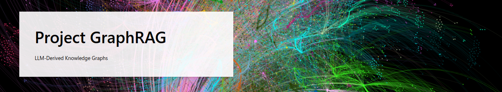

[arxiv - From Local to Global: A Graph RAG Approach to Query-Focused Summarization](https://arxiv.org/pdf/2404.16130v1)

[ReadPaper - Paper & Note](https://readpaper.com/pdf-annotate/note?pdfId=4881783320383324161&noteId=2323244243193266176)

[WeChat 文章](https://mp.weixin.qq.com/s/JBQf8C-4KU8ot9G0-olSzA?poc_token=HDPWvGajAVZgIexn63pDnrb7e6NO4hjLV04azmLi)

[YouTube - GraphRAG: LLM-Derived Knowledge Graphs for RAG](https://www.youtube.com/watch?v=r09tJfON6kE&list=WL)

对于宏观问题，需要 遍历整个知识库 并总结，Connect the Dot 找到散落在各处的信息，传统 RAG 效果不理想

相当于提前将信息进行**整理(Pre-Processing)**，搭建 **知识图谱**(同时也构建了知识的层次结构(Community Detection))，通过查询知识图谱，很快能够获取关联信息

更新知识图谱可能消耗资源过多

使用 LLM(GPT) 构建 Graph, Graph 用于 RAG

RAG
1. **excellent** at performing retrieval for highly specific facts (Vector similarity approach)
2. **poor** at performing any operation that require higher order reasoning and understanding

Graph
1. aggregate semantic concepts and derive holistic understanding of the whole sources
2. guide content discovery to provide the llm diverse comprehensive and topically relevant content

**Two Step Process**
1. indexing process on private data to create LLM-Derived Knowledge Graphs (LLM memory representation)
2. LLM Orchestration to utilize memory constructs in RAG operations

**Differentiators**
1. enhance search relevance
2. enable new scenarios that require large context

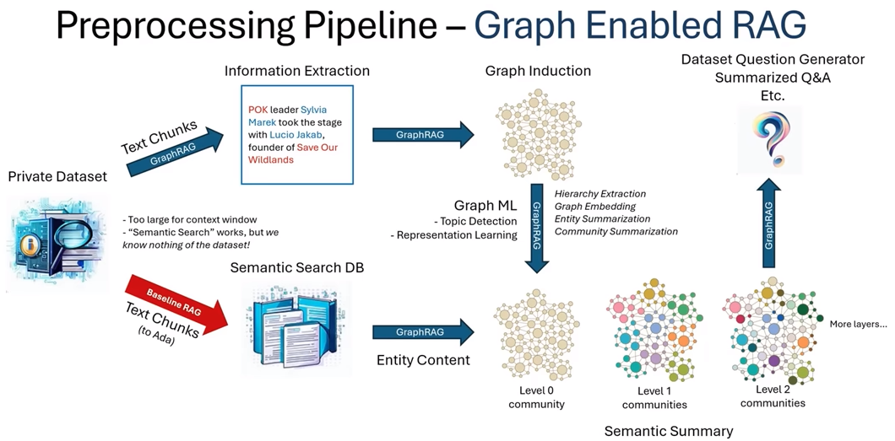

Graph Machine Learning
1. semantic aggregation
2. hierarchy extraction

TODO

[大模型研发核心 - 数据工程、自动化评估及与知识图谱的结合 - 智源社区](https://hub.baai.ac.cn/view/28740)

[从传统RAG到GraphRAG](https://www.bilibili.com/video/BV1bm41117XN/)

## LLM & KnowledgeGraph

知识图谱 - 结构化的知识表示方式，能通过符号推理产生**可解释的结果**，具备精确可靠的领域知识

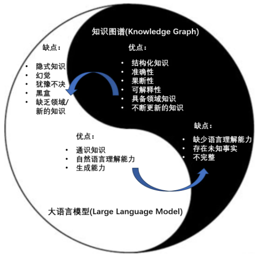

[知识图谱 + RAG](https://mp.weixin.qq.com/s/C5TY8wbrJLDb-jmLzGhbXg)

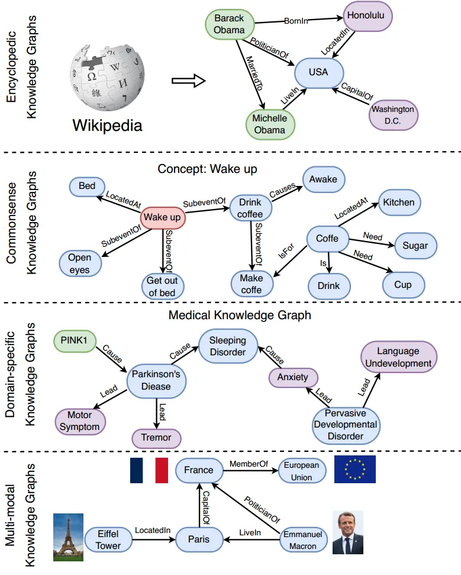

三类路线
1. 基于知识图谱增强的大模型
2. 基于大模型增强的知识图谱
3. 大模型和知识图谱的融合

---

# Advanced RAG Techniques : an Illustrated Overview

[Advanced RAG Techniques : an Illustrated Overview](https://medium.com/towards-artificial-intelligence/advanced-rag-techniques-an-illustrated-overview-04d193d8fec6)

[高级 RAG 技术 : 图解概览 [译]](https://baoyu.io/translations/rag/advanced-rag-techniques-an-illustrated-overview)

## Vector Search - 向量搜索

## LLM 产品

LLM(**brain** for **RAG pipeline**)
1. [ChatGPT - OpenAI](https://openai.com/chatgpt) - Get answers. Find inspiration. Be more productive.
2. [Claude - Anthropic](https://www.anthropic.com/product) - a family of foundational AI models that can be used in a variety of applications
3. [Mixtral form Mistral](https://mistral.ai/news/mixtral-of-experts/) - A high quality Sparse Mixture-of-Experts
4. [Phi-2 from Microsoft](https://www.microsoft.com/en-us/research/blog/phi-2-the-surprising-power-of-small-language-models/)
5. [Llama2](https://huggingface.co/blog/zh/llama2) - a family of state-of-the-art open-access large language models
6. [OpenLLaMA - UC Berkelely](https://huggingface.co/openlm-research) - open source reproduction of Meta AI’s LLaMA model trained on the RedPajama dataset
7. [Falcon](https://huggingface.co/tiiuae) - TII's flagship series of large language models, built from scratch using a custom data pipeline and distributed training library

## LLM-based pipelines & applications

**open source libraries for LLM-based pipelines & applications**
1. [LangChain 🦜️](https://python.langchain.com/docs/get_started/introduction/)
   
2. [LlamaIndex 🦙](https://docs.llamaindex.ai/en/stable/) - a framework for building context-augmented LLM applications
   
3. [Dify](https://dify.ai/zh) - **开源的** LLM 应用开发平台。提供从 Agent 构建到 AI workflow 编排、RAG 检索、模型管理等能力，轻松构建和运营生成式 AI 原生应用
   
4. [BiSheng](https://bisheng.dataelem.com/) - 便捷、灵活、可靠的企业级大模型应用开发平台
   

知识库 横评

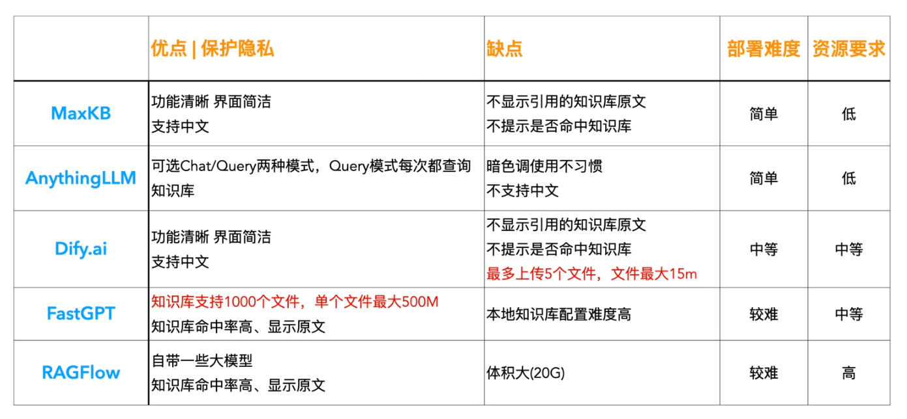

## Naive RAG

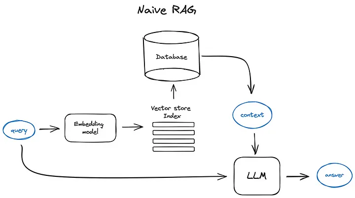

**Vanilla RAG case**
1. split texts into chunks
2. **embed chunks into vectors** with some Transformer Encoder model
3. put all those vectors into an index
4. create **prompt** for LLM that tells the model to answers user’s query(given the context found)

**Runtime**
1. **vectorize user’s query** with the **same Encoder model**
2. execute search of this query vector against the index
3. find the top-k results
4. retrieve the corresponding text chunks from our database
5. feed them into the LLM prompt as context

Prompt engineering is the **cheapest** thing you can try to improve your RAG pipeline

[OpenAI - Prompt engineering(shares strategies and tactics for getting better results from large language models)](https://platform.openai.com/docs/guides/prompt-engineering)

## Advanced RAG

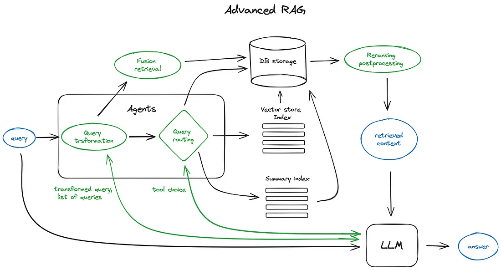

### 01 - Chunking & vectorization

Procedure
1. create an index of vectors(向量索引), representing our document contents
2. in the runtime to search for the **least cosine distance**(余弦值用来表示两个向量的相似性)
3. query vector which corresponds to the closest semantic meaning

**least cosine distance**
**$$ \cos (x, y)
=\frac{x \cdot y}{|x| \cdot |y|}
=\frac{\sum_{i=1}^{n} x_{i} y_{i}}
{\sqrt{\sum_{i=1}^{n} x_{i}^{2}} \sqrt{\sum_{i=1}^{n} y_{i}^{2}}} $$**

**Chunking** - split documents in chunks without loosing meaning
1. 相比于几页文本的平均向量，一句话或几句话的向量更能准确地代表其语义含义
2. size of the chunk depends on the embedding model and its capacity in tokens
3. [Chunking Strategies for LLM Applications](https://www.pinecone.io/learn/chunking-strategies/)

**Vectorization**
1. embed chunks
2. search optimized models(为搜索优化的模型)
   1. [bge-large](https://huggingface.co/BAAI/bge-large-en-v1.5)
   2. [E5](https://huggingface.co/intfloat/multilingual-e5-large)
3. [Overall MTEB English leaderboard](https://huggingface.co/spaces/mteb/leaderboard) - Massive Text Embedding Benchmark
4. [FlagEmbedding - Github](https://github.com/FlagOpen/FlagEmbedding/blob/master/README_zh.md)

### 02 - Index

#### Vector store index

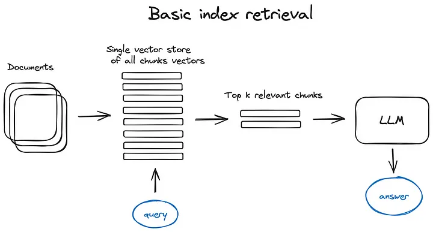

(omit the Encoder block)

**search index 搜索索引**, store vectorized content

most naive implementation uses **flat index**(a brute force 暴力 distance calculation)

vector index - optimized for efficient retrieval, using **Approximate Nearest Neighbour**(clustering, trees or HNSW algorithm)

[Vector Search - Hierarchical Navigable Small World (HNSW) graphs](https://www.pinecone.io/learn/series/faiss/hnsw/)

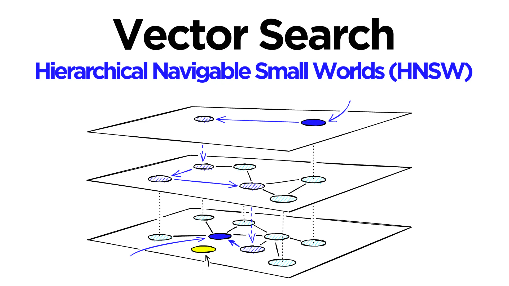

LlamaIndex 支持多种向量存储索引

#### Hierarchical indices

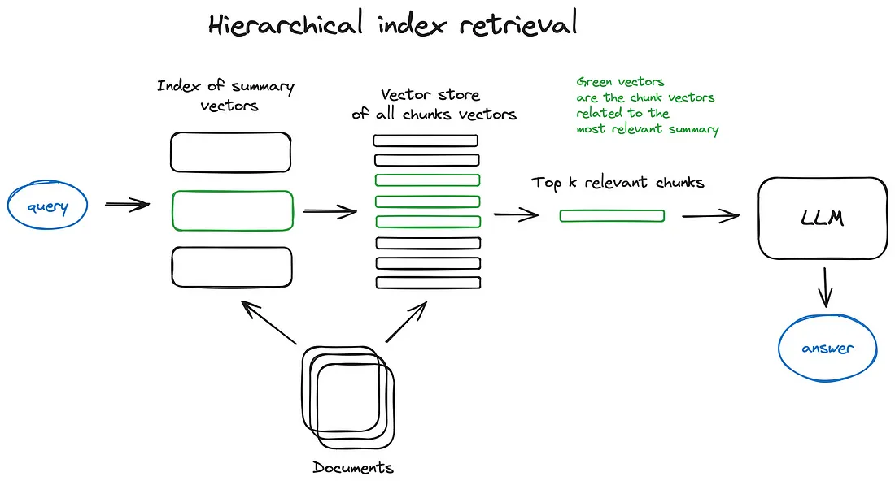

create two indices
1. summaries
2. document chunks

procedure
1. filter out the relevant docs by summaries
2. search inside this relevant group

#### Hypothetical Questions and HyDE

**Hypothetical Questions - 假设性问题**
1. let LLM **generate a question for each chunk** and embed questions in vectors
2. at runtime performing query search against this index of question vectors

**HyDE**
1. ask an LLM to **generate a hypothetical response given the query**
2. use its vector along with the query vector to enhance search quality

#### Context enrichment

retrieve smaller chunks for better search quality(检索更小的信息块来提高搜索质量)

add up surrounding context for LLM to reason upon(为大语言模型增加更多周围语境以便其进行推理)

##### Sentence Window Retrieval

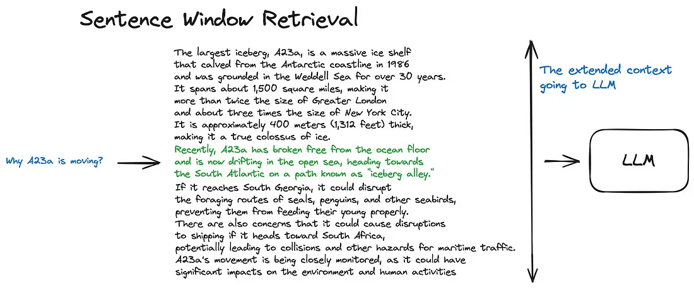

each sentence is embedded(provides great accuracy)

extend the context window by **k sentences before and after** the retrieved sentence

##### Auto-merging Retriever (Parent Document Retriever)

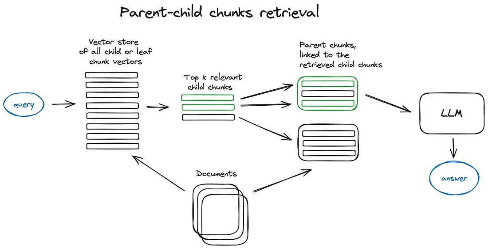

documents are split into **smaller child chunks** referring to **larger parent chunks**

if more than n chunks in top k retrieved chunks are linked to the same parent node, replace the context fed to the LLM by this parent node

##### Fusion Retrieval or Hybrid Search

take into account both semantic similarity and keyword matching

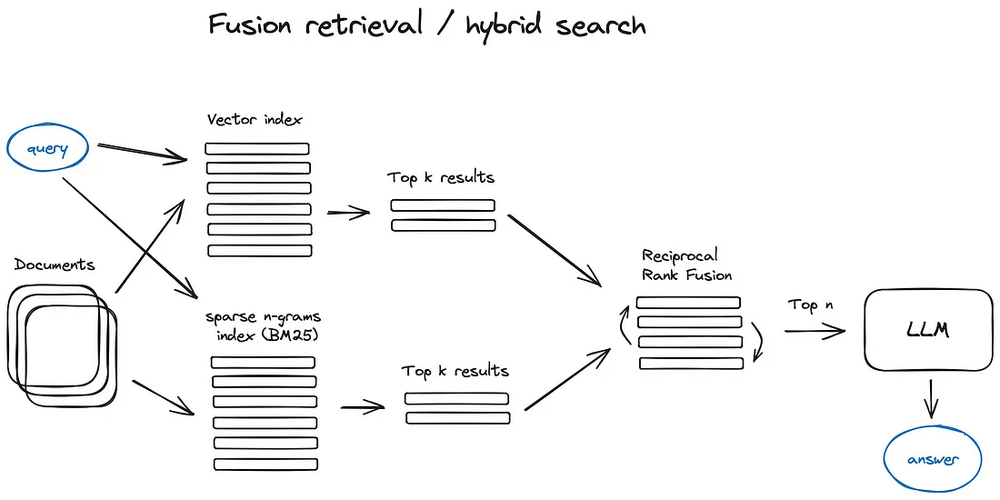

take the best from
1. keyword-based old school search (词频 & 倒排索引)
   1. TF-IDF (`Term Frequency` - `Inverse Document Frequency`)
   2. BM25 (一种改进的基于概率模型的检索算法，结合词频、逆文档频率以及文档长度等)
2. modern semantic or vector search

[Reciprocal Rank Fusion algorithm](https://plg.uwaterloo.ca/~gvcormac/cormacksigir09-rrf.pdf)
1. properly combine the retrieved results with different similarity scores
2. re-ranking the retrieved results

### 03 - Reranking & filtering

final step before feeding our retrieved context to LLM

refine retrieval results through **filtering**, **re-ranking**, **transformation**

### 04 - Query transformations

modify user input in order to improve retrieval quality

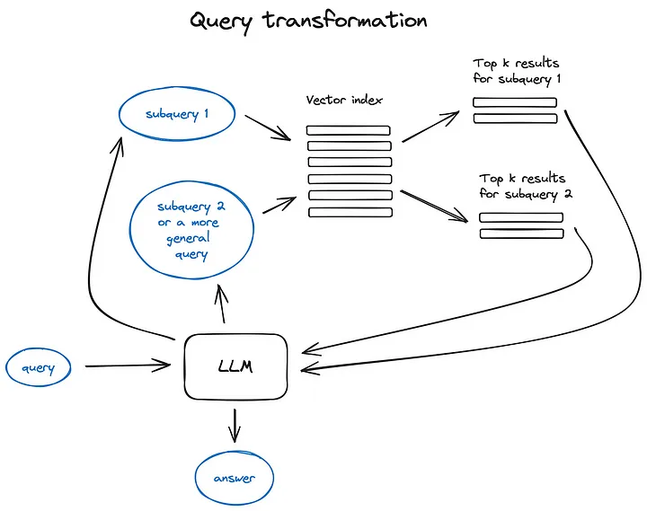

LLM decompose complex query into several sub queries
1. Step-back prompting - uses LLM to **generate a more general query**(obtain a more general or high-level context)
2. Query Re-writing - uses LLM to **reformulate initial query**

### 05 - Reference citations

back reference sources
1. Insert referencing task into prompt
2. Match the parts of generated response to the original text chunks
   1. Fuzzy Citation Query

### 06 - Chat Engine

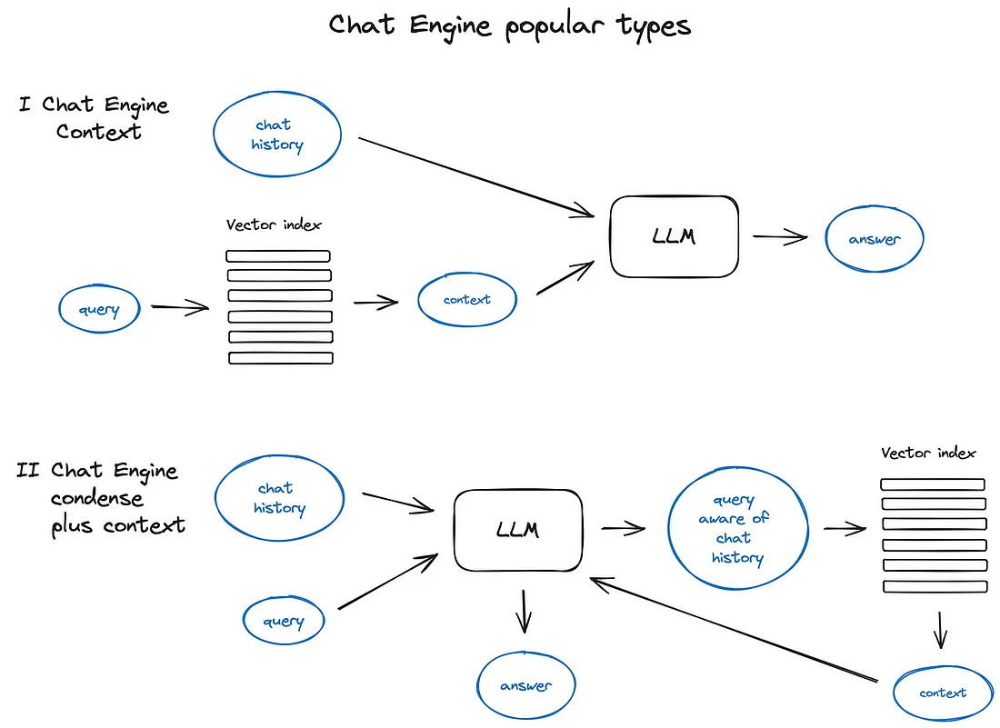

chat logic - taking into account the dialogue context

follow up **questions, anaphora(照应，eg:代词), or arbitrary user commands relating to the previous dialogue context**

solved by **query compression technique** - taking chat context into account along with the user query
1. ContextChatEngine
   1. retrieve context relevant to user’s query
   2. send **retrieved context** to LLM along with **chat history** from the memory buffer
2. CondensePlusContextMode
   1. in each interaction the chat history and last message are condensed into a new query
   2.  this query goes to the index

### 07 - Query Routing

Query routing is the step of **LLM-powered decision making** upon what to do next given the user query
1. summarize
2. perform search against some data index
3. try a number of different routes
4. synthesize their output in a single answer

Query routers are also used to select where to send user query
1. classic vector store
2. hierarchy of indices
3. graph DB
4. relational DB

Defining the query router includes **setting up the choices LLM can make**

selection of a routing option is performed with an LLM call

### 08 - Agents in RAG

provide an LLM, capable of reasoning, with a set of tools and a task to be completed

tools include functions like
1. code function
2. chat history
3. knowledge storage
4. document uploading interface
5. function calling API(external API) - capabilities to convert natural language into API calls to external tools or database queries
6. other agents

LLM chaining idea

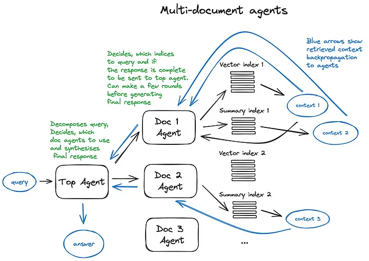
1. Each **document agent** has two tools — a vector store index and a summary index
2. For the **top agent**, all document agents are tools

a lot of routing decisions made by each involved agent

**Drawback**
1. slow due to multiple back and forth iterations with the LLMs inside our agents
2. **LLM call** is always the longest operation in a RAG pipeline
3. **search** is optimized for speed by design

### 09 - Response synthesizer

the final step of RAG pipeline

generate an answer based on all the context retrieved

more sophisticated options involving multiple(多次) LLM calls to refine retrieved context and generate a better answer

main approaches
1. iteratively refine the answer
2. summarize the retrieved context
3. generate multiple answers (based on different context chunks) and summarize

### 10 - Encoder and LLM fine-tuning

2 DL models
1. Encoder - responsible for **embeddings quality** and thus **context retrieval quality**
2. LLM - responsible for the best usage of the provided context to answer user query

LLM is a good few shot learner

FineTuning
1. Encoder fine-tuning
2. Ranker fine-tuning
3. LLM fine-tuning
   1. OpenAI started providing LLM fine-tuning API
   2. LlamaIndex has a tutorial on fine-tuning GPT-3.5-turbo in RAG setting to distill蒸馏 some of the GPT-4 knowledge

### 11 - Evaluation

frameworks
1. answer relevance
2. answer groundedness - 根据
3. faithfulness - 真实性
4. retrieved context relevance

### 12 - Conclusion

other things to consider
1. web search
2. agent architectures
3. LLMs Long-term memory
4. **speed**

---

# 12 RAG Pain Points and Proposed Solutions-Solving the core challenges of Retrieval-Augmented Generation

[12 RAG Pain Points and Proposed Solutions](https://towardsdatascience.com/12-rag-pain-points-and-proposed-solutions-43709939a28c)

[12 个 RAG 痛点和建议的解决方案 (中文翻译)](https://zhuanlan.zhihu.com/p/681351068)

Pain Point
1. **Missing Content (内容缺失)**
   1. provides a **plausible but incorrect answer** when **the actual answer is not in the knowledge base**, rather than stating it doesn’t know
   2. users receive misleading information, leading to frustration
   3. **SOLUTION**
      1. **Clean your data** - Garbage in, garbage out, such as containing conflicting information. Clean data is the prerequisite for any RAG pipeline
      2. **Better prompting** - By instructing the system with prompts : "Tell me you don’t know if you are not sure of the answer", encourage the model to acknowledge its limitations and communicate uncertainty
2. **Missed the Top Ranked Documents (错过排名靠前的文档)**
   1. essential documents may not appear in the top results returned by the system’s retrieval component
   2. correct answer is overlooked, causing the system to fail to deliver accurate responses
   3. question is in the document but did not rank highly enough to be returned to the user
   4. **SOLUTION**
      1. **Hyperparameter tuning** for **chunk_size**(分块大小) and **similarity_top_k**(相似度最高的K个) - manage the efficiency and effectiveness of the data retrieval process, impact the **trade-off** between **computational efficiency** and the **quality of retrieved information**
      2. **Reranking retrieval results** - evaluate and enhance retriever performance using various **embeddings and rerankers** & finetune **a custom reranker**
3. **Not in Context - Consolidation Strategy Limitations (不在上下文中-整合策略的局限性)**
   1. Documents with the answer were retrieved from the database but **did not make it into the context for generating an answer**, a consolidation process takes place to retrieve the answer
   2. **SOLUTION**
      1. Tweak retrieval strategies
      2. Finetune embeddings
4. **Not Extracted (未提取)**
   1. system struggles to extract the correct answer from the provided context, especially when overloaded with information
   2. Key details are missed, compromising the quality of responses
   3. occurs when there is too much noise or contradicting information in the context
   4. **SOLUTION**
      1. Clean your data
      2. Prompt Compression
      3. LongContextReorder - the best performance typically arises when crucial data is positioned at the start or conclusion of the input context
5. **Wrong Format (格式错误)**
   1. an instruction to extract information in a specific format(table & list) is overlooked
   2. **SOLUTION**
      1. Better prompting - Clarify the instructions、Simplify the request and use keywords、Give examples、Iterative prompting and asking follow-up questions
      2. Output parsing - to provide “parsing” for LLM outputs、provide formatting instructions
      3. Pydantic programs - serves as a versatile framework that converts an input string into a structured Pydantic object
      4. OpenAI JSON mode - enable JSON mode for the response
6. **Incorrect Specificity (特征不明显)**
   1. responses may lack the necessary detail or specificity, often requiring follow-up queries for clarification
   2. answers may be too vague or general, failing to meet the user’s needs
   3. **SOLUTION**
      1. Advanced retrieval strategies
         1. small-to-big retrieval - 先从较小、较精确的数据集开始搜索，如果在这些数据集中找不到足够的信息，就逐渐扩展到更大的数据集
         2. sentence window retrieval - 基于文本窗口的检索策略，特别适用于需要从大量文本中提取具体句子或短文本片段的场景，检索系统会根据查询的上下文或关键词，确定相关句子周围的“窗口”范围，并从这些窗口中提取信息
         3. recursive retrieval - 迭代的检索方法，它在初次检索后使用检索到的信息来精细化和改进后续的搜索查询
7. **Incomplete (不完整)**
   1. partial responses aren’t wrong; however, don’t provide all the details, despite the information being present and accessible within the context
   2. **SOLUTION**
      1. Query transformations - add a query understanding layer before actually querying the vector store
8. **Data Ingestion Scalability (数据摄取可扩展性)**
   1. the system struggles to efficiently manage and process large volumes of data
   2. lead to performance bottlenecks and potential system failure
   3. cause prolonged ingestion time, system overload, data quality issues, and limited availability
   4. **SOLUTION**
      1. Parallelizing ingestion pipeline - ingestion pipeline parallel processing
9. **Structured Data QA (结构化数据 QA)**
   1. accurately interpreting user queries to retrieve relevant structured data
   2. especially with complex or ambiguous queries, inflexible text-to-SQL
   3. **SOLUTION** of LlamaIndex
      1. Chain-of-table Pack
      2. Mix-Self-Consistency Pack
10. **Data Extraction from Complex PDFs (复杂 PDF 中的数据提取)**
    1. extract data from complex PDF documents(embedded tables)
    2. **SOLUTION**
       1. Embedded table retrieval - use [Unstructured.io](Unstructured.io) to parse out the embedded tables from an HTML document(use **pdf2htmlEX** to convert the PDF to HTML), build a node graph, use recursive retrieval to index/retrieve tables based on the user question
11. **Fallback Model(s) (后备模型)**
    1. rate limit errors with OpenAI’s models
    2. a fallback model(s) as the backup in case your **primary model malfunctions**
    3. **SOLUTION**
       1. Neutrino router - a collection of LLMs to which you can route queries
       2. OpenRouter - a unified API to access any LLM, finds the lowest price for any model and offers fallbacks in case the primary host is down
12. **LLM Security (LLM安全性)**
    1. combat **prompt injection**, handle **insecure outputs**, prevent **sensitive information disclosure**
    2. **SOLUTION**
       1. Guard - classify content for LLMs by examining both the inputs (through **prompt classification**) and the outputs (via **response classification**), produce text outcomes that determine whether a specific prompt or response is considered safe or unsafe

