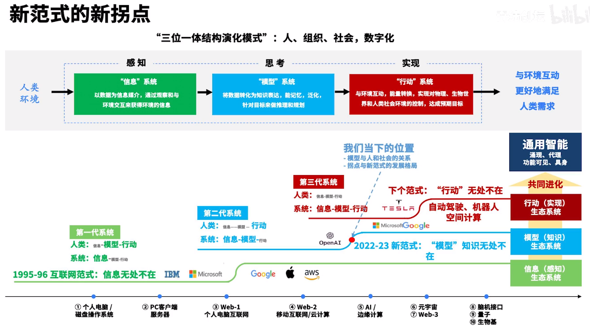
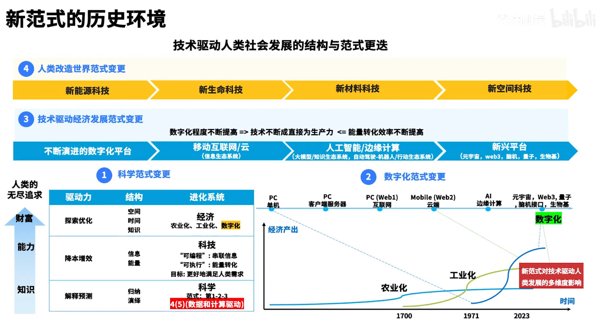
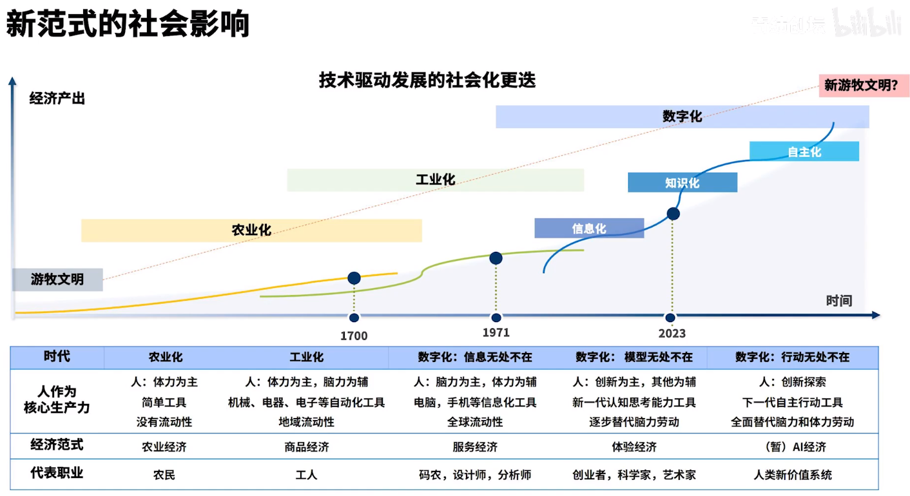
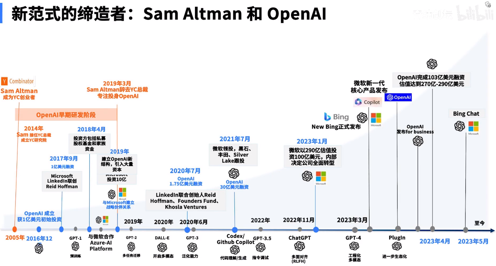
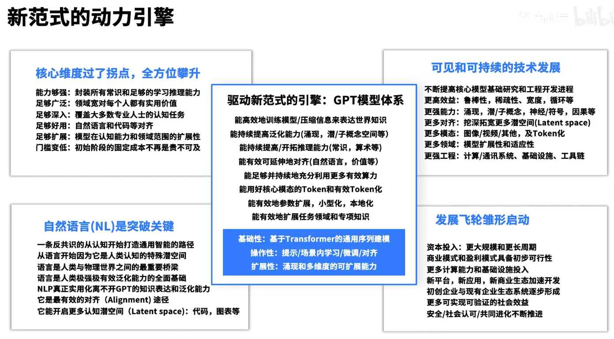
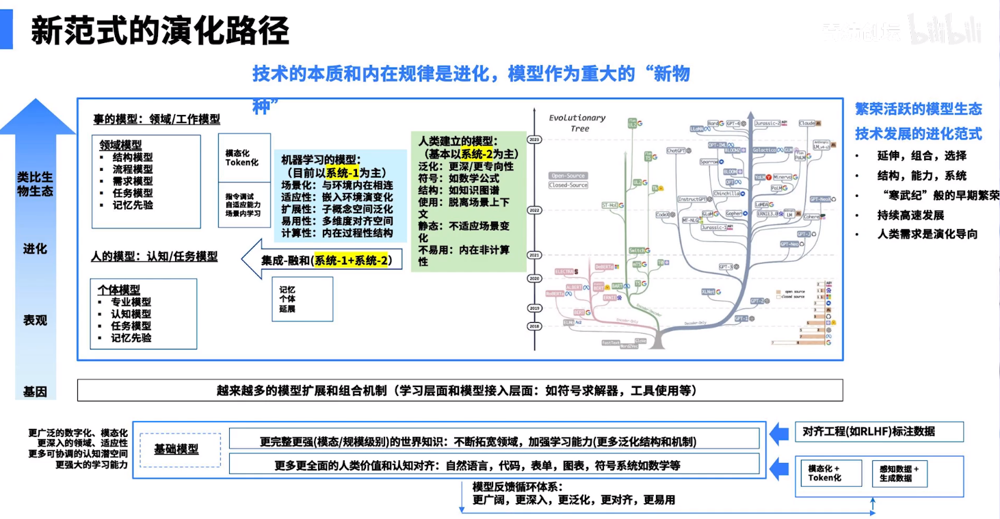
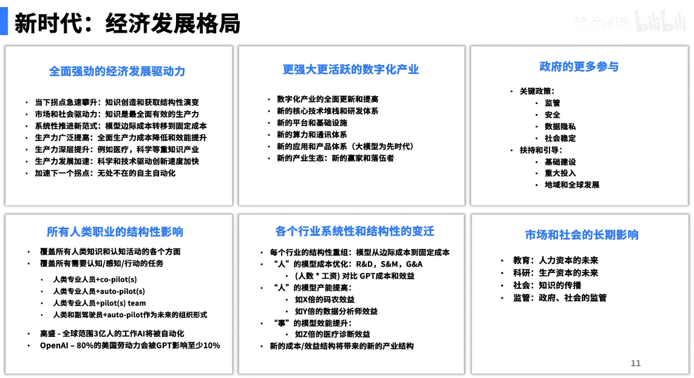

# 陆奇最新演讲｜大模型带来的新范式

[陆奇最新演讲｜大模型带来的新范式](https://www.bilibili.com/video/BV1mM4y147qw/)

## 新范式

### 新拐点

数字化产业，三位一体
1. 信息子系统
2. 模型子系统，将信息表达有效(推理规划)
3. 行动子系统，与环境交互

成本的结构变化，新商业模式

1995年，信息系统拐点(绿色)，信息获取的成本从边际走向固定

当前，模型系统新拐点(蓝色)，模型的成本从边际走向固定。攀升速度将更快，模型无处不在

未来，行动系统拐点

### 历史环境

科技公司特点，用信息转换资源

第一范式 : 经验主义
第二范式 : 系统性的实践
第三范式 : 大理论模拟
第四范式 : 数据驱动
第五范式 : 数据&计算驱动

数字化是人的延伸，改造世界，用信息转换能源，因此促进新能源科技

能源通过生物和材料产生，同时需要空间

### 社会影响

社会重大进展由技术驱动

除了特殊的认知和能力，由于模型的成本降低，从服务型经济转为体验型经济

三个职业
1. 创业者
2. 科学家，新一代科研
3. 艺术家，由独到的见解

最终因为不需要脑力和体力劳动，人需要探索新的价值体系

### 缔造者

面对新范式，用不同方法去思考和实践

反共识

思考提醒
1. 坚信未来、坚持
2. 两个技术点，模型足够深，强化学习&无监督学习
3. 科研、工程、平台、产品
4. 融到大量资本

价值观对齐

**预训练、Fine-Tuning、泛化能力、Prompt-Engineering、多模态、Plugin**

### 动力引擎(核心技术)

对齐

Token化(在自然语言处理中，"token" 是指文本中的最小单位或基本元素。在大型语言模型中，例如 GPT-3，文本被分解成一系列的 token 进行处理。在英语中，一个 token 可以是一个单词，例如 "cat" 或者 "running"；也可以是一个标点符号，例如 "," 或者 "."；或者是一个特殊的字符，例如 "[CLS]" 或者 "[SEP]"。每个 token 都被赋予一个唯一的标识符，以便进行处理和表示。)

零样本泛化能力

大模型仍需要继续往前走

多模态

模型稀疏化

已经大量资本投入

### 演化路径

技术是不断进化的

结构、功能、组合、选择

系统-1 : 直觉，快速思考 (开车) 过程性的
系统-2 : 人建的模型，专业性强 (公式 知识图谱)

系统-1、系统-2 组合模型

大模型及其延伸的子模型

## 新时代

生产力随着成本的下降而提升，同时模型更好，同时研发速度加快

## 新机会

## 奇绩创坛

## 问答

