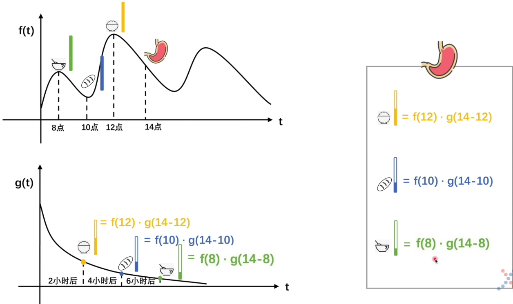
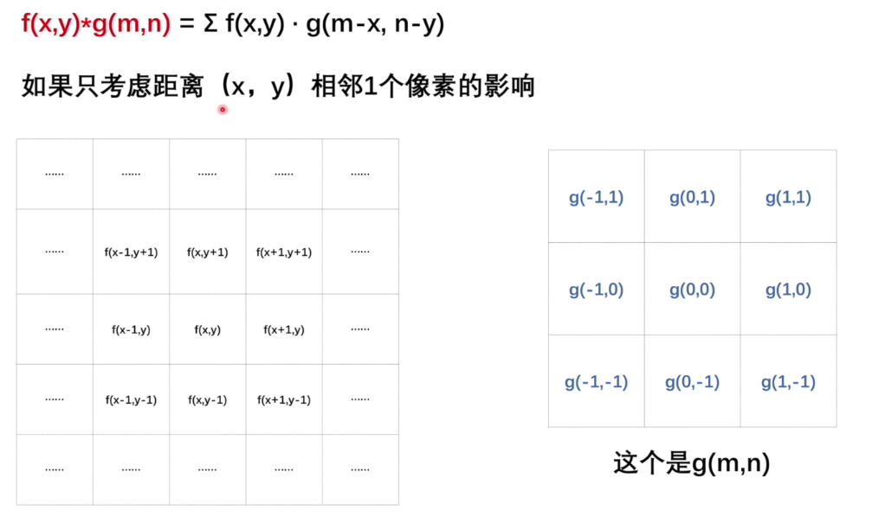
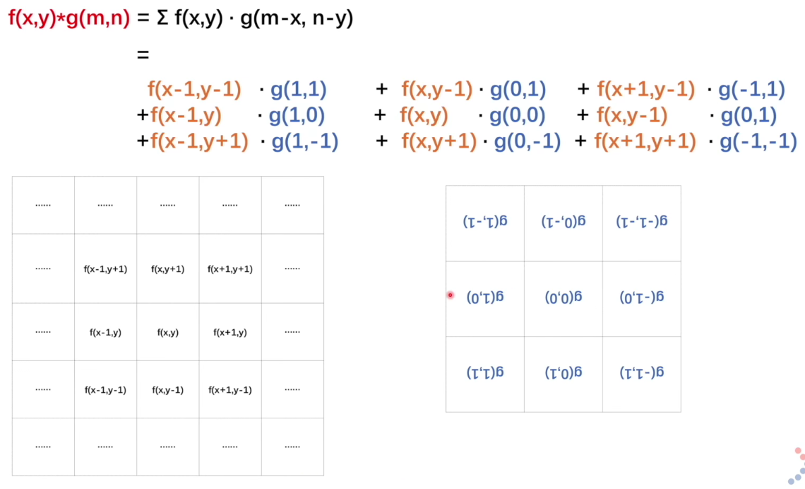
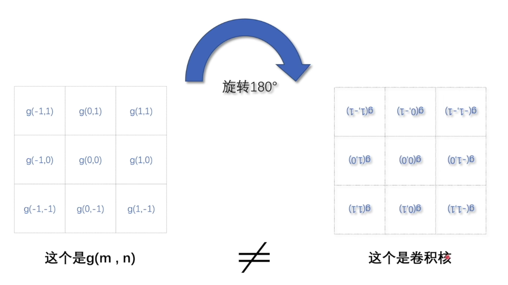
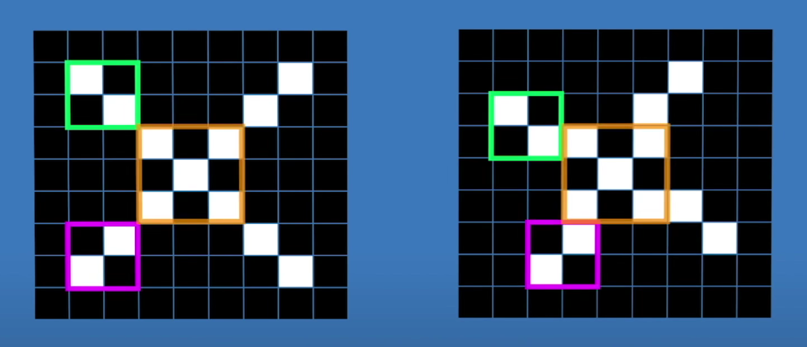

# 深度学习知识点

## 卷积

卷积其实反应的是每一点对当前研究对象的影响（权重）。

g函数反应了影响力的变化。

卷积核其实也可以理解为卷积，只不过已经将反转操作（在二维里面其实是绕中心旋转180°）内化到卷积核中了。所以我们只需要将卷积核盖在矩阵上，然后对应位置相乘即可。

卷积核提取局部特征（过滤器相当于对周围的试探）

## 感知机

## 神经网络

## 最小二乘法

## 极大似然估计

## 交叉熵 Cross Entropy

