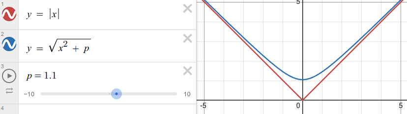

# Loss Function

## Table of Contents

- [Loss Function](#loss-function)
  - [Table of Contents](#table-of-contents)
- [Charbonnier Loss](#charbonnier-loss)
- [PSNR (Peak Signal-to-Noise Ratio) 峰值信噪比](#psnr-peak-signal-to-noise-ratio-峰值信噪比)
- [SSIM (Structural Similarity Index Measure) 结构相似性指数](#ssim-structural-similarity-index-measure-结构相似性指数)
- [VIF (Visual Information Fidelity)](#vif-visual-information-fidelity)
- [UQI](#uqi)
- [FSIM (Feature Similarity Index) 特征相似性指数](#fsim-feature-similarity-index-特征相似性指数)
- [BCE (Binary Cross Entropy)](#bce-binary-cross-entropy)
- [Dice Loss](#dice-loss)

---

# Charbonnier Loss

用 Charbonnier Loss来近似 L1 Loss

$Loss_{charbonnier}(x, y) = \sqrt{(x - y)^2 + \epsilon^2}$
1. $x$ : 预测值
2. $y$ : 真实值
3. $\epsilon$ : 很小的常数，保证函数的连续可微性，$10^{-6} \sim 10^{-3}$

结合 L1 Loss 的 鲁棒性 & L2 Loss 的 平滑性

零点处可导，不像 L1 Loss

收敛时，误差 $x$ 非常小时，函数行为近似于 L2 Loss 抛物线底，随着误差减小而逐渐趋向于 0

---

# PSNR (Peak Signal-to-Noise Ratio) 峰值信噪比

衡量图像质量，通常用来评估图像在经 过压缩、去噪、超分辨率 等处理后，与原始图像相比失真多少

将图像质量问题转化为信号与噪声之比
1. 信号 : 原始图像的像素信息
2. 噪声 : 处理后图像与原始图像之间的差异或失真

信噪比(SNR)
1. 信号功率 & 噪声功率 比值，通常以 分贝 dB 为单位
2. $$\text{SNR} = 10 · \log_{10}(\frac{\text{信号功率}}{\text{噪声功率}})$$

PSNR 值越高，说明图像的失真越小，质量越好

计算方式
1. 计算 MSE
2. 计算 PSNR
   1. $$\text{PSNR} = 10 · \log_{10}(\frac{\text{MAX}^2}{\text{MSE}})$$
   2. $\text{MAX}$ : 图像中 **可能的** 最大像素值 (8bit -> 255)

# SSIM (Structural Similarity Index Measure) 结构相似性指数

基于人类视觉系统，衡量 2幅图像在 亮度、对比度、结构 上相似度的 指标

将图像看作是由 亮度、对比度、结构 组成的集合

通过比较 3方面的相似性 来评估整体相似度
1. 亮度 : $$l(x,y) = \frac{2 \mu_x \mu_y + C_1}{\mu_x^2 + \mu_y^2 + C_1}$$
2. 对比度 : $$c(x,y) = \frac{2 \sigma_x \sigma_y + C_2}{\sigma_x^2 + \sigma_y^2 + C_2}$$
3. 结构 : $$s(x,y) = \frac{\sigma_{xy} + C_3}{\sigma_x \sigma_y + C_3}$$
   1. $C_3$ 通常被设置为 $\frac{C_2}{2}$

参数
1. $\mu_x, \mu_y$ : 局部窗口内的平均值，表示图像的亮度水平
2. $\sigma_x, \sigma_y$ : 局部窗口内的方差，表示图像的对比度
3. $C_1 = (K_1 L)^2$，通常 $K_1 = 0.01$
4. $C_2 = (K_2 L)^2$，通常 $K_2 = 0.03$
5. L 是像素值的动态范围(如 8-bit 图像 L=255)

$$\text{SSIM}(x,y) = [l(x,y)]^\alpha · [c(x,y)]^\beta · [s(x,y)]^\gamma$$
1. 通常 $\alpha = \beta = \gamma = 1$，即 $\text{SSIM}(x,y) = l(x,y) · c(x,y) · s(x,y)$

优劣
1. 优点
   1. 符合人类视觉感知
   2. 结构敏感
   3. 局部对比(滑动窗口方式)
2. 劣势
   1. 计算复杂度高
   2. 窗口大小选择 影响评估结果
   3. 对 旋转、缩放 敏感

# VIF (Visual Information Fidelity)

# UQI

# FSIM (Feature Similarity Index) 特征相似性指数

---

# BCE (Binary Cross Entropy)

逐像素 (Pixel-wise)

无法应对类别不平衡 (Class Imbalance)

---

# Dice Loss

区域级 (Region-level) / 集合重叠度

无视类别不平衡

公式核心
1. $$1 - \frac{2 \times (A \cap B)}{A + B}$$
2. A 是 pred，B 是 GroundTruth

