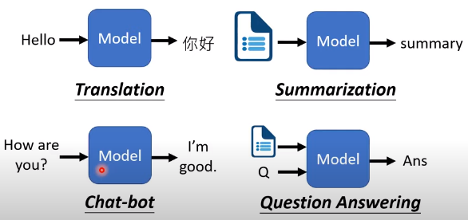

# [DLHLP 2020] Deep Learning for Human Language Processing - 李宏毅

[[DLHLP 2020] Deep Learning for Human Language Processing](https://www.youtube.com/playlist?list=PLJV_el3uVTsO07RpBYFsXg-bN5Lu0nhdG)

[toc]

# 01 Course Overview

NLP & HLP 区别
1. NLP - $\frac{Text}{Speech} = \frac{5}{5}$
2. HLP - $\frac{Text}{Speech} = \frac{9}{1}$

Human Language is Complex
1. audio
   1. 1 second has 16K sample points
   2. each point has 256 possible values
2. text
   1. length of sentence

Model = Deep Network

1. speech recognition
   
2. Text-to-Speech Synthesis(合成)
3. Speech Seperation
   1. 解决 cocktail party effect
4. Voice Converter
   1. 变声器 不需要说相同语言、相同句话 (one-shot learning)
5. Speaker Recognition
   1. 腾讯会议
6. Keyword Spotting
   1. 语言助手唤醒，需要模型够小（省电）
7. 输入是文字时
   1. 
8. 输出是文字时
   1. auto  regressive
9. 输入输出同时是文字
   

**meta learning** = learn to learn

