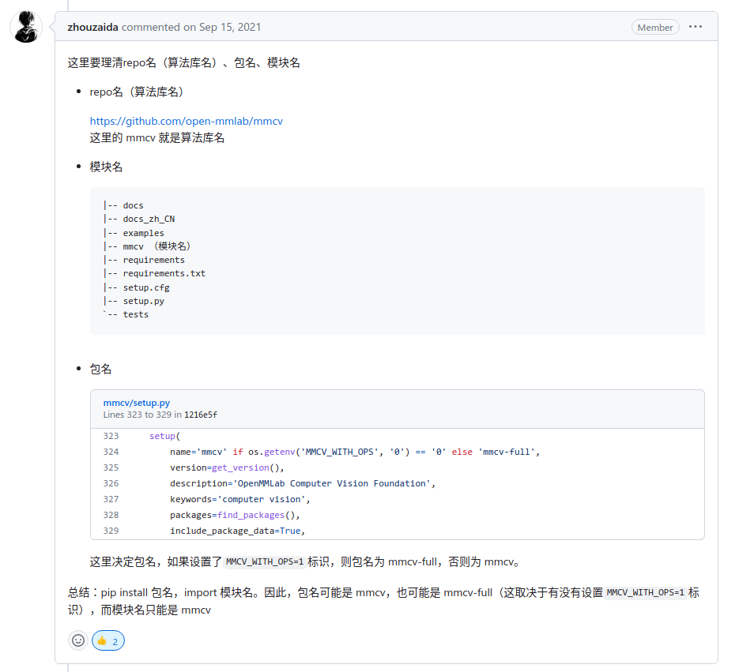
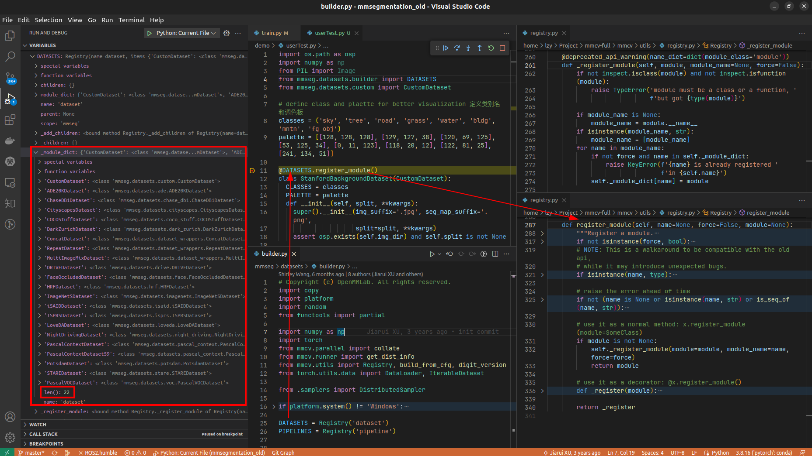
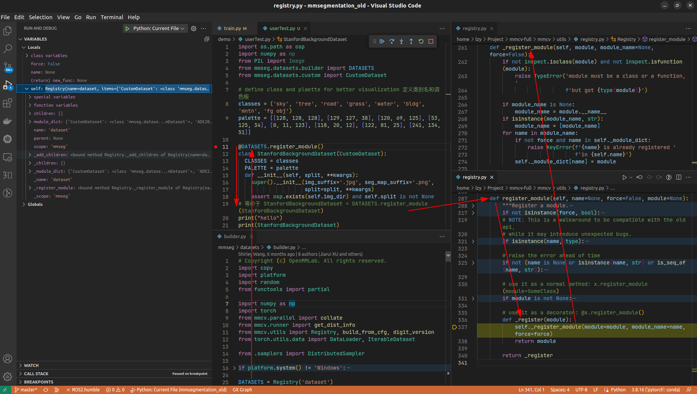
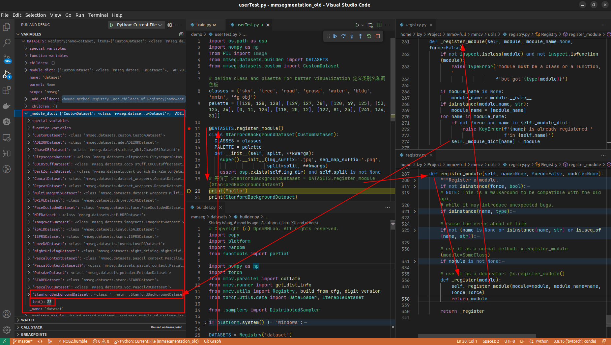

# mmcv

[MMCV github 官網](https://github.com/open-mmlab/mmcv)

[MMCV 教程](https://mmcv.readthedocs.io/)

[手撸OpenMMlab系列教程(mmcv，mmsegmentation)](https://www.bilibili.com/video/BV1ub4y187DP)

# 深入理解 MMCV-1.7.1

[MMCV 核心组件分析（一）：整体概述 --- 官方知乎博客](https://zhuanlan.zhihu.com/p/336081587)

## mmcv & mmcv-full




## Config 配置

[Config 配置](https://mmcv.readthedocs.io/zh_CN/v1.7.1/understand_mmcv/config.html)

[MMCV 核心组件分析(四): Config --- 官方知乎博客](https://zhuanlan.zhihu.com/p/346203167)

我们遵循以下格式来命名配置文件，建议社区贡献者遵循相同的风格。

```
{algorithm name}_{model component names [component1]_[component2]_[...]}_{training settings}_{training dataset information}_{testing dataset information}

eg:

segformer_mit-b0_8x1_1024x1024_160k_cityscapes.py
deeplabv3_r18-d8_512x1024_80k_cityscapes.py
pspnet_r18-d8_512x1024_80k_cityscapes.py


```
配置文件的文件名分为五个部分，组成文件名每一个部分和组件之间都用_连接，每个部分或组件中的每个单词都要用-连接。
1. {algorithm name}: 算法的名称，如 deeplabv3, pspnet 等。
2. {model component names}: 算法中使用的组件名称，如主干(backbone)、解码头(head)等。例如，r50-d8 表示使用ResNet50主干网络，并使用主干网络的8倍下采样输出作为下一级的输入。
3. {training settings}: 训练时的参数设置，如 batch size、数据增强(augmentation)、损失函数(loss)、学习率调度器(learning rate scheduler)和训练轮数(epochs/iterations)。例如: 4xb4-ce-linearlr-40K 意味着使用4个gpu，每个gpu4个图像，使用交叉熵损失函数(CrossEntropy)，线性学习率调度程序，训练40K iterations。 一些缩写:
   1. {gpu x batch_per_gpu}: GPU数量和每个GPU的样本数。bN 表示每个GPU的batch size为N，如 8xb2 为8个gpu x 每个gpu2张图像的缩写。如果未提及，则默认使用 4xb4 。
   2. {schedule}: 训练计划，选项有20k，40k等。20k 和 40k 分别表示20000次迭代(iterations)和40000次迭代(iterations)。
4. {training dataset information}: 训练数据集名称，如 cityscapes ， ade20k 等，以及输入分辨率。例如: cityscapes-768x768  表示使用 cityscapes 数据集进行训练，输入分辨率为768x768 。
5. {testing dataset information} (可选): 测试数据集名称。当您的模型在一个数据集上训练但在另一个数据集上测试时，请将测试数据集名称添加到此处。如果没有这一部分，则意味着模型是在同一个数据集上进行训练和测试的。


## Registry 注册器

[Registry 注册器](https://mmcv.readthedocs.io/zh_CN/v1.7.1/understand_mmcv/registry.html)

[MMCV 核心组件分析(五): Registry --- 官方知乎博客](https://zhuanlan.zhihu.com/p/355271993)

MMCV 使用 注册器 来管理具有相似功能的不同模块

在MMCV中，注册器可以看作类或函数到字符串的映射。 一个注册器中的类或函数通常有相似的接口，但是可以实现不同的算法或支持不同的数据集。 借助注册器，用户可以通过使用相应的字符串查找类或函数，并根据他们的需要实例化对应模块或调用函数获取结果。

**mmsegmentation dataset 注册流程**



原先为22个数据集



使用修饰器的特性



注册后，23个数据集

重复导入会报错

```
KeyError: 'StanfordBackgroundDataset is already registered in dataset'
```
