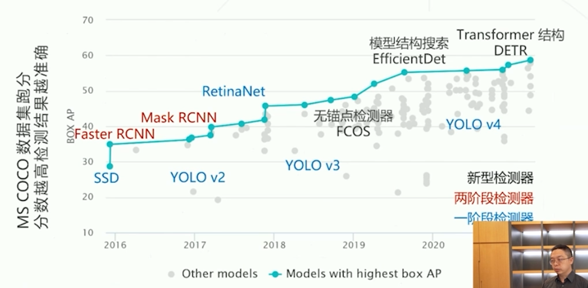
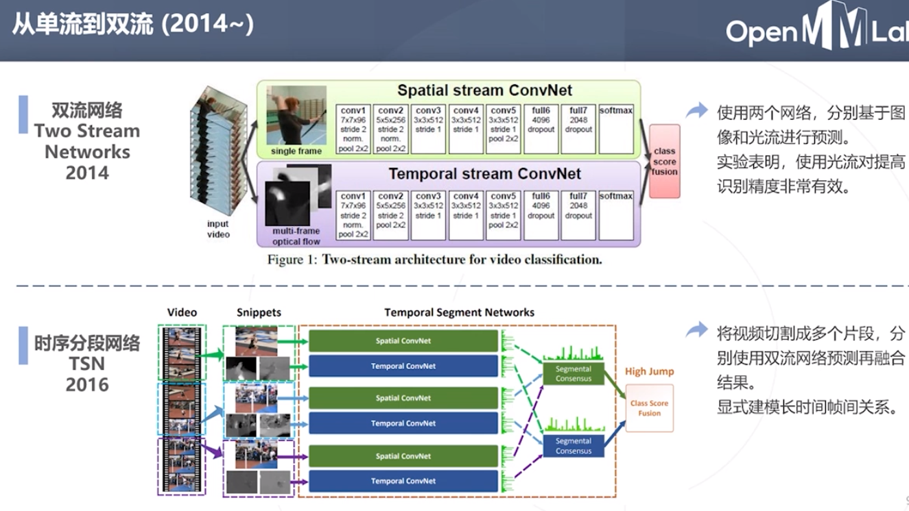
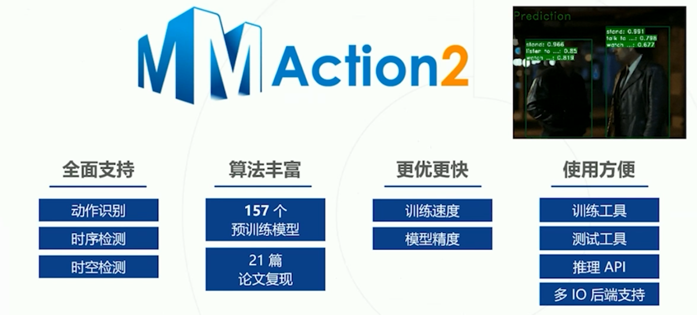

# OpenMMLab

# 【OpenMMLab 公开课】计算机视觉与 OpenMMLab 概述

[【OpenMMLab 公开课】计算机视觉与 OpenMMLab 概述](https://www.bilibili.com/video/BV1R341117FJ/)

## 1. 绪论与 OpenMMLab 简介

所有项目基于一致架构开发，算法+预训练模型

历程
1. 201808  MMCV+MMDetection
2. 201906  MMAction(人体动作识别)
3. 201908  MMSR(Super-Resolution超分辨率)+MMSkeleton
4. 201910  MMFashion(时尚服饰领域)
5. 202003  OpenPCDet(激光雷达点云3D物体检测)
6. 202005  OpenUnReID(目标重识别的无监督学习 (USL) 和无监督域适应(UDA))
7. 202006  OpenSelfSup(自监督学习框架)
8. 202007  MMSegmentation+MMDetection3d+MMClassification+MMAction2(二代人体动作识别)+MMEditing(图像和视频编辑开源工具箱)+MMPose(姿态估计)
9. 202101  MMTracking(一体化视频目标感知工具箱，同时支持视频目标检测，多目标跟踪，单目标跟踪和视频实例分割等多种任务和算法)

## 2. 图像分类与MMClassification

从数据中学习 : 收集数据->定义模型->训练->预测

传统方法 : 图像->特征算法->图像特征->学习->分类

深度学习 : 图像->学习->特征->学习->分类 (端到端)

提供便捷的API

## 3. 目标检测与MMDetection

类别+位置

**两阶段算法**

提升效率

RCNN

**一阶段算法**

**MMDetection**

**模块化思想**

## 4. 图像分割与MMSegmentation

应用
1. 无人驾驶
2. 遥感
3. 医疗影像

通过获取全局信息来更加准确的判断，消去歧义

## 5. 视频分析与MMAction2

视频检索
1. 识别视频片段中出现的动作(行为识别)
2. 视频的分类问题

时序动作检测 when+what 在长视频中定位特定动作出现的时间段，并对动作分类

时空动作检测 where+when+what 识别并定位视频中出现的人和动作，视频的检测问题

视频
1. 时间+空间
2. 外观+运动

光流包含信息多，但是数据量大

时序分段网络可以避免重复的计算

要理解问题本身的挑战

需要降低计算开销

## 6. 图像编辑与MMEditing

GAN

