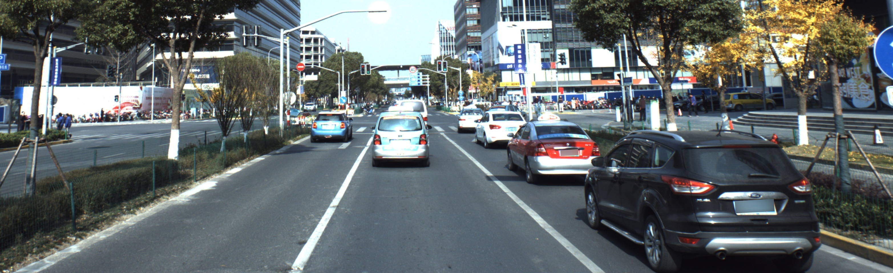
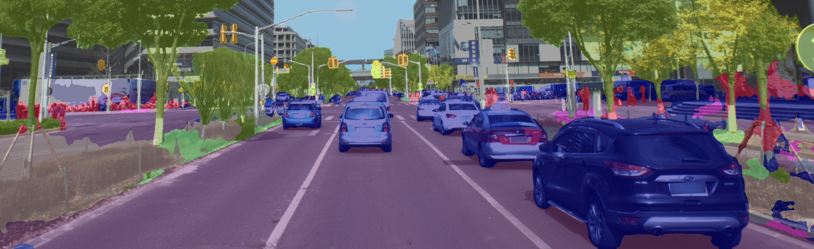

# mmsegmentation

[OpenMMLab github官网](https://github.com/open-mmlab)

[mmsegmentation --- github官网](https://github.com/open-mmlab/mmsegmentation)

[手撸OpenMMlab系列教程(mmcv，mmsegmentation) --- B站视频](https://www.bilibili.com/video/BV1ub4y187DP/)

## install

### 源码安装

先安装mmcv

[BUILD MMCV FROM SOURCE 官方文档](https://mmcv.readthedocs.io/en/latest/get_started/build.html)

```bash
git clone https://github.com/open-mmlab/mmcv.git
cd mmcv

pip install -r requirements/optional.txt
# 不是直接 pip install -r requirements.txt

MMCV_WITH_OPS=1 pip install -e . -v

# 会出现结果 : Successfully installed addict-2.4.0 mmcv-full-1.7.1 yapf-0.32.0

python3 .dev_scripts/check_installation.py
# 结果如下
```

```
/home/lzy/Project/mmcv/mmcv/__init__.py:20: UserWarning: On January 1, 2023, MMCV will release v2.0.0, in which it will remove components related to the training process and add a data transformation module. In addition, it will rename the package names mmcv to mmcv-lite and mmcv-full to mmcv. See https://github.com/open-mmlab/mmcv/blob/master/docs/en/compatibility.md for more details.
  warnings.warn(
Start checking the installation of mmcv-full ...
CPU ops were compiled successfully.
CUDA ops were compiled successfully.
mmcv-full has been installed successfully.

Environment information:
------------------------------------------------------------
sys.platform: linux
Python: 3.8.16 (default, Mar  2 2023, 03:21:46) [GCC 11.2.0]
CUDA available: True
GPU 0: NVIDIA GeForce RTX 3050 Laptop GPU
CUDA_HOME: /usr/local/cuda-11.7
NVCC: Cuda compilation tools, release 11.7, V11.7.99
GCC: gcc (Ubuntu 11.3.0-1ubuntu1~22.04) 11.3.0
PyTorch: 2.0.0+cu117
PyTorch compiling details: PyTorch built with:
  - GCC 9.3
  - C++ Version: 201703
  - Intel(R) oneAPI Math Kernel Library Version 2022.2-Product Build 20220804 for Intel(R) 64 architecture applications
  - Intel(R) MKL-DNN v2.7.3 (Git Hash 6dbeffbae1f23cbbeae17adb7b5b13f1f37c080e)
  - OpenMP 201511 (a.k.a. OpenMP 4.5)
  - LAPACK is enabled (usually provided by MKL)
  - NNPACK is enabled
  - CPU capability usage: AVX2
  - CUDA Runtime 11.7
  - NVCC architecture flags: -gencode;arch=compute_37,code=sm_37;-gencode;arch=compute_50,code=sm_50;-gencode;arch=compute_60,code=sm_60;-gencode;arch=compute_70,code=sm_70;-gencode;arch=compute_75,code=sm_75;-gencode;arch=compute_80,code=sm_80;-gencode;arch=compute_86,code=sm_86
  - CuDNN 8.5
  - Magma 2.6.1
  - Build settings: BLAS_INFO=mkl, BUILD_TYPE=Release, CUDA_VERSION=11.7, CUDNN_VERSION=8.5.0, CXX_COMPILER=/opt/rh/devtoolset-9/root/usr/bin/c++, CXX_FLAGS= -D_GLIBCXX_USE_CXX11_ABI=0 -fabi-version=11 -Wno-deprecated -fvisibility-inlines-hidden -DUSE_PTHREADPOOL -DNDEBUG -DUSE_KINETO -DLIBKINETO_NOROCTRACER -DUSE_FBGEMM -DUSE_QNNPACK -DUSE_PYTORCH_QNNPACK -DUSE_XNNPACK -DSYMBOLICATE_MOBILE_DEBUG_HANDLE -O2 -fPIC -Wall -Wextra -Werror=return-type -Werror=non-virtual-dtor -Werror=bool-operation -Wnarrowing -Wno-missing-field-initializers -Wno-type-limits -Wno-array-bounds -Wno-unknown-pragmas -Wunused-local-typedefs -Wno-unused-parameter -Wno-unused-function -Wno-unused-result -Wno-strict-overflow -Wno-strict-aliasing -Wno-error=deprecated-declarations -Wno-stringop-overflow -Wno-psabi -Wno-error=pedantic -Wno-error=redundant-decls -Wno-error=old-style-cast -fdiagnostics-color=always -faligned-new -Wno-unused-but-set-variable -Wno-maybe-uninitialized -fno-math-errno -fno-trapping-math -Werror=format -Werror=cast-function-type -Wno-stringop-overflow, LAPACK_INFO=mkl, PERF_WITH_AVX=1, PERF_WITH_AVX2=1, PERF_WITH_AVX512=1, TORCH_DISABLE_GPU_ASSERTS=ON, TORCH_VERSION=2.0.0, USE_CUDA=ON, USE_CUDNN=ON, USE_EXCEPTION_PTR=1, USE_GFLAGS=OFF, USE_GLOG=OFF, USE_MKL=ON, USE_MKLDNN=ON, USE_MPI=OFF, USE_NCCL=1, USE_NNPACK=ON, USE_OPENMP=ON, USE_ROCM=OFF, 

TorchVision: 0.15.1+cu117
OpenCV: 4.6.0
MMCV: 1.7.1
MMCV Compiler: GCC 11.3
MMCV CUDA Compiler: 11.7
------------------------------------------------------------
```

再源码安装mmsegmentation

```
git clone https://github.com/open-mmlab/mmsegmentation.git
cd mmsegmentation
pip install -v -e .
# "-v" means verbose, or more output
# "-e" means installing a project in editable mode,
# thus any local modifications made to the code will take effect without reinstallation.
```

### 简单安装

[安装指南链接](https://github.com/open-mmlab/mmsegmentation/blob/master/docs/en/get_started.md#installation)

MMSegmentation works on Linux, Windows and macOS. It requires Python 3.6+, CUDA 9.2+ and PyTorch 1.3+.

```bash
# download
pip install -U openmim
mim install mmcv-full
pip install mmsegmentationpip
```

```bash
# verity 会下载一个pth模型和一个py文件
mim download mmsegmentation --config pspnet_r50-d8_512x1024_40k_cityscapes --dest .

# 复制文档里的代码，自己找张图片试试看即可（记得python运行目录位置和图片位置）
# 我测试完就把他们删了
```

我是使用ApolloScape中的图片



结果如下



## 手撸OpenMMlab系列教程(mmcv，mmsegmentation)

### 运行代码

[眼球血管数据集](https://staffnet.kingston.ac.uk/~ku15565/CHASE_DB1/assets/CHASEDB1.zip)

转换数据集格式

```bash
# python3 tools/convert_datasets/chase_db1.py /path/to/CHASEDB1.zip

python3 tools/convert_datasets/chase_db1.py /mnt/sda1/Datasets/CHASEDB1.zip
```

```bash
python3 tools/train.py configs/unet/deeplabv3_unet_s5-d16_128x128_40k_chase_db1.py --work-dir userLogs/chaseDB_20230402_162030 --seed 0
```


