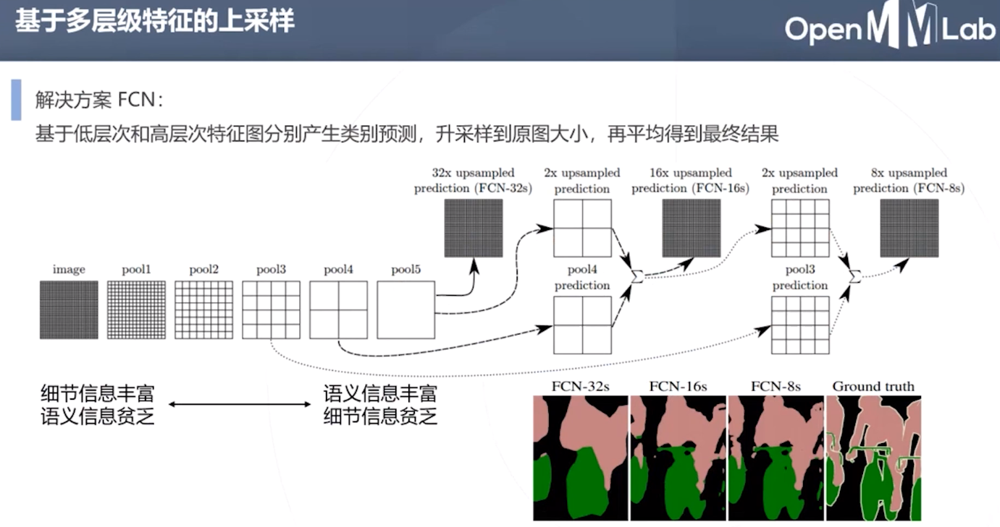

# mmsegmentation

[OpenMMLab github官网](https://github.com/open-mmlab)

[mmsegmentation --- github官网](https://github.com/open-mmlab/mmsegmentation)

## 常用优化器

在语义分割中，常用的优化器包括以下几种：
1. SGD（随机梯度下降）优化器：SGD优化器是深度学习中最常用的优化器之一，也适用于语义分割。通常情况下，需要设置一个合适的学习率和一些正则化项（如L2正则化）来控制模型的训练过程。
2. Adam（自适应矩估计）优化器：Adam优化器是一种自适应学习率优化器，具有快速收敛和较低的内存消耗等优点。在语义分割中，Adam优化器通常需要设置一个较小的学习率以避免过拟合。
3. AdamW（带权重衰减修正的Adam）优化器：AdamW优化器是Adam优化器的一种扩展版本，通过解决Adam优化器在权重衰减处理上可能存在的问题，提供了更好的性能和泛化能力。在语义分割中，AdamW优化器通常需要设置一个较小的学习率和适当的权重衰减系数。
4. RMSProp（均方根传递）优化器：RMSProp优化器是一种自适应学习率优化器，它使用了指数加权平均的方法来估计梯度的方差，并根据方差来调整学习率。在语义分割中，RMSProp优化器通常需要设置一个合适的学习率和较小的权重衰减系数。

需要注意的是，不同的优化器适用于不同的场景，选择合适的优化器需要根据具体问题和数据集进行评估。在实践中，可以通过尝试不同的优化器和超参数来确定最佳的优化器和超参数组合。

### SGD

SGD（随机梯度下降）优化器也有一些参数，其中包括以下两个参数：
1. momentum 参数：这是SGD优化器中的一个可选参数，用于指定动量（momentum）的大小。动量可以帮助SGD优化器在训练过程中更快地收敛，并且可以减少梯度更新的震荡。通常情况下，momentum的值在0.9左右能够提供良好的性能。如果设置为0，则不使用动量。
2. weight_decay 参数：这是SGD优化器中的另一个可选参数，用于指定L2正则化（weight decay）的强度。L2正则化可以帮助防止模型过度拟合训练数据。通常情况下，weight_decay的值设置为一个较小的正数，例如1e-4或1e-5。

例如，可以使用以下代码创建一个具有momentum和weight_decay参数的SGD优化器：
```python
import torch.optim as optim

optimizer = optim.SGD(model.parameters(), lr=0.01, momentum=0.9, weight_decay=1e-4)
```
在这个例子中，SGD优化器将使用学习率0.01、动量0.9和权重衰减系数1e-4来优化模型的参数。需要注意的是，momentum和weight_decay参数都是可选的，如果不需要使用它们，可以将它们的值设置为0或不指定它们。

### Adam

Adam优化器和AdamW优化器的构造函数中都包含了一些可选参数，其中包括betas和paramwise_cfg。
1. betas 参数：这是一个长度为2的元组，用于指定Adam优化器和AdamW优化器中用于计算梯度一阶矩估计和二阶矩估计的指数衰减率。默认情况下，它们的值为(0.9, 0.999)，这通常能够在大多数情况下提供良好的性能。如果需要调整优化器的性能，可以尝试调整betas参数的值。
2. paramwise_cfg 参数：这是一个字典，用于指定Adam优化器和AdamW优化器中每个参数组的超参数配置。通常情况下，每个参数组都需要具有相同的学习率和权重衰减系数。通过paramwise_cfg参数，可以为每个参数组设置不同的学习率和权重衰减系数。

例如，可以使用以下代码创建一个 AdamW 优化器，并将 betas 参数设置为(0.9, 0.999)，将学习率设置为 0.01，将权重衰减系数设置为 0.001，其中第一个参数组的学习率是默认值，第二个参数组的学习率是默认值的10倍，第三个参数组不使用权重衰减：

```python
import torch.optim as optim

optimizer = optim.AdamW([
    {'params': model.features.parameters()},
    {'params': model.classifier.parameters(), 'lr': 1e-2},
    {'params': model.fc.parameters(), 'weight_decay': 0, 'lr': 1e-3}
], lr=0.01, weight_decay=0.001, betas=(0.9, 0.999))
```
在这个例子中，paramwise_cfg 参数被省略了，因为每个参数组都使用了默认值。如果需要为每个参数组设置不同的学习率和权重衰减系数，可以使用 paramwise_cfg 参数来指定。


## OpenMMLab 公开课】语义分割与 MMSegmentation

[【OpenMMLab 公开课】语义分割与 MMSegmentation](https://www.bilibili.com/video/BV1944y1b76p/)

实例分割在 MMDetection 中，因为首先需要进行目标检测

### 全卷积网络


意思就是，原来是卷积核和每一个小划窗进行卷积，现在是直接与原图进行卷积


分类任务中，输入大小固定

而分割任务中，输入大小不定，而希望输出和输入大小一致


使用全连接层的卷积化，类别信息保存在通道中(图中为三分类)


原来的分类问题使用的方法是先将特征图向量化，然后再通过矩阵乘法来模拟全连接

现在为了获取和原图相同大小的，使用卷积，不用将特征图化为向量的形式。当把全连接层替换成了卷积层后，就可以不限制输入图像的大小，一次性输入网络即可获得一张图片所有位置的检测目标概率，形成一幅 heatmap


双线性插值相对固定


通过卷积化，加快计算速度


但是 双线性差值的卷积核 是固定的，想要可学习

转置卷积的卷积核可学习


图中绿色为输出，蓝色为输入。转置卷积的操作可以理解为先散开然后卷积


仅有形状上互逆


低层次和高层次特征图优势互补



细节越来越多


### 上下文信息

低层次小区域容易有歧义，通过上下文可以更加准确的进行判断


建立特征图金字塔 pyramid pooling
1. 金字塔越顶端，看到的范围越大
2. 金字塔越底端，看到的范围越小


### 空洞卷积与DeepLab系列算法

FCN UNet PSPNet


**空洞卷积 解决下采样问题**

空洞卷积（atrous convolutions）又称扩张卷积（dilated convolutions）


膨胀卷积核


空洞卷积等价于下采样+卷积，两部合成一步

膨胀卷积核，不加入额外参数


DeepLab核心


使用交叉熵损失函数

**条件随机场 后处理**


能量函数包含两项，只跟自己有关的和与周围像素有关的


条件随机场可以产生更加精细的边界

因为同时考虑了原图信息和网络输出的概率信息

**多尺度空洞卷积 ASPP 空间金字塔池化 捕捉上下文信息** Atrous Spatial Pyramid Pooling


和PSPNet不同点在于，PSPNet是多尺度池化，而DeepLab使用的是不同膨胀率的空洞卷积


**总结**


**评价体系**

利用交集和并集


Accuracy : 像素级的 交集与面积的比值

IoU : 交集与并集的比值

Dicd : 两倍的交集除(真实面积+预测面积)


### 语义分割工具包 MMSegmentation


公平比较


**项目结构**

所有 openmmlab 工具包结构一致


模型
1. 主干网络  backbone eg. resnet
2. 颈部  neck  将主干网络产生的多层次特征进行融合  eg. FPN(feature pyramid network)
3. 解码头  decode head  根据特征生成分割图  eg. fcn转置卷积、PSPNet池化金字塔
4. 辅助解码头  auxiliary decode head  基于底层特征产生分割图的结构  eg. resnet
5. 级联解码头  cascade decode head  可能单个解码头效果不够好


resnetV1c 是 resnet 的变种


语义分割一般采用C，7x7 卷积拆分为3个 3x3 的卷积，非线性映射能力更强


采用空洞卷积一般就不采用降采样了

多机多卡的环境下使用 SyncBN


主解码头采用 PSPNet，包含池化金字塔

loss_weight是因为还有一个辅助解码头，控制主解码头的损失函数权重


另一个解码头

鼓励主干网络学习出更好的低层次特征

同样的，也有一个loss_weight，一般辅助解码头的权重小一些


数据集配置

指定一些 dataloader 的参数

数据处理流水线

数据集分为 train val test


数据处理流水线

一开始只是字典

进行数据增强，亮度和对比度等一些操作不用在分割图上同时调整，其他的需要在原图和分割图上同时调整


### 代码实操演示

[mmsegmentation 官方 model zoo](https://mmsegmentation.readthedocs.io/zh_CN/latest/modelzoo_statistics.html)


## Install

### 源码安装

先安装mmcv

[BUILD MMCV FROM SOURCE 官方文档](https://mmcv.readthedocs.io/en/latest/get_started/build.html)

```bash
git clone https://github.com/open-mmlab/mmcv.git
cd mmcv

pip install -r requirements/optional.txt
# 不是直接 pip install -r requirements.txt

MMCV_WITH_OPS=1 pip install -e . -v

# 会出现结果 : Successfully installed addict-2.4.0 mmcv-full-1.7.1 yapf-0.32.0

python3 .dev_scripts/check_installation.py
# 结果如下
```

```
/home/lzy/Project/mmcv/mmcv/__init__.py:20: UserWarning: On January 1, 2023, MMCV will release v2.0.0, in which it will remove components related to the training process and add a data transformation module. In addition, it will rename the package names mmcv to mmcv-lite and mmcv-full to mmcv. See https://github.com/open-mmlab/mmcv/blob/master/docs/en/compatibility.md for more details.
  warnings.warn(
Start checking the installation of mmcv-full ...
CPU ops were compiled successfully.
CUDA ops were compiled successfully.
mmcv-full has been installed successfully.

Environment information:
------------------------------------------------------------
sys.platform: linux
Python: 3.8.16 (default, Mar  2 2023, 03:21:46) [GCC 11.2.0]
CUDA available: True
GPU 0: NVIDIA GeForce RTX 3050 Laptop GPU
CUDA_HOME: /usr/local/cuda-11.7
NVCC: Cuda compilation tools, release 11.7, V11.7.99
GCC: gcc (Ubuntu 11.3.0-1ubuntu1~22.04) 11.3.0
PyTorch: 2.0.0+cu117
PyTorch compiling details: PyTorch built with:
  - GCC 9.3
  - C++ Version: 201703
  - Intel(R) oneAPI Math Kernel Library Version 2022.2-Product Build 20220804 for Intel(R) 64 architecture applications
  - Intel(R) MKL-DNN v2.7.3 (Git Hash 6dbeffbae1f23cbbeae17adb7b5b13f1f37c080e)
  - OpenMP 201511 (a.k.a. OpenMP 4.5)
  - LAPACK is enabled (usually provided by MKL)
  - NNPACK is enabled
  - CPU capability usage: AVX2
  - CUDA Runtime 11.7
  - NVCC architecture flags: -gencode;arch=compute_37,code=sm_37;-gencode;arch=compute_50,code=sm_50;-gencode;arch=compute_60,code=sm_60;-gencode;arch=compute_70,code=sm_70;-gencode;arch=compute_75,code=sm_75;-gencode;arch=compute_80,code=sm_80;-gencode;arch=compute_86,code=sm_86
  - CuDNN 8.5
  - Magma 2.6.1
  - Build settings: BLAS_INFO=mkl, BUILD_TYPE=Release, CUDA_VERSION=11.7, CUDNN_VERSION=8.5.0, CXX_COMPILER=/opt/rh/devtoolset-9/root/usr/bin/c++, CXX_FLAGS= -D_GLIBCXX_USE_CXX11_ABI=0 -fabi-version=11 -Wno-deprecated -fvisibility-inlines-hidden -DUSE_PTHREADPOOL -DNDEBUG -DUSE_KINETO -DLIBKINETO_NOROCTRACER -DUSE_FBGEMM -DUSE_QNNPACK -DUSE_PYTORCH_QNNPACK -DUSE_XNNPACK -DSYMBOLICATE_MOBILE_DEBUG_HANDLE -O2 -fPIC -Wall -Wextra -Werror=return-type -Werror=non-virtual-dtor -Werror=bool-operation -Wnarrowing -Wno-missing-field-initializers -Wno-type-limits -Wno-array-bounds -Wno-unknown-pragmas -Wunused-local-typedefs -Wno-unused-parameter -Wno-unused-function -Wno-unused-result -Wno-strict-overflow -Wno-strict-aliasing -Wno-error=deprecated-declarations -Wno-stringop-overflow -Wno-psabi -Wno-error=pedantic -Wno-error=redundant-decls -Wno-error=old-style-cast -fdiagnostics-color=always -faligned-new -Wno-unused-but-set-variable -Wno-maybe-uninitialized -fno-math-errno -fno-trapping-math -Werror=format -Werror=cast-function-type -Wno-stringop-overflow, LAPACK_INFO=mkl, PERF_WITH_AVX=1, PERF_WITH_AVX2=1, PERF_WITH_AVX512=1, TORCH_DISABLE_GPU_ASSERTS=ON, TORCH_VERSION=2.0.0, USE_CUDA=ON, USE_CUDNN=ON, USE_EXCEPTION_PTR=1, USE_GFLAGS=OFF, USE_GLOG=OFF, USE_MKL=ON, USE_MKLDNN=ON, USE_MPI=OFF, USE_NCCL=1, USE_NNPACK=ON, USE_OPENMP=ON, USE_ROCM=OFF, 

TorchVision: 0.15.1+cu117
OpenCV: 4.6.0
MMCV: 1.7.1
MMCV Compiler: GCC 11.3
MMCV CUDA Compiler: 11.7
------------------------------------------------------------
```

再源码安装mmsegmentation

```
git clone https://github.com/open-mmlab/mmsegmentation.git
cd mmsegmentation
pip install -v -e .
# "-v" means verbose, or more output
# "-e" means installing a project in editable mode,
# thus any local modifications made to the code will take effect without reinstallation.
```

### 简单安装

[安装指南链接](https://github.com/open-mmlab/mmsegmentation/blob/master/docs/en/get_started.md#installation)

MMSegmentation works on Linux, Windows and macOS. It requires Python 3.6+, CUDA 9.2+ and PyTorch 1.3+.

```bash
# download
pip install -U openmim
mim install mmcv-full
pip install mmsegmentationpip
```

```bash
# verity 会下载一个pth模型和一个py文件
mim download mmsegmentation --config pspnet_r50-d8_512x1024_40k_cityscapes --dest .

# 复制文档里的代码，自己找张图片试试看即可（记得python运行目录位置和图片位置）
# 我测试完就把他们删了
```

我是使用ApolloScape中的图片


结果如下


## 官方文档

### 教程1：了解配置文件

[教程1：了解配置文件 有详细说明](https://mmsegmentation.readthedocs.io/zh_CN/latest/user_guides/1_config.html)

在 config/_base_ 文件夹下面有4种基本组件类型： 数据集(dataset)，模型(model)，训练策略(schedule)和运行时的默认设置(default runtime)

**配置文件命名风格**
我们遵循以下格式来命名配置文件，建议社区贡献者遵循相同的风格。

**{algorithm name} _ {model component names [component1] _ [component2] _ [...]} _ {training settings} _ {training dataset information} _ {testing dataset information}**

配置文件的文件名分为五个部分，组成文件名每一个部分和组件之间都用_连接，每个部分或组件中的每个单词都要用-连接。
1. {algorithm name}: 算法的名称，如 deeplabv3, pspnet 等。
2. {model component names}: 算法中使用的组件名称，如主干(backbone)、解码头(head)等。例如，r50-d8 表示使用ResNet50主干网络，并使用主干网络的8倍下采样输出作为下一级的输入。
3. {training settings}: 训练时的参数设置，如 batch size、数据增强(augmentation)、损失函数(loss)、学习率调度器(learning rate scheduler)和训练轮数(epochs/iterations)。例如: 4xb4-ce-linearlr-40K 意味着使用4个gpu，每个gpu4个图像，使用交叉熵损失函数(CrossEntropy)，线性学习率调度程序，训练40K iterations。 一些缩写:
   1. {gpu x batch_per_gpu}: GPU数量和每个GPU的样本数。bN 表示每个GPU的batch size为N，如 8xb2 为8个gpu x 每个gpu2张图像的缩写。如果未提及，则默认使用 4xb4 。
   2. {schedule}: 训练计划，选项有20k，40k等。20k 和 40k 分别表示20000次迭代(iterations)和40000次迭代(iterations)。
4. {training dataset information}: 训练数据集名称，如 cityscapes ， ade20k 等，以及输入分辨率。例如: cityscapes-768x768  表示使用 cityscapes 数据集进行训练，输入分辨率为768x768 。
5. {testing dataset information} (可选): 测试数据集名称。当您的模型在一个数据集上训练但在另一个数据集上测试时，请将测试数据集名称添加到此处。如果没有这一部分，则意味着模型是在同一个数据集上进行训练和测试的。

eg : segformer_mit-b0_8x1_1024x1024_160k_cityscapes.py


**From ChatGPT**

MIT
```
"MIT-B0" 是 "Mobile Inverted Transformer - B0" 的缩写。它是一种由华为提出的基于 Transformer 的轻量级视觉模型，旨在在计算资源受限的场景下实现高效的图像分类和目标检测。与传统的卷积神经网络不同，MIT-B0 使用了可逆的深度可分离卷积和轻量级的 self-attention 机制。

MIT-B0 的主体结构由一系列的深度可分离卷积层和 Transformer 块组成。其中深度可分离卷积层用于提取特征，而 Transformer 块用于实现跨通道的交互和信息流动。与传统的卷积神经网络相比，MIT-B0 具有更少的参数和更好的计算效率，适用于移动端和嵌入式设备等资源受限的场景。

总之，MIT-B0 是一种基于 Transformer 的轻量级视觉模型，可用于实现高效的图像分类和目标检测，特别适用于移动端和嵌入式设备等计算资源受限的场景。
```

img_scale、crop_size、ratio_range 和 cat_max_ratio
```
img_scale、crop_size、ratio_range 和 cat_max_ratio 都是 OpenMMLab 中图像处理任务中常用的参数，它们的作用如下：

img_scale：用于指定输入图像在预处理过程中的缩放尺度，通常表示为一个元组或列表，包含两个元素，分别表示图像的长和宽。

crop_size：用于指定在训练过程中对输入图像进行随机裁剪的尺寸，通常表示为一个元组或列表，包含两个元素，分别表示裁剪后的图像的长和宽。

ratio_range：用于在训练过程中对输入图像进行随机缩放，增加训练样本的多样性。通常表示为一个元组或列表，包含两个元素，分别表示长宽比例的最小值和最大值。例如，在 Faster R-CNN 目标检测模型的配置文件中，train_cfg 中的 ratio_range 默认值为 (0.5, 2.0)，表示在训练过程中，随机裁剪出的框的长宽比例范围在 0.5 到 2.0 之间。

cat_max_ratio：cat_max_ratio 是一个用于控制单个类别目标在 anchor 中可以填充的最大区域比例的参数。具体来说，对于每个 anchor 和每个类别，算法会计算该 anchor 中包含该类别目标的比例，如果该比例超过了 cat_max_ratio，则该 anchor 不会被视为该类别目标的正样本。在 OpenMMLab 中，cat_max_ratio 通常作为目标检测器的一个超参数，用于控制正负样本的划分。它可以帮助算法更好地学习目标的特征，提高目标检测的准确率和鲁棒性。cat_max_ratio 的取值范围通常是 [0, 1]，默认值为 1，即单个类别目标可以填充整个 anchor 区域。

总之，img_scale、crop_size、ratio_range 和 cat_max_ratio 都是 OpenMMLab 中图像处理任务中常用的参数，它们的作用有所不同，但都与输入图像的缩放、裁剪和尺度有关。其中，img_scale 和 crop_size 用于指定输入图像的缩放和裁剪尺寸，ratio_range 用于指定随机裁剪时长宽比例的范围，cat_max_ratio 用于指定多尺度训练时图像缩放后长和宽的最大比例。
```


## [手撸OpenMMlab系列教程(mmcv，mmsegmentation) --- B站视频](https://www.bilibili.com/video/BV1ub4y187DP/)

### 运行代码

[眼球血管数据集](https://staffnet.kingston.ac.uk/~ku15565/CHASE_DB1/assets/CHASEDB1.zip)

转换数据集格式

```bash
# python3 tools/convert_datasets/chase_db1.py /path/to/CHASEDB1.zip

# -o 指定结果保存位置

# 转换位置 : /mnt/sda1/Datasets/CHASEDB1forMMSeg
python3 tools/convert_datasets/chase_db1.py /mnt/sda1/Datasets/CHASEDB1.zip -o /mnt/sda1/Datasets/CHASEDB1forMMSeg

# 转换位置 : /home/lzy/Project/mmsegmentation/data/CHASE_DB1
python3 tools/convert_datasets/chase_db1.py /mnt/sda1/Datasets/CHASEDB1.zip

```

训练的配置在 configs 下

```bash
python3 tools/train.py tools/train.py configs/unet/unet_s5-d16_deeplabv3_4xb4-40k_chase-db1-128x128.py --work-dir userLogs/chaseDB_20230402_162030 --seed 0
```

可以在 /home/lzy/Project/mmsegmentation/configs/_base_/datasets/chase_db1.py 中修改数据集配置文件

```python
data_root = r"/mnt/sda1/Datasets/CHASEDB1forMMSeg"  # modified
```

## 【OpenMMLab 2.0 系列直播】MMSegmentation 介绍

[【OpenMMLab 2.0 系列直播】MMSegmentation 介绍 + mmdeploy](https://www.bilibili.com/video/BV1F841147JZ/)

**数据变换模块**


经过每个模块，可能新增或者修改一部分字段，绿色为新增，黄色为修改


