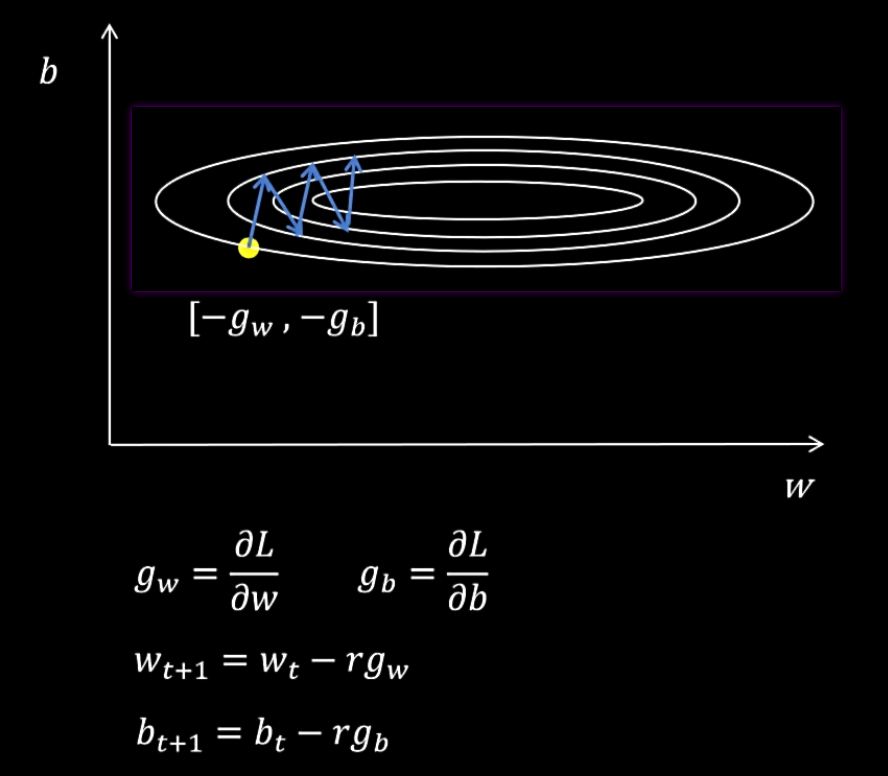
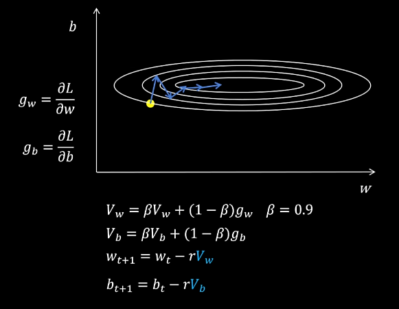
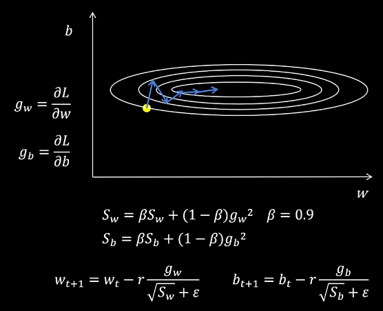
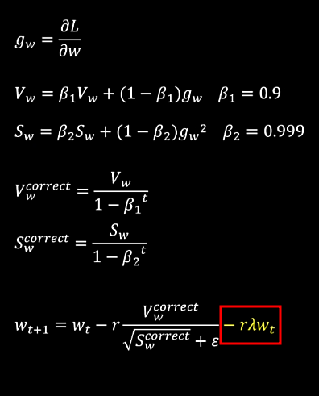

# Optimizer & Scheduler

[torch.optim - PyTorch Docs](https://docs.pytorch.org/docs/stable/optim.html#algorithms)

[LRScheduler - PyTorch Docs](https://docs.pytorch.org/docs/stable/optim.html#how-to-adjust-learning-rate)

---

[SGD, Momentum, RMSProp, Adam, AdamW - B站(RethinkFun)](https://www.bilibili.com/video/BV1NZ421s75D)

[Optimization for Deep Learning (Momentum, RMSprop, AdaGrad, Adam) - YouTube(DeepBean)](https://www.youtube.com/watch?v=NE88eqLngkg)

指数加权平均
1. $V_t = \beta V_{t-1} + (1 - \beta) \theta_t$
2. $V_t^{\text{correct}} = \frac{V_t}{1 - \beta^t}$ 修正
3. 运算只需要 保存 V值

SGD 随机梯度下降
1. 只使用当前 梯度 进行优化
2. 
3. 可能发生震荡，训练不稳定

Momentum 动量梯度下降
1. 使用 **从训练开始的 梯度的 指数加权平均** 更新参数
2. 先计算当前梯度，再计算指数加权平均，最后更新参数
3. 

RMSProp
1. 震荡是由于 有的参数梯度大，有的参数梯度小，**当前梯度 除以 代表参数过去梯度大小的值**，使得 每个梯度大小相近，训练稳定
2. 实现方式是，计算 参数梯度平方的 指数加权平均
3. $\epsilon$ 是为了防止 ÷0
4. 
5. S 表示 square, V 表示 value

Adam & AdamW
1. 结合 Momentum & RMSProp，计算 梯度 & 梯度平方的 指数加权平均，并对 指数加权平均值 进行修正
2. AdamW 在 Adam 基础上 增加 权重衰退(weight decay)，W 代表 weight-decay，直接给参数减去一个小值
3. 
4. 每个参数都需要 **保存2个额外的值** $V$ & $S$，显存占用更大

L2 Regularization ≠ Weight Decay
1. 权重衰退 不改变 Loss 函数 $L = L_{\text{error}}$ 本身，只是在计算完梯度，更新参数时候，减去小值
2. L2 Regularization 影响 Loss 函数 $L = L_{\text{error}} + \frac{\lambda}{2} ||w||^2$，从而影响后续 梯度计算
3. 更新参数 会有不同

ReadPaper
1. [优化器算法讲解(上) - B站视频(ReadPaper)](https://www.bilibili.com/video/BV1NC4y1g716)
2. [优化器算法讲解(中) - B站视频(ReadPaper)](https://www.bilibili.com/video/BV1e94y1N7u5)
3. [优化器算法讲解(下) - B站视频(ReadPaper)](https://www.bilibili.com/video/BV1Nc411m7FL)

https://www.bilibili.com/video/BV1Ri421h7qV

https://www.bilibili.com/video/BV1Wt421b7uA

https://www.bilibili.com/video/BV1jH2RYgEDN

https://www.bilibili.com/video/BV1jh4y1q7ua

创建时，scheduler 保存了 optimizer 的引用，调用 scheduler.step() 时，scheduler 会直接修改 optimizer 的学习率

patience 机制 : 连续 patience 个 epoch 的 loss 没有下降 才触发

理解
1. 前期：大学习率快速收敛
2. 中期：发现卡住了(plateau)，说明步子太大
3. 后期：小学习率精确收敛到最优解

Adam

AdamW
1. Adam 的 改进版本，有更好的 权重衰减 机制
2. scheduler
   1. name      :
   2. factor    :
   3. patience  :
   4. mode      :
   5. min_lr    :

`from torch.optim import Adam, AdamW`

`from torch.optim.lr_scheduler import CosineAnnealingWarmRestarts, ReduceLROnPlateau, _LRScheduler, ConstantLR`

scheduler : 学习率调度器
1. 基于步数
2. 基于性能
   1. `ReduceLROnPlateau`
3. 周期性
4. 预热相关
5. 自适应

