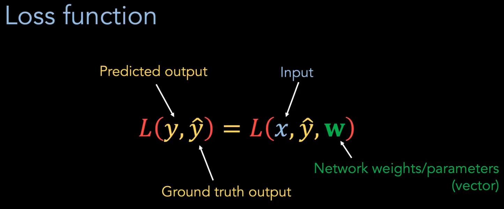
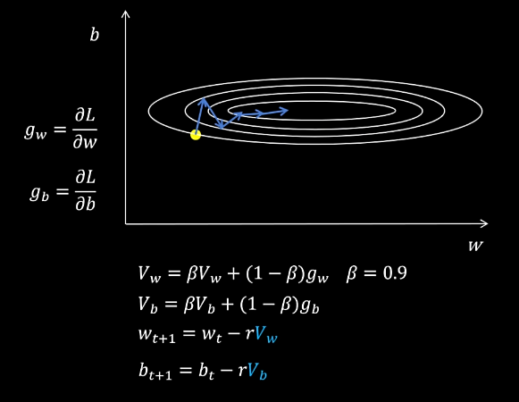
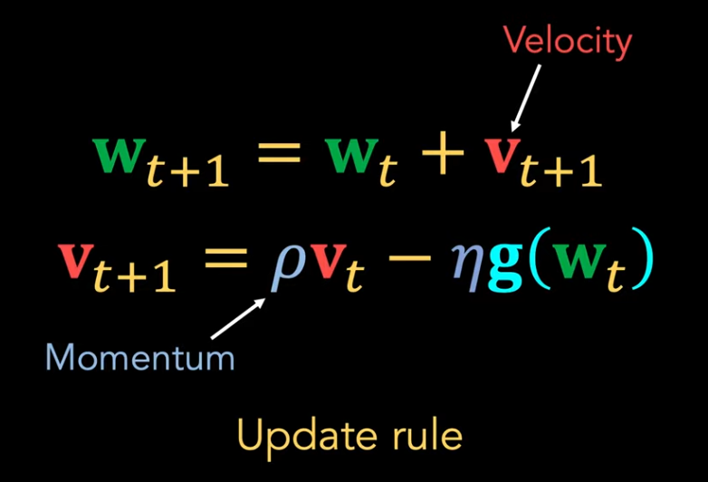
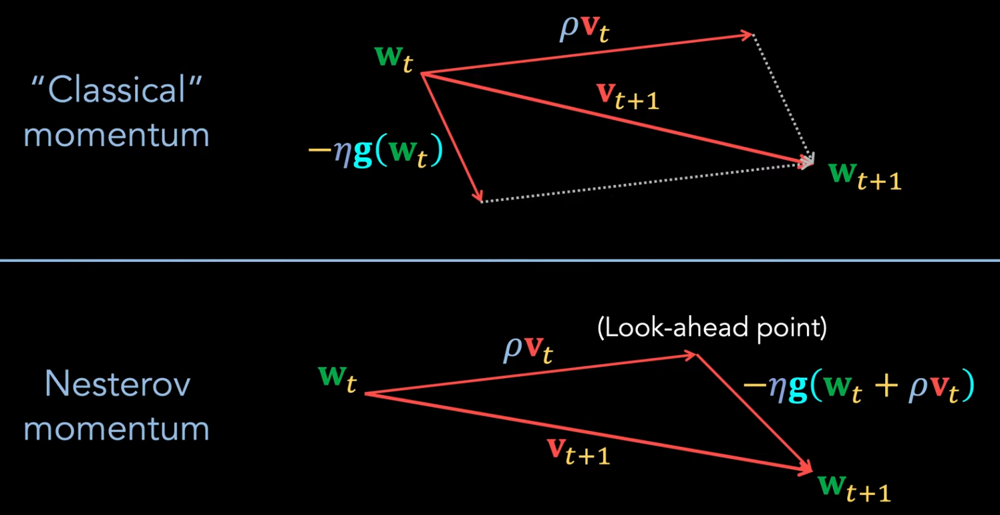
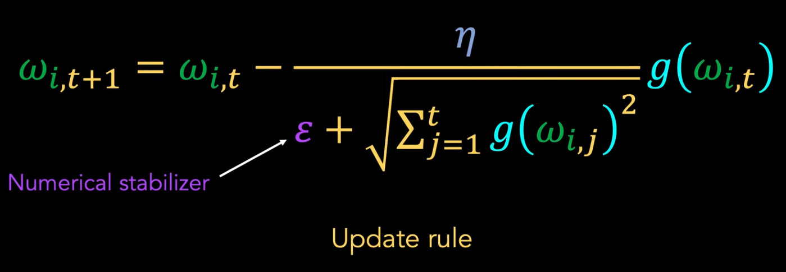
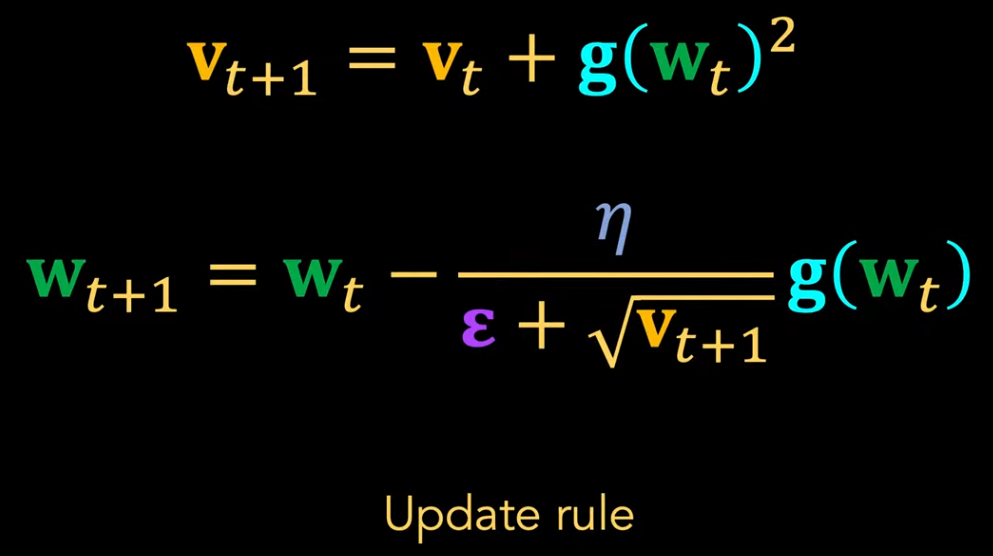
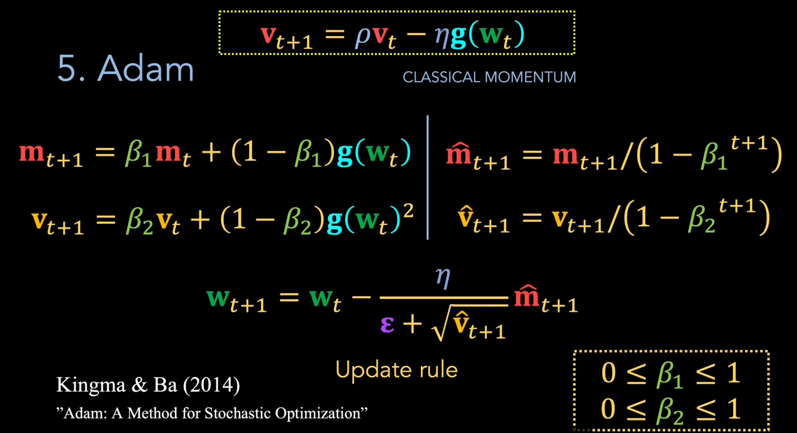

# Optimizer & Scheduler

[torch.optim - PyTorch Docs](https://docs.pytorch.org/docs/stable/optim.html#algorithms)

[LRScheduler - PyTorch Docs](https://docs.pytorch.org/docs/stable/optim.html#how-to-adjust-learning-rate)

---

[SGD, Momentum, RMSProp, Adam, AdamW - B站(RethinkFun)](https://www.bilibili.com/video/BV1NZ421s75D)

[Optimization for Deep Learning (Momentum, RMSprop, AdaGrad, Adam) - YouTube(DeepBean)](https://www.youtube.com/watch?v=NE88eqLngkg)

大 batchsize 的问题 : 计算量大，特殊样本 会被 大量普通样本 淹没

**指数加权平均(Exponentially Weighted Averages, EWA)**
1. $V_t = \beta V_{t-1} + (1 - \beta) \theta_t$
2. 参数
   1. $V_t$ : 当前时刻 $t$ 的估计值
   2. $V_{t-1}$ : 上一个时刻 $t-1$ 的估计值
   3. $\beta$ : 平滑系数/衰减率，通常 接近1，resistance of the velocity to change
   4. $\theta_t$ : 当前时刻 $t$ 的实际观测值
      1. eg : 当前 Mini-Batch 的梯度
3. $V_t^{\text{correct}} = \frac{V_t}{1 - \beta^t}$ 偏差修正
   1. 在训练初期($t$ 很小)，由于 $V_0$ 通常被初始化为 $0$，导致 $V_t$ 的估计值会系统性地偏小
4. 运算只需要 保存 V值
5. 过去的观测值 的 权重以指数级 递减

**SGD 随机梯度下降**
1. 只使用当前 梯度 进行优化
2. 
3. 可能发生震荡，训练不稳定
4. 可以 让模型更快跳出 sharp minimum(相比 Adam)，而转向 flat minimum(和 higher generalizabiltiy 泛化性 有关)

**Momentum 动量梯度下降**
1. 使用 **从训练开始的 梯度的 指数加权平均** 更新参数
2. 先计算当前梯度，再计算指数加权平均，最后更新参数
3. 
4. 
5. 
6. 消除振荡，加速收敛，尤其是在 损失函数 曲面狭长、梯度在不同维度变化不均匀时(防止模型在山谷两侧反复振荡)
7. learning rate 的重要性变低了
8. 2种 momentum
   1. Classical/Polyak Momentum (PyTorch Default，但是可以切换到另一种，`nesterov=False`)
   2. Nesterov Momentum，不在当前位置计算梯度，而是计算 look-ahead point 的梯度，先用惯性推测下一步可能的位置，然后在预估位置上计算梯度
   3. 
   4. 

上面的 只基于 动量&梯度 更新 且 学习率固定，下面的 自动 逐参数 调整学习率

**AdaGrad(Adaptive Gradient)**
1. 通过积累 过去所有梯度平方和 调整学习率(每个权重单独)
2. 
3. 
4. 为每个参数设置一个独特的学习率
   1. 不经常更新的参数(eg : 稀疏特征)，赋予较大的学习率
   2. 经常更新的参数，赋予较小的学习率
5. $\epsilon$ : 数值稳定器，防止除 0
6. 但是有可能距离 最优点很远，但是 update rate 下跌的很小了，因为只能减小学习率，不能增加

**RMSProp**
1. 震荡是由于 有的参数梯度大，有的参数梯度小，**当前梯度 除以 代表参数过去梯度大小的值**，使得 每个梯度大小相近，训练稳定
2. 实现方式是，计算 参数梯度平方的 **指数加权平均**
3. $\epsilon$ 是为了防止 ÷0
4. 
5. 
6. S 表示 square, V 表示 value
7. 可以解决 AdaGrad 学习率 持续衰减 问题

**Adam & AdamW**
1. Adam 目前最流行的默认优化器之一
2. 结合 Momentum & RMSProp，计算 梯度 & 梯度平方的 指数加权平均，并对 指数加权平均值 进行修正
3. 
4. AdamW 在 Adam 基础上 增加 权重衰退(weight decay)，W 代表 weight-decay，直接给参数减去一个小值
5. 
6. 每个参数都需要 **保存2个额外的值** $V$ & $S$，显存占用更大

**L2 Regularization ≠ Weight Decay**
1. **L2 Regularization** : 影响 Loss 函数 $L = L_{\text{error}} + \frac{\lambda}{2} ||w||^2$，从而影响后续 梯度计算
2. **Weight Decay 权重衰退** : 不改变 Loss 函数 $L = L_{\text{error}}$ 本身，只是在计算完梯度，更新参数时，减去值
3. 更新参数 会有不同

ReadPaper
1. [优化器算法讲解(上) - B站视频(ReadPaper)](https://www.bilibili.com/video/BV1NC4y1g716)
2. [优化器算法讲解(中) - B站视频(ReadPaper)](https://www.bilibili.com/video/BV1e94y1N7u5)
3. [优化器算法讲解(下) - B站视频(ReadPaper)](https://www.bilibili.com/video/BV1Nc411m7FL)

https://www.bilibili.com/video/BV1Ri421h7qV

https://www.bilibili.com/video/BV1Wt421b7uA

https://www.bilibili.com/video/BV1jH2RYgEDN

https://www.bilibili.com/video/BV1jh4y1q7ua

创建时，scheduler 保存了 optimizer 的引用，调用 scheduler.step() 时，scheduler 会直接修改 optimizer 的学习率

patience 机制 : 连续 patience 个 epoch 的 loss 没有下降 才触发

理解
1. 前期：大学习率快速收敛
2. 中期：发现卡住了(plateau)，说明步子太大
3. 后期：小学习率精确收敛到最优解

Adam

AdamW
1. Adam 的 改进版本，有更好的 权重衰减 机制
2. scheduler
   1. name      :
   2. factor    :
   3. patience  :
   4. mode      :
   5. min_lr    :

`from torch.optim import Adam, AdamW`

`from torch.optim.lr_scheduler import CosineAnnealingWarmRestarts, ReduceLROnPlateau, _LRScheduler, ConstantLR`

scheduler : 学习率调度器
1. 基于步数
2. 基于性能
   1. `ReduceLROnPlateau`
3. 周期性
4. 预热相关
5. 自适应

