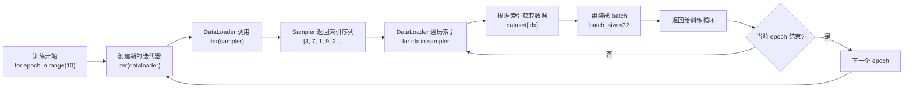

# Sampler & DataLoader & Dataset

PyTorch Docs
1. [torch.utils.data.DataLoader](https://docs.pytorch.org/docs/stable/data.html#torch.utils.data.DataLoader)
2. [torch.utils.data.Dataset](https://docs.pytorch.org/docs/stable/data.html#torch.utils.data.Dataset)
3. [torch.utils.data.Sampler](https://docs.pytorch.org/docs/stable/data.html#torch.utils.data.Sampler)


# Sampler & DataLoader & Dataset 之间的关系

Sampler 告诉 DataLoader 要取的 index

DataLoader 接收 Sampler 生成的 index 序列，告诉 Dataset 取对应 index 的数据

Dataset 根据 index 返回数据，DataLoader 将它们打包成 batch

DataLoader 有默认的 Sampler
1. `shuffle = False`，对应 `torch.utils.data.SequentialSampler`
2. `shuffle = True` (default)，对应 `torch.utils.data.RandomSampler`
3. 同时将上面的基础 Sampler 封装进 `BatchSampler`

# 实现细节

Sampler 继承 `torch.utils.data.Sampler`
1. `__len__(self)` : length of the returned iterators
2. `__iter__(self)` : iterate over indices or lists of indices (batches) of dataset elements，成为 Iterable (Iterator 还需实现 `__next__()`)

Dataset 继承 `torch.utils.data.Dataset`
1. `__len__(self)` (optional) : 返回数据集中的总样本数
2. `__getitem__(self, index)` : 根据给定的整数索引，返回单个数据样本
3. `__getitems__(self, indices)` (optional) : speedup batched samples loading


DataLoader 继承 `torch.utils.data.DataLoader`
1. [dataloader.py 源码 - Github](https://github.com/pytorch/pytorch/blob/main/torch/utils/data/dataloader.py)
2. **支持 Dataset 类型**
   1. **Map-style Dataset** (继承 `torch.utils.data.Dataset`) : 预知大小
      1. 实现 `__len__()` 和 `__getitem__(index)`
      2. 数据完全可用，可通过索引访问
   2. **Iterable-style Dataset** (继承 `torch.utils.data.IterableDataset`) : 流式
      1. 实现 `__iter__()` 方法
      2. 数据流式生成，大小未知或无限
3. 支持 single-process & multi-process loading
4. **Parameters**
   1. dataset
   2. batch_size, shuffle, sampler, drop_last
   3. batch_sampler 与 batch_size, shuffle, drop_last, sampler **互斥**
   4. num_workers, worker_init_fn(只在 num_workers > 0 时起作用，可用于设置随机种子)
   5. collate_fn(合并从 Dataset 中取出的 多个独立样本，转为 batch tensors，方便并行处理)
   6. pin_memory(将数据加载到 锁页内存(Pinned Memory) 区域，GPU 可以直接通过 DMA 读数据，分配过多可能导致系统资源紧张)
   7. etc


# Sampler Collection


`Sampler`
1. 所有的 采样器 继承自 `Sampler`
2. 3个 方法
   1. `__init__` : 初始化
   2. `__iter__` : 产生迭代索引值的，也就是指定每个 step 需要读取哪些数据 (定义了 `__iter__` 方法的对象就是 iterable)
   3. `__len__`  : 返回每次迭代器的长度


`SequentialSampler`
1. 按顺序对数据集采样
2. 先得到和 data_source 一样长度的 range 可迭代器
3. **每次只会返回一个索引值**


`RandomSampler`
1. `replacement` : True 表示 可以重复采样(可能导致有的样本采样不到)
   1. `True`  : `iter(torch.randint(high=n, size=(self.num_samples,), dtype=torch.int64).tolist())`
   2. `False` : `iter(torch.randperm(n).tolist())`
2. `num_samples` : 指定采样的数量，默认是所有

`WeightedRandomSampler`
1. 参数同 `RandomSampler`


`SubsetRandomSampler` : 子集随机采样
1. 传入 `indices`
2. 常用于将 train dataset 划分成 train & eval(不是 test)
3. 传入 indice 的时候已经 shuffle 过，内部 还会 shuffle(每个epoch内数据顺序随机化)

`BatchSampler`
1. Wraps another sampler to yield a mini-batch of indices
2. `BatchSampler` 将前面的 Sampler 采样得到的索引值进行合并，当数量等于 batch_size 后就将这一批的索引值返回
3. drop_last 处理最后一批不够 batch_size
4. `DataLoader` 内部会使用 `BatchSampler` 自动组装 batch，大多数情况下不需要手动写 `BatchSampler`，但是也支持传入 `batch_sampler`
5. `BatchSampler` 接收的是 **已经实例化的** sampler 对象，不是类


`DistributedSampler`
1. 用于 DDP & FSDP
2. 也会被 `BatchSampler` 包装


```python
DataLoader(
    dataset, batch_size=1, shuffle=False,
    sampler=None,
    batch_sampler=None,
    num_workers=0, collate_fn=None,
    pin_memory=False, drop_last=False, timeout=0,
    worker_init_fn=None, *, prefetch_factor=2,
    persistent_workers=False
)
```

如果使用自定义 batch_sampler，必须在创建 batch_sampler 时就指定 sampler，`DataLoader` 的 sampler 参数会被完全忽略





