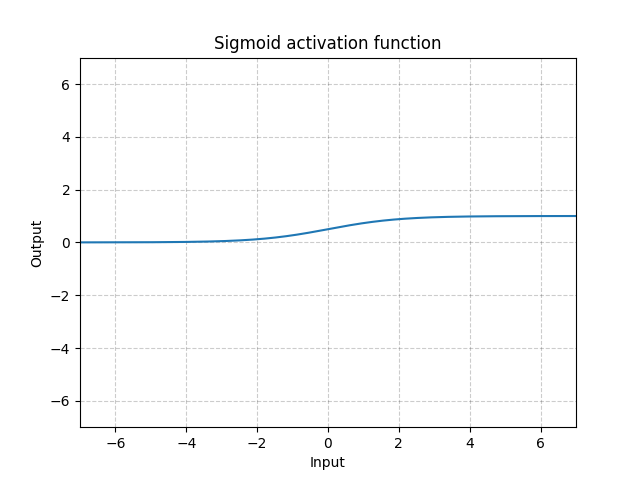
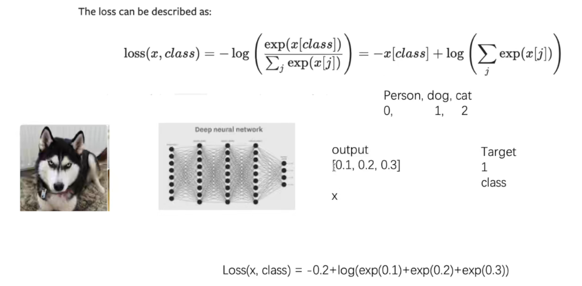

# PyTorch

[toc]

# Portals

[PyTorch深度学习快速入门教程 -- 小土堆](https://www.bilibili.com/video/BV1hE411t7RN) 

[《PyTorch深度学习实践》完结合集 -- 刘二大人](https://www.bilibili.com/video/BV1Y7411d7Ys)

# PyTorch深度学习快速入门教程 -- 小土堆

## 00 Python两大法宝函数

**dir()**
展示

```python
print(dir(torch))

# 或者直接在中断输入

dir(torch)
dir(torch.cuda)

```

**help()**

```python
help(torch.cuda.is_available)

# 函数不需要加括号
```

## 01 PyTorch加载数据认识

两个类：

**Dataset**

获取数据及其对应label
1. 获取每一个数据及其label
2. 统计数据的总量

```python
help(Dataset)
```

1. Dataset是一个抽象类
2. 所有数据集要继承该类
3. 所有子类要重写__gititem__、__len__


**DataLoader**

为网络提供不同的数据形式

## Dataset类代码实战

Dataset是一个抽象类，需要定义一个类去继承。需要实现几个相应的方法
1. __init__()
2. __getitem__():魔法函数，方便通过下标获得数据
3. __len__():魔法函数，方便len()

DataLoader可以直接实例化

```python
import torch
from torch.utils.data import Dataset
from torch.utils.data import DataLoader
import cv2 as cv
import os

class MyData(Dataset):
    def __init__(self, root_dir, label_dir):
        self.root_dir = root_dir
        self.label_dir = label_dir
        self.path = os.path.join(self.root_dir, self.label_dir)
        self.img_path = os.listdir(self.path)

    def __getitem__(self, idx):
        img_name = self.img_path[idx]
        img_item_path = os.path.join(self.path, img_name)
        img = cv.imread(img_item_path, 1)  # 不一定使用opencv，也可以使用其他方式
        # print(img_item_path)
        # cv.imshow("img",img)
        label = self.label_dir
        return img, label

    def __len__(self):
        return len(self.img_path)


RootDir = r"D:\Project\DataSet\hymenoptera_data"
AntsLabelDir = r"train\ants"
BeesLabelDir = r"train\ants"
AntsDataset = MyData(RootDir, AntsLabelDir)
BeesDataset = MyData(RootDir, BeesLabelDir)

Img, Label = AntsDataset[0]  # 这里应该就是通过__getitem__获取所需数据
print(Label)
cv.imshow("img", Img)
cv.waitKey(0)
cv.destroyAllWindows()

# 使用+，即可将两个数据集进行合并
WholeDataset = AntsDataset + BeesDataset


print("Ants Length : ", len(AntsDataset))
print("Bees Length : ", len(BeesDataset))
print("Whole Length : ", len(WholeDataset))

```

## TensorBoard的使用

用TensorBoard进行效果（output）展示

在PyCharm中按住Ctrl+鼠标点击即可查看

```python
import cv2 as cv
import numpy as np
from torch.utils.tensorboard import SummaryWriter

# 对类创建实例
writer = SummaryWriter("logs")
# comment是一个注释，会添加在文件夹后


AntImgPath = r"D:\Project\DataSet\TestData\train\ants_image\0013035.jpg"
AntImg = cv.imread(AntImgPath, cv.IMREAD_COLOR)
print(type(AntImg))
print(AntImg.shape)
# 支持的数据类型torch.Tensor, numpy.array, or string/blobname
writer.add_image("Ant", AntImg, 1, dataformats="HWC")  # 添加image
# 注意对于opencv读取的数据由于和add_image方法所默认的组织形式不同，需要通过dataformats进行指明
# 同时，相同tag不同global_step的数据会被放在一起
# 如果希望显示在不同区域，可以使用不同的tag


for i in range(100):
    writer.add_scalar("y=x", i, i)  # 添加数

# scalar_value 数值
# global_step 训练步数

writer.close()
# 在Terminal中运行
# tensorboard --logdir=logs --port=56789
# logs是文件夹名称，port是localhost的端口号，避免冲突
```

## Transforms的使用（图像变换）

```python
import cv2 as cv
from torchvision import transforms
from PIL import Image

"""
transforms.py相当于一个工具箱(进行两次Ctrl+鼠标左键进行查看)

Compose:结合不同的transforms
ToTensor:将数据类型转换为tensor
Resize
CenterCrop

tensor数据类型:
_backward_hooks
device
is_cuda
_grad_fn
_grad
包装类神经网络需要的很多参数
所以需要将各种数据转为tensor类型
"""

img_path = r"D:\Project\DataSet\TestData\train\ants_image\0013035.jpg"
img = Image.open(img_path)

tensor_trans = transforms.ToTensor()
# ToTensor是一个类， tensor_trans是创建的具体工具， ToTensor相当于模具
# 实例化+调用方法
trans_img = tensor_trans(img)
print(trans_img)
```


```python
from PIL import Image
from torchvision import transforms


img_path = r"D:\Project\DataSet\TestData\train\ants_image\0013035.jpg"
img = Image.open(img_path)
# print(img)

# python中__call__的用法
class Person:
    def __call__(self, name):
        print("__call__ " + "Hello, " + name)

    def hello(self, name):
        print("Hello,", name)


person1 = Person()  # 创建对象
person1("LZY")  # __call__可以直接使用对象+括号进行调用
person1.hello("YYR")  #

# Compose

# ToTensor
trans_totensor = transforms.ToTensor()
img_totensor = trans_totensor(img)
# Normalize
# 归一化 输入tensor数据类型 mean是均值、std是标准差
# 归一化只接受tensor数据类型
trans_norm = transforms.Normalize([0.5, 0.5, 0.5], [0.5, 0.5, 0.5])
# 三个参数是应为图片是RGB三个通道
img_norm = trans_norm(img_totensor)
print(img_norm.dtype)
print(img_norm.shape)  # 层 行 列

# Resize
# 输入是PIL Image， 也接受tensor形式
trans_resize_512 = transforms.Resize((512, 512))
img_resize = trans_resize_512(img_totensor)
print(img_resize.shape)

# Compose
# 接受的参数是一个列表[数据1， 数据2， ……]， 数据要求是transforms类型
trans_compose = transforms.Compose([trans_resize_512, trans_totensor])
img_resize = trans_compose(img)

# RandomCrop
trans_randomcrop = transforms.RandomCrop((128,256))
img_randomcrop = img.copy()
for i in range(1):  # 只裁剪出一块，而不是切去
    img_randomcrop = trans_randomcrop(img_randomcrop)

# 其他查看官方文档即可

img_randomcrop.show()

# 使用技巧
# 多看官方文档
# 关注输入的参数

```

## torchvision中的数据集使用

[torchvision官方文档](https://pytorch.org/vision/stable/index.html)

如果使用CIFAR10数据集，在dataset的时候需要加入totensor，因为该数据集的图片格式是PIL

```python
"""
使用torchvision的标准数据集

去到pytorch官方的torchvision进行查看：https://pytorch.org/vision/stable/index.html

先选择数据集，不同数据集所对应的函数有所不同

root (string)
    Root directory of dataset where directory cifar-10-batches-py exists
    or will be saved to if download is set to True.

train (bool, optional)
    If True, creates dataset from training set
    otherwise creates from test set.

transform (callable, optional)
    A function/transform that takes in an PIL image and returns a transformed version.
    E.g, transforms.RandomCrop

target_transform (callable, optional)
    A function/transform that takes in the target and transforms it.

download (bool, optional)
    If true, downloads the dataset from the internet and puts it in root directory.
    If dataset is already downloaded, it is not downloaded again.

如果下载较慢，可以复制Run窗口中的网址进行迅雷下载，然后移动到相应目录中
如果已存在就不会再次下载，而是进行解压和校验

有些数据集在Run窗口中不显示网址
可以Ctrl+鼠标左键，然后进行查看文件中的url
"""

import torchvision.datasets
import torchvision.transforms as tf

root_dir = r"D:\Project\DataSet"

tf_totensor = tf.ToTensor()

# CIFAR数据集的类型是PIL_Image需要先转为Tensor类型

train_set = torchvision.datasets.CIFAR10(root_dir, train=True, download=False, transform=tf_totensor)
test_set = torchvision.datasets.CIFAR10(root_dir, train=False, download=False, transform=tf_totensor)

# # 不加transform时
# # print(test_set[0])  # (<PIL.Image.Image image mode=RGB size=32x32 at 0x13B7A00D550>, 3)
# # 图片， 数字（package）
# print(test_set.classes)
# # ['airplane', 'automobile', 'bird', 'cat', 'deer', 'dog', 'frog', 'horse', 'ship', 'truck']
# img, target = test_set[0]
# img.show()  # cat 32*32
# print(target)
# print(test_set.classes[target])  # cat

# 加入transform时
img, target = test_set[0]
print(img.dtype)  # torch.float32
print(len(test_set))  # 10000
print(len(train_set))  # 50000

```

## DataLoader的使用

[DataLoader官方文档](https://pytorch.org/docs/stable/data.html?highlight=dataloader#torch.utils.data.DataLoader)

加载器，从dataset中取数据


```python
"""
DataLoader

大部分都有默认值

DataLoader(dataset, batch_size=1, shuffle=False, sampler=None,
           batch_sampler=None, num_workers=0, collate_fn=None,
           pin_memory=False, drop_last=False, timeout=0,
           worker_init_fn=None, *, prefetch_factor=2,
           persistent_workers=False)

dataset (Dataset)
    dataset from which to load the data.
    将自定义的Dataset实例化即可，传入即可

batch_size (int, optional)
    how many samples per batch to load
    (default: 1).
    每次取几个数据

shuffle (bool, optional)
    set to True to have the data reshuffled at every epoch
    (default: False).
    是否洗牌

sampler (Sampler or Iterable, optional)
    defines the strategy to draw samples from the dataset. Can be any Iterable with __len__ implemented.
    If specified, shuffle must not be specified.

batch_sampler (Sampler or Iterable, optional)
    like sampler, but returns a batch of indices at a time.
    Mutually exclusive with batch_size, shuffle, sampler, and drop_last.

num_workers (int, optional)
    how many subprocesses to use for data loading. 0 means that the data will be loaded in the main process.
    (default: 0)
    多进程，设置子进程数量（0表示只有主进程）读数据的时候

collate_fn (callable, optional)
    merges a list of samples to form a mini-batch of Tensor(s).
    Used when using batched loading from a map-style dataset.

pin_memory (bool, optional)
    If True, the data loader will copy Tensors into CUDA pinned memory before returning them.
    If your data elements are a custom type, or your collate_fn returns a batch that is a custom type.

drop_last (bool, optional)
    set to True to drop the last incomplete batch, if the dataset size is not divisible by the batch size.
    If False and the size of dataset is not divisible by the batch size, then the last batch will be smaller.
    (default: False)
    除不尽的时候是否舍去

timeout (numeric, optional)
    if positive, the timeout value for collecting a batch from workers. Should always be non-negative.
    (default: 0)

worker_init_fn (callable, optional)
    If not None, this will be called on each worker subprocess with the worker id (an int in [0, num_workers - 1])
    as input, after seeding and before data loading. (default: None)

generator (torch.Generator, optional)
    If not None, this RNG will be used by RandomSampler to generate random indexes
    and multiprocessing to generate base_seed for workers.
    (default: None)

prefetch_factor (int, optional, keyword-only arg)
    Number of samples loaded in advance by each worker.
    2 means there will be a total of 2 * num_workers samples prefetched across all workers.
    (default: 2)

persistent_workers (bool, optional)
    If True, the data loader will not shutdown the worker processes after a dataset has been consumed once.
    This allows to maintain the workers Dataset instances alive.
    (default: False)

"""

import torchvision
from torch.utils.data import DataLoader
from torch.utils.tensorboard import SummaryWriter

root_dir = r"D:\Project\DataSet"

# 测试数据集
test_data = torchvision.datasets.CIFAR10(root_dir, train=False, transform=torchvision.transforms.ToTensor())

test_loader = DataLoader(dataset=test_data, batch_size=64, shuffle=True, num_workers=0, drop_last=False)

# # 测试数据集中的第一个
# img, target = test_data[0]  # 调用__getitem__方法
# print(img.shape)  # torch.Size([3, 32, 32])
# print(test_data.classes[target])  # cat

# test_loader:
# 每次取batchsize个数据进行打包，通过多次test_data[idx]的方式，多次调用dataset的__getitem__，作为data_loader的返回
writer = SummaryWriter("TestDataLoaderWithCIFAR10")
GlobalStep = 0
# 此处外面可以再嵌套一层循环 for epoch in range(epoch_times)
for datas in test_loader:
    imgs, targets = datas
    writer.add_images("test_data", imgs, GlobalStep)  # 注意add_images
    GlobalStep += 1
    # print(imgs.shape)
    # print(targets)
"""
Size的列表的第一个数字就是batchsize
torch.Size([4, 3, 32, 32])
tensor([6, 9, 9, 1])
torch.Size([4, 3, 32, 32])
tensor([0, 9, 5, 6])
......
"""

writer.close()

# 如果drop_last = False, 最后会由于不能整除64，er使得batchsize不够64，进行保留

# shuffle指的是每一整次（epoch）的顺序，如果为True，即时shuffle为随机，顺序也是相同的

# 是否随机取应该取决于sampler

```


## 神经网络搭建 nn.Module的使用

在pytorch官网的Docs，torch.nn进行查看

[PyTorch官网 TORCH.NN](https://pytorch.org/docs/stable/nn.html)

[开源动图](https://github.com/vdumoulin/conv_arithmetic/blob/master/README.md)

**Containers**

给神经网络定义骨架

六个模块
1. Module：对所有神经网络的基本的类（框架），从类进行继承。进行一些修改
   1. 重写__init__
   2. 重写forward
2. Sequential：
3. ModuleList：
4. ModuleDict：
5. ParameterList：
6. ParameterDict：

```python
import torch
import torch.nn as nn
import torch.nn.functional as F


class TEST(nn.Module):
    def __init__(self):
        super().__init__()

    def forward(self, input):
        output = input + 1
        return output


test = TEST()
x = torch.tensor(1.0)
output = test(x)
print(output)

# __call__()方法的实现_call_impl()中调用了forward()方法（可以在Module.py中查看）

```


## 卷积操作

**torch.nn.Conv2d**

torch.nn（对torch.nn.functional进行封装）

torch.nn.functional.conv2d
1. input（输入） – input tensor of shape
2. weight（卷积核） – filters of shape
3. bias（偏置） – optional bias tensor of shape. Default: None
4. stride（卷积核移动步长） – the stride of the convolving kernel. Can be a single number or a tuple (sH, sW)（横向和纵向）. Default: 1
5. padding（对周围进行填充） – implicit paddings on both sides of the input. Can be a string {‘valid’, ‘same’}, single number or a tuple (padH, padW). Default: 0 padding='valid' is the same as no padding. padding='same' pads the input so the output has the shape as the input. However, this mode doesn’t support any stride values other than 1.（如果只输入一个数，则上下左右都扩展那么多）

```python
import torch
import torch.nn.functional as F

input = torch.tensor([[1, 2, 0, 3, 1],
                      [0, 1, 2, 3, 1],
                      [1, 2, 1, 0, 0],
                      [5, 2, 3, 1, 1],
                      [2, 1, 0, 1, 1]])

kernel = torch.tensor([[1, 2, 1],
                       [0, 1, 0],
                       [2, 1, 0]])

# 注意，这里的input和kernel的输入通道数和torch.nn.functional.xx的要求不同
print(input.shape)  # torch.Size([5, 5])
print(kernel.shape)  # torch.Size([3, 3])

input = torch.reshape(input, (1, 1, 5, 5))
kernel = torch.reshape(kernel, (1, 1, 3, 3))

print(input.shape)  # torch.Size([1, 1, 5, 5])
print(kernel.shape)  # torch.Size([1, 1, 3, 3])

output = F.conv2d(input=input, weight=kernel, stride=1)
print(output, output.shape)
"""
tensor([[[[10, 12, 12],
          [18, 16, 16],
          [13,  9,  3]]]]) torch.Size([1, 1, 3, 3])
"""
output = F.conv2d(input=input, weight=kernel, stride=2)
print(output, output.shape)
"""
tensor([[[[10, 12],
          [13,  3]]]]) torch.Size([1, 1, 2, 2])
"""
output = F.conv2d(input=input, weight=kernel, stride=1, padding=1)
print(output, output.shape)
"""
tensor([[[[ 1,  3,  4, 10,  8],
          [ 5, 10, 12, 12,  6],
          [ 7, 18, 16, 16,  8],
          [11, 13,  9,  3,  4],
          [14, 13,  9,  7,  4]]]]) torch.Size([1, 1, 5, 5])
"""
output = F.conv2d(input=input, weight=kernel, stride=2, padding=1)
print(output, output.shape)
"""
tensor([[[[ 1,  4,  8],
          [ 7, 16,  8],
          [14,  9,  4]]]]) torch.Size([1, 1, 3, 3])
"""

```

**Convolution Layers**

torch.nn.Conv2d(in_channels, out_channels, kernel_size, stride=1, padding=0, dilation=1, groups=1, bias=True, padding_mode='zeros', device=None, dtype=None)

1. in_channels (int) –（输入的通道数） Number of channels in the input image
2. out_channels (int) –（输出的通道数） Number of channels produced by the convolution
   out_channels和in_channels未必一样大，out_channels等于多少，卷积核就有几层，分别与数据进行卷积，叠放在一起输出
3. kernel_size (int or tuple) –（卷积核大小） Size of the convolving kernel（填一个数x就是x*x的大小）
   只需要定义size大小，不需要指定其中的数值
4. stride (int or tuple, optional) –（补偿大小） Stride of the convolution. Default: 1
5. padding (int, tuple or str, optional) –（填充） Padding added to all four sides of the input. Default: 0
6. padding_mode (string, optional) –（填充方式） 'zeros', 'reflect', 'replicate' or 'circular'. Default: 'zeros'
    输出规模 o=i+2⌊k/2⌋−(k−1)=i，可见输出规模与输入规模相等（half-padding，向下取整）
7. dilation (int or tuple, optional) –（空洞卷积） Spacing between kernel elements. Default: 1
8. groups (int, optional) –（分组卷积） Number of blocked connections from input channels to output channels. Default: 1
9.  bias (bool, optional) –（偏置） If True, adds a learnable bias to the output. Default: True
10. device（）
11. dtype（）

```python
import torch
import torchvision
from torch import nn
from torch.utils.data import DataLoader
from torch.utils.tensorboard import SummaryWriter

root_dir = r"D:\Project\DataSet"
dataset = torchvision.datasets.CIFAR10(root_dir, train=False, transform=torchvision.transforms.ToTensor(), download=False)

dataloader = DataLoader(dataset, batch_size=64)

class Test(nn.Module):
    def __init__(self):
        super(Test, self).__init__()
        self.conv1 = nn.Conv2d(in_channels=3, out_channels=6, kernel_size=3, stride=1, padding=0)

    def forward(self, x):
        x = self.conv1(x)
        return x


test = Test()
# print(test)
"""
Test(
  (conv1): Conv2d(3, 3, kernel_size=(3, 3), stride=(1, 1))
)
"""

writer = SummaryWriter("Conv")

step = 0
for data in dataloader:
    imgs, targets = data
    outputs = test(imgs)
    # print(outputs.shape)  # torch.Size([16, 6, 30, 30])
    writer.add_images("inputs", imgs, global_step=step)
    # 直接add_images会由于通道数的不同而报错，需进行resize
    outputs = torch.reshape(outputs, (-1, 3, 30, 30))  # 不确定数字多少就填入-1
    writer.add_images("outputs", outputs, global_step=step)
    step += 1

```


## 最大池化的使用

Pooling Layers

torch.nn.MaxPool2d(kernel_size, stride=None, padding=0, dilation=1, return_indices=False, ceil_mode=False)

1. kernel_size –（用于取最大值的窗口） the size of the window to take a max over
2. stride –（默认值是kernel_size） the stride of the window. Default value is kernel_size
3. padding –（填充） implicit zero padding to be added on both sides
4. dilation –（空洞卷积，和input进行相乘时，卷积核会被分裂（每行每列插入空隙）） a parameter that controls the stride of elements in the window
5. return_indices –（基本不用） if True, will return the max indices along with the outputs. Useful for torch.nn.MaxUnpool2d later
6. ceil_mode –（floor向下取整 ceil向上取整）（由于stride步长默认为核的大小，如果最后剩余几个行、列大小不够，True则保留并从中去除最大值，False则忽略） when True, will use ceil instead of floor to compute the output shape

```python
import torch
from torch import nn

test_input = torch.tensor([[1, 2, 0, 3, 1],
                           [0, 1, 2, 3, 1],
                           [1, 2, 1, 0, 0],
                           [5, 2, 3, 1, 1],
                           [2, 1, 0, 1, 1]], dtype=torch.float32)
# 这里必须加入dtype，否则最大池化层会不能处理long数据类型

test_input = torch.reshape(test_input, (-1, 1, 5, 5))
# print(test_input.shape)  # torch.Size([1, 1, 5, 5])

class Test(nn.Module):
    def __init__(self):
        super(Test, self).__init__()
        self.maxpool1 = nn.MaxPool2d(kernel_size=3, ceil_mode=True)

    def forward(self, input):
        output = self.maxpool1(input)
        return output


test = Test()
output = test(test_input)
print(output)
"""
tensor([[[[2., 3.],
          [5., 1.]]]])
"""

"""
最大池化的目的是保留输入的特征，缩小数据量
"""
```

## 非线性激活

为神经网络引入非线性特质

nn.ReLU -- Rectified Linear Unit (整流线性单元) 


nn.Sigmoid



```python
import torch
from torch import nn

inputs = torch.tensor([[1, -0.5],
                       [-1, 3]])

inputs = torch.reshape(inputs, (-1, 1, 2, 2))
# print(inputs.shape)  # torch.Size([1, 1, 2, 2])


class unlinear(nn.Module):
    def __init__(self):
        super(unlinear, self).__init__()
        self.relu1 = nn.ReLU(inplace=False)
        # inplace作用：是否覆盖原来的值，True则覆盖，False则不覆盖并返回新值
        # 一般采用False，防止数据丢失
        self.sigmoid1 = nn.Sigmoid()

    def forward(self, Input):
        output = self.relu1(Input)
        output = self.sigmoid1(Input)
        return output


UnLinear = unlinear()
outputs = UnLinear(inputs)
print(outputs)
"""
tensor([[[[1., 0.],
          [0., 3.]]]])
"""
# step从3开始，并且很多图像没显示的，在terminal那里，最后面加一个 --samples_per_plugin=images=1000
```


## 线性层及其他层

Normalization Layer

正则化层，对输入进行正则化，可以增加训练速度，使用并不多

Recurrent Layer

Transformer Layer

Dropout Layer

随机将元素变为了0，防止过拟合

Distance Functions

Loss Functions

**Linear Layer**

torch.nn.Linear(in_features, out_features, bias=True, device=None, dtype=None)
1. in_features – size of each input sample
2. out_features – size of each output sample
3. bias – If set to False, the layer will not learn an additive bias. Default: True

线性连接，只需要输入和输出个数

```python
import torch
import torchvision
from torch import nn
from torch.utils.data import DataLoader

root_dir = r"D:\Project\DataSet"
test_dataset = torchvision.datasets.CIFAR10(root_dir, train=False, download=False,
                                            transform=torchvision.transforms.ToTensor())
test_dataloader = DataLoader(test_dataset, batch_size=64, drop_last=True)


class Test(nn.Module):
    def __init__(self):
        super(Test, self).__init__()
        self.linear1 = nn.Linear(196608, 10)

    def forward(self, Input):
        return self.linear1(Input)


test = Test()

for data in test_dataloader:
    imgs, targets = data
    # print(imgs.shape)
    # inputs = torch.reshape(imgs, (1, 1, 1, -1))
    # 使用flatten替代reshape
    inputs = torch.flatten(imgs)
    # print(input.shape)
    output = test(inputs)
    # print(output.shape)
    # 这里如果之前定义dataLoader的时候没有dropout则会报错，因为最后一批数据尺寸不对


"""
torch.flatten() 展平，展成一行
"""
```

## 神经网络搭建 Sequential使用

在torchvision.models提供了很多的网络模型

[pytorch 官网介绍](https://pytorch.org/vision/stable/models.html#object-detection-instance-segmentation-and-person-keypoint-detection)

**Sequential**

将网络结构放入，使得代码更加简洁

```python
import torch
import torchvision.datasets
import torchvision.transforms as tf
from torch import nn
import torch.utils.data
from torch.utils.data import DataLoader
from torch.utils.tensorboard import SummaryWriter

root_dir = r"D:\Project\DataSet"
test_dataset = torchvision.datasets.CIFAR10(root=root_dir, train=True, transform=tf.ToTensor())
test_dataloader = DataLoader(dataset=test_dataset, batch_size=64)


class Test(nn.Module):
    def __init__(self):
        super(Test, self).__init__()
        # self.conv1 = nn.Conv2d(in_channels=3, out_channels=32, kernel_size=5, padding=2)
        # self.pooling1 = nn.MaxPool2d(kernel_size=2)
        # self.conv2 = nn.Conv2d(in_channels=32, out_channels=32, kernel_size=5, padding=2)
        # self.pooling2 = nn.MaxPool2d(kernel_size=2)
        # self.conv3 = nn.Conv2d(in_channels=32, out_channels=64, kernel_size=5, padding=2)
        # self.pooling3 = nn.MaxPool2d(kernel_size=2)
        # self.flatten1 = nn.Flatten()
        # # 两层线性层
        # self.linear1 = nn.Linear(in_features=64*4*4, out_features=64)
        # self.linear2 = nn.Linear(in_features=64, out_features=10)
        # sequential
        # 层与层用逗号分割，不需要名称
        
    def forward(self, x):
        return self.model1(x)


test = Test()
print(test)
"""
Test(
  (model1): Sequential(
    (0): Conv2d(3, 32, kernel_size=(5, 5), stride=(1, 1), padding=(2, 2))
    (1): MaxPool2d(kernel_size=2, stride=2, padding=0, dilation=1, ceil_mode=False)
    (2): Conv2d(32, 32, kernel_size=(5, 5), stride=(1, 1), padding=(2, 2))
    (3): MaxPool2d(kernel_size=2, stride=2, padding=0, dilation=1, ceil_mode=False)
    (4): Conv2d(32, 64, kernel_size=(5, 5), stride=(1, 1), padding=(2, 2))
    (5): MaxPool2d(kernel_size=2, stride=2, padding=0, dilation=1, ceil_mode=False)
    (6): Flatten(start_dim=1, end_dim=-1)
    (7): Linear(in_features=1024, out_features=64, bias=True)
    (8): Linear(in_features=64, out_features=10, bias=True)
  )
)
"""

# 对网络结构进行检验
it = torch.ones((64, 3, 32, 32))
ot = test(it)
print(ot.shape)
# 如果某层参数不正确，会有报错

# 可视化展示
writer = SummaryWriter("log_sequential")
writer.add_graph(model=test, input_to_model=it)
writer.close()

# tensorboard --logdir=log_sequential
# 双击进行详细查看

```

## 损失函数与反向传播

**Loss Function**
1. 计算实际输出和目标之间的差距
2. 为更新输出提供一定的依据（反向传播）

[Pytorch官网](https://pytorch.org/docs/stable/nn.html#loss-functions)

nn.L1Loss

nn.MSELoss

nn.CrossEntropyLoss

交叉熵



Input: shape:(N, C)

Targe: shape:(N)

Output: shape:(N)

N是batchsize，C是类别数

```python
import torch
from torch import nn

inputs = torch.tensor([1, 2, 3], dtype=torch.float32)
targets = torch.tensor([1, 2, 5], dtype=torch.float32)

# 两个数值的第一个维度要相同

# 如果不加dtype转换，则会出现报错
# RuntimeError: mean(): input dtype should be either floating point or complex dtypes. Got Long instead.

# inputs = torch.reshape(inputs, (1, 1, 1, 3))
# targets = torch.reshape(targets, (1, 1, 1, 3))

loss = nn.L1Loss()  # reduction有两个选择sum或mean
result = loss(inputs, targets)

print(result)
```

```python
import torch
import torchvision.datasets
import torchvision.transforms as tf
from torch import nn
import torch.utils.data
from torch.utils.data import DataLoader
from torch.utils.tensorboard import SummaryWriter

root_dir = r"D:\Project\DataSet"
test_dataset = torchvision.datasets.CIFAR10(root=root_dir, train=True, transform=tf.ToTensor())
test_dataloader = DataLoader(dataset=test_dataset, batch_size=64)


class Test(nn.Module):
    def __init__(self):
        super(Test, self).__init__()
        # self.conv1 = nn.Conv2d(in_channels=3, out_channels=32, kernel_size=5, padding=2)
        # self.pooling1 = nn.MaxPool2d(kernel_size=2)
        # self.conv2 = nn.Conv2d(in_channels=32, out_channels=32, kernel_size=5, padding=2)
        # self.pooling2 = nn.MaxPool2d(kernel_size=2)
        # self.conv3 = nn.Conv2d(in_channels=32, out_channels=64, kernel_size=5, padding=2)
        # self.pooling3 = nn.MaxPool2d(kernel_size=2)
        # self.flatten1 = nn.Flatten()
        # # 两层线性层
        # self.linear1 = nn.Linear(in_features=64*4*4, out_features=64)
        # self.linear2 = nn.Linear(in_features=64, out_features=10)
        # sequential
        # 层与层用逗号分割，不需要名称
        self.model1 = nn.Sequential(
            nn.Conv2d(in_channels=3, out_channels=32, kernel_size=5, padding=2),
            nn.MaxPool2d(kernel_size=2),
            nn.Conv2d(in_channels=32, out_channels=32, kernel_size=5, padding=2),
            nn.MaxPool2d(kernel_size=2),
            nn.Conv2d(in_channels=32, out_channels=64, kernel_size=5, padding=2),
            nn.MaxPool2d(kernel_size=2),
            nn.Flatten(),
            nn.Linear(in_features=64 * 4 * 4, out_features=64),
            nn.Linear(in_features=64, out_features=10),
        )

    def forward(self, x):
        return self.model1(x)


crossentropy = nn.CrossEntropyLoss()
test = Test()
for data in test_dataloader:
    imgs, targets = data
    outputs = test(imgs)
    # print(imgs)
    # print(targets)
    loss = crossentropy(outputs, targets)  # 计算交叉熵
    loss.backward()  # 反向传播
    print("ok")

    print(outputs.shape)
    print(targets.shape)
    break

```

反向传播的位置：

实例化的网络->model1->保护属性->_modules->网络某层->weight->grad grad_fn

## 优化器

[PyTorch优化器官方文档](https://pytorch.org/docs/stable/optim.html)

先创建实例化

一般有lr(learning rate)参数

[optimizer_name].zero_grad()  # 将之前的梯度归零（上一批次的梯度对本次反向传播没用） 

[optimizer_name].step()

调用step方法，利用之前计算好的梯度进行参数更新

optimizer = optim.SGD([网络名称].parameters(), [学习率])

```python
import torchvision.datasets
import torchvision.transforms as tf
from torch import nn
import torch.utils.data
from torch.utils.data import DataLoader
from torch.utils.tensorboard import SummaryWriter
from torch import optim

root_dir = r"D:\Project\DataSet"
test_dataset = torchvision.datasets.CIFAR10(root=root_dir, train=True, transform=tf.ToTensor())
test_dataloader = DataLoader(dataset=test_dataset, batch_size=64)


class Test(nn.Module):
    def __init__(self):
        super(Test, self).__init__()
        # self.conv1 = nn.Conv2d(in_channels=3, out_channels=32, kernel_size=5, padding=2)
        # self.pooling1 = nn.MaxPool2d(kernel_size=2)
        # self.conv2 = nn.Conv2d(in_channels=32, out_channels=32, kernel_size=5, padding=2)
        # self.pooling2 = nn.MaxPool2d(kernel_size=2)
        # self.conv3 = nn.Conv2d(in_channels=32, out_channels=64, kernel_size=5, padding=2)
        # self.pooling3 = nn.MaxPool2d(kernel_size=2)
        # self.flatten1 = nn.Flatten()
        # # 两层线性层
        # self.linear1 = nn.Linear(in_features=64*4*4, out_features=64)
        # self.linear2 = nn.Linear(in_features=64, out_features=10)
        # sequential
        # 层与层用逗号分割，不需要名称
        self.model1 = nn.Sequential(
            nn.Conv2d(in_channels=3, out_channels=32, kernel_size=5, padding=2),
            nn.MaxPool2d(kernel_size=2),
            nn.Conv2d(in_channels=32, out_channels=32, kernel_size=5, padding=2),
            nn.MaxPool2d(kernel_size=2),
            nn.Conv2d(in_channels=32, out_channels=64, kernel_size=5, padding=2),
            nn.MaxPool2d(kernel_size=2),
            nn.Flatten(),
            nn.Linear(in_features=64 * 4 * 4, out_features=64),
            nn.Linear(in_features=64, out_features=10),
        )

    def forward(self, x):
        return self.model1(x)


crossentropy = nn.CrossEntropyLoss()
test = Test()
optimizer = optim.SGD(test.parameters(), lr=0.01)
cnt = 0

# 还可以加上epoch
for data in test_dataloader:
    optimizer.zero_grad()  # 记得清理
    imgs, targets = data
    outputs = test(imgs)
    # print(imgs)
    # print(targets)
    loss = crossentropy(outputs, targets)  # 计算交叉熵
    loss.backward()  # 反向传播
    optimizer.step()
    print(cnt)
    cnt += 1
    if cnt == 10:
        break

```

## 现有网络模型的使用及修改

[torchvision 官方文档](https://pytorch.org/vision/stable/models.html)

[torc](https://pytorch.org/vision/stable/datasets.html)

VGG16

```python
import torch
import torchvision
from torch import nn

root_dir = r"D:\Project\DataSet"
train_data = torchvision.datasets.CIFAR10(root=root_dir,train=True,transform=torchvision.transforms.ToTensor(),
                                          download=False)

vgg16_false = torchvision.models.vgg16(pretrained=False)
vgg16_true = torchvision.models.vgg16(pretrained=True)
print(vgg16_true)

"""
VGG(
  (features): Sequential(
    (0): Conv2d(3, 64, kernel_size=(3, 3), stride=(1, 1), padding=(1, 1))
    (1): ReLU(inplace=True)
    (2): Conv2d(64, 64, kernel_size=(3, 3), stride=(1, 1), padding=(1, 1))
    (3): ReLU(inplace=True)
    (4): MaxPool2d(kernel_size=2, stride=2, padding=0, dilation=1, ceil_mode=False)
    (5): Conv2d(64, 128, kernel_size=(3, 3), stride=(1, 1), padding=(1, 1))
    (6): ReLU(inplace=True)
    (7): Conv2d(128, 128, kernel_size=(3, 3), stride=(1, 1), padding=(1, 1))
    (8): ReLU(inplace=True)
    (9): MaxPool2d(kernel_size=2, stride=2, padding=0, dilation=1, ceil_mode=False)
    (10): Conv2d(128, 256, kernel_size=(3, 3), stride=(1, 1), padding=(1, 1))
    (11): ReLU(inplace=True)
    (12): Conv2d(256, 256, kernel_size=(3, 3), stride=(1, 1), padding=(1, 1))
    (13): ReLU(inplace=True)
    (14): Conv2d(256, 256, kernel_size=(3, 3), stride=(1, 1), padding=(1, 1))
    (15): ReLU(inplace=True)
    (16): MaxPool2d(kernel_size=2, stride=2, padding=0, dilation=1, ceil_mode=False)
    (17): Conv2d(256, 512, kernel_size=(3, 3), stride=(1, 1), padding=(1, 1))
    (18): ReLU(inplace=True)
    (19): Conv2d(512, 512, kernel_size=(3, 3), stride=(1, 1), padding=(1, 1))
    (20): ReLU(inplace=True)
    (21): Conv2d(512, 512, kernel_size=(3, 3), stride=(1, 1), padding=(1, 1))
    (22): ReLU(inplace=True)
    (23): MaxPool2d(kernel_size=2, stride=2, padding=0, dilation=1, ceil_mode=False)
    (24): Conv2d(512, 512, kernel_size=(3, 3), stride=(1, 1), padding=(1, 1))
    (25): ReLU(inplace=True)
    (26): Conv2d(512, 512, kernel_size=(3, 3), stride=(1, 1), padding=(1, 1))
    (27): ReLU(inplace=True)
    (28): Conv2d(512, 512, kernel_size=(3, 3), stride=(1, 1), padding=(1, 1))
    (29): ReLU(inplace=True)
    (30): MaxPool2d(kernel_size=2, stride=2, padding=0, dilation=1, ceil_mode=False)
  )
  (avgpool): AdaptiveAvgPool2d(output_size=(7, 7))
  (classifier): Sequential(
    (0): Linear(in_features=25088, out_features=4096, bias=True)
    (1): ReLU(inplace=True)
    (2): Dropout(p=0.5, inplace=False)
    (3): Linear(in_features=4096, out_features=4096, bias=True)
    (4): ReLU(inplace=True)
    (5): Dropout(p=0.5, inplace=False)
    (6): Linear(in_features=4096, out_features=1000, bias=True)
  )
)
"""

# 在最后加一层线性层
vgg16_true.add_module('add_linear', nn.Linear(1000,10))
print("add last")
print(vgg16_true)

# 在classifier的最后添加一个线性层
vgg16_true.classifier.add_module('add_linear', nn.Linear(1000,10))
print("add classifier last")
print(vgg16_true)

# 修改
vgg16_true.classifier[6] = nn.Linear(4096, 10)  # 注意是使用中括号
print("modify last")
print(vgg16_true)
"""
    (5): Dropout(p=0.5, inplace=False)
    (6): Linear(in_features=4096, out_features=10, bias=True)  # 第三次修改
    (add_linear): Linear(in_features=1000, out_features=10, bias=True)  # 第二次增加
  )
  (add_linear): Linear(in_features=1000, out_features=10, bias=True)  # 第一次增加
)
"""
```


## 网络模型的保存与加载

从另一个文件导入模型文件的时候，仍然在当前文件需要定义这个类，只是不用实例化

（现在似乎可以不用重新定义这个类了，可能是版本问题？）


```python
# 方式1

torch.save(net, "path")  # 保存网络模型结构和参数

net = torch.load("path")

# 方式2

torch.save(net.state_dict(), "path")  # 保存模型参数

# 先创建一个实例

net.load_state_dict(torch.load("path"))

```


## 完整的模型训练

CIFAR10数据集

```python
import torch
import torchvision
import torchvision.transforms as tf
from torch import nn
from torch.utils.data import DataLoader
from torch.utils.tensorboard import SummaryWriter

dataset_dir = r"D:\Project\DataSet"
train_data = torchvision.datasets.CIFAR10(root=dataset_dir, train=True, transform=tf.ToTensor())
test_data = torchvision.datasets.CIFAR10(root=dataset_dir, train=False, transform=tf.ToTensor())

# 使用len获取数据集长度
train_data_len = len(train_data)
print("训练数据集：", train_data_len)  # 训练数据集： 50000
test_data_len = len(test_data)  # 测试数据集： 10000
print("测试数据集：", test_data_len)

# 创建DataLoader
train_dataloader = DataLoader(train_data, batch_size=64, drop_last=True)
test_dataloader = DataLoader(test_data, batch_size=64, drop_last=True)

# 构建神经网络
class Net(nn.Module):
    def __init__(self):
        super(Net, self).__init__()
        self.model = nn.Sequential(
            nn.Conv2d(in_channels=3, out_channels=32, kernel_size=(5,), padding=2),
            nn.MaxPool2d(kernel_size=2),
            nn.Conv2d(in_channels=32, out_channels=32, kernel_size=(5,), padding=2),
            nn.MaxPool2d(kernel_size=2),
            nn.Conv2d(in_channels=32, out_channels=64, kernel_size=(5,), padding=2),
            nn.MaxPool2d(kernel_size=2),
            nn.Flatten(),
            nn.Linear(in_features=64 * 4 * 4, out_features=64),
            nn.Linear(in_features=64, out_features=10),
        )

    def forward(self, Inputs):
        Outputs = self.model(Inputs)
        return Outputs


if __name__ == '__main__':
    writer = SummaryWriter(log_dir="./total_train")
    net = Net()
    # input = torch.ones((64, 3, 32, 32))
    # output = net(input)
    # print(output.shape)  # torch.Size([64, 10])
    LR = 0.01
    lossfunc = nn.CrossEntropyLoss()
    optimizer = torch.optim.SGD(net.parameters(), lr=LR)

    total_train_step = 0  # 记录训练次数
    total_test_step = 0  # 记录测试次数
    epoch = 2  # 训练轮数

    for i in range(epoch):
        print("——第{}轮训练开始——".format(i+1))
        net.train()
        for datas in train_dataloader:
            imgs, targets = datas
            outputs = net(imgs)
            loss_result = lossfunc(outputs, targets)

            optimizer.zero_grad()
            loss_result.backward()
            optimizer.step()

            total_train_step += 1
            if total_train_step % 100 == 0:
                print("训练次数：{}，Loss {}".format(total_train_step, loss_result.item()))
                writer.add_scalar("step_loss", loss_result.item(), total_train_step)
            # 使用item将复杂数据类型转化为纯数值

        # 每测试完一轮，在测试数据集上进行测试，测试时不需要调优，不需要梯度
        net.eval()
        total_test_loss = 0
        total_accuracy = 0
        with torch.no_grad():
            for datas in test_dataloader:
                imgs, targets = datas
                outputs = net(imgs)
                # print(outputs.shape)  # torch.Size([64, 10])
                test_loss = lossfunc(outputs, targets)
                total_test_loss += test_loss.item()
                # .argmax(direction)
                # direction:0 竖着看，找到最大的位置的坐标
                # direction:1 横着看，找到最大的位置的坐标
                accuracy = (outputs.argmax(1) == targets).sum()
                total_accuracy += accuracy

        print("整体测试集上的loss：{}".format(total_test_loss))
        print("整体测试集上的accuracy：{}".format(total_accuracy/train_data_len))

        writer.add_scalar("total_loss", total_test_loss, i)

    torch.save(net, "./Models/TestNet.pth")
    print("模型已保存")

    writer.close()
```

测试时，可以加上with torch.no_grad():

最好加上，net.train()以及net.eval()

## 利用GPU训练

第一种：

网络模型

数据（输入，标注）（包括训练时和测试时）

损失函数（优化器没用.cuda()方法）

调用.cuda()

```python
import torch
import torchvision
import torchvision.transforms as tf
from torch import nn
from torch.utils.data import DataLoader
from torch.utils.tensorboard import SummaryWriter
import time

dataset_dir = r"D:\Project\DataSet"
train_data = torchvision.datasets.CIFAR10(root=dataset_dir, train=True, transform=tf.ToTensor())
test_data = torchvision.datasets.CIFAR10(root=dataset_dir, train=False, transform=tf.ToTensor())

# 使用len获取数据集长度
train_data_len = len(train_data)
print("训练数据集：", train_data_len)  # 训练数据集： 50000
test_data_len = len(test_data)  # 测试数据集： 10000
print("测试数据集：", test_data_len)

# 创建DataLoader
train_dataloader = DataLoader(train_data, batch_size=64, drop_last=True)
test_dataloader = DataLoader(test_data, batch_size=64, drop_last=True)

# 构建神经网络
class Net(nn.Module):
    def __init__(self):
        super(Net, self).__init__()
        self.model = nn.Sequential(
            nn.Conv2d(in_channels=3, out_channels=32, kernel_size=5, padding=2),
            nn.MaxPool2d(kernel_size=2),
            nn.Conv2d(in_channels=32, out_channels=32, kernel_size=5, padding=2),
            nn.MaxPool2d(kernel_size=2),
            nn.Conv2d(in_channels=32, out_channels=64, kernel_size=5, padding=2),
            nn.MaxPool2d(kernel_size=2),
            nn.Flatten(),
            nn.Linear(in_features=64 * 4 * 4, out_features=64),
            nn.Linear(in_features=64, out_features=10),
        )

    def forward(self, Inputs):
        Outputs = self.model(Inputs)
        return Outputs


if __name__ == '__main__':
    writer = SummaryWriter(log_dir="./total_train")
    net = Net()
    if torch.cuda.is_available():
        net = net.cuda()  # 网络模型转移到cuda中
        print("GPU可以使用")

    # input = torch.ones((64, 3, 32, 32))
    # output = net(input)
    # print(output.shape)  # torch.Size([64, 10])
    LR = 0.01
    lossfunc = nn.CrossEntropyLoss()
    lossfunc = lossfunc.cuda()  # 损失函数转移到cuda中
    optimizer = torch.optim.SGD(net.parameters(), lr=LR)

    total_train_step = 0  # 记录训练次数
    total_test_step = 0  # 记录测试次数
    epoch = 2  # 训练轮数

    start_time = time.time()

    for i in range(epoch):
        print("——第{}轮训练开始——".format(i+1))
        net.train()
        for datas in train_dataloader:
            imgs, targets = datas
            # 训练时的输入转移到cuda
            imgs = imgs.cuda()
            targets = targets.cuda()
            outputs = net(imgs)
            loss_result = lossfunc(outputs, targets)

            optimizer.zero_grad()
            loss_result.backward()
            optimizer.step()

            total_train_step += 1
            if total_train_step % 100 == 0:
                end_time = time.time()
                print(abs(start_time-end_time))
                print("训练次数：{}，Loss {}".format(total_train_step, loss_result.item()))
                writer.add_scalar("step_loss", loss_result.item(), total_train_step)
            # 使用item将复杂数据类型转化为纯数值

        # 每测试完一轮，在测试数据集上进行测试，测试时不需要调优，不需要梯度
        net.eval()
        total_test_loss = 0
        total_accuracy = 0
        with torch.no_grad():
            for datas in test_dataloader:
                imgs, targets = datas
                # 测试时的输入转移到cuda
                imgs = imgs.cuda()
                targets = targets.cuda()

                outputs = net(imgs)
                # print(outputs.shape)  # torch.Size([64, 10])
                test_loss = lossfunc(outputs, targets)
                total_test_loss += test_loss.item()
                # .argmax(direction)
                # direction:0 竖着看，找到最大的位置的坐标
                # direction:1 横着看，找到最大的位置的坐标
                accuracy = (outputs.argmax(1) == targets).sum()
                total_accuracy += accuracy

        print("整体测试集上的loss：{}".format(total_test_loss))
        print("整体测试集上的accuracy：{}".format(total_accuracy/train_data_len))

        writer.add_scalar("total_loss", total_test_loss, i)

    torch.save(net, "./Models/TestNet.pth")
    print("模型已保存")

    writer.close()

```

第二种：

xxx.to(device)

device = torch.device("cpu")  # 定义训练设备

torch.device("cuda")

torch.device("cuda:x")

其实只有数据和标注需要重新幅值

**语法糖**

device = torch.device("cuda" if torch.cuda.is_available() else "cpu")

```python
import torch
import torchvision
import torchvision.transforms as tf
from torch import nn
from torch.utils.data import DataLoader
from torch.utils.tensorboard import SummaryWriter
import time

dataset_dir = r"D:\Project\DataSet"
train_data = torchvision.datasets.CIFAR10(root=dataset_dir, train=True, transform=tf.ToTensor())
test_data = torchvision.datasets.CIFAR10(root=dataset_dir, train=False, transform=tf.ToTensor())

# 使用len获取数据集长度
train_data_len = len(train_data)
print("训练数据集：", train_data_len)  # 训练数据集： 50000
test_data_len = len(test_data)  # 测试数据集： 10000
print("测试数据集：", test_data_len)

# 创建DataLoader
train_dataloader = DataLoader(train_data, batch_size=64, drop_last=True)
test_dataloader = DataLoader(test_data, batch_size=64, drop_last=True)

# 构建神经网络
class Net(nn.Module):
    def __init__(self):
        super(Net, self).__init__()
        self.model = nn.Sequential(
            nn.Conv2d(in_channels=3, out_channels=32, kernel_size=5, padding=2),
            nn.MaxPool2d(kernel_size=2),
            nn.Conv2d(in_channels=32, out_channels=32, kernel_size=5, padding=2),
            nn.MaxPool2d(kernel_size=2),
            nn.Conv2d(in_channels=32, out_channels=64, kernel_size=5, padding=2),
            nn.MaxPool2d(kernel_size=2),
            nn.Flatten(),
            nn.Linear(in_features=64 * 4 * 4, out_features=64),
            nn.Linear(in_features=64, out_features=10),
        )

    def forward(self, Inputs):
        Outputs = self.model(Inputs)
        return Outputs


if __name__ == '__main__':
    device = torch.device("cuda")
    writer = SummaryWriter(log_dir="./total_train")
    net = Net()
    if torch.cuda.is_available():
        net = net.to(device)  # 网络模型转移到cuda中
        print("GPU可以使用")

    # input = torch.ones((64, 3, 32, 32))
    # output = net(input)
    # print(output.shape)  # torch.Size([64, 10])
    LR = 0.01
    lossfunc = nn.CrossEntropyLoss()
    lossfunc = lossfunc.to(device)  # 损失函数转移到cuda中
    optimizer = torch.optim.SGD(net.parameters(), lr=LR)

    total_train_step = 0  # 记录训练次数
    total_test_step = 0  # 记录测试次数
    epoch = 2  # 训练轮数

    start_time = time.time()

    for i in range(epoch):
        print("——第{}轮训练开始——".format(i+1))
        net.train()
        for datas in train_dataloader:
            imgs, targets = datas
            # 训练时的输入转移到cuda
            imgs = imgs.to(device)
            targets = targets.to(device)
            outputs = net(imgs)
            loss_result = lossfunc(outputs, targets)

            optimizer.zero_grad()
            loss_result.backward()
            optimizer.step()

            total_train_step += 1
            if total_train_step % 100 == 0:
                end_time = time.time()
                print(abs(start_time-end_time))
                print("训练次数：{}，Loss {}".format(total_train_step, loss_result.item()))
                writer.add_scalar("step_loss", loss_result.item(), total_train_step)
            # 使用item将复杂数据类型转化为纯数值

        # 每测试完一轮，在测试数据集上进行测试，测试时不需要调优，不需要梯度
        net.eval()
        total_test_loss = 0
        total_accuracy = 0
        with torch.no_grad():
            for datas in test_dataloader:
                imgs, targets = datas
                # 测试时的输入转移到cuda
                imgs = imgs.to(device)
                targets = targets.to(device)

                outputs = net(imgs)
                # print(outputs.shape)  # torch.Size([64, 10])
                test_loss = lossfunc(outputs, targets)
                total_test_loss += test_loss.item()
                # .argmax(direction)
                # direction:0 竖着看，找到最大的位置的坐标
                # direction:1 横着看，找到最大的位置的坐标
                accuracy = (outputs.argmax(1) == targets).sum()
                total_accuracy += accuracy

        print("整体测试集上的loss：{}".format(total_test_loss))
        print("整体测试集上的accuracy：{}".format(total_accuracy/train_data_len))

        writer.add_scalar("total_loss", total_test_loss, i)

    torch.save(net, "./Models/TestNet.pth")
    print("模型已保存")

    writer.close()
```

## 完整的模型验证/测试

利用已经训练好的模型

用GPU训练好的模型，如果要放到CPU上进行测试，需要进行map

model = torch.load([position], map_location=torch.device("cpu"))

最好还是加上
model.eval()
with torch.no_grad():


## 开源项目


##


<br>

<br>


# 什么是PyTorch？

## Tensor 张量

Tensors 类似于 NumPy 的 ndarrays ，同时 Tensors 可以使用 GPU 进行计算。

构造矩阵

```python
x = torch.empty(a,b)  #构造一个a×b矩阵，不初始化

x = torch.rand(a,b)  #构造一个a×b矩阵，随机初始化

x = torch.zeros(a,b，dtype=torch.long)  #构造一个a×b矩阵，全0，数据类型为long

x = torch.tensor([m,n])  #构造一个张量，直接使用数据

x = torch.randn_like(x, dtype=torch.float)  #创建一个 tensor 基于已经存在的 tensor

```

获取信息
```python
print(x.size())
```

操作

任何使张量会发生变化的操作都有一个前缀 ‘’。例如：x.copy(y), x.t_(), 将会改变 x

```python
#加法
x + y
torch.add(x, y)
torch.add(x, y, out=result)  #提供一个输出 tensor 作为参数
y.add_(x)  #in-place

#索引
x[:, 1]  #使用标准的 NumPy 类似的索引操作

#改变大小：如果你想改变一个 tensor 的大小或者形状，你可以使用 torch.view
z = x.view(-1, 8) # the size -1 is inferred from other dimensions

#获取值：使用 .item() 来获得这个 value
x.item()
```