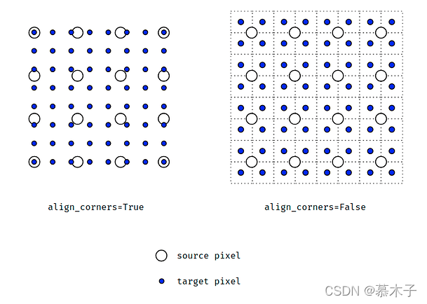

# interpolate

[torch.nn.functional.interpolate - PyTorch Docs](https://docs.pytorch.org/docs/stable/generated/torch.nn.functional.interpolate.html)

Parameters
1. `input` : input tensor
   1. 通常是 3D 或 4D 的特征图 `[N, C, H, W]`
2. `size` / `scale_factor` : tensor interpolated to either the given `size` or the given `scale_factor`，不能同时使用
3. `mode` : 插值算法
   1. `nearest`(default) : 最近邻插值
   2. `linear` & `bilinear` & `trilinear` : 分别用于 1D & 2D & 3D 输入，线性插值，比 nearest 更平滑
   3. `bicubic` : 双三次插值
   4. `area` : 面积插值
   5. `nearest-exact`
4. `align_corners` : 如何对齐输入和输出张量的像素
   1. 
   2. False(default/recommended) : 采样时会超出原本的边角像素值范围，边界点也为预测值，不为原像素值
   3. True : 采样不会超出原本边角像素值范围
5. `recompute_scale_factor` : 处理浮点精度问题
   1. 为 True 时，你必须传入 `scale_factor`，而函数会根据它来计算一个精确的输出尺寸
   2. 通常在 不传入 `size` 而是 传入 `scale_factor` 的时候，设置为 True 以确保数值精度
6. `antialias` : 用于抗锯齿
   1. 下采样时，图像可能会出现锯齿状的混叠伪影
   2. 将 `antialias` 设置为 `True` 可以启用 平滑滤波器，从而生成更平滑、视觉效果更好的下采样图像

