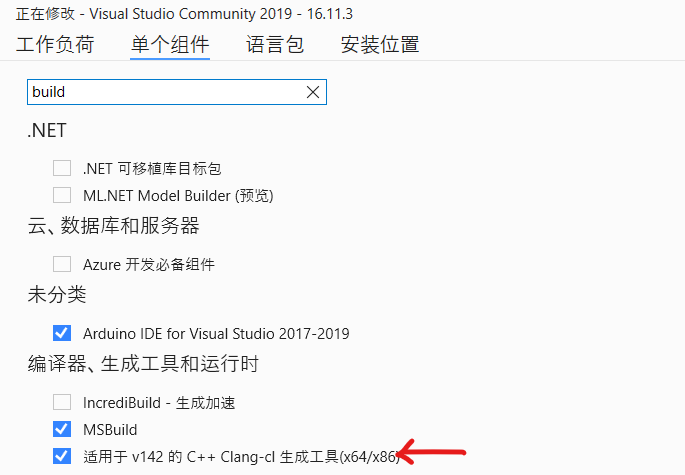

# YOLOv5

[toc]

## Portals

[目标检测 YOLOv5 开源代码项目调试与讲解实战](https://www.bilibili.com/video/BV1tf4y1t7ru)

[gitee yolov5](https://gitee.com/monkeycc/yolov5)

# 目标检测 YOLOv5 -- 土堆

## pycocotools

可能会报错。解决方案，安装visual studio，并且安装其中一个组件。

## 

