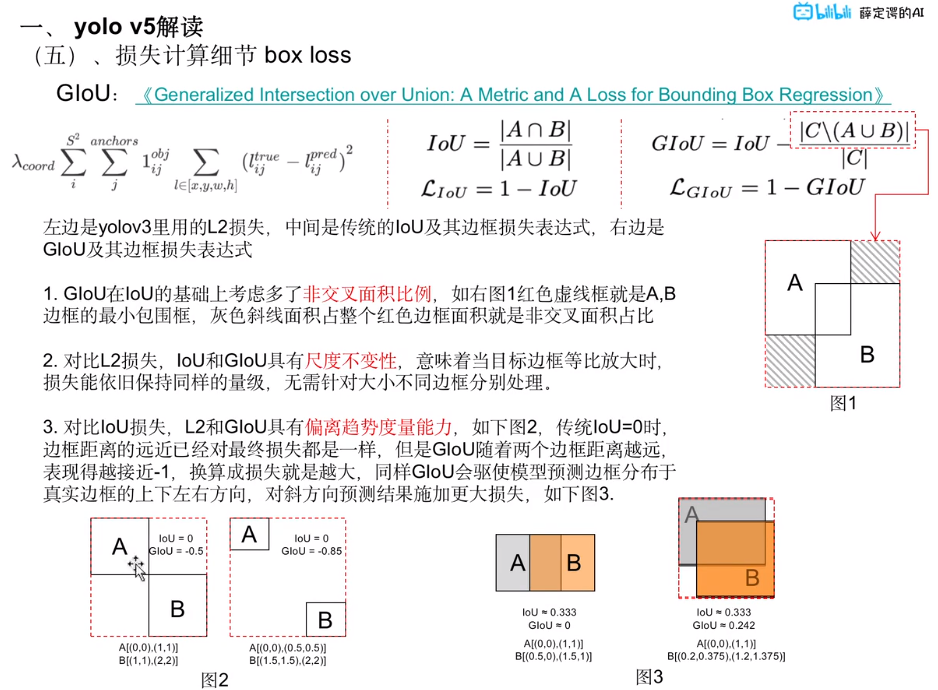
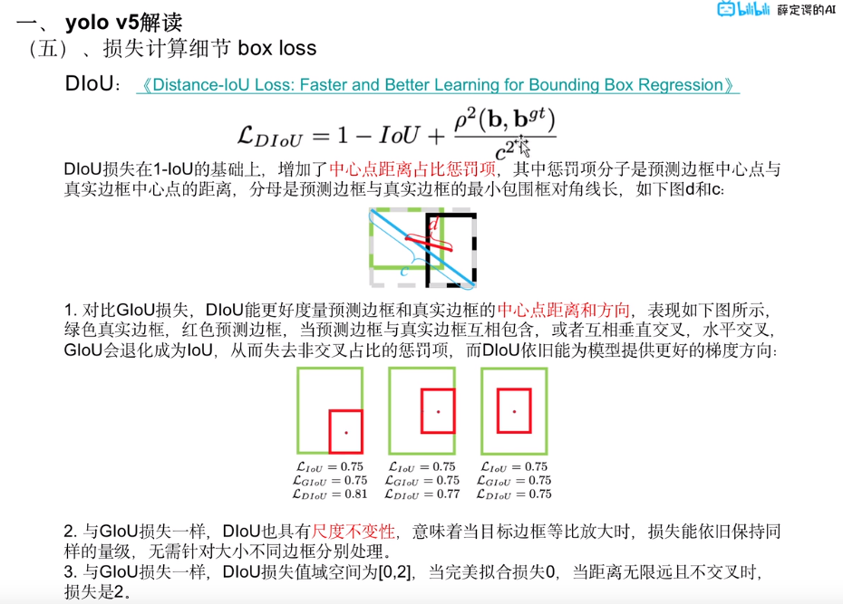
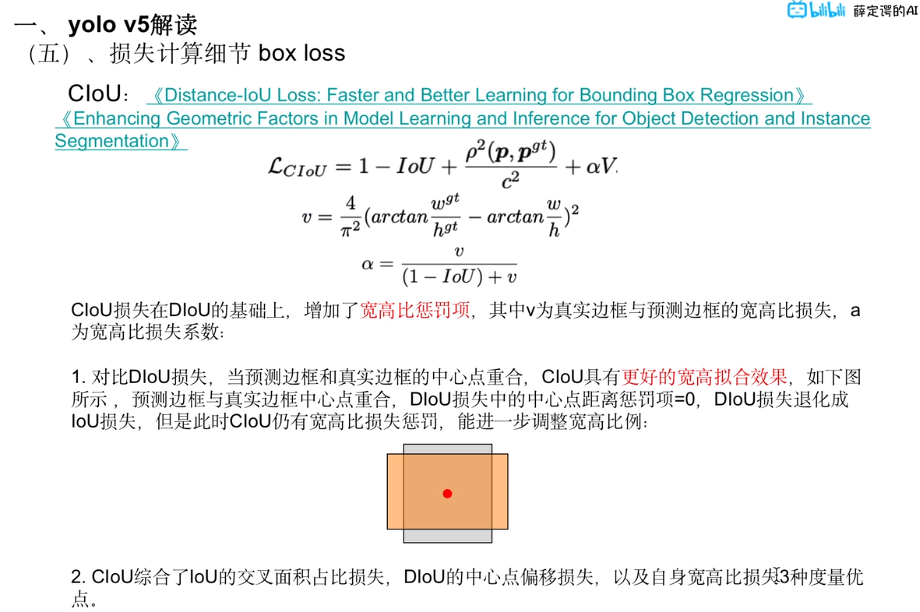
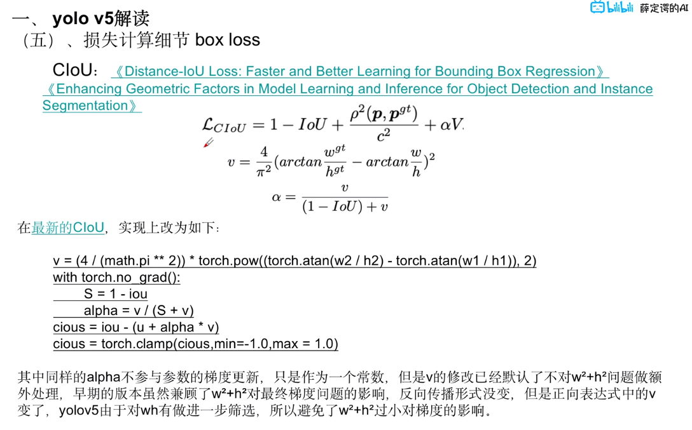
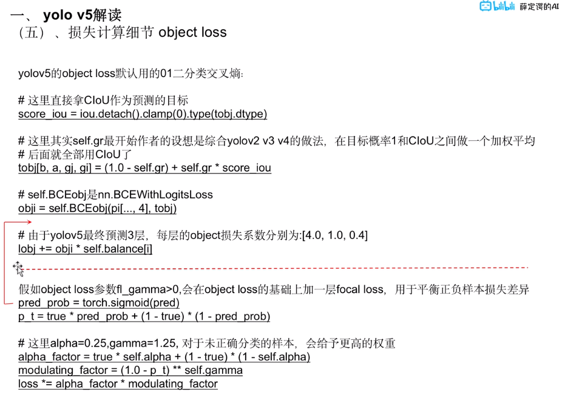
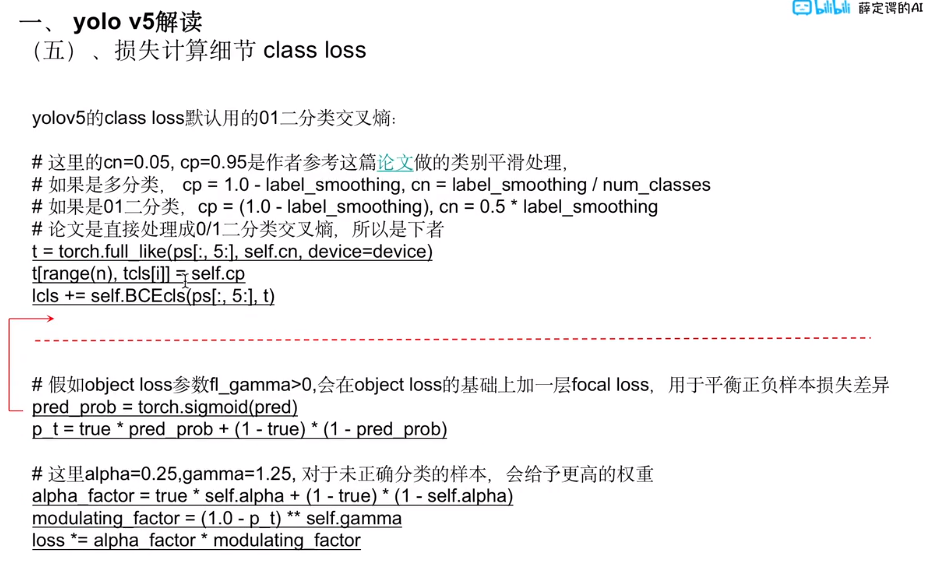

# Yolo

[toc]

# Yolo V8

## Portals

[Yolo V8 Github 官网说明](https://github.com/ultralytics/ultralytics)

[Yolo V8 官方文档](https://docs.ultralytics.com/)


## Install

```bash
# Pip 安装包含所有 requirements 的 ultralytics 包，环境要求 Python>=3.7，且 PyTorch>=1.7 
pip install ultralytics

# YOLOv8 可以直接在命令行界面（CLI）中使用 yolo 命令运行  似乎会下载 一个bus图片 和 一个yolov8n.pt
yolo predict model=yolov8n.pt source='https://ultralytics.com/images/bus.jpg'

# yolo可以用于各种任务和模式，并接受额外的参数，例如 imgsz=640
python3 setup.py install

pip3 install -r requirements.txt
```

## Use

主要 使用 cfg 文件 进行 配置 

对于一个项目，可以创建多个 .cfg 文件，分别用于 train val predict 等等

```bash
yolo cfg=xxx.yaml
```

对于不同任务，model和data需要相应调整。以segmentation为例，model 和 data 需要使用 xxx-seg.yaml

## Mode

可选模式
1. Train: For training a YOLOv8 model on a custom dataset.  # 用自己的数据集训练模型
2. Val: For validating a YOLOv8 model after it has been trained.  # 用于验证训练好的模型
3. Predict: For making predictions using a trained YOLOv8 model on new images or videos.  # 用训练的模型进行预测
4. Export: For exporting a YOLOv8 model to a format that can be used for deployment.  # 导出方便部署的模型
5. Track: For tracking objects in real-time using a YOLOv8 model.  # 将模型用于实时追踪物体
6. Benchmark: For benchmarking YOLOv8 exports (ONNX, TensorRT, etc.) speed and accuracy.  # 

## Position

[dataset].yaml : ultralytics/datasets/coco128-seg.yaml

[network].yaml : ultralytics/models/v8/yolov8-seg.yaml

[cfg].yaml : ultralytics/yolo/cfg/testSeg.yaml

[datasetPos] : datasets/coco128-seg  当然可以自己设定

[network].pt : [project]/[name]/weights/last.pt


## Loss

损失函数(From GPT-4)
1. box_loss：这是边界框损失（Bounding Box Loss），用于衡量预测边界框与实际边界框之间的差距。边界框是用于在图像中识别目标物体的位置的矩形框。常见的边界框损失函数有均方误差（Mean Squared Error, MSE）和交并比损失（Intersection over Union, IoU Loss）等。
2. seg_loss：这是分割损失（Segmentation Loss），用于衡量预测的像素级别的目标分割与实际分割之间的差距。在图像分割任务中，模型需要为每个像素分配一个类别标签，以便详细识别图像中的对象。常见的分割损失函数有交叉熵损失（Cross Entropy Loss）和Dice损失（Dice Loss）等。
3. cls_loss：这是分类损失（Classification Loss），用于衡量预测的目标类别与实际类别之间的差距。分类任务要求模型为输入图像或图像中的物体分配一个或多个类别标签。常见的分类损失函数有交叉熵损失（Cross Entropy Loss）和二元交叉熵损失（Binary Cross Entropy Loss）等。
4. dfl_loss：DFL（Distribution Focal Loss）是一种用于目标检测中的分类损失函数，它是在Focal Loss的基础上进行改进得到的。DFL旨在解决类别分布不均匀的问题，通过对每个类别的损失进行动态调整，使得模型更加关注罕见类别，从而提高模型的性能。与Focal Loss类似，DFL也引入了一个调节因子，但是DFL的调节因子不是固定的，而是根据类别在训练集中的分布进行动态调整。

mAP (mean Average Precision)


## 


# Yolo V5

项目位置 /home/lzy/Project/yolov5

## Portals

[how to train your own custom dataset with YOLOv5 🚀 --- 官方文档](https://docs.ultralytics.com/yolov5/train_custom_data/)
## [yolo v5 解读|训练|复现 --- B站视频](https://www.bilibili.com/video/BV1JR4y1g77H/)


path类里面通过__truediv__方法，将右侧的字符串转为path对象然后拼接到一起


### 数据增强

**数据增强方法** (在yolo v8中也有这些方式，可以在 config/[filename].yaml 中查看)(标签要跟着修改)
1. hsv_h: 0.015  # image HSV-Hue augmentation (fraction)        色调 Hue
2. hsv_s: 0.7  # image HSV-Saturation augmentation (fraction)   饱和度 Saturation 取0-100%
3. hsv_v: 0.4  # image HSV-Value augmentation (fraction)        明度 Value 取0-100%
4. degrees: 0.0  # image rotation (+/- deg)                             旋转(利用齐次变换矩阵)
5. translate: 0.1  # image translation (+/- fraction)                   平移(利用齐次变换矩阵)
6. scale: 0.5  # image scale (+/- gain)                                 缩放(利用齐次变换矩阵)
7. shear: 0.0  # image shear (+/- deg)                                  错切(利用齐次变换矩阵)
8. perspective: 0.0  # image perspective (+/- fraction), range 0-0.001  透视变换(利用齐次变换矩阵)不保证平行关系，常用于OCR
9. flipud: 0.0  # image flip up-down (probability)      上下翻转
10. fliplr: 0.5  # image flip left-right (probability)  左右翻转
11. mosaic: 1.0  # image mosaic (probability)           4图拼接，每一张图片都有其对应的目标框，将四张图片拼接之后就获得一张新的图片，同时也获得对应的框。由于中心点的选取不同，可能会出现目标边框部分被裁剪的情况，可能需要重新计算目标边框。
12. mixup: 0.0  # image mixup (probability)             图像融合，将图像叠加在一起，通过透明度
13. copy_paste: 0.0  # segment copy-paste (probability) 分割填补，将其他图片的实例粘贴过来，将不同图片中的信息进行混合，需要保证IOU不能过大

对于后面有 (probability) 的参数，当等于0时，不使用该数据增强方法

rectangular 同一个batch中作rectangle宽高等比变换，加快训练

### 数据处理源码（没看完）

超参数配置路径 : data/hyps

带注释的配置文件路径 : data/hyps/hyp.no-augmentation.yaml

LoadImagesAndLabels(Yolo) 继承 Dataset(Pytorch)
1. 在 train.py 的 create_dataloader 中被创建
2. LoadImagesAndLabels 的 __ getitem __ 方法中，进行 mosaic，mixup，perspective(random_perspective)，hsv，flip 等操作，函数实现在 augmentations.py 中，相应的标签会进行 clip 限制操作(segment2box)，以及候选对象的过滤(box_candidates，筛去劣质的对象)
3. LoadImagesAndLabels 的 __ init __ 方法中，进行变量的传入，图片路径的获取，会筛选掉不支持的格式，在 dataloaders.py 的 开头处有定义支持的 formats
4. 中间有一些 关于 cache 的操作，以加快处理速度
5. 由 img2label_paths 方法可推出，存放图片和标签的格式因满足 xxx/images 和 xxx/labels


### 损失计算

[yolov5目标检测神经网络——损失函数计算原理](https://zhuanlan.zhihu.com/p/458597638)

在 utils/loss.py 中可以查看，ComputeLoss 类中的 __ call __ 方法，其中也包含了各个损失的权重调整

**box loss**



GIoU仍有缺点



CIoU在DIoU基础上又加入宽高比惩罚项





**object loss**



**class loss**



### 损失计算源码解析


utils/loss.py 的 __ init __ 中
1. autobalance
2. 定义了两个二分类交叉熵的损失构造器，用于类别和目标概率的损失，以及平滑处理
3. focal loss，可以在超参数中进行配置，最初用于图像领域解决数据不平衡造成的模型性能问题(由何恺明提出)，通过动态缩放因子，可以动态降低训练过程中易区分样本的权重，从而将重心快速聚焦在那些难区分的样本


# 其他


**教程**

[yolov5 github 官方页面](https://github.com/ultralytics/yolov5)

[目标检测 YOLOv5 开源代码项目调试与讲解实战【土堆 x 布尔艺数】](https://www.bilibili.com/video/BV1tf4y1t7ru)

[《YOLOv5全面解析教程》九，train.py 逐代码解析](https://zhuanlan.zhihu.com/p/587808267)

[Train Custom Data yolov5 官网说明](https://docs.ultralytics.com/yolov5/train_custom_data/)

[Train Custom Data yolov8 官网说明](https://docs.ultralytics.com/modes/train/)


**工具**

[https://zhuanlan.zhihu.com/p/402114635](图像标注用的工具有哪些)

LabelImg，支持PASCAL VOC 格式和 YOLO 格式，在本机 conda 环境 label 中

Labelme，支持对象检测、图像语义分割数据标注。支持矩形、圆形、线段和点标注;支持视频标注;支持导出 VOC 与 COCO 格式数据实验分割


[cvat官网](https://www.cvat.ai/)

[cvat github 首页](https://github.com/opencv/cvat)