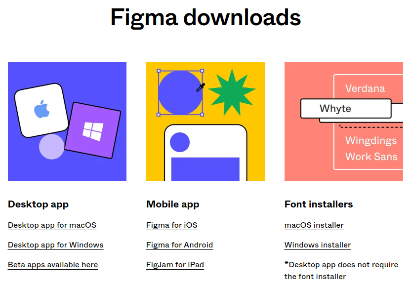
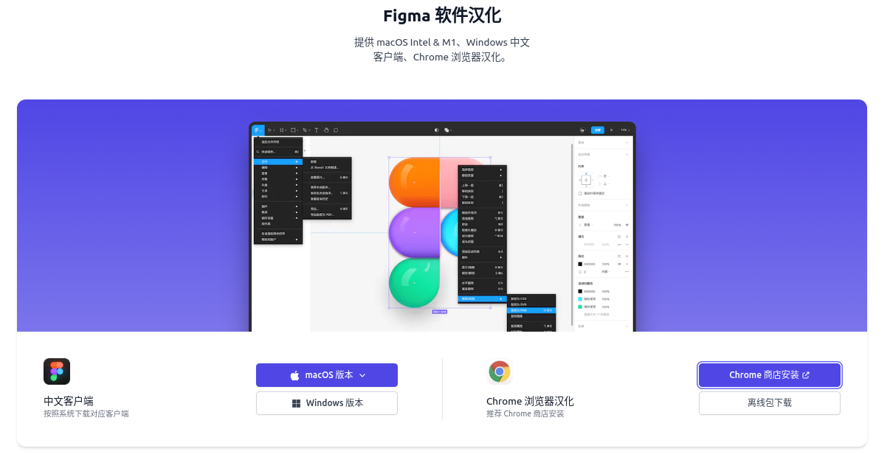
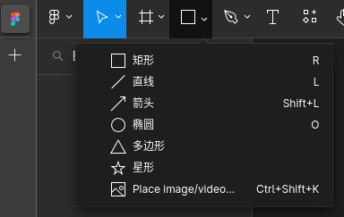
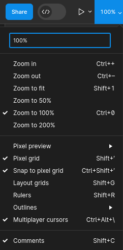
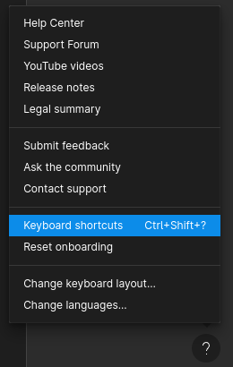
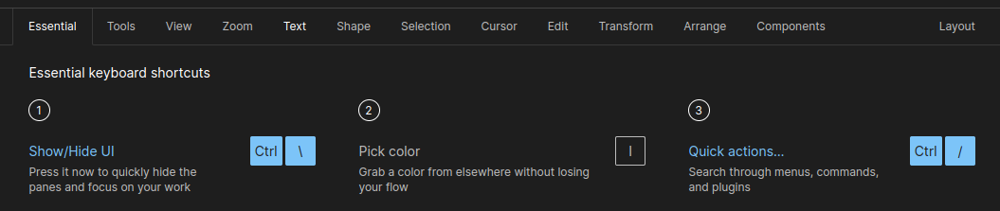
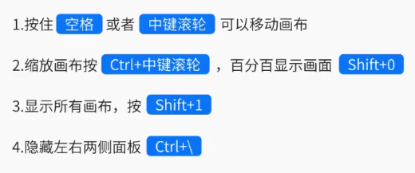

# Figma  


[toc]

[Figma 官网](https://www.figma.com/)

[Figma 中文社区 插件](https://www.figma.cool/plugins/0)

# Figma精讲|Figma工具|Figma应用|Figma学习|Figma项目

[Figma精讲|Figma工具|Figma应用|Figma学习|Figma项目](https://www.bilibili.com/video/BV1wa411V7mU/)

## 01 简介

Sketch 仅支持 苹果电脑

国内
1. Pixso
2. 蓝湖-Master

Figma优势
1. 团队协作 -- 支持多人线上同步协作
2. 开源社区 -- 免费资源
3. 操作体验 -- 流畅


## 02 安装与汉化

### 客户端汉化

[Figma downloads -- Font installers](https://www.figma.com/downloads/)



### 网页端汉化

[Figma 汉化 (FigmaCN 首页位置)](https://www.figma.cool/#Figma%20%E6%B1%89%E5%8C%96)

[Figma 汉化 (插件页面)](https://www.figma.cool/cn)



浏览器插件，直接通过应用商店，安装失败。最终通过下载离线包安装，汉化效果如下



记得重启浏览器，生效插件

## 03 基础操作

### 快捷键



```Ctrl + \``` 隐藏两侧任务栏，方便查看设计文件

点击'?'，键盘快捷键



出现下方提示





### 移动缩放工具


# 素材链接

## 数据可视化大屏素材

[可视化大屏设计素材 (收费)](https://www.nbchart.com/sucai/sucaiInner.php?id=93)

[运维绿色页面图标组件 --- Figma社区](https://www.figma.com/community/file/1220295018522127854)

[数据可视化文件整理（711） --- Figma社区](https://www.figma.com/community/file/1176883366840895093)

[B端界面整合 --- Figma社区](https://www.figma.com/community/file/1184313104451698531)

[驾驶舱+B端后台样式收集整理-711 --- Figma社区](https://www.figma.com/community/file/1180315480312724731)