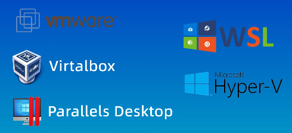
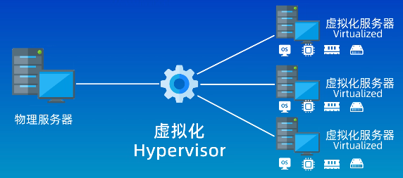
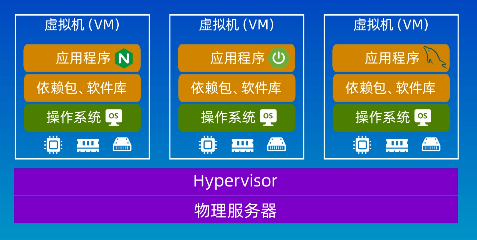
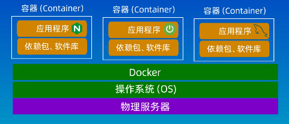
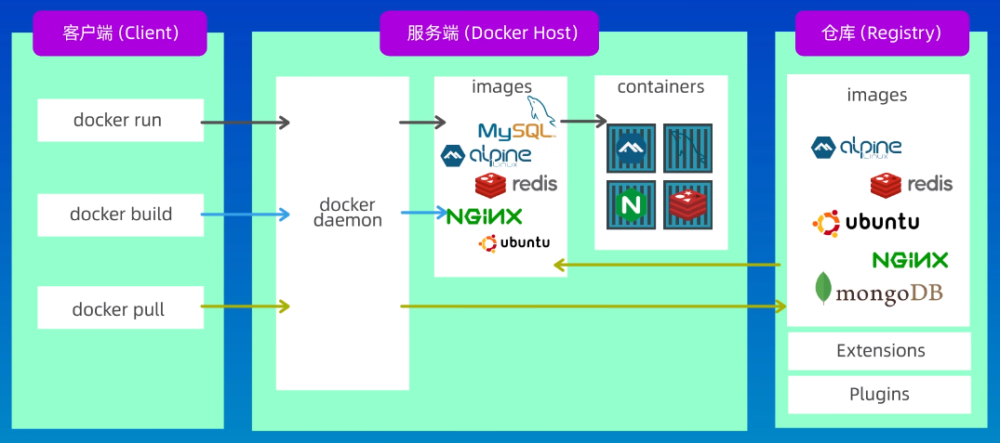
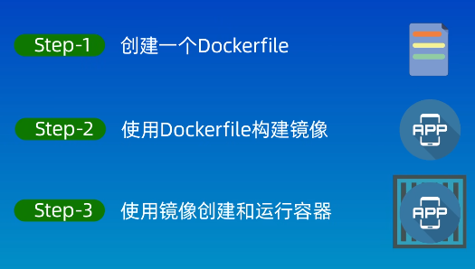
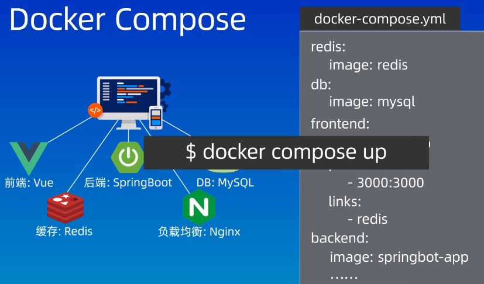
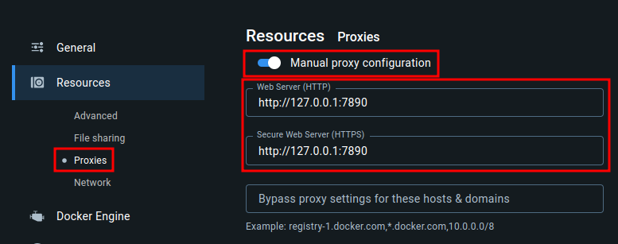

# Docker

# [【GeekHour】30分钟Docker入门教程](https://www.bilibili.com/video/BV14s4y1i7Vf) 

## Docker 简介

用于 构建build、运行run、传送ship 应用程序的平台 


## Docker 和 虚拟机 的区别

虚拟机



使用虚拟化(Hypervisor)技术实现



缺点
1. 占用资源多
2. 启动速度慢

大部分时候不需要整个操作系统的所有功能



容器

容器 ≠ Docker

Docker 只是容器化的解决方案&平台



容器使用宿主机的操作系统

优点
1. 启动速度快
2. 减少资源的浪费（服务器上开更多的容器）

## 基本原理和概念



镜像 image
1. 只读的模板
2. 可以用来创建容器

容器 container
1. 运行实例
2. 提供独立可移植的环境

**镜像&容器 ≈ 类&对象（实例）**

仓库 registry
1. 存储 docker 镜像
2. 最流行的 - docker hub - 公共的，可上传和下载 镜像

docker 使用 client-server 架构模式
1. docker client 和 docker daemon(服务端的守护进程) 之间通过 socket 或 restful api 通信
2. docker client 向 docker daemon 发送请求，docker daemon 接收到请求后进行处理，结果返回给 docker client


# Docker 安装

Windows 中需要开启 Hyper-V 功能

查看版本信息（只看到client说明没有启动docker）

```bash
lzy@Razer:/media/lzy/4D01-C671/Blog (main)$ docker version
Client: Docker Engine - Community
 Cloud integration: v1.0.35+desktop.11
 Version:           25.0.3
 API version:       1.44
 Go version:        go1.21.6
 Git commit:        4debf41
 Built:             Tue Feb  6 21:13:09 2024
 OS/Arch:           linux/amd64
 Context:           desktop-linux

Server: Docker Desktop 4.28.0 (139021)
 Engine:
  Version:          25.0.3
  API version:      1.44 (minimum version 1.24)
  Go version:       go1.21.6
  Git commit:       f417435
  Built:            Tue Feb  6 21:14:25 2024
  OS/Arch:          linux/amd64
  Experimental:     false
 containerd:
  Version:          1.6.28
  GitCommit:        ae07eda36dd25f8a1b98dfbf587313b99c0190bb
 runc:
  Version:          1.1.12
  GitCommit:        v1.1.12-0-g51d5e94
 docker-init:
  Version:          0.19.0
  GitCommit:        de40ad0
```

## 容器化 和 Dockerfile

containerization

容器化三个步骤


Dockerfile - 文本文件 - 包含指令，告诉 docker 构建应用程序镜像所需要的步骤和配置

包含
1. 精简版操作系统
2. 应用程序的运行环境
3. 应用程序
4. 第三方依赖
5. 配置文件
6. 环境变量


## 实践环节

Dockerfile (D大写，无后缀)

```docker
FROM baseImage
<!-- 指定基础镜像 -->

COPY source dest
<!-- 复制文件 源路径（相对Dockerfile） 目标路径（相对镜像） -->

CMD 
<!--  -->
```

```bash
docker build -t [name] .
# .表示当前目录
```

查看镜像位置
```bash
docker image ls
# 或
docker images
```

```bash
lzy@Razer:/media/lzy/4D01-C671/Blog/Docker/HelloDocker (main)$ docker image ls
REPOSITORY        TAG       IMAGE ID       CREATED          SIZE
hello-my-docker   latest    6d2dd257ed27   15 minutes ago   119MB
```
TAG - 版本(不指定默认为latest)


```bash
docker run [name]
```

如果想在另一环境运行，仅需复制镜像，再run

也可以将镜像上传仓库，使用docker pull

[Play with Docker 网站](https://labs.play-with-docker.com/#)

可以使用命令行运行

## Docker Desktop

volumes - 逻辑卷

docker容器中的数据不会持久化，容器停止后，所有数据会丢失

如果想要持久化，则使用逻辑卷，可以将容器中的目录或指定路径映射到宿主机，保存在宿主机的磁盘中

Dev Environments 用于配置开发环境

## Docker Compose





# 安装 Docker & Docker Desktop

## 官方安装教程

[Install Docker Desktop on Ubuntu - Docker官方](https://docs.docker.com/desktop/install/ubuntu/)
1. Set up Docker's package repository. See step one of Install using the apt repository.[Install Docker Engine on Ubuntu - Docker官方](https://docs.docker.com/engine/install/ubuntu/#install-using-the-repository)
   1. Set up Docker's apt repository.
      ```bash
      # Add Docker's official GPG key:
      sudo apt-get update
      sudo apt-get install ca-certificates curl
      sudo install -m 0755 -d /etc/apt/keyrings
      sudo curl -fsSL https://download.docker.com/linux/ubuntu/gpg -o /etc/apt/keyrings/docker.asc
      sudo chmod a+r /etc/apt/keyrings/docker.asc

      # Add the repository to Apt sources:
      echo \
      "deb [arch=$(dpkg --print-architecture) signed-by=/etc/apt/keyrings/docker.asc] https://download.docker.com/linux/ubuntu \
      $(. /etc/os-release && echo "$VERSION_CODENAME") stable" | \
      sudo tee /etc/apt/sources.list.d/docker.list > /dev/null
      sudo apt-get update
      ```
   2. Install the Docker packages.
      ```bash
      sudo apt-get install docker-ce docker-ce-cli containerd.io docker-buildx-plugin docker-compose-plugin
      ```
   3. Verify that the Docker Engine installation is successful by running the hello-world image.
      ```bash
      sudo docker run hello-world
      ```
2. Download latest DEB package.
3. Install the package with apt as follows:
   ```bash
   sudo apt-get update
   sudo apt-get install ./docker-desktop-<version>-<arch>.deb
   ```

## 测试与 Docker Hub 的连通性

方法1

```bash
curl -I https://hub.docker.com/

lzy@Razer:~ $ curl -I https://hub.docker.com/
HTTP/1.1 200 Connection established

HTTP/1.1 200 OK
date: Fri, 01 Mar 2024 06:45:05 GMT
content-type: text/html; charset=utf-8
x-xss-protection: 1; mode=block
x-docker-correlation-id: 72d388f1-4298-4511-8c0b-ceac191df541
x-docker-app-version: v3801.0.0
accept-ch: Sec-CH-Prefers-Color-Scheme
vary: Sec-CH-Prefers-Color-Scheme, Accept-Encoding
link: <https://hub.docker.com/>; rel="canonical"
server: nginx
x-frame-options: deny
x-content-type-options: nosniff
strict-transport-security: max-age=31536000
```

## 其他安装教程

```bash
sudo apt update                              # 升级 apt
sudo apt install docker.io docker-compose    # 安装docker
sudo usermod -aG docker ${USER}              # 将当前用户加入 docker组

# 测试
docker ps -a
docker run hello-world
```

## 常见问题

### docker run 命令需要 sudo，导致 vscode 中无法正常使用

```text
permission denied while trying to connect to the Docker daemon socket at unix:///var/run/docker.sock: Get "http://%2Fvar%2Frun%2Fdocker.sock/v1.24/containers/json?all=1": dial unix /var/run/docker.sock: connect: permission denied
```

解决方法

```bash
sudo chmod 666 /var/run/docker.sock
```

### vscode没有运行docker的permission

```bash
sudo groupadd docker             # 创建docker组，如果提示groupadd: group 'docker' already exists，表示这个组之前已经创建
sudo usermod -aG docker $USER    # 添加你的用户到docker组中
newgrp docker                    # 在终端中输入下面的命令更新组
```

### docker-desktop : Depends: docker-ce-cli but it is not installable

[Install using the apt repository - Docker官方](https://docs.docker.com/engine/install/ubuntu/#install-using-the-repository)

```bash
sudo apt install -y ca-certificates curl gnupg lsb-release
sudo mkdir -p /etc/apt/keyrings
curl -fsSL https://download.docker.com/linux/ubuntu/gpg | sudo gpg --dearmor -o /etc/apt/keyrings/docker.gpg
echo \
  "deb [arch=$(dpkg --print-architecture) signed-by=/etc/apt/keyrings/docker.asc] https://download.docker.com/linux/ubuntu \
  $(. /etc/os-release && echo "$VERSION_CODENAME") stable" | \
  sudo tee /etc/apt/sources.list.d/docker.list > /dev/null
sudo apt update
```

### 无法登录 docker desktop

如果 ubuntu 系统配置了 network proxy，则 docker-desktop 也需要配置



**注意 ！！！ 不要手贱把第二行的 http 改成 https**


