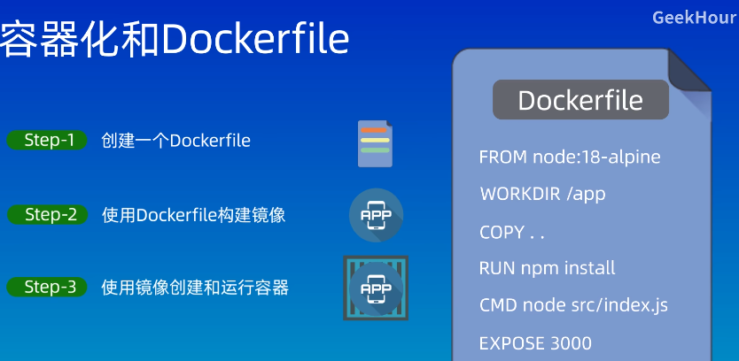
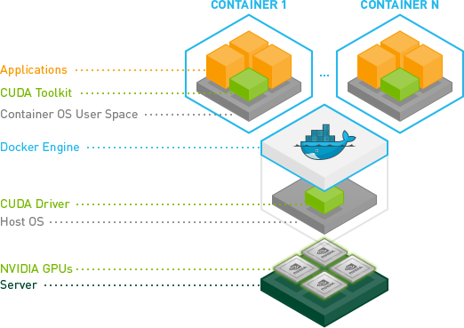

# Docker

[Docker - Official Website](https://www.docker.com/)

[Docker - Docs](https://docs.docker.com/)

Products
1. Docker Desktop
   1. Docker 引擎
   2. Docker CLI - 命令行工具，用于与 Docker 交互
   3. Docker Compose
   4. Kubernetes
2. Docker Hub
   1. 公共镜像库，包含了官方镜像和社区贡献的镜像
   2. 允许用户创建和管理私有镜像库
   3. 提供镜像的版本控制和访问控制
3. Docker Scout
   1. 分析和可视化工具
4. Docker Build Cloud
   1. 云端的构建服务，用于在云环境中构建 Docker 镜像


---

## Table of Contents


- [Docker](#docker)
  - [Table of Contents](#table-of-contents)
- [Docker 入门](#docker-入门)
  - [00. Docker 简介](#00-docker-简介)
  - [01. Docker 和 虚拟机 的区别](#01-docker-和-虚拟机-的区别)
  - [02. 基本原理和概念](#02-基本原理和概念)
  - [03. Docker 安装](#03-docker-安装)
  - [04. 容器化 和 Dockerfile](#04-容器化-和-dockerfile)
  - [05. 实践环节](#05-实践环节)
  - [06. Docker Desktop (图形化界面)](#06-docker-desktop-图形化界面)
  - [07. Docker Compose](#07-docker-compose)
  - [08. VPS \& ECS](#08-vps--ecs)
  - [09. Namespace \& Cgroup](#09-namespace--cgroup)
  - [10. Docker Swarm (K8s 竞品)](#10-docker-swarm-k8s-竞品)
  - [11. Kubernetes(k8s)](#11-kubernetesk8s)
- [Docker 1小时快速上手教程，无废话纯干货](#docker-1小时快速上手教程无废话纯干货)
  - [Docker 简介](#docker-简介)
  - [镜像加速源](#镜像加速源)
  - [用 Docker 快速安装软件](#用-docker-快速安装软件)
- [Docker最新超详细版教程通俗易懂 - 狂神说Java](#docker最新超详细版教程通俗易懂---狂神说java)
- [安装 Docker \& Docker Desktop](#安装-docker--docker-desktop)
  - [官方安装教程](#官方安装教程)
  - [测试与 Docker Hub 的连通性](#测试与-docker-hub-的连通性)
  - [其他安装教程](#其他安装教程)
  - [常见问题](#常见问题)
    - [docker run 命令需要 sudo，导致 vscode 中无法正常使用](#docker-run-命令需要-sudo导致-vscode-中无法正常使用)
    - [vscode没有运行docker的permission](#vscode没有运行docker的permission)
    - [docker-desktop : Depends: docker-ce-cli but it is not installable](#docker-desktop--depends-docker-ce-cli-but-it-is-not-installable)
    - [无法登录 docker desktop](#无法登录-docker-desktop)
- [NVIDIA Container Toolkit 安装 - nvidia-docker](#nvidia-container-toolkit-安装---nvidia-docker)
  - [Installing the NVIDIA Container Toolkit](#installing-the-nvidia-container-toolkit)
  - [Configuration](#configuration)
  - [Docker Hub nvidia/cuda Images](#docker-hub-nvidiacuda-images)
  - [Running a Sample Workload](#running-a-sample-workload)
- [Docker 三大版本](#docker-三大版本)

---

# Docker 入门

[【GeekHour】30分钟Docker入门教程](https://www.bilibili.com/video/BV14s4y1i7Vf)


## 00. Docker 简介

用于 构建build、运行run、传送ship 应用程序的平台


## 01. Docker 和 虚拟机 的区别

**虚拟机**


使用虚拟化(Hypervisor)技术实现，将物理资源虚拟为多个逻辑资源(有各自的 OS、CPU、Memory、Network 可以独立运行)


特点
1. 占用资源多
2. 启动速度慢
3. 有一个额外的**虚拟化层**
4. 需要运行一个**完整的操作系统内核**
5. 提供**操作系统级的隔离**，更加彻底，但也更加重量级

大部分时候不需要整个操作系统的所有功能


**容器** - 运行在宿主机操作系统上的轻量级虚拟化实例，容器共享宿主机的操作系统内核

**容器 ≠ Docker** - Docker 只是容器化的解决方案 & 平台


容器 使用 **宿主机的操作系统**

特点
1. 启动速度快
2. 减少资源的浪费(物理服务器上开更多的容器)，性能接近原生
3. 容器共享宿主机内核
4. 提供**进程级的隔离**，适合微服务架构和应用程序容器化

将 `程序` 和 `环境` 一起打包


操作系统 分为 `用户空间` & `内核空间`，应用程序运行在 `用户空间`

**容器 与 宿主机的操作系统内核 共享**，因此不能直接在 Ubuntu 宿主机上运行为 Windows 操作系统设计的 Docker 镜像

Ubuntu 镜像**包含了独立于宿主机的 Ubuntu 操作系统的用户空间**，但**并不包含操作系统内核**。包含内容如下:
1. 文件系统 - `/bin`, `/lib`, `/etc`, `/usr`
2. 命令行工具 - `bash`, `ls`, `cp`, `mv`, `grep`
3. 系统库 - GNU C 库(glibc) 等
4. 包管理器 - `apt`
5. 默认配置文件 - 网络配置、用户配置等，在`/etc` 目录下
6. 其他基础设施 - 网络工具 等

## 02. 基本原理和概念


Docker **容器 是由 镜像 启动的**，**镜像 包含了运行应用程序所需的所有文件和依赖**
1. 镜像是分层的，每一层都代表镜像的一次变更
2. 容器启动时，会从镜像创建一个只读层，并在其上添加一个可写层，容器运行时的所有修改都会记录在这个可写层上

**镜像&容器 ≈ 类&对象(实例)** ≈ 食谱&菜

**镜像 image** - docker build 写好的 Dockerfile 构建环境 & 应用程序 并 打包为 image
1. 只读的模板
2. 可以用来创建容器

**容器 container** - docker run 镜像 得到 容器
1. 运行实例
2. 提供独立可移植的环境

**仓库 registry**
1. 存储 docker 镜像
2. 最流行的 - **docker hub** - 公共的，可上传和下载 镜像

docker 使用 **Client-Server** 架构模式
1. docker client 和 docker daemon(服务端的守护进程) 之间通过 socket 或 restful api 通信
2. docker client 向 docker daemon 发送请求，docker daemon 接收到请求后进行处理，结果返回给 docker client


docker daemon 分为
1. docker server 层
   1. 本质是 http 服务器
   2. 对外提供操作 容器 & 镜像 的API
   3. 接收到请求后分发任务给engine层
2. engine 层
   1. 创建 job
   2. job 实际执行工作

[RESTful 个人笔记](../Software/restful.md)

## 03. Docker 安装

Windows 中需要开启 Hyper-V 功能

查看版本信息 - 只看到 client 说明没有启动 Docker

```bash
lzy@Razer:/media/lzy/4D01-C671/Blog (main)$ docker version
Client: Docker Engine - Community
 Cloud integration: v1.0.35+desktop.11
 Version:           25.0.3
 API version:       1.44
 Go version:        go1.21.6
 Git commit:        4debf41
 Built:             Tue Feb  6 21:13:09 2024
 OS/Arch:           linux/amd64
 Context:           desktop-linux

Server: Docker Desktop 4.28.0 (139021)
 Engine:
  Version:          25.0.3
  API version:      1.44 (minimum version 1.24)
  Go version:       go1.21.6
  Git commit:       f417435
  Built:            Tue Feb  6 21:14:25 2024
  OS/Arch:          linux/amd64
  Experimental:     false
 containerd:
  Version:          1.6.28
  GitCommit:        ae07eda36dd25f8a1b98dfbf587313b99c0190bb
 runc:
  Version:          1.1.12
  GitCommit:        v1.1.12-0-g51d5e94
 docker-init:
  Version:          0.19.0
  GitCommit:        de40ad0
```

## 04. 容器化 和 Dockerfile

容器化 containerization
1. 将应用程序及其所有依赖项打包在一个称为容器的标准化单元中
2. 应用程序可以在任何环境中一致地运行，开发、测试、生产
3. 允许多个容器在同一主机上运行，每个容器相互隔离，但共享操作系统内核

容器化三个步骤


**Dockerfile** - 文本文件
1. 包含指令 - 告诉 docker 构建应用程序镜像所需要的步骤和配置
2. 可以用于 安装依赖库、创建文件夹

包含
1. 精简版操作系统 - alpine(轻量级的 Linux 发行版)
2. 应用程序的运行环境 - python、java、nodejs
3. 应用程序 - jar包
4. 第三方依赖
5. 配置文件
6. 环境变量


## 05. 实践环节

Dockerfile (D大写，无后缀)

```Dockerfile
# 指定基础镜像
FROM ubuntu:22.04

RUN apt update

RUN apt install -y nodejs npm

RUN npm install

WORKDIR /home/lzy

# 复制文件
COPY index.js WORKDIR/index.js
# 源路径 - 相对Dockerfile
# 目标路径 - 相对镜像

# 暴露应用程序运行的端口
EXPOSE 3000

CMD ["node", "WORKDIR/index.js"]
```

`RUN` - 用于在镜像构建时执行命令，生成新的镜像层
1. 安装软件包
2. 修改文件系统
3. 下载和解压文件


`CMD` - 用于在容器启动时指定默认执行的命令
1. CMD 指令在容器启动时执行
2. 每个 Dockerfile 只能有一个 CMD 指令
   1. 如果定义了多个，则只有最后一个生效

```bash
docker build -t ImageName[:Version] .
# . 表示当前目录
# version 可以不写，默认 latest
```

查看镜像 Repository
```bash
docker image ls
# 或
docker images
```

```bash
lzy@Razer:/media/lzy/4D01-C671/Blog/Docker/HelloDocker (main)$ docker image ls
REPOSITORY        TAG       IMAGE ID       CREATED          SIZE
hello-my-docker   latest    6d2dd257ed27   15 minutes ago   119MB
```
TAG - 版本(不指定默认为latest)


```bash
docker run [name]
```

如果想在另一环境运行，仅需复制镜像，再run

也可以将镜像上传仓库，使用docker pull

[Play with Docker 网站](https://labs.play-with-docker.com/#)

可以使用命令行运行

## 06. Docker Desktop (图形化界面)

**volumes - 逻辑卷**

docker 容器中的数据不会持久化，容器停止后，所有数据会丢失

想要持久化，则使用**逻辑卷**

将容器中的目录或指定路径映射到宿主机，保存在宿主机的磁盘中

Dev Environments 用于配置开发环境

## 07. Docker Compose


Docker 官方 开源


多个服务独立 但 需要相互配合


docker-compose.yaml 配置文件 将容器组合，形成项目

写明 部署哪些？部署顺序？占用CPU&内存信息？

用一条命令 启动、停止、重建 项目

```bash
docker compose up
```

## 08. VPS & ECS

VPS - virtual private server
1. 物理机 分割出 多个虚拟机
2. 包含 OS、CPU、Memory、Disk、Network
3. 不支持自主升降级
4. 资源预先分配，不易动态调整

ECS - Elastic Compute Service
1. VPS + 自主升降级功能

物理机 运行 ECS，ECS 运行 容器

多个 Docker 容器 共享一个 ECS实例

## 09. Namespace & Cgroup

在容器技术 (Docker、Kubernetes) 中，namespace 和 cgroup 被结合使用以提供强大的隔离和资源管理功能
1. Namespace 提供了不同容器之间的系统资源隔离，使得每个容器拥有独立的文件系统、网络环境和进程空间
2. Cgroup 提供了资源使用的限制和监控，确保不同容器之间的资源分配公平且受控


**namespace** 是一种内核功能，用于隔离不同进程之间的全局系统资源，使得容器之间相互独立
1. PID namespace - 隔离进程 ID，确保不同容器中的进程可以拥有相同的 PID
2. NET namespace - 隔离网络资源，如网络接口、IP 地址和路由表
3. IPC namespace - 隔离进程间通信资源，如信号量、消息队列和共享内存
4. USER namespace - 隔离用户和组 ID，允许在容器内部映射不同的用户和组 ID
5. CGROUP namespace - 隔离和控制 cgroup 名字空间，使容器对资源的使用更加独立


**cgroup** (Control Group) 是 Linux 内核的一个特性，用于限制、记录和隔离进程组所使用的资源
1. CPU
2. 内存
3. 磁盘 I/O
4. 网络带宽

## 10. Docker Swarm (K8s 竞品)


解决服务 在 服务器集群 的部署

## 11. Kubernetes(k8s)

**容器编排引擎** (以API编程的方式管理安排各个容器的引擎)

在多台node的服务器上调度 Pod 进行部署 & 扩缩容

Pod 内含有 多个 container

Pod 类似与 Docker Compose 的结果


---

# [Docker 1小时快速上手教程，无废话纯干货](https://www.bilibili.com/video/BV11L411g7U1/)

[Docker 快速入门](https://docker.easydoc.net)

## Docker 简介

可以理解为一个轻量的虚拟机，它只虚拟你软件需要的运行环境，多余的一点都不要，而普通虚拟机则是一个完整而庞大的系统，包含各种不管你要不要的软件。

|特性|普通虚拟机|Docker|
|----|--------|------|
|跨平台|通常只能在桌面级系统运行，例如 Windows/Mac，无法在不带图形界面的服务器上运行|支持的系统非常多，各类 windows 和 Linux 都支持|
|性能|性能损耗大，内存占用高，因为是把整个完整系统都虚拟出来了|性能好，只虚拟软件所需运行环境，最大化减少没用的配置|
|自动化|需要手动安装所有东西|一个命令就可以自动部署好所需环境|
|稳定性|稳定性不高，不同系统差异大|稳定性好，不同系统都一样部署方式|

**打包、分发、部署**
1. **打包**：就是把你软件运行所需的依赖、第三方库、软件打包到一起，变成一个安装包
2. **分发**：你可以把你打包好的“安装包”上传到一个镜像仓库，其他人可以非常方便的获取和安装
3. **部署**：拿着“安装包”就可以一个命令运行起来你的应用，自动模拟出一摸一样的运行环境，不管是在 Windows/Mac/Linux。

**Docker 通常用来做什么**
1. 应用分发、部署，方便传播给他人安装。特别是开源软件和提供私有部署的应用
2. 快速安装测试/学习软件，用完就丢（类似小程序），不把时间浪费在安装软件上。例如 Redis / MongoDB / ElasticSearch / ELK
3. 多个版本软件共存，不污染系统，例如 Python2、Python3，Redis4.0，Redis5.0
4. Windows 上体验/学习各种 Linux 系统

**镜像**：可以理解为软件安装包，可以方便的进行传播和安装。
**容器**：软件安装后的状态，每个软件运行环境都是独立的、隔离的，称之为容器。

## 镜像加速源


加速地址
1. Docker 中国官方镜像	https://registry.docker-cn.com
2. 科大镜像站	https://docker.mirrors.ustc.edu.cn
3. 腾讯云	https://mirror.ccs.tencentyun.com

## 用 Docker 快速安装软件

[Docker Hub](https://hub.docker.com/)

[docker container run 官方文档（docker docs）](https://docs.docker.com/reference/cli/docker/container/run/)

```bash
docker ps                        查看当前运行中的容器
docker images                    查看镜像列表
docker rm container-id           删除指定 id 的容器
docker stop/start container-id   停止/启动指定 id 的容器
docker rmi image-id              删除指定 id 的镜像
docker volume ls                 查看 volume 列表
docker network ls                查看网络列表
```

---

# Docker最新超详细版教程通俗易懂 - 狂神说Java

[Docker最新超详细版教程通俗易懂 - 狂神说Java](https://www.bilibili.com/video/BV1og4y1q7M4/)


---

# 安装 Docker & Docker Desktop

## 官方安装教程

[Install Docker Desktop on Ubuntu - Docker官方](https://docs.docker.com/desktop/install/ubuntu/)
1. Set up Docker's package repository. See step one of Install using the apt repository.[Install Docker Engine on Ubuntu - Docker官方](https://docs.docker.com/engine/install/ubuntu/#install-using-the-repository)
   1. Set up Docker's apt repository.
      ```bash
      # Add Docker's official GPG key:
      sudo apt-get update
      sudo apt-get install ca-certificates curl
      sudo install -m 0755 -d /etc/apt/keyrings
      sudo curl -fsSL https://download.docker.com/linux/ubuntu/gpg -o /etc/apt/keyrings/docker.asc
      sudo chmod a+r /etc/apt/keyrings/docker.asc

      # Add the repository to Apt sources:
      echo \
      "deb [arch=$(dpkg --print-architecture) signed-by=/etc/apt/keyrings/docker.asc] https://download.docker.com/linux/ubuntu \
      $(. /etc/os-release && echo "$VERSION_CODENAME") stable" | \
      sudo tee /etc/apt/sources.list.d/docker.list > /dev/null
      sudo apt-get update
      ```
   2. Install the Docker packages.
      ```bash
      sudo apt-get install docker-ce docker-ce-cli containerd.io docker-buildx-plugin docker-compose-plugin
      ```
   3. Verify that the Docker Engine installation is successful by running the hello-world image.
      ```bash
      sudo docker run hello-world
      ```
2. Download latest DEB package.
3. Install the package with apt as follows:
   ```bash
   sudo apt-get update
   sudo apt-get install ./docker-desktop-<version>-<arch>.deb
   ```
4. config the proxy via docker-desktop which is same as the proxy of ubuntu (if using clash)
5. [Sign in to Docker Desktop](https://docs.docker.com/desktop/get-started/#credentials-management-for-linux-users)  -- "Unable to log in You must initialize pass"
   ```bash
   gpg --generate-key
   pass init xxxxxxx(between pub and uid)
   ```


## 测试与 Docker Hub 的连通性

方法1

```bash
curl -I https://hub.docker.com/

lzy@Razer:~ $ curl -I https://hub.docker.com/
HTTP/1.1 200 Connection established

HTTP/1.1 200 OK
date: Fri, 01 Mar 2024 06:45:05 GMT
content-type: text/html; charset=utf-8
x-xss-protection: 1; mode=block
x-docker-correlation-id: 72d388f1-4298-4511-8c0b-ceac191df541
x-docker-app-version: v3801.0.0
accept-ch: Sec-CH-Prefers-Color-Scheme
vary: Sec-CH-Prefers-Color-Scheme, Accept-Encoding
link: <https://hub.docker.com/>; rel="canonical"
server: nginx
x-frame-options: deny
x-content-type-options: nosniff
strict-transport-security: max-age=31536000
```

## 其他安装教程

```bash
sudo apt update                              # 升级 apt
sudo apt install docker.io docker-compose    # 安装docker
sudo usermod -aG docker ${USER}              # 将当前用户加入 docker组

# 测试
docker ps -a
docker run hello-world
```

## 常见问题

### docker run 命令需要 sudo，导致 vscode 中无法正常使用

```text
permission denied while trying to connect to the Docker daemon socket at unix:///var/run/docker.sock: Get "http://%2Fvar%2Frun%2Fdocker.sock/v1.24/containers/json?all=1": dial unix /var/run/docker.sock: connect: permission denied
```

解决方法

```bash
sudo chmod 666 /var/run/docker.sock
```

### vscode没有运行docker的permission

```bash
sudo groupadd docker             # 创建docker组，如果提示groupadd: group 'docker' already exists，表示这个组之前已经创建
sudo usermod -aG docker $USER    # 添加你的用户到docker组中
newgrp docker                    # 在终端中输入下面的命令更新组
```

### docker-desktop : Depends: docker-ce-cli but it is not installable

[Install using the apt repository - Docker官方](https://docs.docker.com/engine/install/ubuntu/#install-using-the-repository)

```bash
sudo apt install -y ca-certificates curl gnupg lsb-release
sudo mkdir -p /etc/apt/keyrings
curl -fsSL https://download.docker.com/linux/ubuntu/gpg | sudo gpg --dearmor -o /etc/apt/keyrings/docker.gpg
echo \
  "deb [arch=$(dpkg --print-architecture) signed-by=/etc/apt/keyrings/docker.asc] https://download.docker.com/linux/ubuntu \
  $(. /etc/os-release && echo "$VERSION_CODENAME") stable" | \
  sudo tee /etc/apt/sources.list.d/docker.list > /dev/null
sudo apt update
```

### 无法登录 docker desktop

如果 ubuntu 系统配置了 network proxy，则 docker-desktop 也需要配置


**注意 ！！！ 不要手贱把第二行的 http 改成 https**


# NVIDIA Container Toolkit 安装 - nvidia-docker

[NVIDIA Container Toolkit](https://docs.nvidia.com/datacenter/cloud-native/container-toolkit/)

[Docker Hub nvidia/cuda Images](https://hub.docker.com/r/nvidia/cuda)



The NVIDIA Container Toolkit enables users to build and run GPU-accelerated containers. The toolkit includes a container runtime library and utilities to automatically configure containers to leverage NVIDIA GPUs.

NVIDIA 容器工具包使用户能够构建和运行 GPU 加速的容器。该工具包包括一个容器运行时库和自动配置容器以利用 NVIDIA GPU 的实用程序。

## Installing the NVIDIA Container Toolkit

Installing with Apt
1. Configure the production repository
   ```bash
   curl -fsSL https://nvidia.github.io/libnvidia-container/gpgkey | sudo gpg --dearmor -o /usr/share/keyrings/nvidia-container-toolkit-keyring.gpg \
   && curl -s -L https://nvidia.github.io/libnvidia-container/stable/deb/nvidia-container-toolkit.list | \
   sed 's#deb https://#deb [signed-by=/usr/share/keyrings/nvidia-container-toolkit-keyring.gpg] https://#g' | \
   sudo tee /etc/apt/sources.list.d/nvidia-container-toolkit.list
   ```
2. Update the packages list from the repository && Install the NVIDIA Container Toolkit packages
   ```bash
   sudo apt update
   sudo apt install -y nvidia-container-toolkit
   ```

## Configuration

Configure the container runtime by using the nvidia-ctk command
```bash
sudo nvidia-ctk runtime configure --runtime=docker
```

Restart the Docker daemon:
```bash
sudo systemctl restart docker
```


## Docker Hub nvidia/cuda Images

[Docker Hub - nvidia/cuda Images](https://hub.docker.com/r/nvidia/cuda)

```bash
docker pull nvidia/cuda:12.3.2-base-ubuntu22.04

# --rm               Automatically remove the container when it exits
# --runtime string   Runtime to use for this container
# --gpus gpu-request GPU devices to add to the container ('all' to pass all GPUs)

lzy@Razer:/media/lzy/(main)$ sudo docker run --rm --runtime=nvidia --gpus all ubuntu nvidia-smi

Sun Mar  3 13:33:13 2024
+---------------------------------------------------------------------------------------+
| NVIDIA-SMI 545.23.06              Driver Version: 545.23.06    CUDA Version: 12.3     |
|-----------------------------------------+----------------------+----------------------+
| GPU  Name                 Persistence-M | Bus-Id        Disp.A | Volatile Uncorr. ECC |
| Fan  Temp   Perf          Pwr:Usage/Cap |         Memory-Usage | GPU-Util  Compute M. |
|                                         |                      |               MIG M. |
|=========================================+======================+======================|
|   0  NVIDIA GeForce GTX 1060 ...    On  | 00000000:01:00.0 Off |                  N/A |
| N/A   46C    P8               3W /  70W |      6MiB /  6144MiB |      0%      Default |
|                                         |                      |                  N/A |
+-----------------------------------------+----------------------+----------------------+

+---------------------------------------------------------------------------------------+
| Processes:                                                                            |
|  GPU   GI   CI        PID   Type   Process name                            GPU Memory |
|        ID   ID                                                             Usage      |
|=======================================================================================|
+---------------------------------------------------------------------------------------+
```


## Running a Sample Workload

```bash
sudo docker run --rm --runtime=nvidia --gpus all ubuntu nvidia-smi
```


# Docker 三大版本

[docker的版本，你真的搞清楚了吗](https://zhuanlan.zhihu.com/p/305572519)

三大版本发展历史
1. docker.io
   1. 在 Docker 技术出现之前，Linux中已经有一个叫 docker 的工具，这个 docker 是一个窗口停靠栏程序
   2. Docker技术出来以后，由于在Linux系统中软件名不能与 docker 重名，而且那个时候 Docker 的官网是 http://docker.io，所以，就在软件名称上加了 io 的后缀
   3. 在 Ubuntu 中就是docker.io，在 CentOS 中就是docker-io
   4. 随着docker的发展，docker的名称虽然发生了三番五次的变化，但Ubuntu上的http://docker.io却一直在维护，它的版本也在不停地更新
2. docker-engine
   1. 后来随着 Docker 的发展，软件包名改成了 docker-engine，名称达到了统一
3. docker
   1. 再后来，随着 Docker 技术的火爆，Docker 容器技术的软件包名才正式成了 docker 这个名称，Docker软件包的名称又得到了一次统一
   2. docker-ce 社区版，免费
   3. docker-ee 商业版，收费

[Docker 三大版本区别](https://kms.app/archives/324/)

三个版本
1. docker.io
   1. debian/ubuntu 官方基于docker社区源码封装的版本,有时候比docker-ce版本还要新
   2. 特点是将docker的依赖直接转接到主系统上
2. docker-ce
   1. docker.com 放出来的社区版,仅维护源码
   2. 特点是使用golang将依赖封装在一个包中
3. docker-ee
   1. docker.com 维护的商业版,主要有以下三个级别:
      1. 基本:用于认证基础架构的Docker平台,得到Docker Inc.的支持以及来自Docker Store的认证容器和插件
      2. 标准:添加了高级映像和容器管理,LDAP / AD用户集成以及基于角色的访问控制.这些功能共同构成了Docker企业版
      3. 高级:添加Docker安全扫描和连续漏洞监控

docker-ce有一个致命缺陷-依赖: docker本身依赖成百上千个第三方依赖，理论上只要有一个依赖出问题就需要完全重新编译docker,否则会被各种hack:joy:反观 docker.io 将依赖托管给系统,只需要更新docker主程序即可

docker-ce不应该被用于任何期望稳定运行的产品中
推荐使用 docker.io 或者 docker-ee
在产品中使用docker-ce是极度不负责的行为
