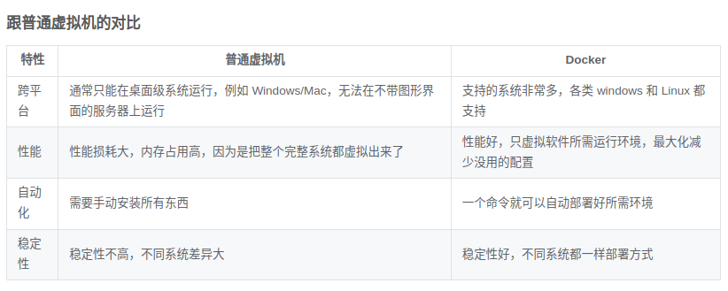
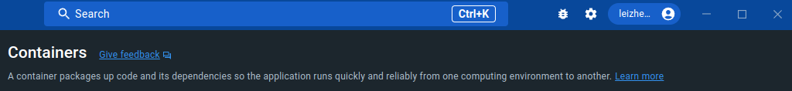
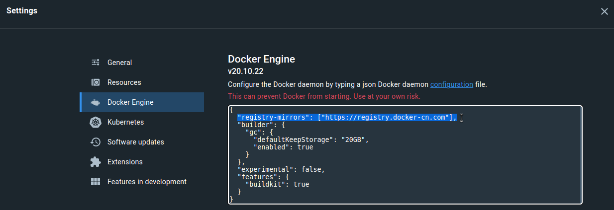
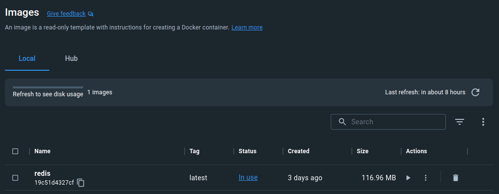
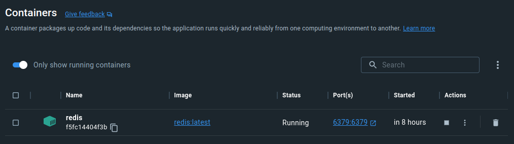

# Docker  

[toc]

## Portals

[Docker 官网](https://www.docker.com/)

[Linux 上 Docker 安装教程](https://docs.docker.com/desktop/install/linux-install/)

[B站 Docker 1小时快速上手教程](https://docker.easydoc.net/doc/81170005/cCewZWoN/lTKfePfP)

[Docker 快速入门 在线文档](https://docker.easydoc.net/doc/81170005/cCewZWoN/lTKfePfP)


# Docker 1小时快速上手教程

## Docker 简介

**是什么**
Docker 是一个应用打包、分发、部署的工具
你也可以把它理解为一个轻量的虚拟机，它**只虚拟你软件需要的运行环境，多余的一点都不要**，
而普通虚拟机则是一个完整而庞大的系统，包含各种不管你要不要的软件。

**与虚拟机对比**


**打包、分发、部署**
1. 打包：就是把你软件运行所需的依赖、第三方库、软件打包到一起，变成一个安装包
2. 分发：你可以把你打包好的“安装包”上传到一个镜像仓库，其他人可以非常方便的获取和安装
3. 部署：拿着“安装包”就可以一个命令运行起来你的应用，自动模拟出一摸一样的运行环境，不管是在 Windows/Mac/Linux。
4. 镜像：可以理解为软件安装包，可以方便的进行传播和安装。
5. 容器：软件安装后的状态，每个软件运行环境都是独立的、隔离的，称之为容器。

**Docker 部署的优势**
常规应用开发部署方式：自己在 Windows 上开发、测试 --> 到 Linux 服务器配置运行环境部署。
问题：我机器上跑都没问题，怎么到服务器就各种问题了

用 Docker 开发部署流程：自己在 Windows 上开发、测试 --> **打包为 Docker 镜像**（可以理解为软件安装包） --> 各种服务器上只需要一个命令部署好
优点：确**保了不同机器上跑都是一致的运行环境**，不会出现我机器上跑正常，你机器跑就有问题的情况。

**Docker 通常用来做什么**
①应用分发、部署，方便传播给他人安装。特别是开源软件和提供私有部署的应用
②快速安装测试/学习软件，用完就丢（类似小程序），不把时间浪费在安装软件上。例如 Redis / MongoDB / ElasticSearch / ELK
③多个版本软件共存，不污染系统，例如 Python2、Python3，Redis4.0，Redis5.0
④Windows 上体验/学习各种 Linux 系统


## Docker 安装


官网说 Docker Desktop 捆绑了 Docker Engine 所以直接安装 Docker Desktop 即可

如果仅希望安装 Engine 可以按照下面的步骤， 如果想要安装 Desktop ，则执行完**Install using the repository**后即可跳转到 Desktop 安装部分

### Install Docker Engine on Ubuntu
[Install Docker Engine on Ubuntu](https://docs.docker.com/engine/install/ubuntu/)

**OS requirements**
```
To install Docker Engine, you need the 64-bit version of one of these Ubuntu versions:
Ubuntu Kinetic 22.10
Ubuntu Jammy 22.04 (LTS)
Ubuntu Focal 20.04 (LTS)
Ubuntu Bionic 18.04 (LTS)
Docker Engine is compatible with x86_64 (or amd64), armhf, arm64, and s390x architectures.
```

**Uninstall old versions**
```shell
# Older versions of Docker went by the names of docker, docker.io, or docker-engine. Uninstall any such older versions before attempting to install a new version:
sudo apt-get remove docker docker-engine docker.io containerd runc

# It’s OK if apt-get reports that none of these packages are installed. 我这里就是这样

# Images, containers, volumes, and networks stored in /var/lib/docker/ aren’t automatically removed when you uninstall Docker. If you want to start with a clean installation, and prefer to clean up any existing data, refer to the uninstall Docker Engine section.
sudo rm -rf /var/lib/docker
sudo rm -rf /var/lib/containerd
```

**Install using the repository**
```shell
# Update the apt package index and install packages to allow apt to use a repository over HTTPS
sudo apt-get update
sudo apt-get install \
    ca-certificates \
    curl \
    gnupg \
    lsb-release

# Add Docker’s official GPG key:
sudo mkdir -p /etc/apt/keyrings
curl -fsSL https://download.docker.com/linux/ubuntu/gpg | sudo gpg --dearmor -o /etc/apt/keyrings/docker.gpg

# Use the following command to set up the repository:
echo \
  "deb [arch=$(dpkg --print-architecture) signed-by=/etc/apt/keyrings/docker.gpg] https://download.docker.com/linux/ubuntu \
  $(lsb_release -cs) stable" | sudo tee /etc/apt/sources.list.d/docker.list > /dev/null
```

**Install Docker Engine**

```shell
# To install the latest version, run:  我这里直接安装最新版，需要特定版本可以去官网查
sudo apt-get install docker-ce docker-ce-cli containerd.io docker-compose-plugin

# Verify that the Docker Engine installation is successful by running the hello-world image:
sudo docker run hello-world
# This command downloads a test image and runs it in a container. When the container runs, it prints a confirmation message and exits.
# 家里网络不稳定，所以用手机热点装的， proxy vpn 啥的也没关

# 输出结果如下
lzy@Razer:~/Project/Blog$ sudo docker run hello-world
Unable to find image 'hello-world:latest' locally
latest: Pulling from library/hello-world
2db29710123e: Pull complete 
Digest: sha256:aa0cc8055b82dc2509bed2e19b275c8f463506616377219d9642221ab53cf9fe
Status: Downloaded newer image for hello-world:latest

Hello from Docker!
This message shows that your installation appears to be working correctly.

To generate this message, Docker took the following steps:
 1. The Docker client contacted the Docker daemon.
 2. The Docker daemon pulled the "hello-world" image from the Docker Hub.
    (amd64)
 3. The Docker daemon created a new container from that image which runs the
    executable that produces the output you are currently reading.
 4. The Docker daemon streamed that output to the Docker client, which sent it
    to your terminal.

To try something more ambitious, you can run an Ubuntu container with:
 $ docker run -it ubuntu bash

Share images, automate workflows, and more with a free Docker ID:
 https://hub.docker.com/

For more examples and ideas, visit:
 https://docs.docker.com/get-started/

 # You have now successfully installed and started Docker Engine. The docker user group exists but contains no users, which is why you’re required to use sudo to run Docker commands. Continue to Linux post-install to allow non-privileged users to run Docker commands and for other optional configuration steps.
```

**卸载 in case 不要了**
[Uninstall Docker Engine](https://docs.docker.com/engine/install/ubuntu/#uninstall-docker-engine)

### Docker Engine post-installation steps

[Docker Engine post-installation steps](https://docs.docker.com/engine/install/linux-postinstall/)

**Manage Docker as a non-root user**
第一次安装先不弄了，意思就是用docker需要sudo一下

**Configure Docker to start on boot with systemd**
```shell
# Many modern Linux distributions use systemd to manage which services start when the system boots. On Debian and Ubuntu, the Docker service starts on boot by default. To automatically start Docker and containerd on boot for other Linux distributions using systemd, run the following commands:
sudo systemctl enable docker.service
sudo systemctl enable containerd.service

# To stop this behavior, use disable instead.
sudo systemctl disable docker.service
sudo systemctl disable containerd.service
```

### Install Docker Desktop on Ubuntu

**检查 KVM virtualization support**
[Install on Linux](https://docs.docker.com/desktop/install/linux-install/)
```shell
lzy@Razer:~/Project/Blog$ modprobe kvm
kvm-amd    kvmgt      kvm-intel  

lzy@Razer:~/Project/Blog$ modprobe kvm-intel 
# 我的电脑是intel 所以执行 modprobe kvm-intel
# 执行 modprobe kvm-amd 会 modprobe: ERROR: could not insert 'kvm_amd': Operation not permitted

lzy@Razer:~/Project/Blog$ lsmod | grep kvm
kvm_intel             368640  0
kvm                  1028096  1 kvm_intel

#  check ownership of /dev/kvm
lzy@Razer:~/Project/Blog$ ls -al /dev/kvm
crw-rw----+ 1 root kvm 10, 232  1月 18 23:10 /dev/kvm
# c表示设备文件里面的串行端口设备

# Add your user to the kvm group in order to access the kvm device:
lzy@Razer:~/Project/Blog$ sudo usermod -aG kvm $USER
[sudo] password for lzy: 

lzy@Razer:~/Project/Blog$ echo $USER
lzy
# Log out and log back in so that your group membership is re-evaluated.
```
[Install on Ubuntu](https://docs.docker.com/desktop/install/ubuntu/)

**查看系统要求（对于 Ubuntu 安装 Docker Desktop）**
Have a 64-bit version of either Ubuntu Jammy Jellyfish 22.04 (LTS) or Ubuntu Impish Indri 21.10. Docker Desktop is supported on x86_64 (or amd64) architecture.

```shell
# For non-Gnome Desktop environments, gnome-terminal must be installed
sudo apt install gnome-terminal
# Uninstall the tech preview or beta version of Docker Desktop for Linux. Run:
sudo apt remove docker-desktop
# For a complete cleanup, remove configuration and data files at $HOME/.docker/desktop, the symlink at /usr/local/bin/com.docker.cli, and purge the remaining systemd service files.
rm -r $HOME/.docker/desktop
sudo rm /usr/local/bin/com.docker.cli
sudo apt purge docker-desktop
# 我是第一次装所以可以不用卸载
# If you have installed the Docker Desktop for Linux tech preview or beta version, you need to remove all files that were generated by those packages (e.g., ~/.config/systemd/user/docker-desktop.service, ~/.local/share/systemd/user/docker-desktop.service).

# Download latest DEB package. 官网下载即可
# Install the package with apt as follows:
sudo apt-get install ./docker-desktop-4.16.1-amd64.deb 
# At the end of the installation process, apt displays an error due to installing a downloaded package. You can ignore this error message.
# 报错信息忽略即可: N: Download is performed unsandboxed as root as file '/home/lzy/Downloads/docker-desktop-4.16.1-amd64.deb' couldn't be accessed by user '_apt'. - pkgAcquire::Run (13: Permission denied)

# There are a few post-install configuration steps done through the post-install script contained in the deb package.
# The post-install script: 感觉是安装deb的时候自动做了
# Sets the capability on the Docker Desktop binary to map privileged ports and set resource limits.
# Adds a DNS name for Kubernetes to /etc/hosts.
# Creates a link from /usr/bin/docker to /usr/local/bin/com.docker.cli.
```

### Quick Start Guide and sign in
[Quick Start Guide and sign in](https://docs.docker.com/desktop/get-started)
[Explore Docker Desktop and its features](https://docs.docker.com/desktop/use-desktop/)

不经过后续步骤无法登录账号

```shell
# Docker Desktop relies on pass to store credentials in gpg2-encrypted files. Before signing in to Docker Hub from the Docker Dashboard or the Docker menu, you must initialize pass. Docker Desktop displays a warning if you’ve not initialized pass.
# You can initialize pass by using a gpg key. To generate a gpg key, run:
lzy@Razer:~/Downloads$ gpg --generate-key
gpg (GnuPG) 2.2.27; Copyright (C) 2021 Free Software Foundation, Inc.
This is free software: you are free to change and redistribute it.
There is NO WARRANTY, to the extent permitted by law.

gpg: directory '/home/lzy/.gnupg' created
gpg: keybox '/home/lzy/.gnupg/pubring.kbx' created
Note: Use "gpg --full-generate-key" for a full featured key generation dialog.

GnuPG needs to construct a user ID to identify your key.

Real name: leizhenyu
Email address: lzy20190501@gmail.com
You selected this USER-ID:
    "leizhenyu <lzy20190501@gmail.com>"

Change (N)ame, (E)mail, or (O)kay/(Q)uit? O
We need to generate a lot of random bytes. It is a good idea to perform
some other action (type on the keyboard, move the mouse, utilize the
disks) during the prime generation; this gives the random number
generator a better chance to gain enough entropy.
We need to generate a lot of random bytes. It is a good idea to perform
some other action (type on the keyboard, move the mouse, utilize the
disks) during the prime generation; this gives the random number
generator a better chance to gain enough entropy.
gpg: /home/lzy/.gnupg/trustdb.gpg: trustdb created
gpg: key EA07F3126F3A3F12 marked as ultimately trusted
gpg: directory '/home/lzy/.gnupg/openpgp-revocs.d' created
gpg: revocation certificate stored as '/home/lzy/.gnupg/openpgp-revocs.d/74E5BC6AE075CBAD894702F5EA07F3126F3A3F12.rev'
public and secret key created and signed.

pub   rsa3072 2023-01-18 [SC] [expires: 2025-01-17]
      74E5BC6AE075CBAD894702F5EA07F3126F3A3F12  # 这个key后面会用到
uid                      leizhenyu <lzy20190501@gmail.com>
sub   rsa3072 2023-01-18 [E] [expires: 2025-01-17]


# To initialize pass, run the following command using the public key generated from the previous command:
lzy@Razer:~/Downloads$ pass init 74E5BC6AE075CBAD894702F5EA07F3126F3A3F12  # 这个后面这一串可以从上面生成的结果查看
mkdir: created directory '/home/lzy/.password-store/'
Password store initialized for 74E5BC6AE075CBAD894702F5EA07F3126F3A3F12

# Once pass is initialized, you can sign in on the Docker Dashboard and pull your private images. When credentials are used by the Docker CLI or Docker Desktop, a user prompt may pop up for the password you set during the gpg key generation.
# docker pull molly/privateimage
```
之后点击右上角的Sign In然后就可以登录了



### 设置 Docker 镜像加速源
在 setting 中的 Docker Engine 添加一行(注意逗号)
```shell
"registry-mirrors": ["https://registry.docker-cn.com", https://docker.mirrors.ustc.edu.cn],
```
可以添加多个，在中括号中逗号分开即可




## Docker 快速安装软件

[docker run 官网](https://docs.docker.com/engine/reference/commandline/run/)

**直接安装的缺点**
1. 安装麻烦，可能有各种依赖，运行报错。例如：WordPress，ElasticSearch，Redis，ELK
2. 可能对 Windows 并不友好，运行有各种兼容问题，软件只支持 Linux 上跑
3. 不方便安装多版本软件，不能共存
4. 电脑安装了一堆软件，拖慢电脑速度
5. 不同系统和硬件，安装方式不一样

**Docker 安装的优点**
1. 一个命令就可以安装好，快速方便
2. 有大量的镜像，可直接使用
3. 没有系统兼容问题，Linux 专享软件也照样跑
4. 支持软件多版本共存
5. 用完就丢，不拖慢电脑速度
6. 不同系统和硬件，只要安装好 Docker 其他都一样了，一个命令搞定所有

```docker
docker run -d -p 6379:6379 --name redis redis:latest
# -d 表示在后台运行
# -p 表示端口暴露 6379(宿主机端口)：6379(docker端口)
# --name redis 命名
# redis:latest 安装版本

lzy@Razer:~$ docker run -d -p 6379:6379 --name redis redis:latest
Unable to find image 'redis:latest' locally
latest: Pulling from library/redis
8740c948ffd4: Already exists 
a2271c958e57: Already exists 
495af11a3eac: Already exists 
18b045ddb54d: Pull complete 
f49c2d6d086c: Pull complete 
14ed0c386119: Pull complete 
Digest: sha256:325d5a448d8f6c1d30a0a0fb26090343279d4cf23258b26b1745862f332e9479
Status: Downloaded newer image for redis:latest
f5fc14404f3b77263de25e7a70b72eb8985857aaea88e4da264484acbf492c1b
```

在 Docker Desktop 中查看

Images


Containers


## 制作自己的镜像

**编写 Dockerfile**
```docker
FROM node:11
MAINTAINER easydoc.net

# 复制代码
ADD . /app

# 设置容器启动后的默认运行目录
WORKDIR /app

# 运行命令，安装依赖
# RUN 命令可以有多个，但是可以用 && 连接多个命令来减少层级。
# 例如 RUN npm install && cd /app && mkdir logs
RUN npm install --registry=https://registry.npm.taobao.org

# CMD 指令只能一个，是容器启动后执行的命令，算是程序的入口。
# 如果还需要运行其他命令可以用 && 连接，也可以写成一个shell脚本去执行。
# 例如 CMD cd /app && ./start.sh
CMD node app.js

```
