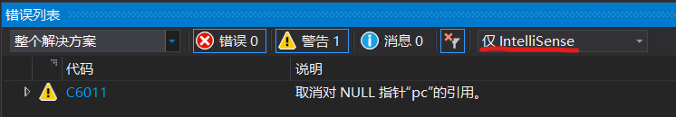
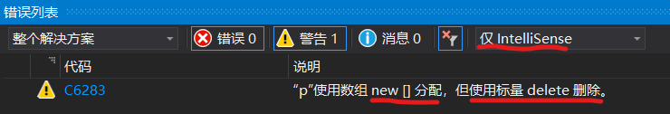
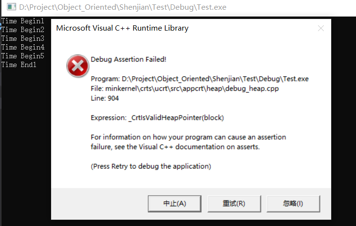
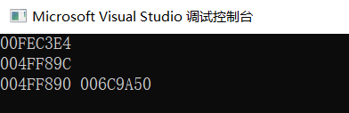

# 动态内存申请

## 一、复习：结构体类型的定义及使用

1. 结构体类型的声明
2. 字节对齐
3. 结构体变量的定义和初始化
4. 指向结构体变量的指针和指向结构体变量中某个成员的指针
5. 结构体(struct)和类(class)的区别


## 二、指向结构体变量的指针与链表

### 2.1 链式结构的基本概念

①数组的不足

1. 大小必须在定义时确定，导致空间浪费
   
    是否可以按需分配空间

2. 占用连续空间，导致小空间无法充分利用

    是否可以充分利用不连续的空间

3. 在插入/删除时必须前后移动元素

    插入/删除时是能否不移动元素

②链表

&emsp;&emsp;**不连续存放数据，用指针指向下一数据的存放地址**

&emsp;&emsp;**注意：的确会由于增加了指针域导致存储相同内容要占用更多空间（对于32位系统是多4个字节用于存储指针变量），但是这并不是链表的缺点。对于一个大型的结构体或者类，这一点空间微不足道，会比用数组省去更多空间。**


结点：存放数据的基本单位

1. 数据域：存放数据的值

2. 指针域：存放下一个同类型节点的地址

链表：由若干结点构成的链式结构

表头结点：第一个结点

表尾结点：链表的最后一个结点，指针域为NULL（空）

头指针：指向链表的表头结点的指针

**另外，结构体中的成员不允许是自身的结构体类型，但可以是指针，因为指针的占用空间已知**

### 2.2 链表与数组的比较

| 数 组 | 链 表 |
|----|------|
| 大小在声明时固定 | 大小不固定 |
|处理的数据个数有差异时，须按最大值声明|可以根据需要随时增减结点|
|内存地址连续，可直接计算得到某个元素的地址|内存地址不连续，须依次查找|
|逻辑上连续，物理上连续|逻辑上连续，物理上不连续|
|**顺序存储 随机存取**|**随机存取 顺序存储**|


## 三、内存的动态申请与释放

### 3.1 C中的相关函数

①void* malloc(unsigned size);

1. 申请size字节的**连续**内存空间，返回该空间**首地址**，对申请到的空间**不做初始化**

2. **如果申请不到，返回NULL**

3. 注意返回类型是**void\*** ，一般需要配合**强制类型转换**

②void* calloc(unsigned n,unsigned size);

1. 申请n*size字节的**连续**内存空间，返回该空间**首地址**，对申请到的空间**初始化为0(\0)**

2. 如果申请不到空间，返回NULL

③void* realloc(void* ptr,unsigned newsize);

1. 

④void free(void *p);

1. 释放p所指向的内存空间,**p必须是malloc、calloc、realloc返回的首地址**

<br>

因为是系统库函数，需要包含头文件
```cpp
#include <stdlib.h> //c方式
#include <cstdlib>  //c++方式
```

### 3.2 C++中的相关运算符

①用new运算符申请空间

1. 如果申请不到空间，new会抛出bad_alloc异常，需要用try-catch方式处理异常
2. 也可以在new时加(nothrow)来强制禁用抛出异常值，并返回NULL
   ```cpp
   int *p=new(nothrow) int[10];
   ```
3. try-throw-catch称为c++的异常处理机制
4. 为什么不像C方式一样如果申请失败返回NULL？ 因为C++中有类，类的构造函数没有任何返回值（不是void）。因此在类的构造函数中，如果有动态内存申请，并且申请失败，将无从检查

②用delete运算符释放空间

③注意：对于C++，**new**和**delete**都是**运算符**，故不需要添加其他的头文件

④**用malloc/calloc等申请的空间用free释放，用new申请的空间用delete释放，不要混用**

⑤**不能重复释放**

⑥**记得申请完检查申请成功/失败，否则VS会有warning**

```cpp
#include <iostream>
#include <cstdlib>

using namespace std;

int main()
{
	int* pc = (int*)malloc(sizeof(int));
	*pc = 0;

	int* pcpp = new int;
	*pcpp = 0;

	return 0;
}
```
上述代码会被IntelliSense认为有问题：




### C/C++语法

1、申请普通变量

①C的函数方式

1. 先定义指针变量再申请
   ```c
   int *p;
   p=(int*)malloc(sizeof(int));
   p=(int*)calloc(1,sizeof(int));
   p=(int*)realloc(NULL,sizeof(int));//一般不用
   ```
2. 定义指针变量的同时申请
    ```c
    int *p=(int*)malloc(sizeof(int));
    int *p=(int*)calloc(sizeof(int));
    ```

②C++的运算符

1. 先定义指针变量再申请
    ```cpp
    int *p;
    p=new int;
    ```
2. 定义指针变量的同时申请
    ```cpp
    int *p=new int;
    ```
3. 申请空间时赋初值
    ```cpp
    int *p=new int(10);
    ```

2、申请一维数组

&emsp;①C的函数方式
1. 先定义指针变量再申请
   ```c
   int *p;
   p=(int*)malloc(10 * sizeof(int));
   p=(int*)calloc(10 , sizeof(int));
   ```
2. 定义指针变量的同时申请
    ```c
    char *name=(char*)malloc(10 * sizeof(char));
    char *name=(char*)calloc(10 , sizeof(char));
    char *name=(char*)realloc(NULL,10 * sizeof(char));//一般不用
    ```

&emsp;②C++的运算符

1. 先定义指针变量再申请
    ```cpp
    int *p;
    p=new int[10];//申请10个int型空间
    ```
2. 定义指针变量的同时申请
    ```cpp
    char *name=new char[10];//申请10个char
    ```
3. 申请空间时赋初值
    
    动态内存申请的一维数组可以再申请时赋初值，方法为后面跟{}
    注意：**{}前不要加=，而且[]内必须有数**，其余规则同一维数组定义时初始化
    ```cpp
    int *p；
    p=new int[5] {1,2,3,4,5};  //correct
    p=new int[5] {1,2,3,4,5,6};//wrong
    p=new int[5] {1,2,};       //correct，后面自动为0
    p=new int[5]={1,2,3,4,5};  //wrong，不要加等号
    p=new int[] {1,2,3,4,5};   //wrong，[]内必须有数字

    char *s;
    s=new char[5] {'h','e','l','l','o'};//correct
    s=new char[5] {"hello"};//wrong，没有给尾零留位置
    s=new char[6] {"hello"};//correct
    ```

3、申请二维数组

&emsp;①C的函数方式
1. 先定义指针变量再申请（注意括号，**左右两侧**）
   ```c
   int (*p)[4];//指向一维数组的指针，高维数组以此类推
   p=(int (*)[4])malloc(3 * 4 * sizeof(int));
   p=(int (*)[4])calloc(3 * 4 , sizeof(int));
   p=(int (*)[4])relloc(NULL,3 * 4 * sizeof(int));//一般不用
   ```
2. 定义指针变量的同时申请
    ```c
    int (*p)[4]=(int (*)[4])malloc(3 * 4*sizeof(int));
    int (*p)[4]=(int (*)[4])calloc(3 * 4,sizeof(int));
    ```

&emsp;②C++的运算符

1. 先定义指针变量再申请
    ```cpp
    int *p;//wrong
    p=new int[3][4];//wrong
    int *p[4];
    p=new int[3][4];//correct   
    ```
2. 定义指针变量的同时申请
    ```cpp
    float (*f)[4]=new float[3][4];
    ```
3. 申请空间时赋初值
   
   动态内存申请的二维数组可以在申请时赋初值，方法为后面跟**双层{}**，{}前不要加=，且[]内必须有数，其余规则同二维数组定义时初始化
    ```cpp
    int (*p)[3];
    p=new int[2][3] {1,2,3,4,5,6};    //wrong，要两层{}
    p=new int[2][3] {{1,2,3},{4,5,6}};//correct
    p=new int[2][3] {{1,2},{3,4,5,6}};//wrong，第二个数组过大
    p=new int[2][3] {1,4};            //wrong，要两层{}
    p=new int[2][3] {{1},{4}};        //correct

    char (*p)[6];
    p=new char[2][6] {'A','B','C'};     //wrong，要两层{}
    p=new char[2][6] {{'A'},{'B','C'}}; //correct
    p=new char[2][6] {"hello","china"}; //correct
    p=new char[2][6] {"hello1","china"};//wrong，第一个字符串过长
    ```
    注意：字符型再使用字符串方式时，少一层{}，双引号相当于一层

4、释放普通变量

&emsp;①C的函数方式

```c
free(p);
```

&emsp;②C++的运算符

```cpp
delete p;
```

5、释放一维数组

&emsp;①C的函数方式

```c
free(p);
```

&emsp;②C++的运算符

```cpp
delete []p;
```
某些资料上说可以不用[]，因为一维数组地址可以理解为首元素地址（这种说法实际并不严谨，必须加）

```cpp
int *p = new int[4];
delete p;
```



对于int/char等基本类型的数组，加不加均正确；但对于用户自定义的class，必须加

```cpp
#include <iostream>
#include <cstdlib>

using namespace std;

class T
{
private:
	int t;
public:
	T(int x);
	~T();
};
T::T(int x) : t(x)
{
	cout << "Time Begin" << t << endl;
}
T::~T()
{
	cout << "Time End" << t << endl;
}

int main()
{
	T* tt = new T[5]{ 1,2,3,4,5 };

	delete tt;//使用构造和析构

	return 0;
}
```
运行报错，并且有弹窗，此外从结果看，析构函数没有被正确执行




6、释放二维数组

&emsp;①C的函数方式

```c
free(p);
```

&emsp;②C++的运算符

```cpp
delete []p;
```
二维及以上必须加上一个[]，否则编译警告

7、其他

1. C 可通过强制类型转换将void型指针转为其他类型
2. C++ 申请时自动确定类型
3. 静态数据区、动态数据区、动态内存分配区（堆空间）的地址各不相同
    ```cpp
    #include <iostream>
    #include <cstdlib>

    using namespace std;

    int a;

    int main()
    {
        int b;
        int* c;
        c = (int*)malloc(sizeof(int));
        if (c == NULL)
        {
            cout << "Application Failure" << endl;
            return -1;
        }
        cout << &a << endl;//a:静态数据区
        cout << &b << endl;//b:动态数据区
        cout << &c << " " << c << endl;
        //&c:动态数据区  c:堆空间(c本身是申请空间的地址)

        return 0;
    }
    ```
    结果图：

    