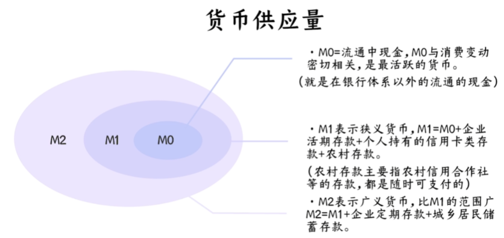
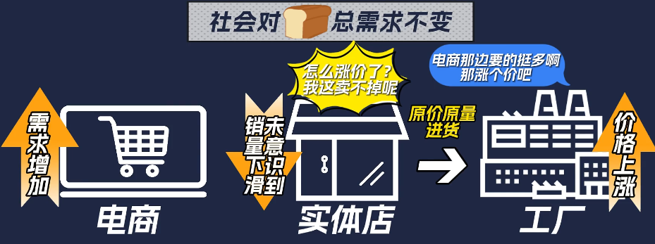

# 经济 & 金融 基本概念

经济 Economics
1. 更广泛，理论性较强
2. 经济体系的运作
3. 三架马车
   1. 投资 Investment
   2. 消费 Consumption
   3. 出口 Export

金融 Finance
1. 更具体，实践性较强
2. 资金的管理与资本市场

# 经济指标

[如何读懂经济指标 : GDP、CPI、工业增加值、PMI、社会消费品零售总额、社会融资规模](https://www.bilibili.com/video/BV1y34y1c7xn)

经济增长 相关

GDP(Gross Domestic Product) - 国内生产总值
1. 一个国家或地区在一定时期内(通常为一年)，在其境内生产的所有最终商品和服务的市场价值
2. 强调地理边界 (仅限于在本国内的生产)
3. GDP = 消费 (C) + 投资 (I) + 政府支出 (G) + 净出口 (NX，出口-进口)
4. 反映本国经济规模和经济活动情况
5. 跨国比较意义不大，因为统计方式不同

GNP(Gross National Product) - 国民生产总值
1. 一个国家或地区的居民和企业在全球范围内(包括国内和国外)，所生产的所有最终商品和服务的市场价值
2. 强调国籍，只要是本国居民或企业的生产活动，无论是否在本国境内，都计入
3. GNP = GDP + 本国居民和企业从国外获得的收入 - 外国居民和企业从本国获得的收入
4. 反映本国居民的经济收益和财富创造能力

工业增加值/附加值(Industrial Added Value) - 通常关注月度数据
1. 在一定时期内，工业企业通过生产活动所创造的新增价值
2. 工业企业的产出总价值 - 中间投入(原材料、能源、半成品)
3. 反映了企业在生产过程中通过劳动、资本和技术的投入对商品附加的价值
4. 工业增加值上升，说明工业企业开工生产积极性提高，反应更旺盛的社会需求
5. 有一定滞后性

PMI(Purchasing Managers' Index) - 采购经理指数
1. 常用于衡量制造业和服务业的经济健康状况
2. PMI 对 采购经理 月度调查(只需做出定性的判断，上升、不变、下降)，在每月最后一天公布
3. 范围 0%-100%，50% 为荣枯线
4. 分项 PMI = 正面回答比例+不变回答比例×0.5
5. 综合 PMI = 新订单×30% + 生产×25% + 雇员×20% + 供应商配送时间×15% + 库存×10%
   1. 供应商配送时间(Supplier Deliveries) : 配送时间 增加/延长 通常被视为一个 Positive 信号，而配送时间 减少/缩短 则可能被视为负向信号
   2. 由于经济活动活跃，企业订单增加，供应链需求过大，供应商无法快速完成交付

社会消费品零售总额(Total Retail Sales of Consumer Goods)
1. 衡量一个国家或地区在一定时期内(通常为一个月或一年)，通过零售和餐饮企业实现的商品销售额和餐饮收入的总和
2. 企业通过 交易 售给 个人、社会集团，非生产、非经营用的 实物商品 金额，以及 提供餐饮服务 所取得的收入金额
3. 作用
   1. 反映 国内消费市场的 总规模 & 地域分布情况
      1. 为 分析判断国内消费品、市场运行总体情况、地域特点、商品类别供给、市场未来走势 提供参考
   2. 反映 城乡居民 和 社会集团 对实物商品消费需求的 总量 和 变化趋势
   3. 反映 经济景气情况，消费信心
      1. 零售是商品流通的最终环节

通货膨胀 相关 CPI & PPI

CPI(Consumer Price Index) - 消费者价格/物价指数
1. 反映居民生活成本的变化(消费品 & 服务 价格变动趋势)，判断 inflation/deflation
2. 统计范围
   1. 包括 : 食品、服装、交通、医疗、教育、娱乐等(与居民生活密切相关的消费品和服务)
   2. 不含 : 生产资料(原材料、工业设备)
3. 用途
   1. 反映居民生活成本 : CPI的上升通常意味着生活成本增加
   2. 衡量通货膨胀或通货紧缩 : CPI上涨意味着通胀压力，而下跌可能预示通货紧缩
      1. 并不等于通货膨胀率，但是可以反映大趋势
      2. 年度CPI上涨率 1% ~ 3% : 爬行通货膨胀
      3. 年度CPI上涨率 3% ~ 6% : 温和通货膨胀
      4. 年度CPI上涨率 > 10% : 需要引起重视
   3. 调整工资和福利 : 政府或企业可以根据CPI调整最低工资、养老金等

PPI(Producer Price Index for Industrial Products) - 生产者价格指数
1. 工业出厂者价格指数，衡量生产者在出厂时出售商品的价格变化

以 物价总水平上涨率 作为 通货膨胀率

# 金融指标

[如何读懂金融指标 : M2、社融、人民币贷款、MLF、LPR、十年国债收益率](https://www.bilibili.com/video/BV1E2421L7GL)

中国货币层次划分(流动性逐级下降)
1. M0(流通中现金)
   1. 居民手中的现钞 + 企业单位的备用金 (不包括商业银行的库存现金)
   2. 可以随时作为交易媒介，具有最强的购买力
2. M1(狭义货币)
   1. M0 + 企业活期存款 + 机关团体存款 + 农村存款 + 个人持有的信用类存款
3. M2(广义货币)
   1. M1 + 城乡居民存续存款 + 企业存款中具有定期性质的存款 + 外币存款 + 信托类存款 + 证券客户保证金 + 住房公积金中心存款 + 非存款类金融机构在存款类金融机构的存款
   2. 准货币 = M2 - M1
4. M3
   1. M2 + 金融债券 + 商业票据 + 大额可转让存单

M1 - M2 剪刀差(增速差)
1. M1 与 M2 的 **增速差异**，特别是当两者的增速方向和幅度出现明显分化时，被称为 **剪刀差**
2. M1 增速 > M2 增速 : 正剪刀差
   1. 对经济预期乐观，更多的钱愿意拿出来进行消费和投资，经济活力增强
   2. 商品和劳务市场的价格通常会上涨，通胀压力增加，央行需要收紧流动性，可能通过加息等措施刺激增加存款
3. M1 增速 < M2 增速 : 负剪刀差
   1. 市场上的 死钱 增多，大家 将 活期存款 转为 定期存款，对经济预期相对悲观，不愿意投资或者消费，经济活力减弱
   2. 央行通常采取货币宽松政策来刺激

兵马未动粮草先行，金融数据往往领先经济指数 1~2 季度，钱需要给到位

社融 & 人民币信贷数据 可以反映 实体的融资需求 & 金融机构的放贷意愿

存款 体现 社会各主体消费的意愿

社会融资规模(宏观经济指标)
1. 一定时期内，实体经济从金融体系获得的全部资金总额
2. 反映 **金融对实体经济的支持力度**
3. 由中国人民银行发布
4. 构成
   1. 表内融资 (在**银行**等金融机构的**资产负债表**中明确记录的信贷活动，正规金融系统内的主要资金来源，受监管较严格)
      1. 人民币贷款 : 银行体系发放的人民币计价贷款，是社融中最主要的部分
      2. 外币贷款 : 银行体系发放的外币计价贷款
      3. 委托贷款 : 通过委托银行，由企业或个人将资金借给其他企业的一种贷款形式
   2. 表外融资 (不计入**银行资产负债表**，但实际上对实体经济起到融资作用的活动，属于影子银行范畴，监管相对较松，风险较大)
      1. 信托贷款 : 通过信托公司以信托方式发放的贷款
      2. 未贴现银行承兑汇票 : 银行承兑但尚未贴现的商业票据
   3. 直接融资 (企业或政府通过资本市场**直接向投资者筹集资金**，而不是依赖银行等金融机构的间接贷款)
      1. 企业债券 : 企业通过发行债券筹集的资金
      2. 政府债券 : 地方政府为支持基础设施建设等项目发行的债券
      3. 非金融企业境内股票融资 : 企业通过股票市场进行股权融资
   4. 其他融资
      1. 存款类金融机构资产支持证券 : 由金融机构通过资产证券化方式筹集的资金
      2. 贷款核销 : 不良贷款处理过程中被核销的部分，反映信用收缩对资金供给的影响
5. 分类
   1. 存量 : 截至统计时点，累计融资总额
   2. 增量 : 统计期内，新增的融资总额
      1. 容易受 季节性因素 影响(一般 1,3,6,9,11 会有明显的扩张需求)

人民币贷款
1. 金融机构 向 非金融企业、实业企业(石油化工)、个人、机关团体 多方式提供的 人民币贷款
2. 组成 (短期 & 中长期 分界线 : 1年)
   1. 短期企业贷款
   2. 中长期企业贷款
   3. 短期居民贷款
   4. 中长期居民贷款 (eg : 住房贷款)
   5. 票据融资
   6. 非银贷款

政策利率
1. 可以传导至 市场利率，已达到调控宏观经济目的
2. 常用政策利率
   1. 公开市场操作利率

# 经济 & 金融 指标 old

经济数据 : 一般指宏观层面的数据(GDP | PMI | CPI | PPI)

金融指标 : 偏向国家与实体之间的资金流通(社融 | M0 | M1 | M2 | 存款准备金率 | 利率 | 汇率)

## Portal

[【华尔街见闻研究院】解读各项经济指标（15讲全）](https://www.bilibili.com/video/BV1jh4y1873G/)

[11分半钟看懂各种经济指标 GDP CPI PPI M2 利率 PMI CRB --- B站](https://www.bilibili.com/video/BV1eK4y1P7TF/)

[【基金配置】吹牛必懂宏观经济指标](https://www.bilibili.com/video/BV1pm4y1c7tJ/)

## 经济

## 大宗商品

四大类
1. 工业金属 : 铜 铝 锌 锡
2. 贵金属 : 黄金 白银
3. 农产品 : 小麦 玉米
4. 能源品 : 煤炭 石油

## GDP 国内生产总值 (Gross Domestic Product)

定义 : **一个国家或地区所有常住单位在一定时期内生产的全部最终产品和劳务的市场价值总和**

计算 : GDP = 总消费 + 资本形成(企业购买) + 政府购买 + 净出口(出口-进口)

"国家的创造财富能力"

国家产生的经济活动

GDP越高，代表经济越繁荣，发展越好，投资市场越好

会有无效GDP(地震重建，无人区修路)

## CPI 消费价格指数

统计
1. 食品烟酒
2. 居住
3. 生活用品及服务
4. 交通通信
5. 教育文化娱乐
6. 医疗保健
7. 其他用品及服务

用于查看通胀 3%为警戒线

若 CPI 低于0，意味着 通缩

物价下降，企业利润降低，不利于发展

保持 1%~2% 温和的通胀

我国 CPI 失真，食品所占比例过大

## PPI 生产价格指数

原材料 -> 半成品 -> 产成品(CPI)

主要指 原材料&能源价格

石油、煤炭、水泥、金属

若经济向上，PPI走势也向上，购买需求旺盛，原材料涨价。反之亦然，经济不好，工厂停产

PPI 比 CPI 更具有前瞻性

PPI 是周期类投资必看的指标

## M 货币供应量

M0 = 流通中的现金 (在银行体系以外流通的现金)

M1 = M0+活期存款 (资金松紧)

M2 = M1+定期存款 (判断流动性松紧)

M2 - M1 = 准货币

M1 比 M2 更活跃

如果 M1 涨的比 M2 快，说明市场资金活跃，通常牛市(钱从定期存款中被取出)

如果 M1 下穿 M2，意味着市场收缩，活期转为定期，投资市场表现不佳

货币宽松，房价才能上涨。货币收紧，M1向下，往往房价也下降

## 十年期国债收益率

一般用于表示市场的
无风险收益率

国债收益率上升，市场缺钱，国家给出更高利息，吸引投资者购买国债，表明市场缺钱，债市、股市都不好

如果涨的过高可能导致股债双杀

国债收益率下行(降息周期)，意味着市场上的钱充足，是投资债券的好时机

## 社会融资规模

全面反映金融与经济关系，以及金融对实体经济资金支持的总量指标

不太关注 同比 和 环比

社融
1. 直接融资
2. 间接融资
3. 表外融资
4. 其他项目

分为增量数据和存量数据

全社会贷款及融资总和，反映资金的需求程度
1. 银行贷款
2. 股票融资
3. 发债融资
4. 非标融资
5. 专项债

与M2的走势接近

社融下降表示经济需求比不足，对未来的预期不好

## 社会消费总额

代表大众消费能力和意愿

下降表示消费出了问题

2016年房地产上涨惹祸

## PMI 采购人经理指数

相对 GDP 更快速，更简便 (每个月发布一次)

工厂采购负责人如何看待经济

若看好未来，则会加大采购量，态度积极乐观。反之亦反

通常作为判断经济景气的**先行指标**

50为枯荣线，高于为经济扩张，低于为经济收缩

超过 55% 有过热嫌疑，接近 40% 有萧条风险

PMI 收缩 对股市不利

PMI 是 **环比** 的概念，反映相比上个月

## CRB指数 路透商品研究局指数

反映大宗商品的周期性波动

## 周期

## 库存周期

主动去库存，大宗商品价格下跌，经济不景气

被动去库存，是经济复苏的标志

主动补库存，经济繁荣

被动补库存，衰退

## 信用利差

银行的模式 : 赚利差

信用利差上升，说明经济遇冷，中小企业成本上升，股市表现不好

信用利差下降，中小企业收益

## MLF 中期借款便利

MLF走低，贷款利率下降，相当于降息。反之相当于加息

## DR007

银行间市场7天质押回购利率

上升快代表银行开始收缩

## 存款准备金率

银行在收到存款时，不能全部用于放贷，需要拿出部分给央行

央行控制货币量的直接手段

降低存款准备金率代表宽信用，反正为紧信用

## 利率

经济萧条时，降低利率，刺激消费

经济过热时，加息，抑制经济过度膨胀

加息是紧货币政策，降息是宽货币政策

## 汇率

用外币的价值衡量本币的价值

影响汇率的因素
1. 供给 : 我国钱印，会流入外汇市场，人民币供过于求，人民币贬值
2. 需求 : 外国印钱，外币流入国内市场，外币供过于求，导致人民币被迫升值

---

# 三张表

三张表
1. 资产负债表 - Balance Sheet
   1. 反映企业在特定时点的财务状况，即资产、负债和所有者权益的分布情况
2. 利润表 - Profit and Loss Statement / Income Statement
   1. 反映企业在一段时间内的经营成果，即收入、成本和利润情况
3. 现金流量表 - Cash Flow Statement
   1. 反映企业在一段时间内的现金流入和流出情况，展示企业的现金状况和流动性

资产负债表中的期末现金余额 等于 现金流量表中的期末现金余额

利润表的 净利润 会反映到 资产负债表的 留存收益 中

---

# 利率

[利率变动对经济和普通人有什么影响？|加息、降息、降准、通胀](https://www.bilibili.com/video/BV1L94y1s7vu)

利率下降，企业 借贷扩大生产，消费者 超前消费

定义 : 利率是一定时期内，利息与本金的比率，反映了**资金价格**(**时间的价值**)

银行 : 存款利息 < 贷款利息

银行放贷有风险，坏账，经济不景气时期

银行贷款利率
1. 无风险利率 (完全无风险)
   1. 没有违约风险的情况下，将资金借出的最低回报率
   2. 通常基于政府债券的收益率(美国国债 & 中国国债)
   3. **时间价值**
   4. 利率倒挂
      1. 一般情况是 利率 与 存款时间长度 正相关(长期债券需要承受更高的不确定性)
      2. 利率倒挂 时 为负相关，表明长期经济不被看好
      3. 当对未来前景不看好时，群众倾向于购买长期债券，推高价格(每一份固定收益)，降低收益率
2. 风险溢价 (银行对贷款人违约风险的评估)
   1. 信用高，违约可能性越低，违约率 ≈ 0
   2. 经济不稳定时期，违约风险上升，银行的风险溢价会更高
   3. 需要 风险溢价 覆盖 潜在损失
3. 银行自设利润 (银行想赚的钱)
   1. 用于盈利的部分
   2. 银行在覆盖资金成本和风险之后额外想赚取的金额，属于银行的净收益

经济情况好 : 长期债券的吸引力降低
1. 经济增长强劲，市场通常预期通胀会上升，央行可能通过提高利率来控制经济过热
2. 短期债券到期后可以较高的利率再投资，而长期债券的收益率固定
3. 风险资产的吸引力更高

经济情况不好 : 长期债券的吸引力增加
1. 央行通常会降低利率以刺激经济，选择长期债券可以锁定当前收益率
2. 经济低迷时，股票和企业债等高风险资产的波动性增加，长期政府债券因其稳定的回报和安全性成为避险首选
3. 衰退时期通常伴随低通胀甚至通缩，长期债券的购买力侵蚀风险降低

债券发行后，在市面上流通，利率后续由市场决定(央行无法控制)

债券的购买确实是一份一份地进行，每一份债券的收益是固定的

债券在二级市场的价格波动会影响实际收益率

中国利率体系
1. 政策利率 (央行控制) - 央行 通过 政策利率，影响其他利率
   1. OMO : 公开市场操作利率，7天逆回购利率(影响短期利率)
   2. MLF : 中期借贷利率，商业银行 向 央行 的借贷成本，使用 国债 政金债 高级信用贷 作为抵押物
2. 货币市场利率
   1. eg : DR007 银行间质押式回购利率
      1. 银行A 向 银行B 借钱的利率，有债券等抵押物
      2. 当 央行下调 OMO，导致 OMO < DR007，则倾向于向央行借钱，为了提升吸引力，银行只能降低 DR007 (通过政策利率，调节市场利率)
3. 信贷市场利率
   1. eg : LPR贷款市场报价利率 (银行愿意提供给最优质客户贷款利率的平均水平)
      1. 每月由各大商业银行报价并加权平均后形成，基于 MLF，因此也可以被 央行通过政策利率间接控制
      2. 分为
         1. 1年期 : 企业短期贷款
         2. 5年期 : 房贷(LPR ↑，房贷成本 ↑)
4. 债券市场利率
   1. 国债收益率 : 被视为无风险利率
   2. 信用债收益率 : 反映企业债、地方债等融资成本，包含信用风险溢价
   3. 利率上涨，债券价格下跌
5. 存贷款市场利率
   1. 利率上涨，融资成本增加，公司发展受阻，利空股票，消费者抑制消费，进一步导致企业营业额&利润下降，利空股票
6. 表外市场利率 - 表外业务是商业银行或金融机构不直接记录在 资产负债表 内的活动

央行加息，为了抑制通货膨胀(由物价上涨导致，需求过于旺盛)，加息使得民众原意将钱存在银行，减少消费

消费、房地产 等板块 会随着 通胀的上升而获益，以更高的价格出售库存商品

央行加息，对银行利好，虽然存贷款利率同时上升，但是市场流动性低，银行话语权更多

---

# 汇率

[汇率变动对经济和普通人有什么影响？|升值、贬值](https://www.bilibili.com/video/BV1nj411e7Uj)

汇率 : 2种货币之间兑换的比率(价值)

汇率标价法
1. 直接标价法(应付标价法) - 一定单位的**外国**货币为标准，计算应付出多少**本国**货币
   1. 外国货币数额保持不变，本币为 pivot
   2. 一定单位外币折合本币数额多于前期，说明 外币币值上升 或 本币币值下跌，(数值上升，汇率贬值)
2. 间接标价法(应收标价法) - 一定单位的**本国**货币为标准，计算应收取多少**外国**货币
   1. 本国货币数额保持不变，外币为 pivot
   2. 一定数额本币兑换外币数额多于前期，说明 外币币值下降 或 本币币值上升，(数值上升，汇率增值)

影响汇率的因素
1. 利率 - 本国提高利率，该国汇率升值
   1. 利率高，金融资产收益率高，吸引国外资金流入投资，对本国货币需求增加，本币升值
   2. 利率低，追求利息收益的短期资本 抛售本国货币，追求其他国家更高的利率资产，本币贬值
2. 国际收支 - 收支顺差升值
   1. 顺差说明，本国商品卖出多于买入，本国会将赚的外汇在外汇市场换回本国货币，在本国扩大生产，在外汇市场中，本国货币需求增大，升值
3. 价格水平
   1. 价格水平上升，出现通货膨胀，购买同样物品花费更多，钱不值钱，本币贬值
4. 心里预期
5. 央行直接干预
   1. 汇率沟通 - 传递信号，引导市场预期
   2. 汇率调节工具
      1. 逆周期因子
      2. 外汇存款准备金率
      3. 远期售汇保证金
   3. 直接进入外汇市场干预，跨境资本流动管理

购买力平价理论
1. 货币的价格取决于它对商品的购买力
2. 假设前提 : 一价定律(不考虑其他任何因素(关税、运费)，在世界任何国家同质的商品价格一样)
3. 太理想化

汇率变动影响
1. 消费(海淘、跨境电商、出国旅游)
2. 企业
   1. 本币贬值 利于 出口型企业
   2. 本币升值 利于 进口型企业
3. 外资流向(外资在中国资产以RMB计价)
   1. 人民币贬值，承担 股票波动风险 & 人民币贬值损失

---

# 通货膨胀(Inflation) & 通货紧缩(Deflation)

[通胀和通缩对经济和普通人有什么影响？](https://www.bilibili.com/video/BV1MC4y1E7Q7)

通货膨胀
1. 东西不变，钱不值钱了
2. 货币超发贬值，物价上涨，CPI上升
3. 定义 : 纸币流通条件下，因 **货币供给 > 货币实际需求** (**现实购买力 > 产出供给**)，导致货币贬值，引起的物价上涨
4. 产生因素
   1. 需求拉动型(Demand-Pull Inflation)
      1. 需求过度增加(消费、投资、出口、政府支出(基建)) (总需求超过总供给，推动物价上涨)
   2. 成本推动型(Cost-Push Inflation)
      1. 总需求不变，由生产要素价格上涨，引起生产成本(原材料、能源、劳动力)上升，进一步导致物价总水平持续上涨
   3. 混合型，上述两种同时存在
      1. eg : 需求拉动型 导致 商品价格上涨，进而导致 生产成本提高，从而引起 成本推动型
      2. eg : 成本推动型 导致 工人工资提高，进而使得 货币收入&需求增加，引起 需求拉动型
   4. 结构型(Structural Inflation)
      1. 由于经济体系中的长期结构性问题或不均衡而导致的物价持续上涨(不是由短期的需求与供给失衡引起的，而是因为经济结构本身存在矛盾，如资源分配不均、市场垄断、劳动力、产业结构问题)
      2. 物价上涨 发生在 总需求并未增加的情况下，某个部门的产品需求增加，但另一需求减少的部门，因为价格刚性因素，并未及时反应，造成产品价格上涨现象
         1. 
         2. 总需求不变(线下转电商)，电商需求增加，而线下商店未意识到自己的销量下滑，仍然按照原先的数量和价格进货，生产厂商以为总需求增加，提高价格
5. 影响
   1. 消极
      1. 货币购买力下降，实际收入水平降低
      2. 财富再分配，抗通胀属性的资产价值保持，其他资产严重缩水
   2. 积极
      1. 政府通过赤字财政政策，加大政府支出，保持温和通胀，有效弥补投资不足，促经济增长
      2. 物价上涨，企业愿意扩大生产，雇佣更多工人
      3. 对债务人有利(对债权人不利)，实际债务负担下降，刺激大家借钱消费

通货紧缩
1. 货币增值，物价下跌，购买力上涨
2. 如果物价不断下降，所有人尽可能保留现金，只进行少量的必要的消费
3. 进一步，影响企业生产，利润减小，企业不愿扩大生产，整体经济不景气，民众失业，更加节衣缩食
4. 加重债务人负担，

温和的通货膨胀能刺激经济增长，通货紧缩百害无一利

生产要素
1. 劳动 Labor
2. 土地 Land
3. 资本 Capital
4. 企业家才能 Entrepreneurship
5. 技术 Technology
6. 信息 Information
7. 数据 Data

