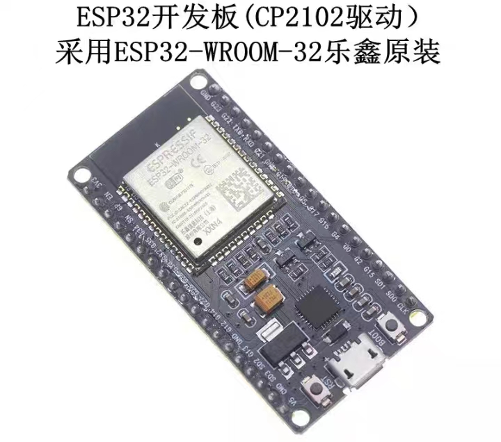
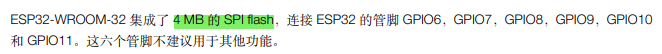
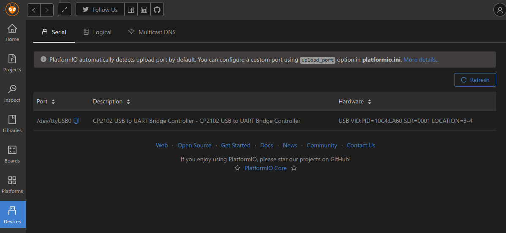
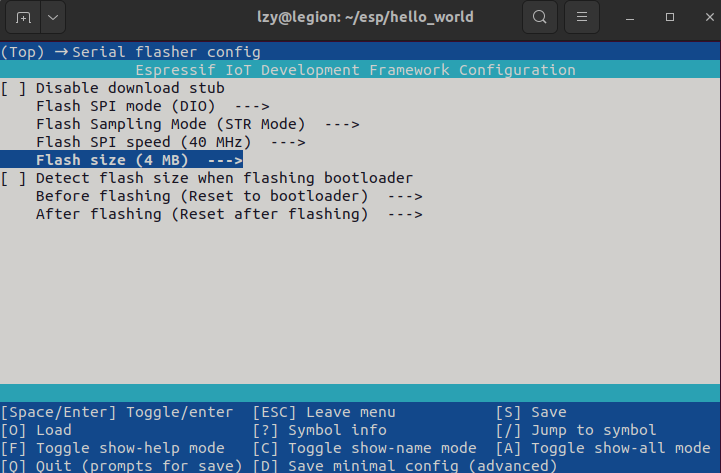
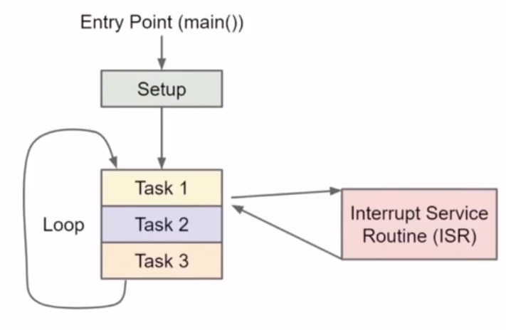

# ESP32

**目录**

[toc]

---

# Portals

[乐鑫官网](https://www.espressif.com/zh-hans/home)

[乐鑫官网开发文档](https://www.espressif.com/zh-hans/support/documents/technical-documents)

[wokwi在线仿真网址](https://wokwi.com/)

[连接手柄 A Bluetooth gamepad "host" for the ESP32 / ESP32-S3 / ESP32-C3](https://github.com/ricardoquesada/bluepad32)


---

# 使用设备

ESP32开发板






---

# 乐鑫 ESP32 物联网开发框架 ESP-IDF 开发入门

[乐鑫 ESP32 物联网开发框架 ESP-IDF 开发入门 --- 孤独的二进制 ](https://www.bilibili.com/video/BV1hM411k7zz/)

[乐鑫官网 ESP-IDF 编程指南](https://docs.espressif.com/projects/esp-idf/zh_CN/latest/esp32/get-started/index.html)

## 入门

### 安装

根据[官方安装指南](https://docs.espressif.com/projects/esp-idf/zh_CN/latest/esp32/get-started/linux-macos-setup.html)一步步走，目前只尝试了Ubuntu

```bash
# 编译 ESP-IDF 需要以下软件包
sudo apt-get install git wget flex bison gperf python3 python3-pip python3-venv cmake ninja-build ccache libffi-dev libssl-dev dfu-util libusb-1.0-0

# 检查电脑上是否已经安装过 Python 3
python3 --version

# 获取 ESP-IDF  # ESP-IDF 将下载至 ~/esp/esp-idf
mkdir -p ~/esp
cd ~/esp
git clone --recursive https://github.com/espressif/esp-idf.git

# 设置工具(为支持 ESP32 的项目安装 ESP-IDF 使用的各种工具，比如编译器、调试器、Python 包等)
# 脚本将 ESP-IDF 所需的编译工具默认安装在用户的根目录中，即 Linux 系统中的 $HOME/.espressif 目录
cd ~/esp/esp-idf
./install.sh esp32

# 设置环境变量  # 刚刚安装的工具尚未添加至 PATH 环境变量，无法通过“命令窗口”使用这些工具。因此，必须设置一些环境变量
. $HOME/esp/esp-idf/export.sh
# 如果您需要经常运行 ESP-IDF，您可以为执行 export.sh 创建一个别名(可以写在 ~/.bashrc 中)
alias get_idf='. $HOME/esp/esp-idf/export.sh'
# 可以在任何终端窗口中运行 get_idf 来设置或刷新 esp-idf 环境
```
### HelloWorld

```bash
# 从 ESP-IDF 中 examples 目录下的 get-started/hello_world 工程开始
cd ~/esp
cp -r $IDF_PATH/examples/get-started/hello_world .
```

您的 ESP32 开发板连接到 PC，并查看开发板使用的串口

使用platformIO查看连接设备



查看连接设备及其端口号，通常，串口在不同操作系统下显示的名称有所不同：
1. Linux 操作系统： 以 /dev/ttyUSB 开头
2. macOS 操作系统： 以 /dev/cu. 开头

```bash
# 查看端口
lzy@legion:/dev$ cd /dev
lzy@legion:/dev$ ls ttyUSB*
ttyUSB0
```

```bash
# 配置工程
cd ~/esp/hello_world  # 必要
idf.py set-target esp32  # 打开一个新工程后，应首先使用 idf.py set-target esp32 设置“目标”芯片
idf.py menuconfig
```



```bash
# 编译工程  # 编译应用程序和所有 ESP-IDF 组件，接着生成引导加载程序、分区表和应用程序二进制文件
idf.py build  # 如果一切正常，编译完成后将生成 .bin 文件
```

```bash
# 烧录到设备
# 将 PORT 替换为 ESP32 开发板的串口名称。如果 PORT 未经定义，idf.py 将尝试使用可用的串口自动连接
idf.py -p PORT flash

# 可以使用 idf.py -p PORT monitor 命令，监视 “hello_world” 工程的运行情况
idf.py flash monitor -p /dev/ttyUSB0
# 使用快捷键 Ctrl+]，退出 IDF 监视器
```


```bash
# 权限问题 /dev/ttyUSB0
sudo chmod a+rw /dev/ttyUSB0
```


## 存储

## WIFI基础篇


# 孤独的二进制 - ESP32上的FREERTOS

[孤独的二进制 - ESP32上的FREERTOS](https://www.bilibili.com/video/BV1q54y1Z7ca/)

## 什么是RTOS

FreeRTOS中, Task = Thread

开源

ESP32双核




## 多任务点灯

```cpp
void task1(void* pt)
{
  pinMode(23, OUTPUT);
  while(1)
  {
    digitalWrite(23,!digitalRead(23));
    vTaskDelay(1000);  // delay换为支持多任务的delay  // 函数内部填多少ticks
    // 对于esp32正好一个tick是1ms
  }
}

void task2(void* pt)
{
  pinMode(21, OUTPUT);
  while(1)
  {
    digitalWrite(21,!digitalRead(21));
    vTaskDelay(3000);
  }
}

void setup() 
{
  // 函数名，定义名称，分配内存大小（字节），参数，优先级，状态Handle
  xTaskCreate(task1,"blink23",1024,nullptr,1,nullptr);
  xTaskCreate(task2,"blink21",1024,nullptr,1,nullptr);
}

void loop() 
{

}

```

## 给任务传递参数

### 传递单个参数

### 传递多个参数


## STM32 FreeRTOS
