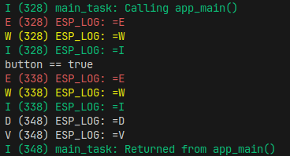
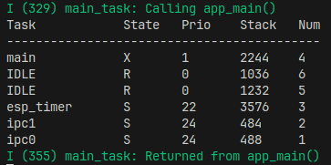

# ESP32

**目录**

[toc]

---

# Portals

[乐鑫官网](https://www.espressif.com/zh-hans/home)

[乐鑫官网开发文档](https://www.espressif.com/zh-hans/support/documents/technical-documents)

[wokwi在线仿真网址](https://wokwi.com/)

[连接手柄 A Bluetooth gamepad "host" for the ESP32 / ESP32-S3 / ESP32-C3](https://github.com/ricardoquesada/bluepad32)

[Bluepad32 firmware for Arduino + ESP32](https://github.com/ricardoquesada/bluepad32/blob/main/docs/plat_arduino.md)


---

# 使用设备

ESP32开发板


引脚定义


---

# 乐鑫 ESP32 物联网开发框架 ESP-IDF 开发

[乐鑫 ESP32 物联网开发框架 ESP-IDF 开发入门 --- 孤独的二进制 ](https://www.bilibili.com/video/BV1hM411k7zz/)

[乐鑫官网 ESP-IDF 编程指南](https://docs.espressif.com/projects/esp-idf/zh_CN/latest/esp32/get-started/index.html)

## 准备 & 安装

### 安装

根据[官方安装指南](https://docs.espressif.com/projects/esp-idf/zh_CN/latest/esp32/get-started/linux-macos-setup.html)一步步走，目前只尝试了Ubuntu

```bash
# 编译 ESP-IDF 需要以下软件包
sudo apt-get install git wget flex bison gperf python3 python3-pip python3-venv cmake ninja-build ccache libffi-dev libssl-dev dfu-util libusb-1.0-0

# 检查电脑上是否已经安装过 Python 3
python3 --version

# 获取 ESP-IDF  # ESP-IDF 将下载至 ~/esp/esp-idf
mkdir -p ~/esp
cd ~/esp
git clone --recursive https://github.com/espressif/esp-idf.git

# 设置工具(为支持 ESP32 的项目安装 ESP-IDF 使用的各种工具，比如编译器、调试器、Python 包等)
# 脚本将 ESP-IDF 所需的编译工具默认安装在用户的根目录中，即 Linux 系统中的 $HOME/.espressif 目录
cd ~/esp/esp-idf
./install.sh esp32

# 设置环境变量  # 刚刚安装的工具尚未添加至 PATH 环境变量，无法通过“命令窗口”使用这些工具。因此，必须设置一些环境变量
. $HOME/esp/esp-idf/export.sh
# 如果您需要经常运行 ESP-IDF，您可以为执行 export.sh 创建一个别名(可以写在 ~/.bashrc 中)
alias get_idf='. $HOME/esp/esp-idf/export.sh'
# 可以在任何终端窗口中运行 get_idf 来设置或刷新 esp-idf 环境
```
### HelloWorld

```bash
# 从 ESP-IDF 中 examples 目录下的 get-started/hello_world 工程开始
cd ~/esp
cp -r $IDF_PATH/examples/get-started/hello_world .
```

您的 ESP32 开发板连接到 PC，并查看开发板使用的串口

使用platformIO查看连接设备


查看连接设备及其端口号，通常，串口在不同操作系统下显示的名称有所不同：
1. Linux 操作系统： 以 /dev/ttyUSB 开头
2. macOS 操作系统： 以 /dev/cu. 开头

```bash
# 查看端口
lzy@legion:/dev$ cd /dev
lzy@legion:/dev$ ls ttyUSB*
ttyUSB0
```

```bash
# 配置工程
cd ~/esp/hello_world  # 必要
idf.py set-target esp32  # 打开一个新工程后，应首先使用 idf.py set-target esp32 设置“目标”芯片
idf.py menuconfig  # 主要是配置 flash 大小
```


```bash
# 编译工程  # 编译应用程序和所有 ESP-IDF 组件，接着生成引导加载程序、分区表和应用程序二进制文件
idf.py build  # 如果一切正常，编译完成后将生成 .bin 文件
```

```bash
# 烧录到设备
# 将 PORT 替换为 ESP32 开发板的串口名称。如果 PORT 未经定义，idf.py 将尝试使用可用的串口自动连接
idf.py -p PORT flash

# 可以使用 idf.py -p PORT monitor 命令，监视 “hello_world” 工程的运行情况
idf.py flash monitor -p /dev/ttyUSB0
# 使用快捷键 Ctrl+]，退出 IDF 监视器
```

烧录时，需要关闭其他 monitor 否则 flash 不成功


```bash
# 权限问题 /dev/ttyUSB0
sudo chmod a+rw /dev/ttyUSB0
```

```bash
lzy@legion:~/esp/hello_world$ echo $IDF_PATH
/home/lzy/esp/esp-idf

cp -r $IDF_PATH/examples/get-started/
```


### VSCode 插件


目前由于 Ubuntu 系统存储空间有限，仅仅安装了插件，没有进行配置


#### 直接使用 VSCode 打开项目

快捷键 Ctrl+Shift+P 选择 **ESP-IDF:Add vscode configuration folder**


会添加几个配置文件，main.c 不报红了


### VSCode 报蓝


在生成的 c_cpp_properties.json 文件的 configurations -> browse -> path 中添加类似下面的路径(for Ubuntu)

```
"/usr/include"  # 解决 stdio.h
"/home/lzy/esp/esp-idf/components/log/include"  # 解决 esp_log.h
```


## 入门

### 你好世界

printf

打印需要 "\n" 或者手动 flush 操作

```cpp
fflush(stdout)
```

```cpp
// 浮点数 总长10位，小数点保留两位
%10.2f    // 隐式用空格填充
%010.2f   // 显式用0填充
% 10.2f   // 显式用空格填充
%+10.2f   // 显式强制输出+号
```


### Arduino & ESP

Arduino 是一套 标准 (Serial.print()) ，所有开发板都支持

ESP32 提供了 Arduino-ESP32 插件，在 Arduino IDE 上使用 ESP32

插件中是一系列 .obj 文件，告诉 IDE 是如何实现标准的

esp-idf 不需要该插件，存放.c源文件，编译时将源文件编译为.obj，增加时间消耗但是更接近底层，也更可控(如 menuconfig 功能)

### 波特率设置

menuconfig 中设置


### 日志

头文件位置

```bash
lzy@legion:~/esp/esp-idf/components/log/include$ pwd
/home/lzy/esp/esp-idf/components/log/include
lzy@legion:~/esp/esp-idf/components/log/include$ ls
esp_log.h  esp_log_internal.h
```

使用例子


```cpp
#include <stdio.h>
#include "esp_log.h"

void app_main(void)
{
    ESP_LOGE("ESP_LOGE","=E");  // error        // 用户
    ESP_LOGW("ESP_LOGW","=W");  // warning      // 用户
    ESP_LOGI("ESP_LOGI","=I");  // information  // 用户
    ESP_LOGD("ESP_LOGD","=D");  // debug        // 程序员   // 默认不显示
    ESP_LOGV("ESP_LOGV","=V");  // verbose      // 程序员   // 默认不显示
}
```

在 menuconfig 中调整输出等级 

```
(Top) → Component config → Log output → Default log
```

默认情况，输出等级为 Info，看不到 Debug 和 Verbose 信息


修改输出等级为 Verbose 后，可以看到更多信息


Bootloader 的信息 也会可以在 menuconfig 调整


使用 esp_log_level_set 中间调整 log 的输出等级(仅看 header 字符串本身)

```c
#include <stdio.h>
#include <stdbool.h>
#include "esp_log.h"

bool button = true;
const char* header = "ESP_LOG";

void app_main(void)
{
    ESP_LOGE(header,"=E");  // error        // 用户
    ESP_LOGW(header,"=W");  // warning      // 用户
    ESP_LOGI(header,"=I");  // information  // 用户
    ESP_LOGD(header,"=D");  // debug        // 程序员   // 默认不显示
    ESP_LOGV(header,"=V");  // verbose      // 程序员   // 默认不显示

    if(button == true)
    {
        esp_log_level_set(header, ESP_LOG_VERBOSE);  // 要对应 header
        printf("button == true\n");
    }

    ESP_LOGE(header,"=E");  // error        // 用户
    ESP_LOGW(header,"=W");  // warning      // 用户
    ESP_LOGI(header,"=I");  // information  // 用户
    ESP_LOGD(header,"=D");  // debug        // 程序员   // 默认不显示
    ESP_LOGV(header,"=V");  // verbose      // 程序员   // 默认不显示
}
```


### 超级大循环

Arduino
1. 全局变量声明
2. setup
3. loop

在 esp 中实现

分时，在 FreeRTOS 中，最小单位为 tick

FreeRTOS 头文件 位置

```
~/esp/esp-idf/components/freertos/FreeRTOS-Kernel/include/freertos
```

默认 1 tick = 10 ms

可以在 menuconfig 中调整


portTICK_PERIOD_MS 可以查看 tick 时长 


```cpp
#include "/usr/include/mycommon.h"
#include "/home/lzy/esp/esp-idf/components/log/include/esp_log.h"
#include "/home/lzy/esp/esp-idf/components/freertos/FreeRTOS-Kernel/include/freertos/FreeRTOS.h"
#include "/home/lzy/esp/esp-idf/components/freertos/FreeRTOS-Kernel/include/freertos/task.h"

int counter = 0;

void app_main(void)
{
    ESP_LOGI("Tick", "%ld ms", portTICK_PERIOD_MS);  // 注意是ld

    while(true)
    {
        ESP_LOGI("Counter", "%d", counter);
        counter++;

        vTaskDelay(1000/portTICK_PERIOD_MS);
        // 求出一秒对应几个 ticks 并延迟对应 ticks，即延迟 1  秒
        // 无论 tick rate (HZ) 为多少 都是延迟 1 秒
    }
}
```

### 任务看门狗

如果没有 vTaskDelay 则程序运行一段时间后会出现如下报错


多任务
1. main{} 主线任务
2. idle{} 空闲任务

TWDT (Task Watch Dog Timer) 任务看门狗
1. 每一个任务都有一个任务看门狗
2. 作用是查看任务是否一直占用 CPU 资源不释放 (while死循环)
3. vTaskDelay 释放资源后，idle 任务会 reset timer，防止 watch dog 被触发
4. idle 其实在 “喂狗”

使用ESP-IDF开发的时候，都会遇到ESP32莫名其妙的'自动重启'，很有可能是触发了任务看门狗


可以在 menuconfig 中设置 任务看门狗 和 中断看门狗 的触发时间

如果选择 panic handler 如果没喂狗则进行 重启


也可以设置其他的 panic 表现行为


可以查看所有任务，需要在 menuconfig 中开启下图中的两个选项(勾选第一个后才会出现第二个)，如果不开启无法使用 vTaskList() 函数

其实三个都可以勾选


```cpp
#include "/usr/include/mycommon.h"
#include "/home/lzy/esp/esp-idf/components/log/include/esp_log.h"
#include "/home/lzy/esp/esp-idf/components/freertos/FreeRTOS-Kernel/include/freertos/FreeRTOS.h"
#include "/home/lzy/esp/esp-idf/components/freertos/FreeRTOS-Kernel/include/freertos/task.h"

char ptrTaskList[255] = {};

void app_main(void)
{
    printf("Task            State   Prio    Stack   Num\n");
    printf("-------------------------------------------\n");
    vTaskList(ptrTaskList);
    printf(ptrTaskList);
    fflush(stdout);
}
```



ipc是CPU间的通讯，两个IDLE分别对应CPU0和1

B->block S->suspend

### 点灯Blink

gpio 驱动头文件位置

```
/home/lzy/esp/esp-idf/components/driver/gpio/include/driver/gpio.h
```

pin 其实是枚举类型

```cpp
#include "/usr/include/mycommon.h"
#include "/home/lzy/esp/esp-idf/components/driver/gpio/include/driver/gpio.h"
#include "/home/lzy/esp/esp-idf/components/log/include/esp_log.h"
#include "/home/lzy/esp/esp-idf/components/freertos/FreeRTOS-Kernel/include/freertos/FreeRTOS.h"
#include "/home/lzy/esp/esp-idf/components/freertos/FreeRTOS-Kernel/include/freertos/task.h"

char ptrTaskList[255] = {};

gpio_num_t gpio_num = GPIO_NUM_18;
uint32_t status = 1u;

void app_main(void)
{
    gpio_reset_pin(gpio_num);  // 恢复默认
    gpio_set_direction(gpio_num, GPIO_MODE_OUTPUT);  // 模式选择

    while(true)
    {
        gpio_set_level(gpio_num, status);  // 设置电平高低
        vTaskDelay(1000/portTICK_PERIOD_MS);

        status = !status;  // 取反
    }
}
```


### 自定义菜单

[Kconfig Language 指南](https://www.kernel.org/doc/html/latest/kbuild/kconfig-language.html)

[乐鑫 Kconfig](https://docs.espressif.com/projects/esp-idf/zh_CN/latest/esp32/api-reference/kconfig.html)


在 main 文件夹下创建 Kconfig.projbuild 文件，里面填入要使用 menuconfig 配置的参数，其中的配置会出现在 sdkconfig 中

必须有 default 默认值，否则会报错

在 menuconfig 中按下 ？ 查看帮助信息

在 main.c  中可以通过 宏定义的方法使用这些参数

### 入门完结篇

[SPI Flash API](https://docs.espressif.com/projects/esp-idf/zh_CN/latest/esp32/api-reference/peripherals/spi_flash/index.html)

Header File : components/spi_flash/include/esp_flash_spi_init.h

[杂项系统 API](https://docs.espressif.com/projects/esp-idf/zh_CN/latest/esp32/api-reference/system/misc_system_api.html)

Header File : components/esp_system/include/esp_system.h

```c
#include "/usr/include/mycommon.h"

#include "esp_log.h"
#include "esp_system.h"
#include "esp_chip_info.h"
#include "esp_flash.h"
#include "esp_mac.h"


const char *hw = "硬件";
const char *sw = "软件";

void app_main(void)
{
    ESP_LOGI(sw, "IDF 版本号 : %s", esp_get_idf_version());

    esp_chip_info_t chip_info;

    // typedef struct
    // {
    //     esp_chip_model_t model; //!< chip model, one of esp_chip_model_t
    //     uint32_t features;      //!< bit mask of CHIP_FEATURE_x feature flags
    //     uint16_t revision;      //!< chip revision number (in format MXX; where M - wafer major version, XX - wafer minor version)
    //     uint8_t cores;          //!< number of CPU cores
    // } esp_chip_info_t;

    esp_chip_info(&chip_info);

    ESP_LOGI(hw, "CPU 核心数 : %d", chip_info.cores);
    ESP_LOGI(hw, "CPU 版本号 : %d", chip_info.revision);
    ESP_LOGI(hw, "ESP 类型   : %d", chip_info.model); // 可以用 switch-case 显示的更好
    

    // typedef enum
    // {
    //     CHIP_ESP32 = 1,         //!< ESP32
    //     CHIP_ESP32S2 = 2,       //!< ESP32-S2
    //     CHIP_ESP32S3 = 9,       //!< ESP32-S3
    //     CHIP_ESP32C3 = 5,       //!< ESP32-C3
    //     CHIP_ESP32C2 = 12,      //!< ESP32-C2
    //     CHIP_ESP32C6 = 13,      //!< ESP32-C6
    //     CHIP_ESP32H2 = 16,      //!< ESP32-H2
    //     CHIP_ESP32P4 = 18,      //!< ESP32-P4
    //     CHIP_POSIX_LINUX = 999, //!< The code is running on POSIX/Linux simulator
    // } esp_chip_model_t;

    // esp_chip_info.h
    // /* Chip feature flags, used in esp_chip_info_t */
    // #define CHIP_FEATURE_EMB_FLASH BIT(0)  //!< Chip has embedded flash memory
    // #define CHIP_FEATURE_WIFI_BGN BIT(1)   //!< Chip has 2.4GHz WiFi
    // #define CHIP_FEATURE_BLE BIT(4)        //!< Chip has Bluetooth LE
    // #define CHIP_FEATURE_BT BIT(5)         //!< Chip has Bluetooth Classic
    // #define CHIP_FEATURE_IEEE802154 BIT(6) //!< Chip has IEEE 802.15.4
    // #define CHIP_FEATURE_EMB_PSRAM BIT(7)  //!< Chip has embedded psram

    // 50十进制 = 0011 0010二进制
    ESP_LOGI(hw, "CPU 特征   : %ld", chip_info.features);  // 必须是 ld
    ESP_LOGI(hw, "embedded flash memory : %s", chip_info.features & CHIP_FEATURE_EMB_FLASH  ? "Yes" : "No");
    ESP_LOGI(hw, "2.4GHz WiFi           : %s", chip_info.features & CHIP_FEATURE_WIFI_BGN   ? "Yes" : "No");
    ESP_LOGI(hw, "Bluetooth LE          : %s", chip_info.features & CHIP_FEATURE_BLE        ? "Yes" : "No");
    ESP_LOGI(hw, "Bluetooth Classic     : %s", chip_info.features & CHIP_FEATURE_BT         ? "Yes" : "No");
    ESP_LOGI(hw, "IEEE 802.15.4         : %s", chip_info.features & CHIP_FEATURE_IEEE802154 ? "Yes" : "No");
    ESP_LOGI(hw, "embedded psram        : %s", chip_info.features & CHIP_FEATURE_EMB_PSRAM  ? "Yes" : "No");

    // 查看 flash 容量 1.menuconfig设置的 2.真实的
    // esp_flash_get_chip_size():返回 menuconfig 中设置的 flash 容量（以字节为单位）
    // spi_flash_get_chip_size():返回真实 flash 容量

    // ESP_LOGI(hw, "CPU 特征   : %d", esp_flash_get_chip_size());
    // ESP_LOGI(hw, "CPU 特征   : %lld", esp_flash_get_physical_size());
    // ESP_LOGI(hw, "CPU 特征   : %lld", spi_flash_get_chip_size());
    // ESP_LOGI(hw, "CPU 特征   : %lld", esp_flash_get_physical_size());

    uint32_t flash_size;
    esp_flash_get_size(NULL, &flash_size);
    ESP_LOGI(hw, "%" PRIu32 "MB %s flash", flash_size / (uint32_t)(1024 * 1024),
           (chip_info.features & CHIP_FEATURE_EMB_FLASH) ? "embedded" : "external");    
    
    uint8_t mac[6];
    esp_err_t ret = esp_efuse_mac_get_default(mac);
    if (ret == ESP_OK) 
    {
        ESP_LOGI(hw, "MAC address: %02x:%02x:%02x:%02x:%02x:%02x", mac[0], mac[1], mac[2], mac[3], mac[4], mac[5]);
    } else 
    {
        printf("Failed to get MAC address: %d", ret);
    }
}
```


## 存储

### NVS 非易失性存储

[API 参考 » 存储 API » 非易失性存储库](https://docs.espressif.com/projects/esp-idf/zh_CN/latest/esp32/api-reference/storage/nvs_flash.html)

Non-volatile Storage Library

非易失性存储 (NVS) 库主要用于在 flash 中存储键值格式的数据

NVS 的操作对象为键值对，其中键是 ASCII 字符串，当前支持的最大键长为 15 个字符。值可以为以下几种类型：
1. 整数型：uint8_t、int8_t、uint16_t、int16_t、uint32_t、int32_t、uint64_t 和 int64_t；
2. 以 0 结尾(null)的字符串；
3. 可变长度的二进制数据 (BLOB)

FLASH 也可以分区，相当于 U盘

NVS 可以存放 WiFi 配置

同一个namespace下，key必须唯一

set 和 get 操作

wear leveling

page(4096bytes) & entry(32bytes)

entry 是最小单位， key和value最小占用大小

### NVS 记录启动次数
  
```c
#include "/usr/include/mycommon.h"

#include "nvs_flash.h"
#include "esp_log.h"

void app_main(void)
{
    char* test_namespace="TestNVS";
    nvs_flash_init();  // 类似链接U盘

    nvs_handle_t test_handle;
    nvs_open(test_namespace, NVS_READWRITE, &test_handle);  // 类似打开文件夹

    // typedef enum {
    //     NVS_READONLY,  /*!< Read only */
    //     NVS_READWRITE  /*!< Read and write */
    // } nvs_open_mode_t;

    uint32_t counter_val = 0;
    char* counter_key = "counter";
    nvs_get_u32(test_handle, counter_key, &counter_val);
    ESP_LOGI("Open Counter", "key(%s):val(%ld)", counter_key, counter_val);
    

    counter_val ++;
    nvs_set_u32(test_handle, counter_key, counter_val);

    nvs_close(test_handle);  // 类似关闭文件夹
    nvs_flash_deinit();  // 类似拔出U盘
}
```

```bash
idf.py earse-flash  # 清除 NVS，需要关闭monitor
```

得到如下输出结果


```bash
......
Erasing flash (this may take a while)...
Chip erase completed successfully in 13.0s
Hard resetting via RTS pin...
Done
```

### NVS Blob

### 错误处理

### 分区 Partition Table

### NVS完结篇


## WIFI基础篇

### WIFI 扫描

### FreeRTOS 任务

### 事件标志组

### 事件环 Event Loop


# 孤独的二进制 - ESP32上的FREERTOS


[孤独的二进制 - ESP32上的FREERTOS](https://www.bilibili.com/video/BV1q54y1Z7ca/)

## 什么是RTOS

FreeRTOS 开源

ESP-IDF 的 FreeRTOS 基于 Vanilla FreeRTOS

ESP32双核

**SuperLoop 流程，不可控**


**RTOS 流程 (FreeRTOS中, Task任务 = Thread线程)**


 


## 多任务点灯

```cpp
void task1(void* pt)
{
  pinMode(23, OUTPUT);
  while(1)
  {
    digitalWrite(23,!digitalRead(23));
    vTaskDelay(1000);  // delay换为支持多任务的delay  // 函数内部填多少ticks
    // 对于esp32正好一个tick是1ms
  }
}

void task2(void* pt)
{
  pinMode(21, OUTPUT);
  while(1)
  {
    digitalWrite(21,!digitalRead(21));
    vTaskDelay(3000);
  }
}

void setup() 
{
  // 函数名，定义名称，分配内存大小（字节），参数，优先级，状态Handle
  xTaskCreate(task1,"blink23",1024,nullptr,1,nullptr);
  xTaskCreate(task2,"blink21",1024,nullptr,1,nullptr);
}

void loop() 
{

}

```

## 给任务传递参数

### 传递单个参数

### 传递多个参数


## STM32 FreeRTOS
