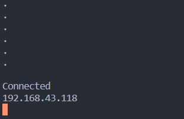
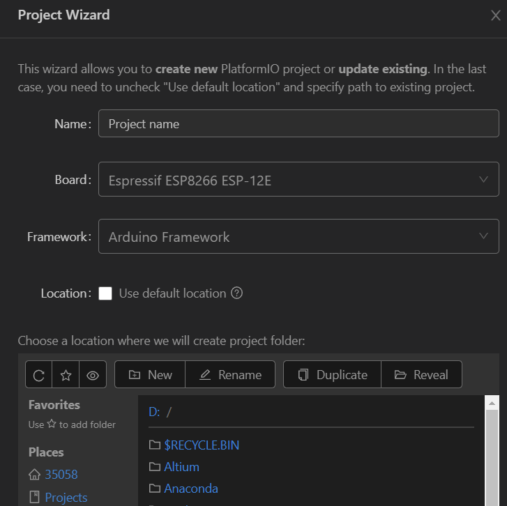
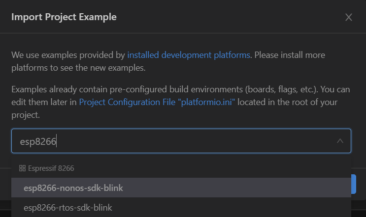
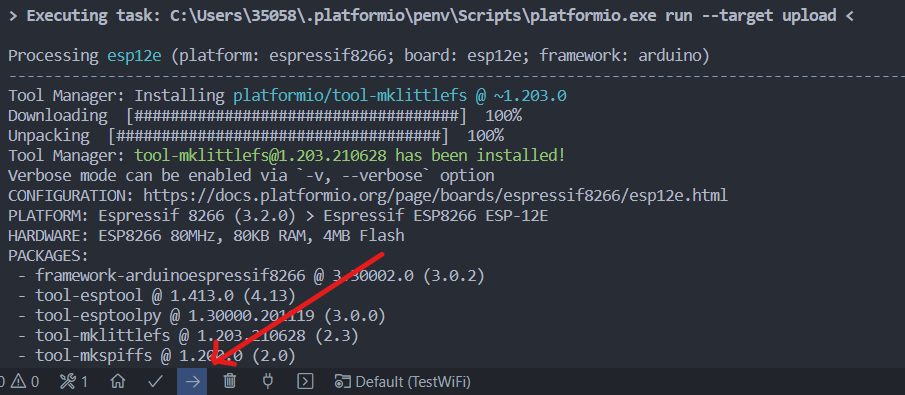
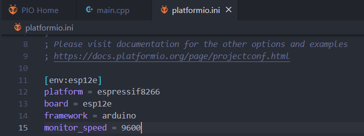
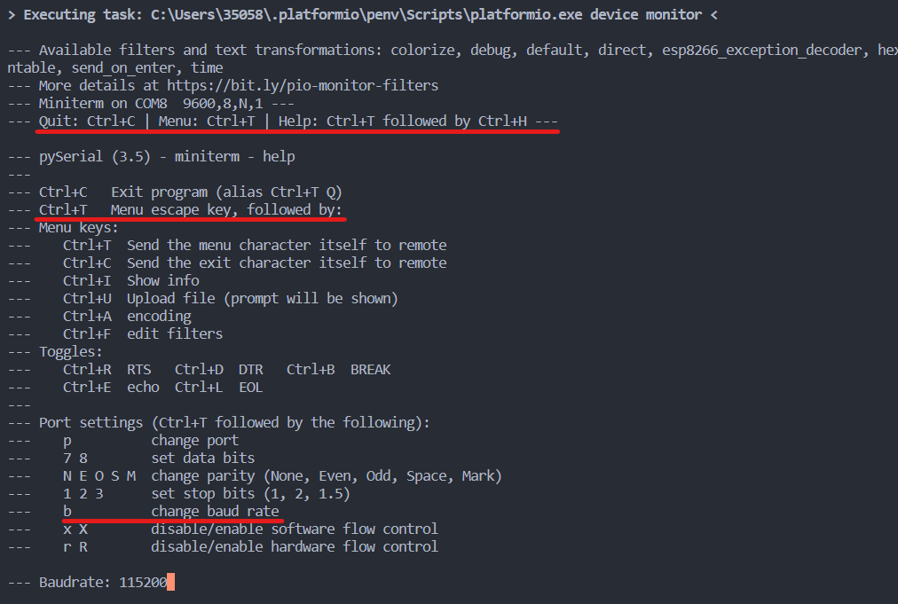

# ESP8266

[toc]

## Portals


# WiFi

## 连接WiFi

[](https://www.bilibili.com/video/BV1n441127eC)

连接成功前会在串口中打点(.)，连接成功后LED灯闪烁。

```cpp
#include <Arduino.h>
#include <ESP8266WiFi.h>

const char* ssid = "lzy";  // 无线网名称
const char* password = "87654321";  // 无线网密码


void setup() 
{
  // put your setup code here, to run once:
  Serial.begin(9600);
  WiFi.begin(ssid, password);
  while(WiFi.status()!=WL_CONNECTED)
  {
    delay(1000);
    Serial.print(".\n");
  }
  Serial.println();
  Serial.println("Connected");
  Serial.println(WiFi.localIP());
  pinMode(LED_BUILTIN,OUTPUT);
}

void loop() 
{
  // put your main code here, to run repeatedly:
  digitalWrite(LED_BUILTIN, HIGH);
  delay(500);
  digitalWrite(LED_BUILTIN, LOW);
  delay(500);  
}
```




# PlatformIO 使用帮助

PlatformIO带有代码提示功能及自动补全功能，相比Arduino IDE而言舒服多了。

## 安装 & 第一次使用

VSCode插件

创建新esp8266项目

 

第一次创建新项目速度极其慢，我是先尝试了Project Example，等待示例项目创建完成之后，再进行其他项目的创建。后续创建速度变快。（整个过程开着Proxy代理）



第一次进行upload操作时需要关闭代理，否则会卡住。（应该是只是第一次安装关闭代理即可，后续开着代理亲测没事）




## 设置串口Monitor波特率

**方法1**：在项目的platformio.ini文件中添加信息

```ini
monitor_speed = 9600
```



**方法2**：使用快捷键（Ctrl+T、Ctrl+H）调出Menu，在使用快捷键（Ctrl+T、b）调出波特率，进行调整。


