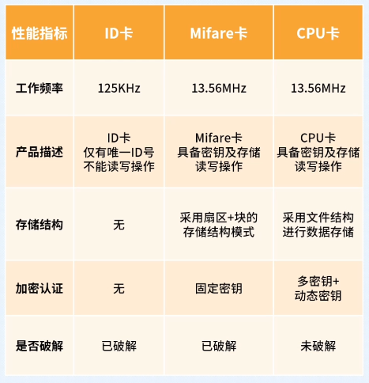

# 门禁卡种类

需要靠近读卡器感应天线就能被读取，例如交通卡、门禁卡

大体分类
1. ID卡 
   1. 早期的电子标签，只有一个ID号，不可以存储任何数据
   2. 没有算法，不可写入数据，其ID出厂一次性写入，应用人员只可读出卡号加以利用，无法存储消费等数据
   3. 安全性：容易复制，安全性较低，ID 无存储，卡片持有者的权限、功能操作要完全能依赖于网络系统
   4. 成本：卡和读卡器便宜，系统布线成本高、运维成本
   5. ID卡的工作频率为125KHz频率
   6. 读卡距离长，市场占有率高，已经有相对成熟的技术实践
2. IC卡
   1. IC卡是智能卡的总称，IC卡带有存储器可读写，普通的IC卡也叫储存器卡、逻辑加密卡
   2. IC卡数据的读取、写入均相应的密码认证，数据可以分区，不同区用于不同的功能，可以有不同的密码保护
   3. IC卡所记录内容可反复擦写，分为接触式和非接触式IC卡，都属于RFID(Radio Frequency Identification)范畴
      1. 非接触式IC卡是由芯片和线圈组成 (需要靠近读卡器感应天线就能被读取，例如交通卡、门禁卡)
      2. 接触式IC卡其芯片直接封装在卡基表面 (使用过程中需要插入读卡器使用，例如银行卡)
      3. 身份证属于 **非接触式IC卡**
   4. 安全性：IC的加密和反复读写的特性，其安全性远大于ID卡
   5. 成本：IC卡贵，但系统相对便宜、系统可靠而且比较安全、便捷
   6. IC卡的工作频率为13.56MHz

CPU卡(Central Processing Unit Card)
1. CPU卡也是IC卡的一种，是高级版的IC卡，CPU卡有信息处理的功能，优点是存储空间大、读取速度快、支持一卡多用功能等特点
2. 如果不强调无线的话，电话卡中SIM卡就是典型的CPU卡
3. 安全性：CPU卡内含有随机数发生器，硬件加密算法等，配合芯片上的OS系统,达到金融级的安全级别，防止重复卡、仿制卡、卡上数据非法修改
4. 应用：金融、保险、交警、政府行业等多个领域，小额支付行业
5. 按接口分类
   1. 接触式
   2. 非接触式

M1卡
1. 一种非接触式射频卡，也被称为Mifare卡
2. 基于ISO/IEC 14443标准，使用13.56MHz的射频频率进行通信
3. 具有较大的存储容量和较高的读写速度，广泛应用于门禁、公交卡、学生卡等领域
4. 已存在破解

EM卡(Electromagnetic Card)
1. 通常是磁条卡，利用磁性条形码进行身份验证
2. 制作成本低、易于替换
3. 相对来说安全性较低，易受磁场干扰和磁条损坏的影响。

