# 硬件工程师

[toc]

## Portals

[硬件工程师桥](https://space.bilibili.com/1881607420)

# 基本知识

## 面包板

电源线竖着连通（沿着红线、蓝线）

中间部分每一行的abcde连通，fghij连通。行与行之间不连通。（理解方便将PICO插入，两侧拓展）

# 通信接口

[SPI、I2C、UART、CAN](https://blog.51cto.com/u_13695010/2096153)

## SPI

[3分钟理解通信协议之SPI总线](https://www.bilibili.com/video/BV1RR4y1E7yq)

SPI（Serial Peripheral Interface，串行外设接口）是Motorola公司提出的一种同步串行数据传输标准，在很多器件中被广泛应用。

全双工、同步、串行外围接口。

主从模式（master-slave架构，对应下面的MOSI、MISO）

串行占用IO口少，但效率会偏低。

推挽输出接口

### 接口

SPI接口经常被称为4线串行总线，以主/从方式工作，数据传输过程由主机初始化。

使用的4条信号线分别为：
1. SCLK：串行时钟，用来同步数据传输，由**主机产生**。（主机和所有从机都使用的同一个时钟源（同步））。
2. MOSI：主机输出从机输入数据线，通常先传输MSB(Most Significant Bit 左侧)。
3. MISO：主机输入从机输出数据线，通常先传输LSB(Least Significant Bit 右侧)。
4. SS(NSS)：片选线（一组线），**低电平有效**，由**主机产生**，从机使能信号（前面三根线是从机共用的）。

在SPI总线上，某一时刻可以出现多个从机，但只能存在一个主机，主机通过片选线来确定要通信的从机。这就要求从机的MISO口具有三态特性，使得该MISO口线在器件未被选通时表现为高阻态输出。

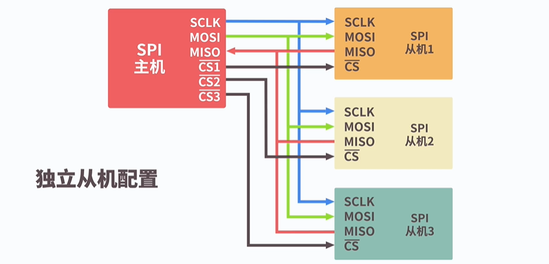

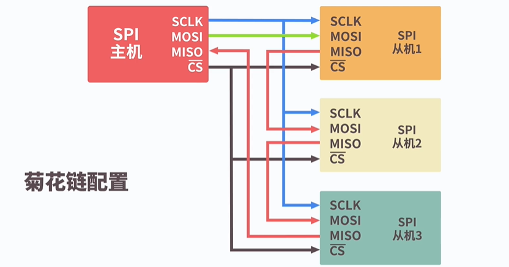

### 数据传输

在一个SPI时钟周期内，会完成如下操作
1. 主机通过MOSI线发送1位数据，从机通过该线读取这1位数据
2. 从机通过MISO线发送1位数据，主机通过该线读取这1位数据

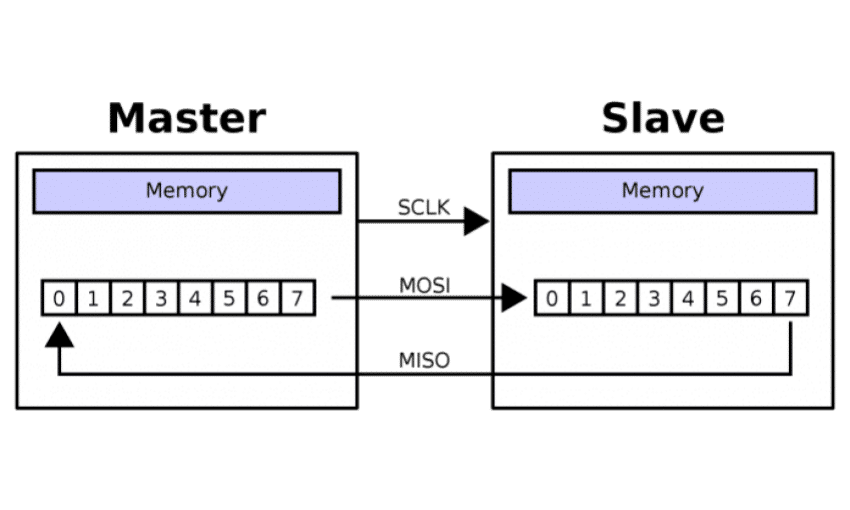

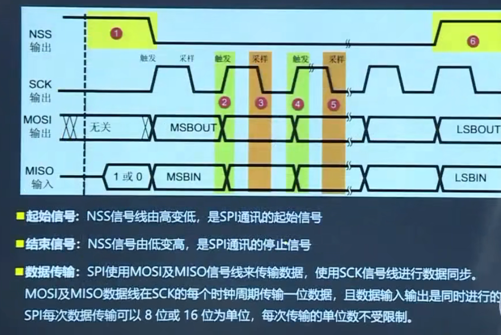

一个边沿进行数据准备，后一个边沿进行采集数据

### 时钟模式

时钟极性CPOL：设置时钟空闲时的电平
1. CPOL=0，SCK引脚在空闲状态保持**低电平**
2. CPOL=1，SCK引脚在空闲状态保持**高电平**

时钟相位CPHA：设置数据采样的时钟沿
1. CPHA=0，MOSI、MISO数据线上的信号将会在SCK时钟线的**奇数边沿**（上升或下降）采样
2. CPHA=1，MOSI、MISO数据线上的信号将会在SCK时钟线的**偶数边沿**（上升或下降）采样

**跳变沿从1开始计数。第一个跳变沿是从空闲变为非空闲。**

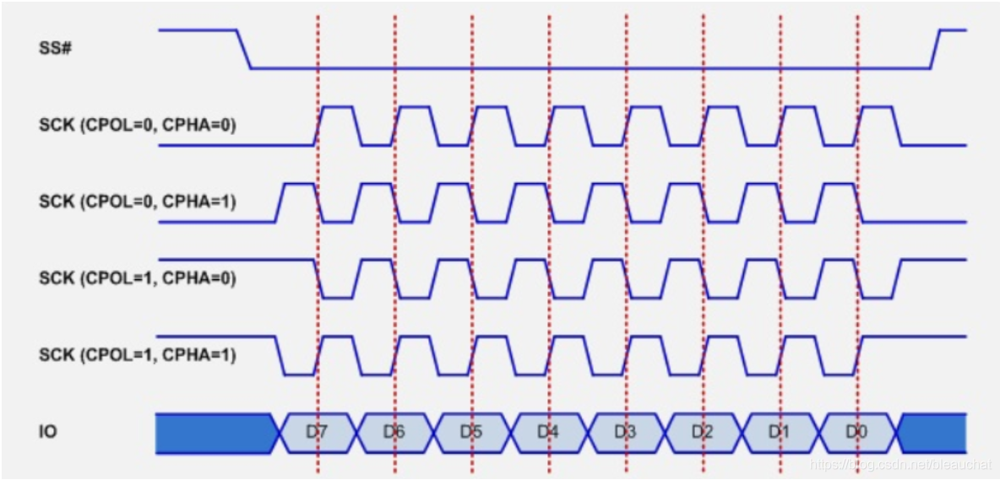

模式1：CPOL= 0，CPHA=0。SCK串行时钟线空闲时为低电平，数据在SCK时钟的上升沿被采样，数据在SCK时钟的下降沿切换

模式2：CPOL= 0，CPHA=1。SCK串行时钟线空闲时为低电平，数据在SCK时钟的下降沿被采样，数据在SCK时钟的上升沿切换

模式3：CPOL= 1，CPHA=0。SCK串行时钟线空闲时为高电平，数据在SCK时钟的下降沿被采样，数据在SCK时钟的上升沿切换

模式4：CPOL= 1，CPHA=1。SCK串行时钟线空闲时为高电平，数据在SCK时钟的上升沿被采样，数据在SCK时钟的下降沿切换

主设备一般支持四种，而从设备不一定全部支持。所以配置主设备使得从设备可以适配。（**SPI主模块和与之通信的外设备时钟相位和极性应该一致。**）

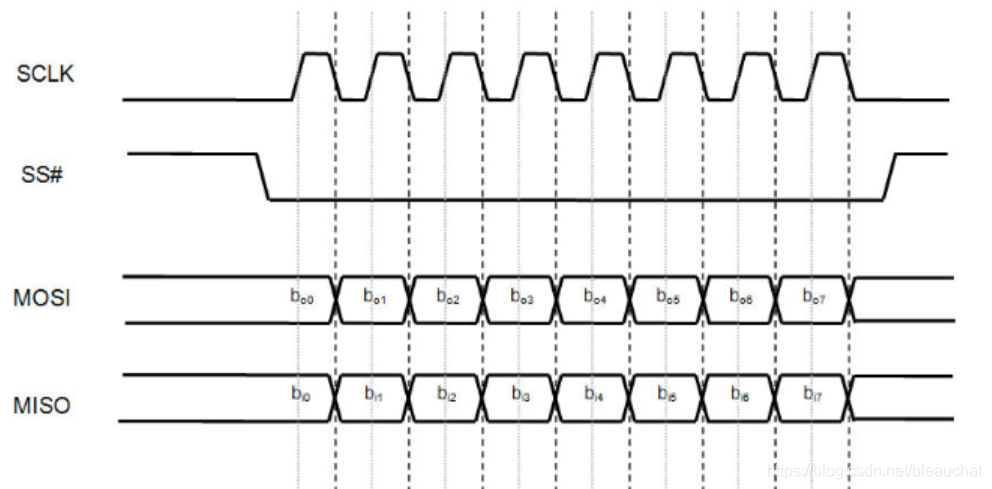

模式1对应的总线时序图(实线采样、虚线切换)

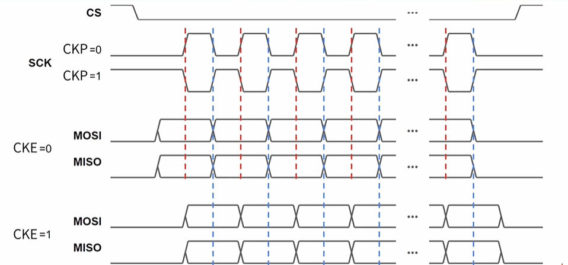

红线是CPHA=0，蓝线是CPHA=1。都表示采样。

### 优缺点

优点：
1. 支持全双工操作
2. 操作简单
3. 数据传输速率较高

缺点：
1. 需要占用主机较多的口线（每个从机都需要一根片选线）
2. 只支持单个主机
3. 无法内部寻址

## I2C

[3分钟理解通信协议之I2C总线](https://www.bilibili.com/video/BV1uP4y187cY)

I2C(Inter－Integrated Circuit)

I2C接口包括时钟线（SCL）和数据线（SDA）。这两条线都是漏极开路或者集电极开路结构，使用时需要外加上拉电阻，可以挂载多个设备。每个设备都有自己的地址，主机通过不同地址来选中不同的设备。

多主从架构

I2C总线上的所有设备都存在主从关系，支持多个主设备在线，支持仲裁和冲突检测

支持最大从机数理论为127。每个设备都只有一个唯一的地址，以便于主设备选择对应的设备进行通信。

仅需要SCL和SDA两条线
1. SCL:串行时钟线，同步时钟由主设备产生
2. SDA:串行数据线，用于传输数据信号

两条数据线都是开漏输出，需要接上拉电阻

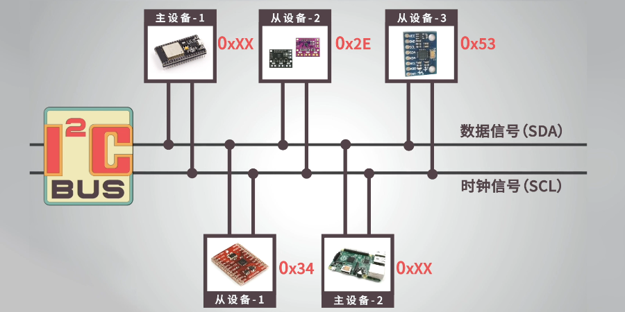

数据传输时，需要遵循数据结构
1. 开始位（所有从机变为活动状态，等待接收地址位）
2. 地址位：7位（也有10位）+ 读写位（主到从：0 | 从到主：1）（指定了数据的传输方向）
3. 应答位：在第9个时钟周期表达（ACK、NACK）。主机每次发送完数据后都会等待从设备的应答信号。
4. 内部寄存器地址或从设备的指令数据
5. 应答位
6. 要发送的数据块
7. 应答位
8. 停止位

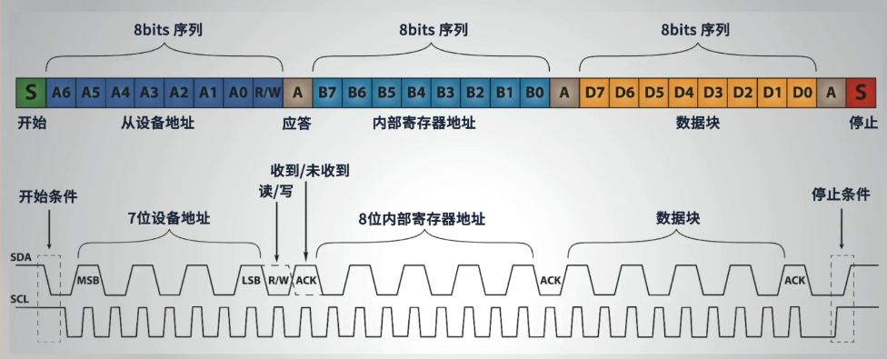

时序表：
1. 开始信号的条件：SCL为高电平且SDA由高向低跳变
2. 结束信号的条件：SCL位高电平且SDA由低向高跳变
3. 第1个应答位：如果从设备发送应答信号ACK，SDA会被拉低。否则表示从设备没有收到之前的地址数据，SDA为高电平。（可能由于从设备正忙或主设备发送了错误的地址）
4. 第2个应答位：如果接收器成功接收到数据，设置为0，否则保持1

## UART

串行通讯：需要地线作为参考，不需要时钟线。
并行通讯：无法携带时钟信息，为保证信号时序一致，需要额外的时钟信号线

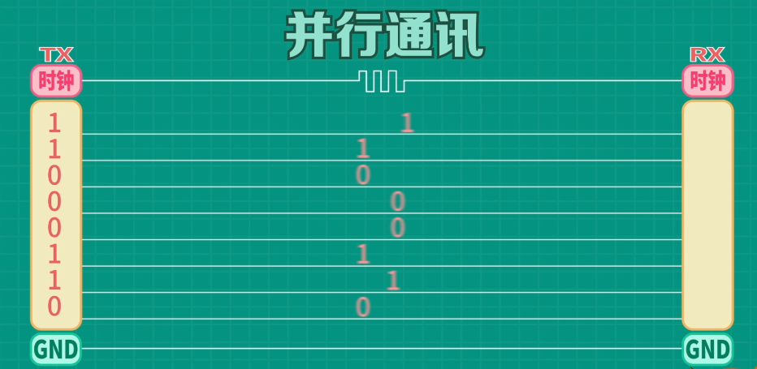

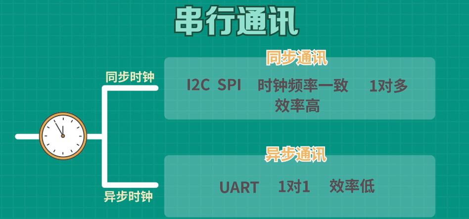

接收方通过识别数据包中的起始位和结束位实现信息同步

UART:(Universal Asynchronous Receiver Transmitter：通用异步收发器)

串行、异步。两条数据线、实现全双工的发送和接收。

UART是一种异步传输接口，不需要时钟线，通过起始位和停止位及波特率进行数据识别。

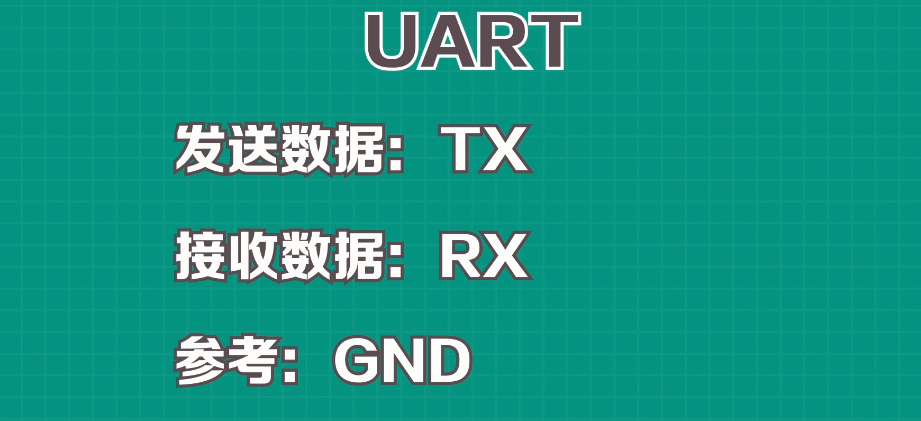

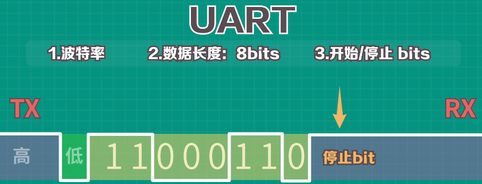

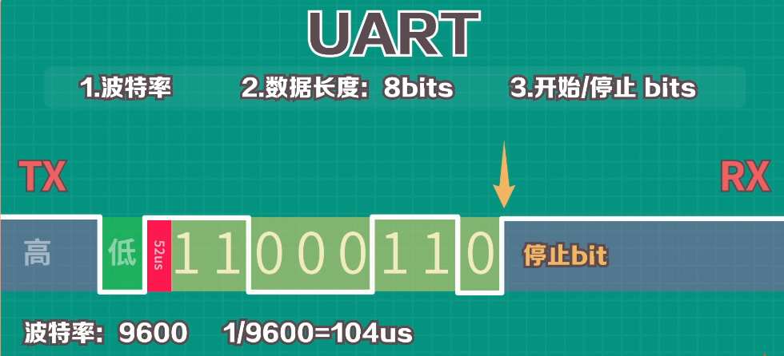

延迟一会再读数据，这样数据相对稳定

### 接口

UART仅使用两条线TXD和RXD用于数据的发和收。

### 数据格式

1. 起始位:数据线空闲状态为高电平，要发送数据时将其拉低一个时钟周期表示起始位
2. 数据位：使用校验位时，数据位可以有5~8位；如果不使用校验位，数据位可以达9位
3. 校验位：奇偶校验，保证包括校验位和数据位在内的所有位中1的个数为奇数或偶数
4. 停止位：为了表示数据包的结束，发送端需要将信号线从低电平变为高电平，并至少保持2个时钟周期

### 优缺点

优点
1. 只使用两条信号线
2. 不需要时钟信号
3. 有校验位进行错误检测
   
缺点
1. 传输速率比较低

## CAN

CAN，全称为(Controller Area Network)，即控制器局域网，是国际上应用最广泛的现场总线之一。

一个由CAN总线构成的单一网络中，理论上可以挂接无数个节点。

### 特点

1. 可以多主方式工作，网络上任意一个节点均可以在任意时刻主动地向网络上的其他节点发送信息，而不分主从，通信方式灵活。
2. 网络上的节点可分成不同的优先级，可以满足不同的实时要求。
3. 采用非破坏性位仲裁总线结构机制，当两个节点同时向网络上传送信息时，优先级低的节点主动停止数据发送，而优先级高的节点可不受影响地继续传送数据。
4. 可以点对点，一点对多点及全局广播几种传送方式接收数据。
5. 直接通信距离最远可达10km(速率4Kbps以下)。
6. 通信速率最高可达1MB/s(此时距离最长40m)。

## 对比

SPI 和I2C这两种通信方式都是短距离的，芯片和芯片之间或者其他元器件如传感器和芯片之间的通信。SPI和IIC是板上通信,IIC有时也会做板间通信,不过距离甚短,不过超过一米,例如一些触摸屏,手机液晶屏那些薄膜排线很多用IIC。

I2C能用于替代标准的并行总线，能连接的各种集成电路和功能模块。I2C是多主控总线，所以任何一个设备都能像主控器一样工作，并控制总线。总线上每一个设备都有一个独一无二的地址，根据设备它们自己的能力，它们可以作为发射器或接收器工作。多路微控制器能在同一个I2C总线上共存这两种线属于低速传输。

而UART是应用于两个设备之间的通信，如用单片机做好的设备和计算机的通信。这样的通信可以做长距离的。UART速度比上面两者者快,最高达100K左右,用与计算机与设备或者计算机和计算之间通信,但有效范围不会很长,约10米左右,UART优点是支持面广,程序设计结构很简单,随着USB的发展,UART也逐渐走向下坡。

CAN 通讯距离最大是10 公里（设速率为5Kbps）,或最大通信速率为1Mbps(设通信距离为40 米)。CAN 总线上的节点数可达110 个。通信介质可在双绞线，同轴电缆，光纤中选择。CAN 采用非破坏性的总线仲裁技术，当多个节点同时发送数据时，优先级低的节点会主动退出发送，高优先级的节点可继续发送，节省总线仲裁时间。CAN 是多主方式工作，网上的任一节点均可在任意时刻主动地向网络上其他节点发送信息。CAN 采用报文识别符识别网络上的节点，从而把节点分成不同的优先级，高优先级的节点享有传送报文的优先权。报文是短帧结构，短的传送时间使其受干扰概率低，CAN 有很好的效验机制，这些都保证了CAN 通信的可靠性。

## OLED

[基于Arduino的OLED显示屏使用教程](https://www.bilibili.com/video/BV1rE411v7KZ)

Cathods--阴极
Emissive--发光部分
Conductive--传导
Anode--阳极

OLED优缺点

