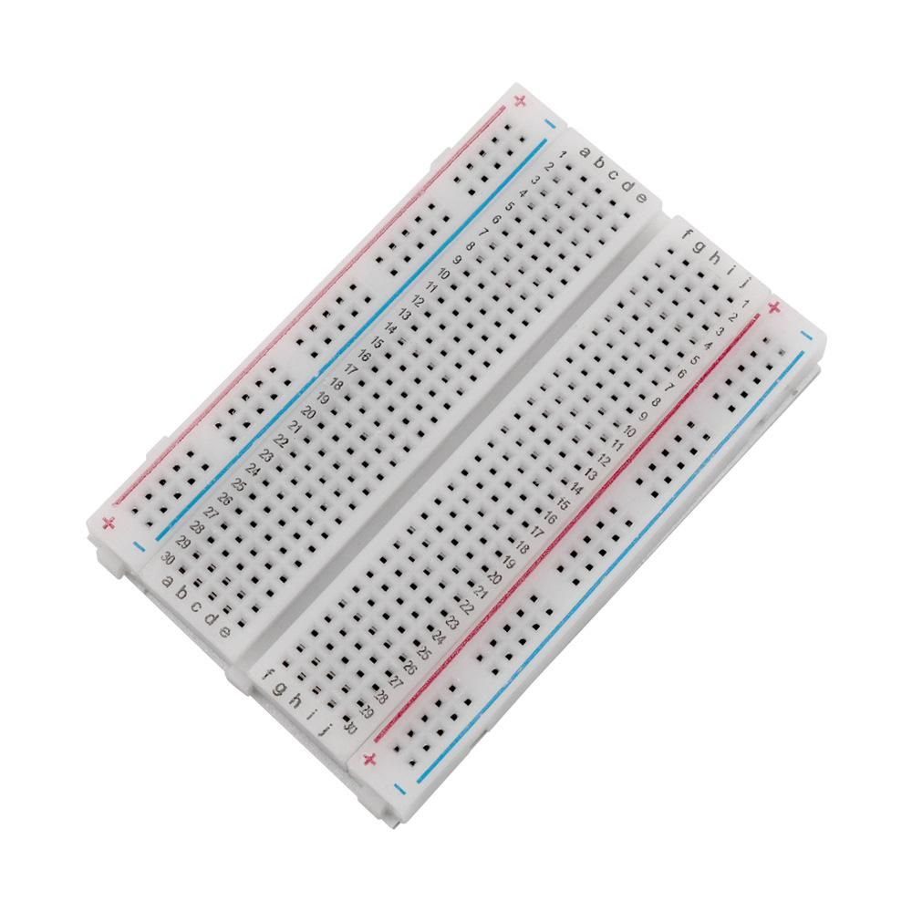
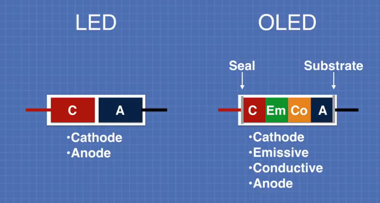
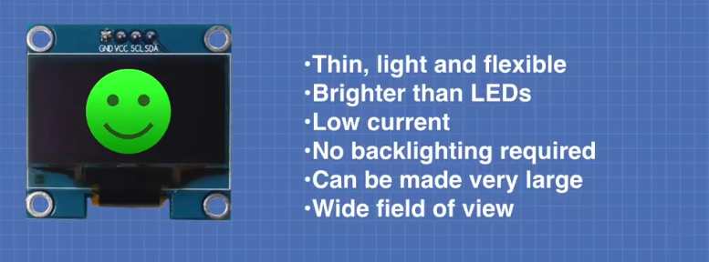
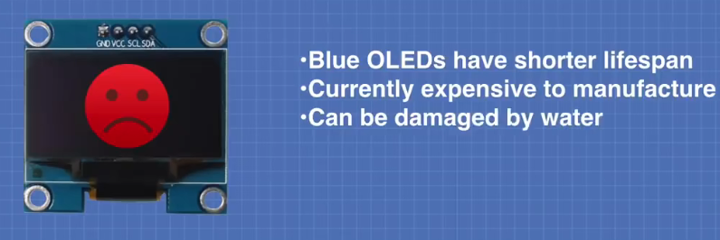

# 硬件工程师

[toc]

## Portals

[硬件工程师桥](https://space.bilibili.com/1881607420)

# 基本知识

## 面包板

电源线竖着连通（沿着红线、蓝线）

中间部分每一行的abcde连通，fghij连通。行与行之间不连通。（理解方便将PICO插入，两侧拓展）

## SPI

模拟SPI通信（使用GPIO，不依赖芯片的GPIO）

**SPI更快，I2C更安全**

|序号|引脚|说明|
|----|----|----|
|1|DC||
|2|RES||
|3|D1||
|4|D0||
|5|VCC||
|6|GND||

## I2C

128*64

## OLED

[基于Arduino的OLED显示屏使用教程](https://www.bilibili.com/video/BV1rE411v7KZ)

Cathods--阴极
Emissive--发光部分
Conductive--传导
Anode--阳极

OLED优缺点

