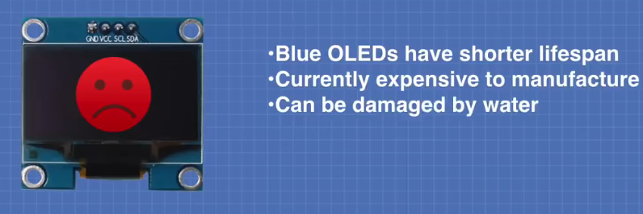

# 通信接口

[toc]

## Portal

[SPI、I2C、UART、CAN](https://blog.51cto.com/u_13695010/2096153)

# SPI

[SPI总线 硬声APP 3分钟](https://www.bilibili.com/video/BV1RR4y1E7yq/)

[SPI通信协议 爱上半导体 5分钟](https://www.bilibili.com/video/BV1F54y1M7e7/)

# I2C

[I2C通信协议 硬声APP 3分钟](https://www.bilibili.com/video/BV1uP4y187cY/)

[I2C通信协议 爱上半导体 4分钟](https://www.bilibili.com/video/BV1dg4y1H773/)

[I2C通信协议 DFRobot智造星球 5分钟](https://www.bilibili.com/video/BV1Ad4y1z7Tp/)

# CAN
## CAN总线 爱上半导体 4分钟

[CAN总线 爱上半导体 4分钟](https://www.bilibili.com/video/BV14k4y187e6/)

Controller Area Network --- 控制器 域 网络 --- 控制器局域网(联结同一个路由器)

应用于汽车领域 其中 控制器 全称为 ECU --- Electronic Control Unit --- 电子控制单元

ECU中集成
1. 供电系统
2. 单片机
3. 驱动系统

CAN协议
1. 使ECU之间进行通讯(挂载在CAN上)
2. 节省铜线

需要专门的CAN收发芯片

单片机发送信号给CAN收发芯片，高电平为逻辑1，低电平为逻辑0

经过CAN收发器后，普通信号转为差分信号，两根线表示一个信号

当发送低电平，一根线3.5V，另一根线1.5V，电压差2V，表示逻辑0， 显性电平

当发送高电平，一根线2.5V，另一根线2.5V，电压差0V，表示逻辑1

CAN收发器也可以将接受的差分信号转化为普通电平信号，然后发送给单片机

差分信号的好处: 双绞线缠绕，如果收到干扰也会同时作用在两根线上，压差保持不变(因此CAN信号可以传输很长的距离)

 

**CAN数据帧解析**

1. 第1位是起始位，必须为逻辑0

2. 后续11位为识别码，用于判断该帧信息是发送给哪个设备
   

3. RTR位，区分数据帧(0)或远程请求帧(1)

4. 后续6位为控制码，用于控制数据长度
   1. IDE位，用于区分标准格式(11位识别码)对应IDE为0 和 扩展格式(29位识别码)对应IDE为1
   
   2. 预留的空闲位，逻辑0
   3. 后续最后4位为DLC(Data Link Control)位，表示后续的数据位的**字节**数
   

5. 接下来的数据吗由DLC控制

6. 后续为16位CRC码(循环冗余校验位)，用于确保数据准确性
   1. 前15位为CRC校验码，数据接收端根据数据计算CRC位，若计算的与接收的CRC不一致则说明数据存在问题，重新发送数据
   2. 最后一位为CRC界定符，逻辑1，用于隔开后续信息

7. 随后为两位ACK码
   1. 第1位为ACK确认槽，发送端发送逻辑1，接收端回复逻辑0表示应答
   2. 第2位为ACK界定位，一定是逻辑1，用于隔开后续

8. 最后是7位结束位，全部为逻辑1，表示数据帧传输结束

当两个设备同时发送信息，**通过识别码判断优先级**

## CAN总线通信及优先级机制

由于CAN总线是异步通信的，它不像IIC、SPI这种同步通行方式一样具有同步时钟，所以总线网络中的节点就需要约定好通信的波特率。

[详解CAN总线：CAN总线报文格式—数据帧](https://handsome-man.blog.csdn.net/article/details/126999222?spm=1001.2014.3001.5502)

[详解CAN总线：CAN总线通信优先级机制](https://blog.csdn.net/m0_38106923/article/details/127499503)

在CAN总线空闲态，最先开始发送消息的单元获得发送权。多个单元同时开始发送时，各发送单元从仲裁段的第一位开始进行仲裁，连续输出显性电平最多的单元可继续发送。所以，帧ID值越小，优先级越高。

## SPI

[3分钟理解通信协议之SPI总线](https://www.bilibili.com/video/BV1RR4y1E7yq)

SPI（Serial Peripheral Interface，串行外设接口）是Motorola公司提出的一种同步串行数据传输标准，在很多器件中被广泛应用。

全双工、同步、串行外围接口。

主从模式（master-slave架构，对应下面的MOSI、MISO）

串行占用IO口少，但效率会偏低。

推挽输出接口

### 接口

SPI接口经常被称为4线串行总线，以主/从方式工作，数据传输过程由主机初始化。

使用的4条信号线分别为：
1. SCLK：串行时钟，用来同步数据传输，由**主机产生**。（主机和所有从机都使用的同一个时钟源（同步））。
2. MOSI：主机输出从机输入数据线，通常先传输MSB(Most Significant Bit 左侧)。
3. MISO：主机输入从机输出数据线，通常先传输LSB(Least Significant Bit 右侧)。
4. SS(NSS)：片选线（一组线），**低电平有效**，由**主机产生**，从机使能信号（前面三根线是从机共用的）。

在SPI总线上，某一时刻可以出现多个从机，但只能存在一个主机，主机通过片选线来确定要通信的从机。这就要求从机的MISO口具有三态特性，使得该MISO口线在器件未被选通时表现为高阻态输出。

### 数据传输

在一个SPI时钟周期内，会完成如下操作
1. 主机通过MOSI线发送1位数据，从机通过该线读取这1位数据
2. 从机通过MISO线发送1位数据，主机通过该线读取这1位数据

一个边沿进行数据准备，后一个边沿进行采集数据

### 时钟模式

时钟极性CPOL：设置时钟空闲时的电平
1. CPOL=0，SCK引脚在空闲状态保持**低电平**
2. CPOL=1，SCK引脚在空闲状态保持**高电平**

时钟相位CPHA：设置数据采样的时钟沿
1. CPHA=0，MOSI、MISO数据线上的信号将会在SCK时钟线的**奇数边沿**（上升或下降）采样
2. CPHA=1，MOSI、MISO数据线上的信号将会在SCK时钟线的**偶数边沿**（上升或下降）采样

**跳变沿从1开始计数。第一个跳变沿是从空闲变为非空闲。**

模式1：CPOL= 0，CPHA=0。SCK串行时钟线空闲时为低电平，数据在SCK时钟的上升沿被采样，数据在SCK时钟的下降沿切换

模式2：CPOL= 0，CPHA=1。SCK串行时钟线空闲时为低电平，数据在SCK时钟的下降沿被采样，数据在SCK时钟的上升沿切换

模式3：CPOL= 1，CPHA=0。SCK串行时钟线空闲时为高电平，数据在SCK时钟的下降沿被采样，数据在SCK时钟的上升沿切换

模式4：CPOL= 1，CPHA=1。SCK串行时钟线空闲时为高电平，数据在SCK时钟的上升沿被采样，数据在SCK时钟的下降沿切换

主设备一般支持四种，而从设备不一定全部支持。所以配置主设备使得从设备可以适配。（**SPI主模块和与之通信的外设备时钟相位和极性应该一致。**）

模式1对应的总线时序图(实线采样、虚线切换)

红线是CPHA=0，蓝线是CPHA=1。都表示采样。

### 优缺点

优点：
1. 支持全双工操作
2. 操作简单
3. 数据传输速率较高

缺点：
1. 需要占用主机较多的口线（每个从机都需要一根片选线）
2. 只支持单个主机
3. 无法内部寻址

## I2C

[3分钟理解通信协议之I2C总线](https://www.bilibili.com/video/BV1uP4y187cY)

I2C(Inter－Integrated Circuit)

I2C接口包括时钟线（SCL）和数据线（SDA）。这两条线都是漏极开路或者集电极开路结构，使用时需要外加上拉电阻，可以挂载多个设备。每个设备都有自己的地址，主机通过不同地址来选中不同的设备。

多主从架构

I2C总线上的所有设备都存在主从关系，支持多个主设备在线，支持仲裁和冲突检测

支持最大从机数理论为127。每个设备都只有一个唯一的地址，以便于主设备选择对应的设备进行通信。

仅需要SCL和SDA两条线
1. SCL:串行时钟线，同步时钟由主设备产生
2. SDA:串行数据线，用于传输数据信号

两条数据线都是开漏输出，需要接上拉电阻

数据传输时，需要遵循数据结构
1. 开始位（所有从机变为活动状态，等待接收地址位）
2. 地址位：7位（也有10位）+ 读写位（主到从：0 | 从到主：1）（指定了数据的传输方向）
3. 应答位：在第9个时钟周期表达（ACK、NACK）。主机每次发送完数据后都会等待从设备的应答信号。
4. 内部寄存器地址或从设备的指令数据
5. 应答位
6. 要发送的数据块
7. 应答位
8. 停止位

时序表：
1. 开始信号的条件：SCL为高电平且SDA由高向低跳变
2. 结束信号的条件：SCL位高电平且SDA由低向高跳变
3. 第1个应答位：如果从设备发送应答信号ACK，SDA会被拉低。否则表示从设备没有收到之前的地址数据，SDA为高电平。（可能由于从设备正忙或主设备发送了错误的地址）
4. 第2个应答位：如果接收器成功接收到数据，设置为0，否则保持1

## UART

串行通讯：需要地线作为参考，不需要时钟线。
并行通讯：无法携带时钟信息，为保证信号时序一致，需要额外的时钟信号线

接收方通过识别数据包中的起始位和结束位实现信息同步

UART:(Universal Asynchronous Receiver Transmitter：通用异步收发器)

串行、异步。两条数据线、实现全双工的发送和接收。

UART是一种异步传输接口，不需要时钟线，通过起始位和停止位及波特率进行数据识别。

延迟一会再读数据，这样数据相对稳定

### 接口

UART仅使用两条线TXD和RXD用于数据的发和收。

### 数据格式

1. 起始位:数据线空闲状态为高电平，要发送数据时将其拉低一个时钟周期表示起始位
2. 数据位：使用校验位时，数据位可以有5~8位；如果不使用校验位，数据位可以达9位
3. 校验位：奇偶校验，保证包括校验位和数据位在内的所有位中1的个数为奇数或偶数
4. 停止位：为了表示数据包的结束，发送端需要将信号线从低电平变为高电平，并至少保持2个时钟周期

### 优缺点

优点
1. 只使用两条信号线
2. 不需要时钟信号
3. 有校验位进行错误检测
   
缺点
1. 传输速率比较低
2. 
## 对比

SPI 和I2C这两种通信方式都是短距离的，芯片和芯片之间或者其他元器件如传感器和芯片之间的通信。SPI和IIC是板上通信,IIC有时也会做板间通信,不过距离甚短,不过超过一米,例如一些触摸屏,手机液晶屏那些薄膜排线很多用IIC。

I2C能用于替代标准的并行总线，能连接的各种集成电路和功能模块。I2C是多主控总线，所以任何一个设备都能像主控器一样工作，并控制总线。总线上每一个设备都有一个独一无二的地址，根据设备它们自己的能力，它们可以作为发射器或接收器工作。多路微控制器能在同一个I2C总线上共存这两种线属于低速传输。

而UART是应用于两个设备之间的通信，如用单片机做好的设备和计算机的通信。这样的通信可以做长距离的。UART速度比上面两者者快,最高达100K左右,用与计算机与设备或者计算机和计算之间通信,但有效范围不会很长,约10米左右,UART优点是支持面广,程序设计结构很简单,随着USB的发展,UART也逐渐走向下坡。

CAN 通讯距离最大是10 公里（设速率为5Kbps）,或最大通信速率为1Mbps(设通信距离为40 米)。CAN 总线上的节点数可达110 个。通信介质可在双绞线，同轴电缆，光纤中选择。CAN 采用非破坏性的总线仲裁技术，当多个节点同时发送数据时，优先级低的节点会主动退出发送，高优先级的节点可继续发送，节省总线仲裁时间。CAN 是多主方式工作，网上的任一节点均可在任意时刻主动地向网络上其他节点发送信息。CAN 采用报文识别符识别网络上的节点，从而把节点分成不同的优先级，高优先级的节点享有传送报文的优先权。报文是短帧结构，短的传送时间使其受干扰概率低，CAN 有很好的效验机制，这些都保证了CAN 通信的可靠性。

## OLED

[基于Arduino的OLED显示屏使用教程](https://www.bilibili.com/video/BV1rE411v7KZ)

Cathods--阴极
Emissive--发光部分
Conductive--传导
Anode--阳极

OLED优缺点

