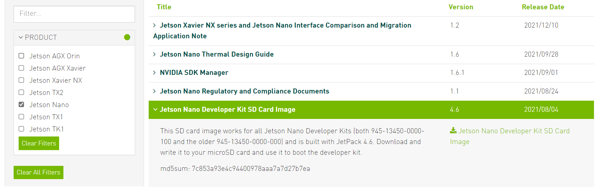
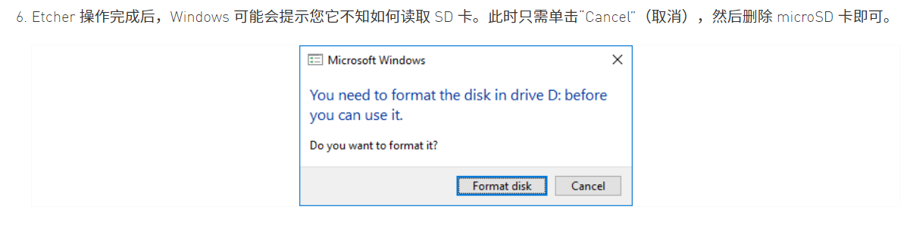
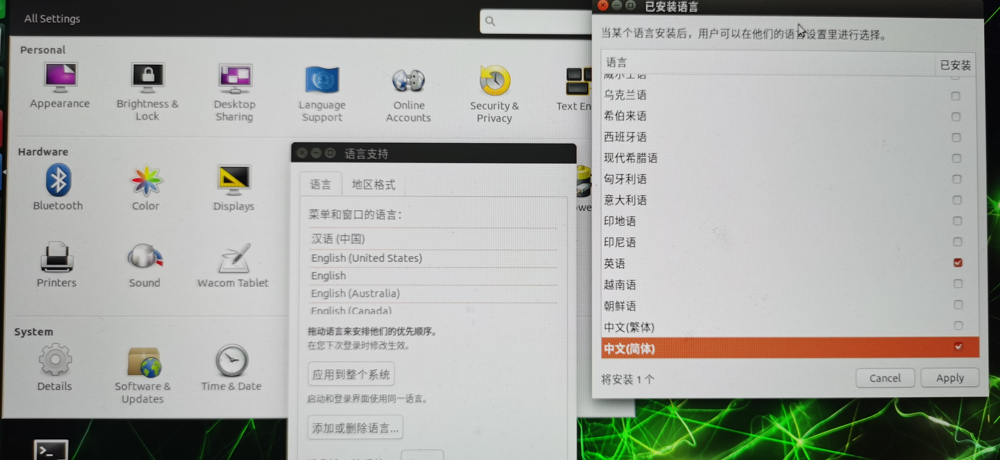
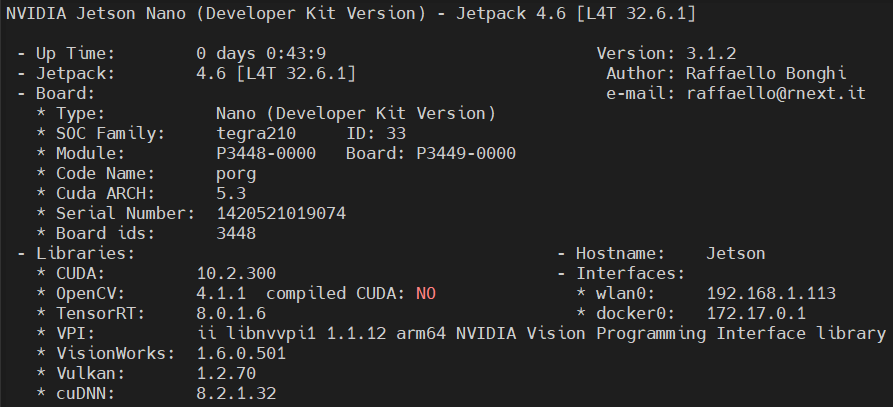
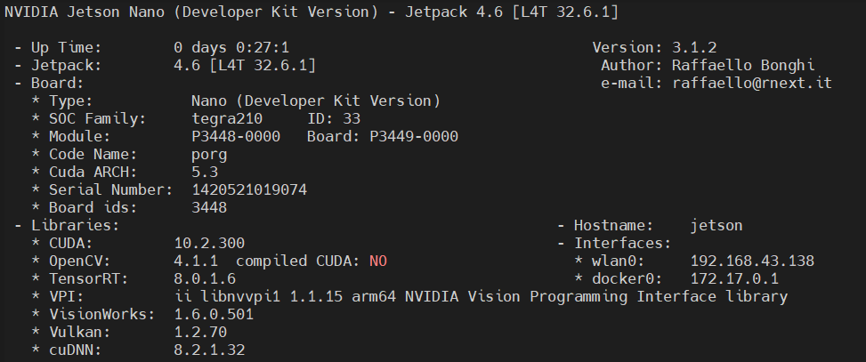
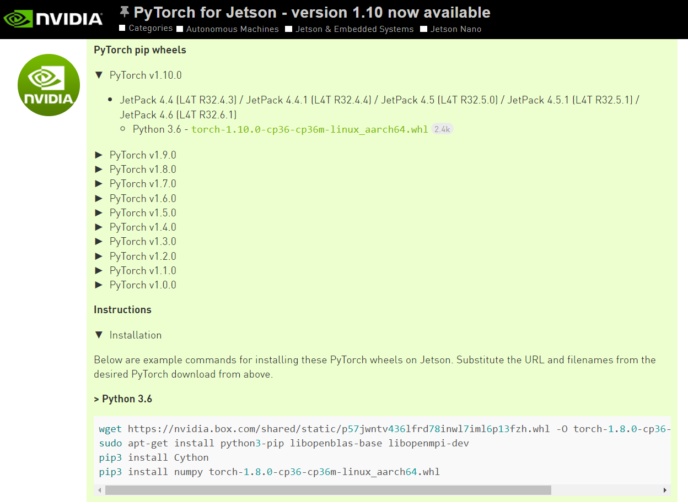
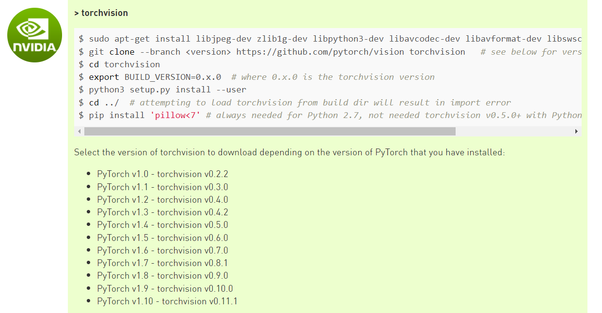
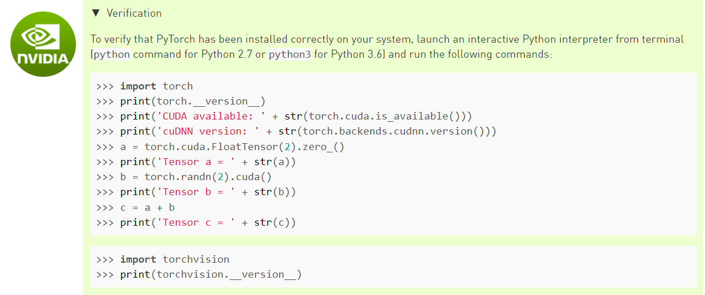
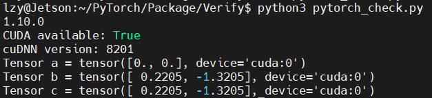
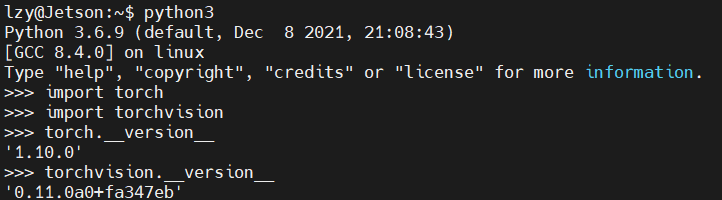

# Jetson Nano

[toc]

# 基础环境配置

## Jetson Nano镜像烧录

最好使用USB3.0

[Jetson 官方下载中心](https://developer.nvidia.cn/zh-cn/embedded/downloads)



记录版本：Jetson Nano Developer Kit SD Card Image (4.6)

```
This SD card image works for all Jetson Nano Developer Kits (both 945-13450-0000-100 and the older 945-13450-0000-000) and is built with JetPack 4.6. Download and write it to your microSD card and use it to boot the developer kit.

md5sum: 7c853a93e4c94400978aaa7a7d27b7ea
```

烧录的时候，最好使用Type-C接口可能更快。



## 修改apt、pip源

```
df -h

sudo apt-get purge libreoffice*  
sudo apt-get clean

sudo cp /etc/apt/sources.list /etc/apt/sources.list.backup

sudo nano /etc/apt/sources.list
```

Ctrl+K删除整行

```
deb http://mirrors.tuna.tsinghua.edu.cn/ubuntu-ports/ bionic main multiverse restricted universe
deb http://mirrors.tuna.tsinghua.edu.cn/ubuntu-ports/ bionic-security main multiverse restricted universe
deb http://mirrors.tuna.tsinghua.edu.cn/ubuntu-ports/ bionic-updates main multiverse restricted universe
deb http://mirrors.tuna.tsinghua.edu.cn/ubuntu-ports/ bionic-backports main multiverse restricted universe
deb-src http://mirrors.tuna.tsinghua.edu.cn/ubuntu-ports/ bionic main multiverse restricted universe
deb-src http://mirrors.tuna.tsinghua.edu.cn/ubuntu-ports/ bionic-security main multiverse restricted universe
deb-src http://mirrors.tuna.tsinghua.edu.cn/ubuntu-ports/ bionic-updates main multiverse restricted universe
deb-src http://mirrors.tuna.tsinghua.edu.cn/ubuntu-ports/ bionic-backports main multiverse restricted universe
```

```
sudo apt-get update

mkdir ~/.pip
vi ~/.pip/pip.conf
```
```
[global]
index-url = https://pypi.tuna.tsinghua.edu.cn/simple
[install]
trusted-host=mirrors.aliyun.com
```
```
sudo -H pip3 install jetson-stats

#重启后才能使用

sudo jtop
```

## 中文输入法

[Jetson Nano 中文输入法安装](https://blog.csdn.net/qq_34213260/article/details/106226831)

在命令行输入ibus，查看相关命令

```
ibus

sudo apt-get install ibus-pinyin
```



语言支持 -> 添加或删除语言 -> 已安装语言 -> 勾选中文（简体） -> 将汉语拖到最上端 -> 应用到整个系统

此处可以重启。

```
ibus-setup
```

弹出IBus首选项窗口，选择输入法，添加汉语。

```
ibus restart

sudo reboot
```

## 增加交换空间

[jetson nano增加交换空间](https://blog.csdn.net/u011119817/article/details/99679350)

```
# 检查当前系统的效换空间
sudo swapon --show

# 检查内存
free -h


# 增加2G交换空间
# a. 创建用于swap的文件
sudo fallocate -l 2G /swapfile
# 如果fallocate没有安装，将得到fallocate failed:Operation not supported的报错信息。可以用以下命令创建
sudo dd if=/dev/zero of=/swapfile bs=2048 count=1048576
# b. 所有用户都可以读写swap file,设置正确的权限
sudo chmod 666 /swapfile
# c. 设置交换空间
sudo mkswap /swapfile
# d. 激活交换空间
sudo swapon /swapfile
# 为了使这个激活永久有效
sudo nano /etc/fstab
# 粘贴 /swapfile swap swap defaults 0 0
# e. 验证增加空间是否有效
sudo swapon --show
sudo free -h
```


## PyTorch

[Nvidia 官方网站](https://forums.developer.nvidia.com/c/agx-autonomous-machines/jetson-embedded-systems/jetson-nano/)

[知乎博客 PyTorch与TensorFlow](https://zhuanlan.zhihu.com/p/342504190)

查看cuda版本(利用sudo jtop)



另外也可以使用nvcc -V

```
/home/innocent# ls /usr/local/cuda-10

不要回车按tab看看自动补全的结果

添加临时环境变量

export PATH=$PATH:/usr/local/cuda-10.2/bin

echo $PATH 

可以查看已添加成功

添加永久环境变量

nano ~/.bashrc

写入

export PATH=$PATH:/usr/local/cuda-10.2/bin

nvcc -V

查看信息
```


**安装torch**

```
# 安装pip3
sudo apt install python3-pip

# 用pip3安装jtop（辅助设置监控jetson nano）
sudo pip3 install -U jetson-stats

# 打开jtop
sudo jtop
# 按下6进入第六页显示Jetpack CUDA opencv TRT等软件版本。
```

安装PyTorch前记得查看自己的JetPack版本。



Jetson Nano的架构不是amd所以无法使用miniconda，在这里使用miniforge进行替代

在miniforge中创建一个新环境，进入Nvidia官网查看PyTorch所需要的Python版本（版本过高可能也不行），然后在该环境conda install该python版本。



此处选用PyTorch v1.10.0

```
wget https://nvidia.box.com/shared/static/p57jwntv436lfrd78inwl7iml6p13fzh.whl -O torch-1.8.0-cp36-cp36m-linux_aarch64.whl
sudo apt-get install python3-pip libopenblas-base libopenmpi-dev 
pip3 install Cython
pip3 install numpy 
pip3 torch-1.8.0-cp36-cp36m-linux_aarch64.whl
```

如果wget安装速度较慢可以点击网址在自己的电脑进行下载，随后通过MobaXterm的方式上传到Jetson Nano中，在pip3 install的时候cd到相应的目录下即可。（这样可以省去wget那一行命令）

**安装torchvision**



```
sudo apt-get install libjpeg-dev zlib1g-dev libpython3-dev libavcodec-dev libavformat-dev libswscale-dev

git clone --branch <version> https://github.com/pytorch/vision torchvision   # see below for version of torchvision to download
# 可以看到 PyTorch v1.10 对应 torchvision v0.11.1

git clone --branch v0.11.1 https://github.com/pytorch/vision torchvision

cd torchvision

export BUILD_VERSION=0.x.0  # where 0.x.0 is the torchvision version  

export BUILD_VERSION=0.11.1

sudo python3 setup.py install --user  # 时间很长

cd ../  # attempting to load torchvision from build dir will result in import error

# 这一步应该不需要执行，因为我们使用的的是高版本的torchvision以及Python3.6
pip install 'pillow<7' # always needed for Python 2.7, not needed torchvision v0.5.0+ with Python 3.6

# 如果尝试import torchvision可能会出错，说没有PIL，则安装pillow即可，使用pip3没有安装成功，故使用sudo

sudo apt-get install python3-pil

此后即可import torch和torchvision
```




```
touch pytorch_check.py
nano pytorch_check.py

import torch
print(torch.__version__)
print('CUDA available: ' + str(torch.cuda.is_available()))
print('cuDNN version: ' + str(torch.backends.cudnn.version()))
a = torch.cuda.FloatTensor(2).zero_()
print('Tensor a = ' + str(a))
b = torch.randn(2).cuda()
print('Tensor b = ' + str(b))
c = a + b
print('Tensor c = ' + str(c))

python3 pytorch_check.py

```





没有使用到tensorflow，故暂未安装


## OpenCV

似乎不必安装


## Miniforge


# 安装问题及报错


## sudo pip3 install报错

错误如下：

```
The directory '/home/lzy/.cache/pip/http' or its parent directory is not owned by the current user and the cache has been disabled. Please check the permissions and owner of that directory. If executing pip with sudo, you may want sudo's -H flag.
The directory '/home/lzy/.cache/pip' or its parent directory is not owned by the current user and caching wheels has been disabled. check the permissions and owner of that directory. If executing pip with sudo, you may want sudo's -H flag.
```

解决方案，不要使用sudo。不管是用pip装什么模块，前面都尽量不要加sudo。


## 启动时报错：board setup failed

无法进入系统

解决方案输入exit。

还有一种可能是没有好好关机。老老实实使用sudo shutdown就好。

## 非法指令 (核心已转储)

尝试删除环境并重新创建

[conda 创建/删除/重命名 环境](https://www.jianshu.com/p/7265011ba3f2)

```
创建环境
conda create -n [new_env] python=3.6

删除环境
conda remove -n [origin_env] --all

重命名环境
conda create -n [new_env] --clone [origin_env]
conda remove -n [origin_env] --all

# 查看当前使用源
conda config --show-sources
# 恢复默认源
conda config --remove-key channels
# 换源
conda config --set show_channel_urls yes
```

最终解决方法，重新烧写镜像。从头来过。