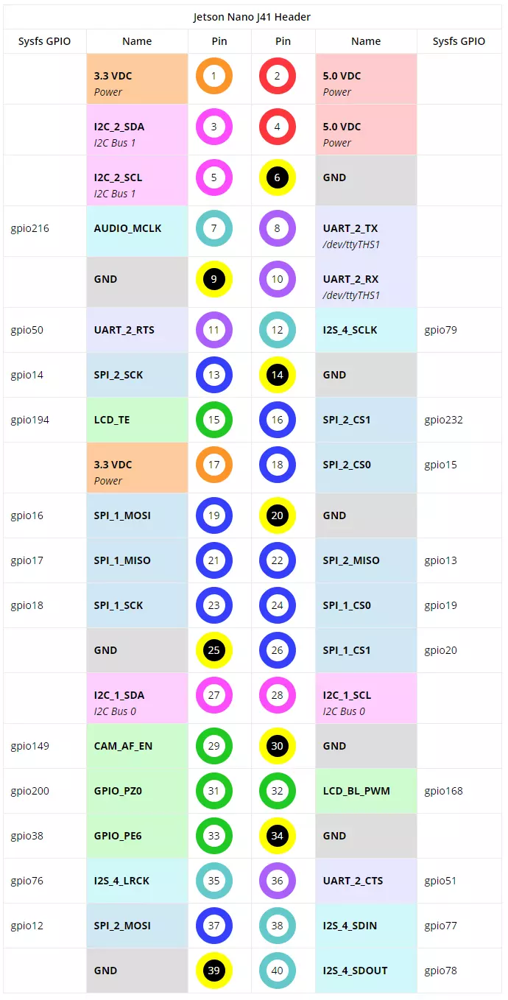
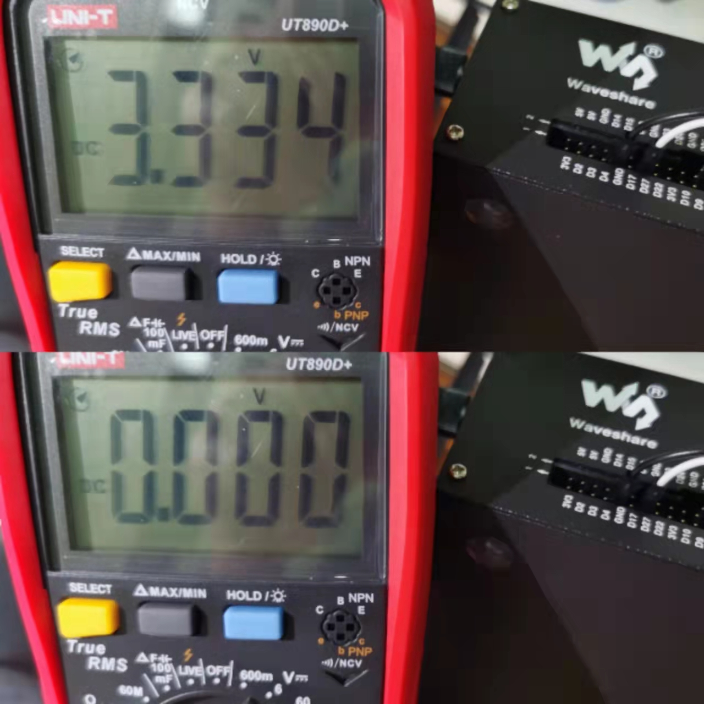
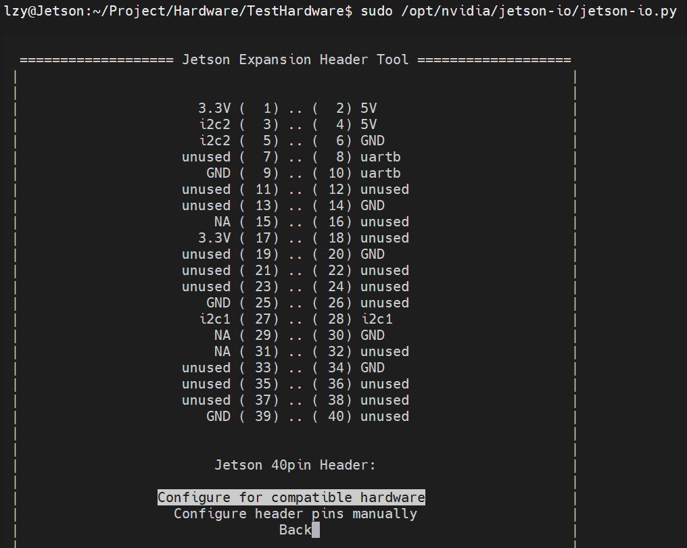

# Jetson Nano GPIO

[toc]



# Portals


# 安装Jetson.GPIO库

**安装流程**

[JetsonGPIO Github Nvidia](https://github.com/NVIDIA/jetson-gpio/tree/master/)

[Jetson Nano GPIO使用、四种模式以及串口解释](https://blog.csdn.net/cynophile/article/details/99310678)

```
pip3 install Jetson.GPIO
```

[Jetson GPIO库源码](https://pypi.org/project/Jetson.GPIO/)

```
创建一个新的gpio用户组。然后将用户添加到新创建的组中，your_user_name是用户名。

sudo groupadd -f -r gpio

sudo usermod -a -G gpio your_user_name
# 这里改成lzy
```

通过将99-gpio.rules文件复制到rules.d目录来安装自定义udev规则：
```
# 查找文件位置
find -name 99-gpio.rules

# /home/lzy/.local/lib/python3.6/site-packages/Jetson/GPIO/99-gpio.rules

# 通过将99-gpio.rules文件复制到rules.d目录来安装自定义udev规则：
sudo cp /home/lzy/.local/lib/python3.6/site-packages/Jetson/GPIO/99-gpio.rules /etc/udev/rules.d/99-gpio.rules

# 重新加载udev规则：
sudo udevadm control --reload-rules && sudo udevadm trigger

# 重启
sudo reboot now
```

**sys相关存疑**
```python
import sys
sys.path.append('/opt/nvidia/jetson-gpio/lib/python/')
sys.path.append('/opt/nvidia/jetson-gpio/lib/python/Jetson/GPIO')
```

网上有的教程说一定要写sys.path.append()才可以import GPIO。但是我这里似乎不用。可能是由于版本更新的原因。另外，我的JetsonGPIO的一些路径和网上并不相同。具体原因未知，先用着再说。（jetpack为最新版本4.6）


## 测试安装

测试代码如下（注意管脚要插对位置）
```python
import Jetson.GPIO as GPIO
import time

# Pin Definitions
output_pin = 13  #J41_BOARD_PIN13---gpio14/GPIO.B06/SPI2_SCK

def main():
    # Pin Setup:
    # Board pin-numbering scheme
    GPIO.setmode(GPIO.BOARD)
    # set pin as an output pin with optional initial state of HIGH
    GPIO.setup(output_pin, GPIO.OUT, initial=GPIO.HIGH)

    print("Starting demo now! Press CTRL+C to exit")
    curr_value = GPIO.HIGH
    try:
        while True:
            time.sleep(2)
            # Toggle the output every second
            print("Outputting {} to pin {}".format(curr_value, output_pin))
            GPIO.output(output_pin, curr_value)
            curr_value ^= GPIO.HIGH
    finally:
        GPIO.cleanup()

if __name__ == '__main__':
    main()

```


由于没有LED灯所以就使用万用表进行测试。看到显示再高低变化，和下面所示的预期输出相吻合。

```
Starting demo now! Press CTRL+C to exit
Outputting 1 to pin 13
Outputting 0 to pin 13
Outputting 1 to pin 13
Outputting 0 to pin 13
Outputting 1 to pin 13
Outputting 0 to pin 13
Outputting 1 to pin 13
Outputting 0 to pin 13
Outputting 1 to pin 13
Outputting 0 to pin 13
```

# 配置40引脚扩展接头

[配置40引脚扩展接头](https://www.jianshu.com/p/9ce10d82f3dd)

**启动工具**
```
sudo /opt/nvidia/jetson-io/jetson-io.py
```




