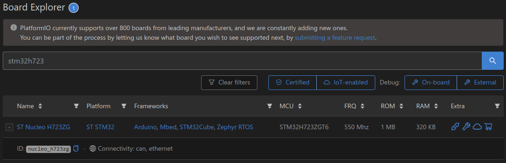
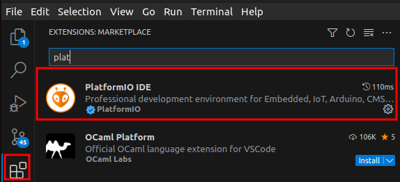
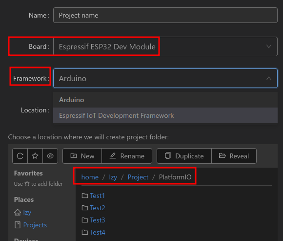
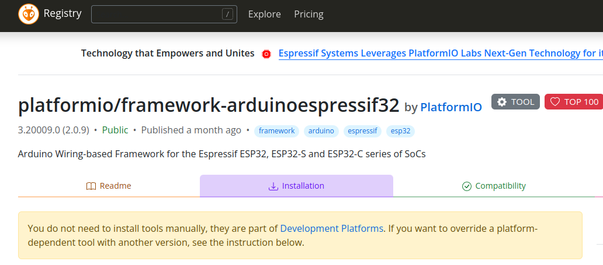

# Platform IO

# Table of Contents

[toc]

-----

# 官网

[PlatformIO 官网](https://platformio.org/)

-----

# 简介

[stm32开发新方式-PlatformIO](https://zhuanlan.zhihu.com/p/61589772)

整个主页其实是Platformio在本地开启了一个web应用，包含了Home,Account,Libraries,Boards,Platforms,Devices

## Libraries

Libraries 标签页是管理库的接口
1. Registry - 搜索框中输入关键词就会过滤，点击想要安装的库，进入详细页面，安装、例程、使用等操作接口
2. Installed - 展示本机已经安装的第三方库
3. Built-in 标签页 - 显示已安装平台内置的库
4. Updates 标签页 - 展示需要更新的库

## Boards

展示 Platformio 支持的开发板列表，最上方的搜索框内可以输入关键词过滤显示相关的开发板



[ST Nucleo H723ZG](https://docs.platformio.org/en/latest/boards/ststm32/nucleo_h723zg.html?utm_source=platformio&utm_medium=piohome)

## Platforms

用来管理平台支持
1. Espressif 32
2. Espressif 8266
3. ST STM32

## Devices

显示连接电脑的硬件设备，比如串口、数字逻辑设备和网络设备


# 安装

流程
1. vscode
2. 开启VPN(最好美国节点)
3. platformIO插件
   
4. 创建项目(以esp32为例，注意设置项目位置)
   

如果安装失败，直接去官网搜索，根据指令下载

[官网下载 platformio/framework-arduinoespressif32 (Arduino Wiring-based Framework for the Espressif ESP32, ESP32-S and ESP32-C series of SoCs)](https://registry.platformio.org/tools/platformio/framework-arduinoespressif32/installation)



```bash
# PlatformIO Core (CLI) Installation Install Shell Commands
export PATH=$PATH:$HOME/.local/bin
ln -s ~/.platformio/penv/bin/platformio ~/.local/bin/platformio
ln -s ~/.platformio/penv/bin/pio ~/.local/bin/pio
ln -s ~/.platformio/penv/bin/piodebuggdb ~/.local/bin/piodebuggdb

# Install PlatformIO
sudo apt install platformio

# Install Package
pio pkg install --global --tool "platformio/framework-arduinoespressif32@^3.20009.0"
```

